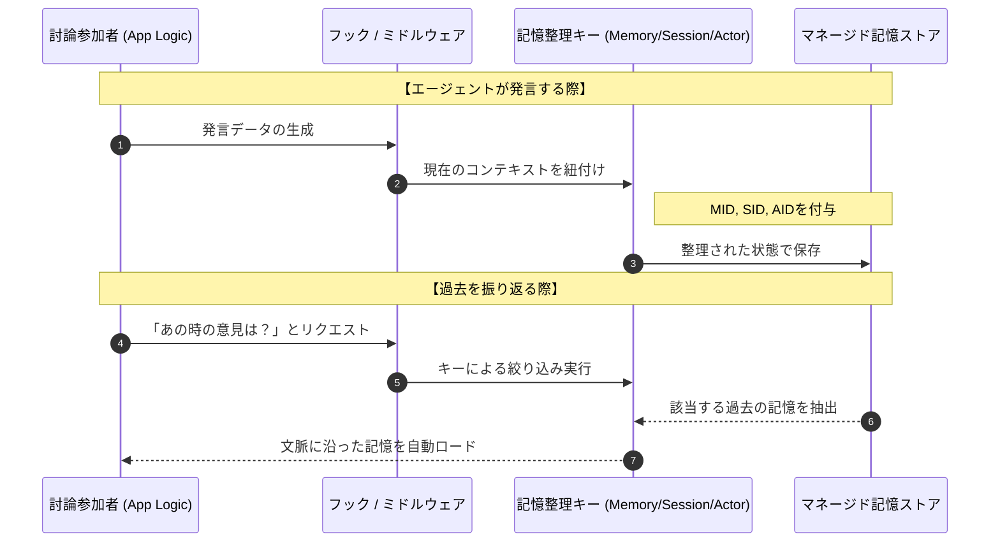

このコードは、**Strands Agents**と**Amazon Bedrock AgentCore**を統合し、複数のエージェント（司会者とパネリスト）が過去の文脈を共有しながらリアルタイムで討論を行う高度なシミュレーションプログラムです。

特に、自前のデータ管理を廃止し、AgentCoreのマネージドな記憶管理機能へ完全に移行している点が特徴です。

# 概要：オーケストレーション型討論システム

このコードは、田原総一朗氏を模したAI司会者が、複数のAIパネリストに問いかけを行う「討論バトル」を実装しています。

- **文脈共有:** `ShortTermMemoryHook` を通じて、全エージェントが同一セッションの過去の発言を「短期記憶」として参照します。
    
- **マルチエージェント:** 役割（田中、南など）ごとに個別の `Agent` インスタンスが生成されますが、背後の記憶基盤は統合されています。
    
- **マネージド管理:** 会話履歴の保存・取得・期限切れ管理を AWS Bedrock AgentCore が担当します。
    

データがどのように流れ、記憶が保持されるかを示します。




### 記憶を特定する3つの階層キー

膨大なログの中から特定の情報にアクセスするために、3段階のフィルタリング（キー）を用いています。

- **Memory ID (MID):** システム全体。異なる番組やプロジェクト同士が混ざらないようにします。
- **Session ID (SID):** 1回ごとの討論単位。第1回と第2回の文脈を分離します。
- **Actor ID (AID):** 発言者単位。田原氏の過去の発言だけを追う際などに機能します。
    
### フックによる「自動」読み込みと保存

**フック（Hook）**は、アプリケーション本体（App Logic）と記憶ストアの間に立つ「自動司書」のような存在です。開発者がわざわざ「保存せよ」と命令を書かなくても、発言が発生した瞬間にフックが **MID/SID/AID** を自動で付与し、ストアへ格納します。これにより、エージェントは常に「自分が誰で、今どの会議にいるか」という自覚を持ったまま会話を継続できます。

### マネージド記憶ストア（AgentCore Memory）

**マネージド記憶ストア**は、LTM（長期記憶）とSTM（短期記憶）を統合的に管理する器です。キーによって高度に整理されているため、数千行に及ぶ議論の果てでも、AIが「さっきのパネリスト田中さんの発言だけど...」といった、具体的かつ文脈を捉えたレスポンスを返すことを可能にしています。


# 🔧 プロビジョニング

### ✅ Memory 作成開始

1. **Amazon Bedrock AgentCore > Memory > Create memory** をクリック
2. 以下の設定を入力：
    - **Memory name**: `memory_masoy`
    - **Short-term memory (raw event) expiration**: `7 days`（※初期値は 30日）
3. **[Create memory]** をクリックして作成を開始

### 🔑 Memory ID の取得

- 作成後、自動的に **Memory ID** が払い出されます：
```
MemoryId: memory_masoy-2JQxnf4Pnc
```
### 🌱 環境変数への追加

アプリケーションコードや Lambda 環境変数などに以下のように設定：

[.env]
```
# AgentCore Memory
AGENTCORE_MEMORY_ID=memory_masoy-2JQxnf4Pnc
```

>[注]
AgentCore Gatewayは、『[70-30-020.朝まで生テレビーAgentCore版＋](70-30-020.朝まで生テレビーAgentCore版＋.md)』を流用。

# 実装のポイント

討論バトルの履歴は、Amazon Bedrock AgentCoreのメモリに短期記憶(Short Time Memory)として保存。

# サンプルコード

`Strands` SDKと `ShortTermMemory` を組み合わせた実装イメージです。

[debate_battle_short-term-memory.py]
```
"""
田原総一朗の討論バトル - AWS AgentCore 短期記憶版
Strands Agents + AgentCore Short-term Memory + AgentCore Gateway
"""
import os
import json
import signal
import uuid
import sys
import base64
from datetime import datetime
from dataclasses import dataclass
from typing import Any
import boto3
import requests
from dotenv import load_dotenv
from mcp.client.streamable_http import streamablehttp_client

# Strands 関連のインポート
from strands import Agent
from strands.tools.mcp import MCPClient
from strands.models import BedrockModel
from strands.hooks import AgentInitializedEvent, HookProvider, HookRegistry, MessageAddedEvent
 
# AgentCore Memory 関連のインポート
from bedrock_agentcore_starter_toolkit.operations.memory.manager import MemoryManager
from bedrock_agentcore.memory.constants import ConversationalMessage, MessageRole
from bedrock_agentcore.memory.session import MemorySession, MemorySessionManager

load_dotenv()

# =============================================================================
# 設定
# =============================================================================
@dataclass
class Config:
    cognito_client_id: str
    cognito_client_secret: str
    cognito_discovery_url: str
    cognito_custom_scope: str
    gateway_endpoint: str
    model_id: str
    region: str
    max_tokens: int
    topic: str
    memory_id: str  # AgentCore Memory ID
    session_id: str  # 短期記憶のキーとして使用

    @classmethod
    def from_env(cls) -> "Config":
        return cls(
            cognito_client_id=os.getenv("COGNITO_CLIENT_ID", ""),
            cognito_client_secret=os.getenv("COGNITO_CLIENT_SECRET", ""),
            cognito_discovery_url=os.getenv("COGNITO_DISCOVERY_URL", ""),
            cognito_custom_scope=os.getenv("COGNITO_CUSTOM_SCOPE", ""),
            gateway_endpoint=os.getenv("AGENTCORE_GATEWAY_ENDPOINT", ""),
            model_id=os.getenv("BEDROCK_MODEL_ID", "us.anthropic.claude-sonnet-4-20250514-v1:0"),
            region=os.getenv("AWS_DEFAULT_REGION", "us-east-1"),
            max_tokens=int(os.getenv("BEDROCK_MAX_TOKENS", "4096")),
             memory_id=os.getenv("AGENTCORE_MEMORY_ID", ""),
            topic=os.getenv("DEBATE_TOPIC", "台湾有事の問題"),
            session_id=os.getenv("DEBATE_SESSION_ID", "session-debate-001"),
        )

    def validate(self) -> list[str]:
        required = {
            "COGNITO_CLIENT_ID": self.cognito_client_id,
            "AGENTCORE_GATEWAY_ENDPOINT": self.gateway_endpoint,
            "AGENTCORE_MEMORY_ID": self.memory_id,
        }
        return [k for k, v in required.items() if not v]

# =============================================================================
# パネリスト定義
# =============================================================================
PANELISTS = {
    "tanaka": {"name": "田中", "role": "日本国首相", "prompt": "日本国首相。日米同盟重視。"},
    "minami": {"name": "南", "role": "歴史専門家", "prompt": "歴史専門家。歴史的視点。"},
    "kanemoto": {"name": "金本", "role": "経済専門家", "prompt": "経済専門家。経済的損失重視。"},
    "tsuyoshi": {"name": "強", "role": "軍事専門家", "prompt": "軍事専門家。安全保障の現実。"},
    "taira": {"name": "平", "role": "平和主義市民", "prompt": "平和主義者。戦争絶対反対。"},
    "taka": {"name": "タカ", "role": "タカ派市民", "prompt": "タカ派市民。国防強化主張。"},
}
SPEAKER_ORDER = ["tanaka", "minami", "kanemoto", "tsuyoshi", "taira", "taka"]

# =============================================================================
# 短期記憶フック
# =============================================================================
class ShortTermMemoryHook(HookProvider):
    def __init__(self, memory_session: MemorySession, memory_id: str, speaker_name: str = "不明"):
        self.memory_session = memory_session
        self.memory_id = memory_id
        self.speaker_name = speaker_name
        self.memory_client = boto3.client('bedrock-agentcore', region_name=os.getenv("AWS_DEFAULT_REGION", "us-east-1"))
        self.actor_id = None  # create_memory_sessionで設定されたactor_id
        self.session_id = None  # create_memory_sessionで設定されたsession_id


    def on_agent_initialized(self, event: AgentInitializedEvent):
        """エージェント開始時に会話履歴を読み込む"""
        try:
            recent_turns = self.memory_session.get_last_k_turns(k=10)
            
            if recent_turns:
                context_messages = []
                for turn in recent_turns:
                    for message in turn:
                        if hasattr(message, 'role') and hasattr(message, 'content'):
                            role = message['role']
                            content = message['content']
                        else:
                            role = message.get('role', 'unknown')
                            content = message.get('content', {}).get('text', '')
                        context_messages.append(f"{role}: {content}")
                
                context = "\n".join(context_messages)
                event.agent.system_prompt += f"\n\n過去の討論履歴:\n{context}\n\nこの文脈を踏まえて討論を続けてください。"
        except Exception as e:
            print(f"[WARN] 履歴読み込み失敗: {e}")
    
    def on_message_added(self, event: MessageAddedEvent):
        """メッセージをメモリに保存"""
        messages = event.agent.messages
        try:
            if messages and len(messages) > 0 and messages[-1]["content"][0].get("text"):
                message_text = messages[-1]["content"][0]["text"]
                role = "USER" if messages[-1]["role"] == "user" else "ASSISTANT"
                
                # 発言者名をプレフィックスとして付与
                tagged_message = f"【{self.speaker_name}】{message_text}"
                
                # 公式パターン: create_event を直接使用
                payload = [{
                    "conversational": {
                        "content": {"text": tagged_message},
                        "role": role
                    }
                }]
                
                params = {
                    "memoryId": self.memory_id,
                    "actorId": self.actor_id,
                    "sessionId": self.session_id,
                    "eventTimestamp": datetime.utcnow(),
                    "payload": payload,
                    "clientToken": str(uuid.uuid4()),
                }
                response = self.memory_client.create_event(**params)
                print(f"[DEBUG] Event created: {response['event']['eventId']}")    
        except Exception as e:
            print(f"[WARN] メモリ保存失敗: {e}")
    
    def register_hooks(self, registry: HookRegistry) -> None:
        registry.add_callback(MessageAddedEvent, self.on_message_added)
        registry.add_callback(AgentInitializedEvent, self.on_agent_initialized)
 
# =============================================================================
# 討論マネージャー (AgentCore Memory版)
# =============================================================================
class DebateManager:
    def __init__(self, config: Config):
        self.config = config
        self.running = True
        self.model = BedrockModel(region_name=config.region, model_id=config.model_id, max_tokens=config.max_tokens)

        # --- [核心] AgentCore Memory の初期化 ---
        self.memory_manager = MemoryManager(region_name=config.region)
       
        # 環境変数から取得した ID をそのまま使用
        # Config.validate() で存在チェックは済んでいるため、ここでは代入のみ行う
        self.memory_id = config.memory_id
        print(f"[INFO] 既存の Memory ID を使用します: {self.memory_id}")

        self.session_manager = MemorySessionManager(memory_id=self.memory_id, region_name=config.region)
                   
        # 討論のメタデータ（最新ニュースなど）
        self.metadata = {"latest_news": "", "tahara_personality": ""}
        
        signal.signal(signal.SIGINT, self._on_interrupt)

    def _on_interrupt(self, *_):
        print("\n" + "=" * 60 + "\n【中断】田原: では、ここで討論を終了します。\n" + "=" * 60)
        self.running = False
        self._summarize()
        sys.exit(0)

    def _get_token(self) -> str:
        cfg = self.config
        auth = base64.b64encode(f"{cfg.cognito_client_id}:{cfg.cognito_client_secret}".encode()).decode()
        discovery = requests.get(cfg.cognito_discovery_url, timeout=10).json()
        res = requests.post(discovery["token_endpoint"],
            headers={"Content-Type": "application/x-www-form-urlencoded", "Authorization": f"Basic {auth}"},
            data={"grant_type": "client_credentials", "scope": cfg.cognito_custom_scope}, timeout=10)
        res.raise_for_status()
        return res.json()["access_token"]

    def _create_agent(self, prompt: str, actor_id: str, speaker_name: str = "システム", use_tools: list = None, use_memory: bool = True) -> Agent:
 
        """エージェント作成時に hooks を渡すことで履歴管理を自動化"""

        hooks = []
        if use_memory:
            memory_session = self.session_manager.create_memory_session(
                actor_id=actor_id,
                session_id=self.config.session_id
            )
            hook = ShortTermMemoryHook(memory_session, self.memory_id, speaker_name)
            hook.actor_id = actor_id  # actor_idを設定
            hook.session_id = self.config.session_id  # session_idを設定
            hooks.append(hook)

        return Agent(
            model=self.model,
            system_prompt=prompt,
            tools=use_tools,
            hooks=hooks if hooks else None,
            callback_handler=None
        )

    def run(self):
        print("=" * 60 + "\n【討論会準備中...】\n" + "=" * 60)
        token = self._get_token()
        mcp = MCPClient(lambda: streamablehttp_client(self.config.gateway_endpoint,
            headers={"Authorization": f"Bearer {token}"}))

        with mcp:
            tools = mcp.list_tools_sync()
            prep_agent = self._create_agent("準備用アシスタント", actor_id="prep", speaker_name="準備", use_tools=tools)

            
            print("[INFO] 最新ニュースと田原の人格情報を取得中...")
            self.metadata["latest_news"] = str(prep_agent("台湾有事の最新ニュースを要約して"))
            self.metadata["tahara_personality"] = str(prep_agent("田原総一朗の討論スタイルを教えて"))

        print(f"\n【討論会開始】テーマ: {self.config.topic}\n" + "=" * 60 + "\n")

        # 司会者 (田原総一朗) の作成
        mod_prompt = f"""あなたは田原総一朗です。{self.metadata['tahara_personality']}
テーマ「{self.config.topic}」に基づき議論を活性化してください。発言は150文字以内。"""
        moderator = self._create_agent(mod_prompt, actor_id="tahara", speaker_name="田原")

        # 討論開始
        opening = moderator(f"テーマ「{self.config.topic}」で討論を開始してください。")
        print(f"田原: {opening}\n")

        round_count = 1
        while self.running:
            for sid in SPEAKER_ORDER:
                info = PANELISTS[sid]

                # 司会者による指名

                q_res = moderator(f"{info['name']}さん（{info['role']}）に鋭い質問を投げてください。")
                print(f"田原: {q_res}\n")

                # パネリストの作成と回答
                # 過去の履歴は memory から自動で読み込まれます
                p_prompt = f"あなたは{info['name']}（{info['role']}）です。{info['prompt']} 200文字以内で回答。"
                panelist = self._create_agent(p_prompt, actor_id=sid, speaker_name=info['name'])                
         
                a_res = panelist(str(q_res))
                print(f"{info['name']}: {a_res}\n" + "-" * 60)
            round_count += 1
            print(f"\n【ラウンド {round_count} 開始】\n")

    def _summarize(self):
        print("\n【討論サマリー生成中...】\n" + "=" * 60)

        # 全発言者のactor_idリスト
        all_actors = ["tahara"] + list(PANELISTS.keys())
        
        all_events = []

        try:
            client = boto3.client('bedrock-agentcore', region_name=self.config.region)
            
            # 全actor_idからイベントを収集
            for actor_id in all_actors:
                try:
                    response = client.list_events(
                        memoryId=self.memory_id,
                        sessionId=self.config.session_id,
                        actorId=actor_id,
                        includePayloads=True
                    )
                    for event in response.get('events', []):
                        for payload in event.get('payload', []):
                            if 'conversational' in payload:
                                conv = payload['conversational']
                                text = conv.get('content', {}).get('text', '')
                                timestamp = event.get('eventTimestamp')
                                all_events.append((timestamp, text))
                except Exception as e:
                    print(f"[WARN] {actor_id}の履歴取得失敗: {e}")
            
            # タイムスタンプでソート
            all_events.sort(key=lambda x: x[0] if x[0] else datetime.min)
            history_text = "\n".join([text for _, text in all_events]) if all_events else "履歴なし"
  
        except Exception as e:
            print(f"[WARN] 履歴取得失敗: {e}")
            history_text = "履歴取得に失敗しました"

        summary_agent = Agent(model=self.model, system_prompt="討論の要約者。")
        result = summary_agent(f"以下の討論内容を各発言者の立場に沿って簡潔に要約してください:\n{history_text}")

        print(str(result))
        print("\n" + "=" * 60 + "\n討論会終了\n" + "=" * 60)

# =============================================================================
# エントリーポイント
# =============================================================================
if __name__ == "__main__":
    config = Config.from_env()
    if missing := config.validate():
        print(f"[ERROR] 環境変数不足: {', '.join(missing)}")
        sys.exit(1)
        
    manager = DebateManager(config)
    manager.run()
```

---

# 実行

```
uv pip install bedrock_agentcore bedrock-agentcore-starter-toolkit
```

実行結果は、短期記憶としてAgentCoreのマネージードストアに格納されます。

```
python debate_battle_short-term-memory.py
✅ MemoryManager initialized for region: us-east-1
[INFO] 既存の Memory ID を使用します: memory_masoy-2JQxnf4Pnc
============================================================
【討論会準備中...】
============================================================
[INFO] 最新ニュースと田原の人格情報を取得中...
/home/ubuntu/projects/agent-core-test/debate_battle/debate_battle_short-term-memory.py:144: DeprecationWarning: datetime.datetime.utcnow() is deprecated and scheduled for removal in a future version. Use timezone-aware objects to represent datetimes in UTC: datetime.datetime.now(datetime.UTC).
  "eventTimestamp": datetime.utcnow(),
[DEBUG] Event created: 0000001767448272097#bd125a76
[DEBUG] Event created: 0000001767448285486#adc783e5
[DEBUG] Event created: 0000001767448293277#b115d6ad
[DEBUG] Event created: 0000001767448293606#4e23f9a1
[DEBUG] Event created: 0000001767448296281#f5dd3b24
[DEBUG] Event created: 0000001767448306413#acfcd056


【討論会開始】テーマ: 台湾有事の問題
============================================================

[DEBUG] Event created: 0000001767433674601#3e9be5d0
[DEBUG] Event created: 0000001767433683376#ca1f0016
田原: ちょっと待って！台湾有事って言葉ばっかり踊ってるけど、具体的に何が起きるって想定してるんだ？

中国が台湾に軍事侵攻した場合、日本はアメリカと一緒に戦争するのか？それとも見てるだけなのか？

要するに、日本政府は台湾有事で自衛隊を出すのか出さないのか、はっきり答えてもらいたい！曖昧な答弁はもううんざりだ！


[DEBUG] Event created: 0000001767433683736#0d973440
[DEBUG] Event created: 0000001767433687725#2c1bb3a7
田原: 田中総理、ちょっと待って！

あなたは「台湾の平和と安定は重要」って言ってるけど、それは建前論でしょう？

具体的に聞きますよ。中国が明日、台湾に侵攻を開始した場合、日本は72時間以内にどう対応するんですか？

自衛隊を派遣するのか？アメリカ軍への後方支援だけなのか？

要するに、日本は台湾を守るために血を流す覚悟があるのかないのか、はっきり答えてください！


[DEBUG] Event created: 0000001767433688360#231a774a
[DEBUG] Event created: 0000001767433700585#05ac1d5c
田中: 極めて重大な質問ですね。率直に申し上げます。

台湾海峡の平和と安定は、我が国の安全保障に直結する死活的利益です。仮定の質問にはお答えできませんが、我が国は憲法の範囲内で、あらゆる選択肢を排除せずに対応します。

具体的には、まず外交的解決に全力を尽くし、同時にアメリカとの緊密な連携の下、状況に応じた適切な措置を講じます。重要影響事態や存立危機事態に該当すれば、関連法制に基づき必要な対応を取る覚悟はあります。

ただし、武力行使は憲法上の制約があることも事実です。しかし日米同盟の抑止力と、自由で開かれたインド太平洋の実現に向け、断固たる意志を持って臨みます。

------------------------------------------------------------
[DEBUG] Event created: 0000001767433700914#9444e75e
[DEBUG] Event created: 0000001767433704917#691ebab6
田原: 南さん、ちょっと待って！

あなたは歴史の専門家だから聞きたいんだが、台湾問題で「歴史を踏まえて慎重に」なんて悠長なこと言ってる場合じゃないでしょう？

1950年の朝鮮戦争で日本は何もできなかった。その教訓を今度は活かせるのか？

要するに、歴史から学ぶべきは「備えあれば憂いなし」じゃないのか？

過去の事例ばかり持ち出して現実逃避してないで、今、日本がとるべき具体的な行動を歴史家として提言してください！


[DEBUG] Event created: 0000001767433705458#6b0b4b3a
[DEBUG] Event created: 0000001767433715558#e54f81ee
南: おっしゃる通り、朝鮮戦争は日本の安全保障における重要な転換点でした。

確かに当時、日本は占領下で主体的対応ができませんでしたが、逆にそこから警察予備隊創設、日米安保体制構築という現実的対応が生まれました。

歴史が教える教訓は「準備の重要性」です。具体的には：①防衛力の着実な整備②同盟国との連携強化③経済安全保障の確立④国民的議論の深化、これらを並行して進めるべきです。

ただし、歴史家として強調したいのは、過度な軍事的緊張は却って危機を招くリスクもあるということ。1914年の第一次大戦前夜の教訓です。

「備えあれば憂いなし」は正しいですが、同時に外交努力も怠ってはなりません。

------------------------------------------------------------
[DEBUG] Event created: 0000001767433715870#3004cff0
[DEBUG] Event created: 0000001767433720376#1ea412a0
田原: 金本さん、ちょっと待って！

台湾有事になったら日本経済はどうなるんだ？台湾海峡が封鎖されたら、半導体不足どころじゃ済まないでしょう？

あなたは経済の専門家なんだから、綺麗事は抜きにして現実を言ってください！

要するに、中国との経済関係を優先して台湾を見捨てるのか？それとも経済制裁を覚悟で台湾を支持するのか？

日本企業の中国からの撤退費用はいくらかかるんですか？具体的な数字で答えてください！


[DEBUG] Event created: 0000001767433720920#6b6be58d
[DEBUG] Event created: 0000001767433732762#aa0d734f
金本: 台湾有事の経済損失は壊滅的です。台湾海峡封鎖で半導体供給が停止すれば、日本の製造業は即座に生産停止。GDP20-30兆円減少は避けられません。

中国との貿易額は年36兆円。全面制裁なら日本企業の中国撤退費用は推定50-80兆円。トヨタ、ソニー等の主力工場移転だけで数兆円規模です。

しかし中国依存継続はより危険。段階的デカップリングで年5-10兆円投資し、東南アジア・インドへの生産移管を急ぐべきです。短期的痛みを避けて長期的破綻を選ぶのは愚策。台湾の自由な半導体供給確保こそが日本経済の生命線です。

------------------------------------------------------------
[DEBUG] Event created: 0000001767433733096#8a112138
[DEBUG] Event created: 0000001767433738078#45159188
田原: 強さん、ちょっと待って！

あなたは軍事の専門家だから、はっきり聞きますよ！

中国軍が台湾侵攻を開始したら、自衛隊は何日間戦えるんですか？弾薬も燃料も足りないって話じゃないか！

それに、日本の防衛力で本当に中国のミサイル攻撃を防げるのか？

要するに、今の自衛隊の装備と人員で台湾有事に対応できるのかできないのか、軍事専門家として率直に答えてください！

「検討します」なんて政治家みたいな答弁はやめてくれ！


[DEBUG] Event created: 0000001767433738672#7d57de0d
[DEBUG] Event created: 0000001767433750466#ebc20e53
強: 率直に申し上げます。

現状の自衛隊では**極めて困難**です。

弾薬備蓄は1-2週間程度、燃料も同様。中国の飽和攻撃に対するミサイル防衛も限界があります。

特に問題は：
- 対艦ミサイルの絶対数不足
- 長射程打撃能力の欠如
- 継戦能力の脆弱性

米軍との連携前提でも、初動対応で大きな損害は避けられません。

ただし、地理的優位性と防御戦術で時間稼ぎは可能。その間に米軍主力の到着を待つのが現実的シナリオです。

**結論：単独では不可能、日米連携でも相当厳しい**というのが軍事的現実です。

だからこそ抑止力強化が急務なのです。

------------------------------------------------------------
[DEBUG] Event created: 0000001767433750797#6536e613
[DEBUG] Event created: 0000001767433755849#93c096fc
田原: 平さん、ちょっと待って！

あなたは「平和的解決を」って言うけど、中国が軍事侵攻を始めたら話し合いなんてできないでしょう？

ウクライナを見てください！プーチンと話し合いで解決できましたか？

要するに、あなたの平和主義は現実逃避じゃないのか？

台湾の人たちが中国に武力で併合されそうになっても、日本は「憲法9条があるから」って見てるだけでいいんですか？

平和を守るためには時として力も必要だという現実を、どう考えるんですか？


[DEBUG] Event created: 0000001767433756405#1c7c55c0
[DEBUG] Event created: 0000001767433771215#3b5dc76b
平: その通り、現実は厳しいです。でも武力で武力に対抗すれば、結局は一般市民が犠牲になります。

ウクライナの状況は確かに深刻ですが、だからこそ戦争の悲惨さが分かるじゃないですか。日本が軍事介入したら、この国も戦場になってしまいます。

代わりに経済制裁、国際世論の形成、人道支援など、武力以外の手段で圧力をかけるべきです。憲法9条は「見てるだけ」ではなく「戦争という選択肢を捨てた覚悟」を示しています。

確かに理想論かもしれませんが、一度武力の道に足を踏み入れたら、もう後戻りできません。

------------------------------------------------------------
[DEBUG] Event created: 0000001767433771543#bba75824
[DEBUG] Event created: 0000001767433775726#a0a1a901
田原: タカさん、ちょっと待って！

あなたは「中国と戦うべきだ」って勇ましいこと言うけど、具体的にどうやって戦うんですか？

自衛隊員の息子さんや娘さんが最前線で命を落とすかもしれないんですよ？それでもいいんですか？

要するに、あなた自身は安全な場所にいて、他人に戦争しろって言ってるだけじゃないのか？

本当に中国と戦争する覚悟があるなら、まず自分が自衛隊に志願してからものを言ってください！

口先だけの勇ましさは無責任すぎる！


[DEBUG] Event created: 0000001767433776269#66bfa176
[DEBUG] Event created: 0000001767433787025#e6704bbf
タカ: 私は軽々しく戦争を望んでいるわけではありません。しかし現実を直視してください。中国の軍事的脅威は日増しに高まっています。台湾侵攻、南シナ海での覇権拡大、尖閣諸島への領海侵犯...これらに対し「話し合いで解決」などと悠長なことを言っている間に、既成事実を積み重ねられているのです。

抑止力こそが平和を守る唯一の手段です。相手が「この国と戦えば痛い目に遭う」と思わせることで、むしろ戦争を回避できるのです。

自衛隊員の覚悟と使命感を軽んじるべきではありません。彼らは国を守るプロフェッショナルです。国民全体で国防を支える体制を構築することこそ、真の責任ある姿勢だと考えます。

------------------------------------------------------------

【ラウンド 2 開始】

[DEBUG] Event created: 0000001767433787360#fc141efe
[DEBUG] Event created: 0000001767433791481#026e65e3
田原: 田中総理！今度は逃げないで答えてください！

あなたは「国民の生命と財産を守る」って言うけど、台湾有事で中国から日本にミサイルが飛んできたらどうするんですか？

国民に防空壕はない、迎撃ミサイルも足りない、それで本当に国民を守れるのか？

要するに、あなたは総理大臣として、日本が攻撃されたときの具体的な避難計画も防衛計画もないまま、ただ「検討する」って言い続けるつもりですか？

国民の命がかかってるんです！もっと真剣に答えてください！


[DEBUG] Event created: 0000001767433792052#763305a3
[DEBUG] Event created: 0000001767433805601#05b72d16
田中: 【田中】ご指摘は極めて重要です。逃げるつもりは全くありません。

まず現実を申し上げます。確かに日本の防空体制には課題があります。しかし、この3年間で防衛費を大幅に増額し、迎撃能力の強化を図っています。

具体的対応について：
1. Jアラート等による即座の国民避難指示
2. イージス艦、PAC-3による迎撃
3. 地下街、堅牢建物への緊急避難
4. 反撃能力による抑止と対処

防空壕については、全国の地下施設の活用指針を策定中です。完璧ではありませんが、手をこまねいているわけではありません。

台湾有事への対応は、存立危機事態に該当すれば、限定的集団的自衛権の行使も辞さない覚悟です。

国民の生命を預かる総理として、不完全な現状は認めます。しかし、抑止力強化と危機管理体制の構築に全力で取り組んでいることもご理解ください。

------------------------------------------------------------
[DEBUG] Event created: 0000001767433805918#0327b1ef
[DEBUG] Event created: 0000001767433810258#f39cfe63
田原: 南さん、それは違う！

あなたは「歴史に学べ」って言うけど、1938年のミュンヘン会談を忘れたんですか？

ヒトラーに譲歩した結果、第二次世界大戦が起きたでしょう！

要するに、独裁者に対する「宥和政策」は失敗の歴史じゃないのか？

習近平に対しても同じ過ちを繰り返すつもりですか？

歴史の専門家なら、「平和のための準備」こそが戦争を防ぐって分かるはずでしょう？

過去の教訓を現在にどう活かすのか、具体的に答えてください！


[DEBUG] Event created: 0000001767433810814#b57d9b1a
[DEBUG] Event created: 0000001767433824108#d66cf9fa
南: 【南】その通りです！ミュンヘン会談は重要な教訓ですね。

確かに1938年、チェンバレンの宥和政策は結果的にヒトラーの野望を助長しました。「平和のための平和」では真の平和は守れない—これは歴史の鉄則です。

しかし同時に、1914年の「7月危機」も忘れてはいけません。各国の過度な軍事的準備と硬直した同盟関係が、サラエボ事件という小さな火種を世界大戦に発展させました。

歴史が示すのは「抑止と対話のバランス」です。具体的には：

①防衛力強化による「力による平和」の確立
②同時に多層的外交チャンネルの維持
③経済的相互依存関係の活用

ミュンヘンの教訓は「原則なき譲歩は危険」ということ。しかし「原則なき強硬姿勢」も同様に危険です。

歴史家として言えるのは、両方の教訓を統合した戦略的思考こそが必要だということです。

------------------------------------------------------------
[DEBUG] Event created: 0000001767433824437#55d4d3c9
[DEBUG] Event created: 0000001767433829886#2af601c7
田原: 金本さん、ちょっと待って！

あなたは「経済制裁は日本にも打撃」って言うけど、それで中国の侵略を黙認するんですか？

ロシアのウクライナ侵攻で、ヨーロッパは高いエネルギー代を払ってでも制裁してるでしょう？

要するに、お金が大事なのか、それとも民主主義の価値が大事なのか、どっちなんですか？

中国市場を失うのが怖くて、台湾の自由を見捨てるつもりですか？

経済専門家として、短期的な損失と長期的な安全保障、どちらを優先すべきか明確に答えてください！


[DEBUG] Event created: 0000001767433830422#e49aa923
[DEBUG] Event created: 0000001767433843468#837fdbc1
金本: 【金本】誤解しないでください！私は中国の侵略を黙認しろとは一言も言っていません。

ウクライナ制裁でEUのGDP損失は2-3%。しかし日本の対中依存度は比較にならない。中国との貿易停止なら日本のGDP損失は10-15%、約50-75兆円です。

だからこそ「戦略的デカップリング」が必要なんです。今すぐ制裁すれば日本経済は崩壊し、結果的に中国を利するだけ。

まず3-5年かけて供給網多様化に年10兆円投資。半導体はTSMCの熊本工場拡大、レアアースは豪州・アフリカ開発。その上で段階的制裁なら効果的です。

民主主義を守るには経済力が不可欠。無策な制裁で日本が弱体化すれば、台湾も守れません。経済合理性こそが最強の外交カードなのです。

------------------------------------------------------------
[DEBUG] Event created: 0000001767433843812#40c39123
[DEBUG] Event created: 0000001767433849743#e9959ad9
田原: 強さん、それは違う！

あなたは「自衛隊の能力向上が必要」って言うけど、今この瞬間に中国が動いたらどうするんですか？

装備を整えるのに何年かかるんだ？その間に台湾は占領されてしまうでしょう？

要するに、現在の戦力で勝算はあるのかないのか、軍事専門家としてはっきり言ってください！

「準備が必要」なんて悠長なこと言ってる場合じゃない！

アメリカ軍頼みで本当にいいのか？日本独自の抑止力はあるのかないのか？

現実を直視した答えを求めます！


[DEBUG] Event created: 0000001767433850308#70c61ed6
[DEBUG] Event created: 0000001767433861075#d1a2143d
強: 【強】厳しい現実をお話しします。

**現在の戦力では勝算は低い**です。

具体的数値で申し上げると：
- 自衛隊の継戦能力：**7-10日程度**
- 中国軍のミサイル飽和攻撃への対処：**30-40％程度**
- 単独での台湾防衛：**ほぼ不可能**

装備近代化には最低5-10年必要です。

**しかし**、これが抑止の現実です。中国も分かっています。だからこそ：

1. 米軍の参戦前に短期決着を狙う
2. 日本の基地機能を先制攻撃で無力化
3. 既成事実化で国際介入を阻止

日本独自の抑止力は**地理的位置**と**米軍基地の存在**。これが中国の作戦計画を複雑化させています。

**結論：軍事的には厳しいが、だからこそ外交と抑止力強化が急務**。

戦争は「勝てるかどうか」より「起こさせないこと」が最重要なのです。

------------------------------------------------------------
[DEBUG] Event created: 0000001767433861417#757552ec
[DEBUG] Event created: 0000001767433866555#2591bcee
田原: 平さん、ちょっと待って！

あなたは「憲法9条で平和を」って言うけど、それじゃあ聞きますよ！

チベットやウイグルで何が起きてるか知ってるでしょう？中国は話し合いで解決しましたか？

要するに、あなたの平和主義は、力で現状変更しようとする独裁国家には通用しないんじゃないのか？

台湾の2300万人が中国に飲み込まれても「憲法9条があるから関係ない」って言うんですか？

平和を守るためには時として毅然とした態度も必要でしょう？

理想論だけじゃ人は救えませんよ！


[DEBUG] Event created: 0000001767433867180#a3d78871
[DEBUG] Event created: 0000001767433877733#6f52d6aa
平: 【平】確かにチベットやウイグルの状況は深刻です。でもだからこそ、軍事力では根本解決にならないことが分かるじゃないですか！

武力で対抗したら、台湾の2300万人がもっと危険にさらされます。日本が軍事介入すれば、この地域全体が戦場になってしまう。

私たちにできるのは、国際社会と連携した経済制裁、人権問題の告発、難民受け入れなどです。実際に日本はウイグル問題で声を上げ続けています。

「毅然とした態度」は武力だけじゃない。外交的孤立、経済的圧力の方が長期的には効果的です。

戦争は必ず一般市民を巻き込みます。台湾を守るつもりが台湾を破壊することになりかねない。理想論と言われても、一度戦争を始めたら取り返しがつかないんです。

------------------------------------------------------------
[DEBUG] Event created: 0000001767433878089#fc9b5acd
[DEBUG] Event created: 0000001767433883346#64f2dfb7
田原: タカさん、ちょっと待って！

あなたは「敵基地攻撃能力を持て」って勇ましいこと言うけど、その結果、日本全土が中国の報復攻撃の標的になることは考えてるんですか？

東京や大阪にミサイルが飛んできても「仕方ない」って言えるんですか？

要するに、戦争になったら一番被害を受けるのは一般市民なんですよ！

あなたは「中国と戦え」って言うなら、まず自分の家族を疎開させる準備はできてるんですか？

口先だけの威勢のいい話じゃなくて、現実的なリスクを考えた発言をしてください！


[DEBUG] Event created: 0000001767433883927#251ffb90
[DEBUG] Event created: 0000001767433895088#ee96349c
タカ: 【タカ】逆に聞きますが、あなたは何もしないでいる間に、中国が台湾を併合し、次は沖縄、そして本土まで脅威が迫ってきた時、「あの時もっと備えておけば」と後悔しませんか？

敵基地攻撃能力は「攻撃するため」ではなく「攻撃させないため」の抑止力です。相手に「日本を攻めれば自分たちも無事では済まない」と思わせることで、むしろ戦争を防げるのです。

現実を見てください。中国は既に日本全土を射程に収める中距離ミサイルを大量配備済みです。私たちが何もしなくても、既に標的にされているんですよ！

家族の安全を本当に考えるなら、今こそ毅然とした態度で臨むべきです。相手になめられれば、かえって危険が高まります。ウクライナのように「まさか攻撃されない」と油断していた国がどうなったか、歴史に学ぶべきです。

------------------------------------------------------------

【ラウンド 3 開始】

[DEBUG] Event created: 0000001767433895447#8d0560fe
[DEBUG] Event created: 0000001767433900016#345f104b
田原: 田中総理！いい加減にしてください！

あなたは今まで何度も「検討する」「慎重に」って逃げてばかりじゃないか！

国会で野党に追及されても、記者会見でも、全部同じ答弁の繰り返し！

要するに、あなたには台湾有事への明確な方針がないってことでしょう？

総理大臣なら決断してください！日本は台湾を守るのか見捨てるのか！

国民はあなたの曖昧な答弁にうんざりしてるんです！

リーダーシップを発揮する気があるのかないのか、はっきり答えなさい！


[DEBUG] Event created: 0000001767433900584#fa3c1081
[DEBUG] Event created: 0000001767433912753#8a49a6c5
田中: 【田中】お怒りはごもっともです。しかし、この問題は一国の総理として軽々しく発言できるものではありません。

台湾有事について申し上げます。日本の基本方針は明確です。台湾海峡の平和と安定の維持、これが我が国の国益です。

具体的対応について：
1. 外交努力を最優先とする
2. アメリカとの緊密な連携
3. 状況に応じた重要影響事態法の適用
4. 存立危機事態認定時の限定的集団的自衛権行使

「血を流す覚悟」というご質問ですが、自衛隊員の命を預かる総理として、安易な言葉は使えません。しかし、日本の平和と独立、国民の生命を守るため、憲法の範囲内で必要な措置は断固として講じます。

曖昧に聞こえるかもしれませんが、これが民主主義国家の総理として取るべき慎重かつ責任ある姿勢です。感情論ではなく、冷静な判断が求められます。

------------------------------------------------------------
[DEBUG] Event created: 0000001767433913066#f4077dba
[DEBUG] Event created: 0000001767433917494#606c698f
田原: 南さん、ちょっと待って！

あなたは「歴史の複雑性を理解すべき」って言うけど、それって結局、何も決めないための言い訳でしょう？

1931年の満州事変のとき、国際社会は「複雑だ」って言って日本の侵略を止められなかった！

要するに、歴史学者として過去を分析するのは結構だけど、今起きている危機に対してどう行動すべきか提言するのがあなたの責任じゃないのか？

「複雑だから慎重に」なんて言ってる間に台湾が占領されたら、歴史にどう責任を取るんですか？

具体的な提言をしてください！


[DEBUG] Event created: 0000001767433918065#2e2a863b
[DEBUG] Event created: 0000001767433932020#1fbc8cc0
南: 【南】厳しいご指摘、真摯に受け止めます。確かに歴史家としての責任を果たさなければなりません。

満州事変の教訓は明確です。国際社会の優柔不断が侵略を助長した—これは紛れもない事実です。

歴史家として、今すぐ取るべき具体的提言を示します：

①日米豪印「クアッド」の軍事協力強化を急ぐ
②台湾への半導体技術支援で経済的結束を深める
③自衛隊の南西諸島配備を加速し、現実的抑止力を構築
④国民への危機意識共有—戦前の「平和ボケ」を繰り返すな

「複雑だから」という逃避は許されません。1939年、ポーランド侵攻を前にした英仏の迷いが悲劇を拡大させました。

歴史は「決断の瞬間」を逃した代償の重さを教えています。今がまさにその時です。学者の机上論ではなく、現実に向き合った政策提言こそが歴史家の使命だと痛感します。

------------------------------------------------------------
[DEBUG] Event created: 0000001767433932458#37f10a96
[DEBUG] Event created: 0000001767433936868#6cb0112c
田原: 金本さん、ちょっと待って！

あなたは「段階的な経済制裁を」って言うけど、それじゃあ生ぬるいでしょう？

ロシアに対するSWIFT排除みたいな強烈な制裁をやる覚悟はあるんですか？

要するに、中国が本格的に台湾侵攻を始めたら、日本は中国との貿易を完全に止める決断ができるのかできないのか？

「段階的に」なんて悠長なこと言ってる間に台湾は占領されますよ！

経済専門家として、制裁の効果が出るまでに何ヶ月かかるか計算してるんですか？

具体的なタイムラインを示してください！


[DEBUG] Event created: 0000001767433937428#2b87c036
[DEBUG] Event created: 0000001767433948541#7779a694
金本: 【金本】現実を直視してください！中国のSWIFT排除は日本経済の自殺行為です。

ロシア制裁でも効果が出るまで6-12ヶ月。しかし中国は世界経済の18%、ロシアの1.8%とは規模が違う。中国排除なら世界的金融システム崩壊です。

台湾侵攻が始まれば、まず金融制裁・技術輸出禁止で即座に対応。これで中国のハイテク産業は3ヶ月で機能停止します。貿易全面停止は最後の手段。

日本の対中投資残高は17兆円。全面制裁なら回収不能で金融機関連鎖破綻のリスク。むしろ段階的制裁で中国経済を徐々に締め上げる方が確実です。

台湾の半導体工場を守るには、まず軍事的抑止力。経済制裁はその補完です。順序を間違えれば台湾も日本も共倒れになります。

------------------------------------------------------------
[DEBUG] Event created: 0000001767433948867#c7acc3e1
^C
============================================================
【中断】田原: では、ここで討論を終了します。
============================================================

【討論サマリー生成中...】
============================================================
[DEBUG] Event created: 0000001767433954858#da37d738
## 台湾有事討論の要約

### 【田原総一朗】（司会者）
- 台湾有事について各出席者に対し、曖昧な答弁を許さず具体的な方針や行動を求める鋭い質問を連発
- 「検討する」「慎重に」といった政治的答弁に強く反発し、現実的で明確な回答を要求
- 各専門分野の矛盾点や問題点を突いて、より深い議論を促進

### 【田中総理】（日本国首相）
- 台湾海峡の平和と安定は日本の死活的利益と位置づけ
- 憲法の範囲内で、重要影響事態や存立危機事態に応じた対応を示唆
- 外交的解決を最優先としつつ、日米同盟に基づく抑止力強化を強調
- 防衛体制の不備を認めながらも、段階的改善に取り組む姿勢を表明

### 【南】（歴史専門家）
- 朝鮮戦争やミュンヘン会談などの歴史的教訓を踏まえた慎重論を展開
- 「抑止と対話のバランス」の重要性を強調
- 最終的に現実的提言として、クアッド強化、台湾経済支援、自衛隊南西配備などを提案

### 【金本】（経済専門家）
- 台湾有事の経済損失を具体的数値で警告（GDP20-30兆円減少）
- 中国との段階的デカップリングを主張（年10兆円投資で供給網多様化）
- 全面制裁の危険性を指摘し、計画的な経済安全保障政策を提言

### 【強】（軍事専門家）
- 現在の自衛隊の戦力では台湾有事への対応は「極めて困難」と率直に評価
- 継戦能力7-10日、単独防衛は「ほぼ不可能」と現実的分析
- 日米連携の重要性を強調しながらも、抑止力強化の必要性を訴える

### 【平】（平和主義市民）
- 憲法9条に基づく平和的解決を主張
- 武力対応は市民犠牲を拡大するとして、経済制裁や国際世論形成を提案
- 一度戦争が始まれば取り返しがつかないとの危機感を表明

### 【タカ】（タカ派市民）
- 中国の軍事的脅威に対する抑止力強化を強く主張
- 敵基地攻撃能力は「攻撃するため」ではなく「攻撃させないため」と説明
- 宥和政策の危険性を指摘し、毅然とした態度の必要性を強調

### 討論の核心的対立点
1. **軍事対応 vs 平和的解決**：武力行使の是非
2. **経済制裁の範囲**：段階的制裁 vs 全面制裁
3. **日米同盟への依存度**：自主防衛 vs 同盟重視
4. **現実主義 vs 理想主義**：抑止力 vs 憲法9条## 台湾有事討論の要約

### 【田原総一朗】（司会者）
- 台湾有事について各出席者に対し、曖昧な答弁を許さず具体的な方針や行動を求める鋭い質問を連発
- 「検討する」「慎重に」といった政治的答弁に強く反発し、現実的で明確な回答を要求
- 各専門分野の矛盾点や問題点を突いて、より深い議論を促進

### 【田中総理】（日本国首相）
- 台湾海峡の平和と安定は日本の死活的利益と位置づけ
- 憲法の範囲内で、重要影響事態や存立危機事態に応じた対応を示唆
- 外交的解決を最優先としつつ、日米同盟に基づく抑止力強化を強調
- 防衛体制の不備を認めながらも、段階的改善に取り組む姿勢を表明

### 【南】（歴史専門家）
- 朝鮮戦争やミュンヘン会談などの歴史的教訓を踏まえた慎重論を展開
- 「抑止と対話のバランス」の重要性を強調
- 最終的に現実的提言として、クアッド強化、台湾経済支援、自衛隊南西配備などを提案

### 【金本】（経済専門家）
- 台湾有事の経済損失を具体的数値で警告（GDP20-30兆円減少）
- 中国との段階的デカップリングを主張（年10兆円投資で供給網多様化）
- 全面制裁の危険性を指摘し、計画的な経済安全保障政策を提言

### 【強】（軍事専門家）
- 現在の自衛隊の戦力では台湾有事への対応は「極めて困難」と率直に評価
- 継戦能力7-10日、単独防衛は「ほぼ不可能」と現実的分析
- 日米連携の重要性を強調しながらも、抑止力強化の必要性を訴える

### 【平】（平和主義市民）
- 憲法9条に基づく平和的解決を主張
- 武力対応は市民犠牲を拡大するとして、経済制裁や国際世論形成を提案
- 一度戦争が始まれば取り返しがつかないとの危機感を表明

### 【タカ】（タカ派市民）
- 中国の軍事的脅威に対する抑止力強化を強く主張
- 敵基地攻撃能力は「攻撃するため」ではなく「攻撃させないため」と説明
- 宥和政策の危険性を指摘し、毅然とした態度の必要性を強調

### 討論の核心的対立点
1. **軍事対応 vs 平和的解決**：武力行使の是非
2. **経済制裁の範囲**：段階的制裁 vs 全面制裁
3. **日米同盟への依存度**：自主防衛 vs 同盟重視
4. **現実主義 vs 理想主義**：抑止力 vs 憲法9条


============================================================
討論会終了
============================================================
```
