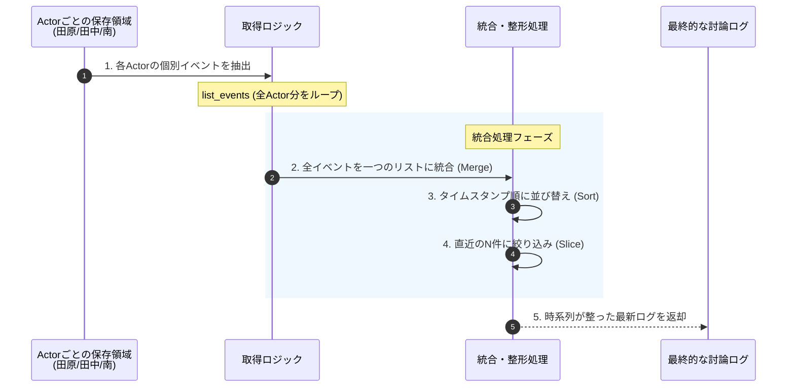

# 概要

短期記憶（STM）は、非常に柔軟に検索・取得が可能です。

Amazon Bedrock AgentCoreのSTMは、単なる「垂れ流しのログ」ではなく、インデックスされたイベントデータとして管理されているため、プログラムから条件を指定して取り出すことができます。

### 短期記憶の検索・取得パターン

主に以下の3つの切り口で取得を制御できます。

| **取得方法**             | **具体的な指定形式**                        | **ユースケース**                        |
| -------------------- | ----------------------------------- | --------------------------------- |
| **最新の○件 (K-turns)**  | `get_last_k_turns(k=5)`             | 「直近のやり取りだけ」をコンテキストに含めて、推論の精度を高める。 |
| **全履歴の取得**           | `list_events(includePayloads=True)` | セッション終了時に、すべての会話を振り返って要約（LTM化）する。 |
| **時間指定 (Timestamp)** | `startTime` / `endTime` パラメータ       | 「今日の14時以降のやり取りだけ」を対象に分析を行う。       |

- **最新件数:** 指定可能です。
- **時間指定:** 指定可能です。
-  **actorId指定:** 特定の参加者（田中さん等）の発言だけを抜き出すことも可能です。





### 分散された個別メモリの抽出

**Storage層**では、情報の書き込み負荷を分散させるため、エージェント（Actor）ごとに記憶が保存されています。**Collection層**は、これらバラバラの場所に存在する「田原氏の発言」「田中氏の発言」などを、指定されたID（actor_ids）に基づいて一斉にかき集める役割を担います。

### 時系列（Timestamp）による秩序の回復

集められた直後のデータは、取得順に並んでいるだけで、実際の会話の前後関係はバラバラです。**Processing層**では、各発言に刻印された「タイムスタンプ」をキーにして並び替える（**Sort**）ことで、カオスな状態から「人間が理解できる正しい対話の流れ」へと復元します。

### 文脈（Context）の最適化

AIエージェントの処理能力（コンテキストウィンドウ）には限りがあるため、全履歴を渡すわけにはいきません。**Slice** 処理によって「最新の○件」だけを切り出すことで、AIが現在の議論の熱量を失わずに、かつ効率的に思考できる「研ぎ澄まされた記憶」を提供します。

# 検索できる「期間」

短期記憶には **`event_expiry_days`（有効期限）** という概念があります。

- **設定例:** `event_expiry_days=7`
    
- **挙動:** 7日を過ぎた短期記憶の生ログは自動的に削除されます。
    
- **注意:** 「いつから」の検索も、この有効期限内のデータに限られます。それより古い「要旨」を検索したい場合は、LTM（長期記憶）の出番となります。
    
# サンプルコード

[retrieve_stm_history.py]
```
import boto3
from datetime import datetime

def retrieve_limited_history(memory_id, session_id, actor_ids, total_limit=10):
    """
    全員の履歴を統合し、全体の最新『total_limit』件のみを抽出する
    """
    client = boto3.client('bedrock-agentcore', region_name='us-east-1')
    combined_history = []

    for actor_id in actor_ids:
        try:
            # 各Actorの直近のイベントを取得 (個別に少し多めに取っておく)
            response = client.list_events(
                memoryId=memory_id,
                sessionId=session_id,
                actorId=actor_id,
                includePayloads=True,
                maxResults=total_limit # 各Actorごとに最大件数まで取得
            )
            
            for event in response.get('events', []):
                ts = event.get('eventTimestamp')
                for p in event.get('payload', []):
                    if 'conversational' in p:
                        conv = p['conversational']
                        combined_history.append({
                            "timestamp": ts,
                            "actor": actor_id,
                            "role": conv.get('role'),
                            "text": conv.get('content', {}).get('text', '')
                        })
        except Exception as e:
            print(f"[WARN] {actor_id}取得失敗: {e}")

    # 1. すべてのActorから集めたデータを時系列順（古い→新しい）にソート
    combined_history.sort(key=lambda x: x['timestamp'])

    # 2. 全体の最新『total_limit』件だけにスライスする
    # 昇順ソートなので、末尾からtotal_limit分を切り出す
    latest_history = combined_history[-total_limit:]

    print(f"\n=== 最新 {len(latest_history)} 件の討論履歴 ===")
    for item in latest_history:
        ts_str = item['timestamp'].strftime('%H:%M:%S')
        print(f"[{ts_str}] {item['actor']} ({item['role']}): {item['text']}")
        print("-" * 30)

    return latest_history

# --- 実行 ---
if __name__ == "__main__":
    MY_MEMORY_ID = "memory_masoy-2JQxnf4Pnc"
    MY_SESSION_ID = "session_debate_001" 
    ACTORS = ["tahara", "tanaka", "minami", "kanemoto", "tsuyoshi", "taira", "taka"]
    
    # 最新の5件だけを表示するように制限
    retrieve_limited_history(MY_MEMORY_ID, MY_SESSION_ID, ACTORS, total_limit=5)

```


# 実行

```
python retrieve_stm_history.py

=== 最新 5 件の討論履歴 ===
[23:33:16] taira (ASSISTANT): 【平】【平】田原さん...本当に辛い現実ですね。でも聞いてください。

確かに憲法9条は「紙」かもしれません。でもその理念こそが日本の最大の安全保障なのです。

中国が台湾を攻撃したとして、日本が軍事介入すれば核戦争になる可能性があります。東京、大阪が火の海になってもいいのですか？

チベット、ウイグルの悲劇は本当に心が痛みます。でもだからこそ、軍事力ではなく国際法と人道外交で対処すべきなのです。経済制裁、国際司法裁判所、市民社会の連帯...これらが独裁者を追い詰める真の力です。

「戦って守る平和」というのは矛盾です。戦争は必ず無辜の民を巻き込みます。沖縄戦を忘れましたか？20万人が犠牲になったのです。

私は侵略者を利するつもりはありません。でも暴力では憎しみしか生まれません。ガンジーやキング牧師が証明したように、非暴力の抵抗こそが最強の武器なのです。

理想を諦めた瞬間、人類の未来は閉ざされます。
------------------------------
[23:33:16] tahara (USER): 【田原】タカさん（タカ派市民）に鋭い質問を投げてください。
------------------------------
[23:33:24] tahara (ASSISTANT): 【田原】【田原】ちょっと待ってタカさん！

あなたは「日本を守れ！中国と戦え！」って勇ましいことばかり言ってるけど、戦争の現実を本当に理解してるんですか！

現代戦は第二次大戦とは全く違う！中国の極超音速ミサイルは迎撃不可能だ！東京が30分で火の海になるんですよ！

あなたの息子や娘も徴兵される可能性がある！最前線で戦って死ぬかもしれない！それでも「戦え」って言えるんですか！

戦前の「欲しがりません勝つまでは」の時代に戻るんですよ！配給制、灯火管制、隣組の監視！

国民総動員で戦争協力を強制される！反対する人間は「非国民」として弾圧される！

それは違う！口先だけの勇ましさは無責任だ！

要するに何が言いたいの？あなた自身が鉄砲を持って最前線に立つ覚悟があるんですか！家族を犠牲にしてでも戦争を支持するんですか！証明してください！
------------------------------
[23:33:24] taka (USER): 【タカ】【田原】ちょっと待ってタカさん！

あなたは「日本を守れ！中国と戦え！」って勇ましいことばかり言ってるけど、戦争の現実を本当に理解してるんですか！

現代戦は第二次大戦とは全く違う！中国の極超音速ミサイルは迎撃不可能だ！東京が30分で火の海になるんですよ！

あなたの息子や娘も徴兵される可能性がある！最前線で戦って死ぬかもしれない！それでも「戦え」って言えるんですか！

戦前の「欲しがりません勝つまでは」の時代に戻るんですよ！配給制、灯火管制、隣組の監視！

国民総動員で戦争協力を強制される！反対する人間は「非国民」として弾圧される！

それは違う！口先だけの勇ましさは無責任だ！

要するに何が言いたいの？あなた自身が鉄砲を持って最前線に立つ覚悟があるんですか！家族を犠牲にしてでも戦争を支持するんですか！証明してください！

------------------------------
[23:33:38] taka (ASSISTANT): 【タカ】【タカ】【タカ】【タカ】田原さん、その通りだ！覚悟はある！

私は55歳だが、いざという時は予備役でも何でもやる！息子が徴兵されるなら、私も一緒に最前線に立つ！

だが田原さん、あなたは根本的に間違ってる！現代戦だからこそ抑止力が重要なんだ！

極超音速ミサイル？だからこそ日本も対抗手段を持つべきだ！座して死を待つのか？中国が「日本は反撃できない」と思えば確実に攻めてくる！

ウクライナを見ろ！備えが不十分だったから侵攻された。今も毎日ミサイルが飛んできて市民が死んでいる。あれが現実だ！

戦前の全体主義？違う！今は民主主義を守るための防衛だ！中国に支配されたら香港やウイグルと同じ運命になる。言論の自由も人権もない暗黒社会だ！

私は家族を愛しているからこそ、彼らに奴隷の平和を押し付けたくない！自由のために戦える国でありたい！

弱腰でいるから相手が調子に乗るんだ！強い抑止力こそが平和を守る唯一の道なんだよ！
------------------------------
```