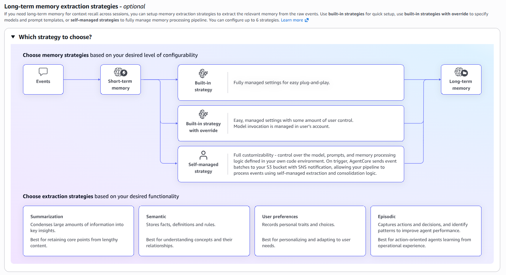
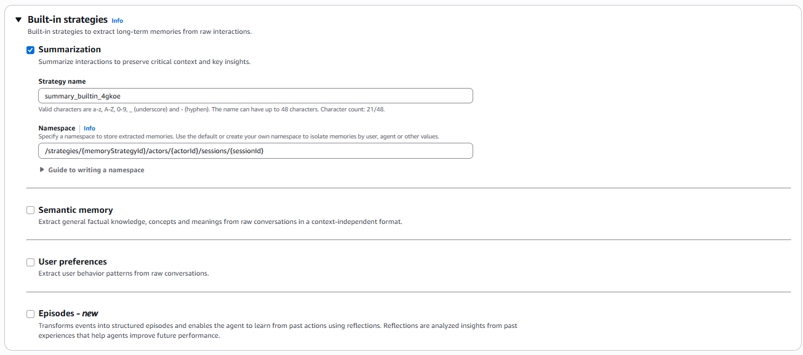

Amazon Bedrock Agent Coreにおける**LTM (Long-term Memory)** は、短期間のやり取り（Short-term Memory）を超えて、数日後や数週間後の対話でもユーザーの情報を覚えているための仕組みです。

短期記憶（STM）が「会話ログの生データ」を扱うのに対し、長期記憶はそこから **「インサイト（価値ある情報）」を蒸留して蓄積** します。

# 概要：オーケストレーション型討論システム

AgentCoreのLTMは、単一の箱ではありません。`MemoryId`（Namespace）をパス構造のように設計することで、**「消えない知識（Actor単位）」** と **「特定の振り返り（Session単位）」**　を使い分けることが可能です。

AgentCoreの長期記憶（LTM）におけるNamespace設計の肝は、**「誰の(Actor)」** 情報を**「どの粒度(Scope)」**で保持するかをパス構造で定義することです。

- **Actor IDによる分離:** ユーザー間のデータ混ざりを物理的に防止。
    
- **Namespaceによる役割分担:** 永続的な「知識・傾向」と、一過性の「セッションサマリー」を切り分ける。
    
# 実装のポイント

- 長期記憶は、『[70-30-022.朝まで生テレビー短期記憶版＋](70-30-022.朝まで生テレビー短期記憶版＋.md)』で作成した短期記憶に対して、長期記憶の設定を追加するだけで対応できます。

- 短期記憶から長期記憶を抽出・保管するかどうかは、**任意（オプション）** です。  必要に応じて抽出・活用すればよく、必須ではありません。

# ネームスペースの設計

長期記憶は蓄積・参照を前提とするため、目的に応じて適切な一意キー（ユニークキー）の設計が不可欠です。
これは、検索するときにインデックスのような枠割を果たします。

| **カテゴリ** | **Namespace (Memory ID) の構成**                   | **保持するインサイト**      | **検索時のメリット**          |
| -------- | ----------------------------------------------- | ------------------ | --------------------- |
| **技術知識** | `tech_learning/knowledge/{actorId}`             | 習得済みスキル、苦手な概念      | 重複説明を避け、最適な難易度を提供     |
| **学習傾向** | `tech_learning/preferences/{actorId}`           | 好みの説明スタイル、集中できる時間帯 | 回答のトーンや形式（図解多用など）を最適化 |
| **サマリー** | `tech_learning/summaries/{actorId}/{sessionId}` | その回の到達点、宿題、未解決事項   | 「前回の続きから」という指示に即座に対応  |

# プロビジョニング

## AgentCoreのメモリに長期記憶の追加

`Amazon Bedrock AgentCore.Memory` にて **`My Memory ID`** を選択し、`Edit` をクリックします。

## 実装戦略&と抽出戦略

###  実装戦略 (Implementation Strategy)

記憶をどこに保存し、誰がそのライフサイクルを管理するかを決定します。

- **Built-in strategy**
    
    - AWSが完全に管理するフルマネージドな記憶方式です。
        
    -  開発者は裏側のDB（DynamoDBなど）を意識する必要がありません。AWS側で自動的に最適な形で保存・読み出しが行われます。
        
- **Built-in strategy with override**
    
    - 基本はAWSのフルマネージドですが、一部の挙動をカスタマイズする設定です。
        
    - デフォルトの保持期間や、特定の条件での記憶の優先順位などを、AWSの枠組みの中で微調整したい場合に使用します。
        
- **Self-managed Strategy**
    
    - 開発者が用意した独自のデータベース（自前のDynamoDBや外部DB）に記憶を保存する方式です。
        
    - データの保存場所を完全にコントロールしたい場合や、既存の顧客DBと密接に連携させたい場合に選択します。
        
### 抽出戦略 (Extraction Strategy)

膨大な会話履歴の中から、**「何を重要な記憶として残すか」**の切り口を決定します。

- **Summarization (要約)**
    
    - 会話全体をギュッと凝縮して要約する戦略です。
        
    - 細かい一言一句ではなく、「このユーザーは〇〇について相談した」という大枠の文脈を維持するのに適しています。
        
- **Semantic (意味的抽出)**
    
    - 会話の「意味」や「トピック」に焦点を当てて抽出します。
        
    -  ベクトル検索のように、文脈的に関連性の高い重要なキーワードやトピックを特定して記憶します。
        
- **User preferences (ユーザーの好み)**
    
    -  ユーザーの嗜好や設定に特化して抽出します。
        
    - 「コーヒーはブラック派」「週末に作業することが多い」といった、ユーザー個人に関する属性情報を優先的に覚えます。
        
- **Episodic (エピソード的抽出)**
    
    -  特定の「出来事」や「イベント」の単位で抽出します。
        
    -  「いつ、どこで、何が起きたか」という時系列の具体的なイベントを記憶するのに適しており、過去の特定のトラブル対応や決定事項を振り返る際に強力です。
        
### 今回の「疑似粗大ごみ判定システム」への適用

- **Built-in strategies**: On
- **Summarization**: On
	- **Strategy name:** `summary_builtin_4gkoe`
	- **Namespace:** `/strategies/{memoryStrategyId}/actors/{actorId}/sessions/{sessionId}`

#### ネームスペースのガイド

ネームスペースは、スラッシュ ( `/` ) 区切りの階層形式で論理的に整理できます。以下の定義済み変数を利用できます：

- `{actorId}`：CreateEvent API で生成されるユーザー識別子
- `{memoryStrategyId}`：抽出戦略の識別子
- `{sessionId}`：各セッションの識別子
    
**例：**  
`/actors/{actorId}/strategies/{memoryStrategyId}/sessions/{sessionId}`

実際の適用例：  
`/actor/actor-dw5zuaHwP2/strategy/summarization-fy5ziaKwC2/session/session-ga7ipaHwV8`

設定後、以下の Strategy ID を控えておきましょう：

- **Strategy ID:** `summary_builtin_lodbf-2whoD9DEDz`

この設定により、**短期記憶から長期記憶への自動抽出**が開始されます。

特に **サンプルコードの修正や環境変数の編集は不要**です。  
そのままの構成で動作確認が可能です。
