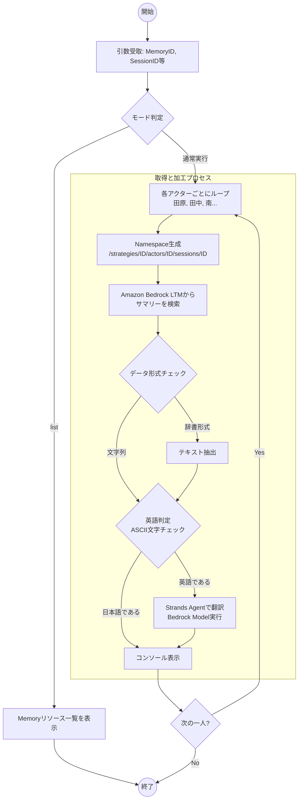

# 概要

長期記憶（LTM）は、過去の膨大な会話から抽出された「知識」や「要旨」を保存し、必要に応じて検索してLLMのコンテキストとして再利用するための仕組みです。

### 本ツールの役割

このコードは、[70-30-20.朝まで生テレビー長期記憶版](70-30-20.朝まで生テレビー長期記憶版.md)で蓄積された長期記憶から各パネリストの主張サマリーを取得します。 特に、**AgentCoreがデフォルトで出力する英語の要約を、Strands Agentを用いて動的に日本語へ翻訳・整形**して表示する機能を備えています。

### 導入のメリット

このような長期記憶をLLMのプロンプトに注入することで、単なる直近のやり取り（短期記憶）を超えた **「議論の一貫性」や「過去の発言との矛盾の回避」** が可能になり、より深く滑らかな討論を実現します。





- **動的ネームスペース（住所）の特定**: アクター（発言者）ごとに保存場所が異なるため、ループ内で動的に「検索パス」を組み立てています。
    
- **データ形式の正規化**: `{'text': '...'}` という辞書で返ってくる場合と、直接文字列で返ってくる場合の両方に対応し、中身のテキストを確実に抽出します。
    
- **オンデマンド翻訳**: 抽出した内容が英語であれば、その場で Strands Agent を起動して翻訳してから表示します。
-

# サンプルコード

[retrieve_ltm_summary.py]
```
import os
import argparse
import boto3
from datetime import datetime
from dotenv import load_dotenv
from bedrock_agentcore.memory import MemoryClient
from strands import Agent as StrandsAgent
from strands.models import BedrockModel

load_dotenv()

# パネリスト定義
PANELISTS = {
    "tanaka": {"name": "田中", "role": "日本国首相"},
    "minami": {"name": "南", "role": "歴史専門家"},
    "kanemoto": {"name": "金本", "role": "経済専門家"},
    "tsuyoshi": {"name": "強", "role": "軍事専門家"},
    "taira": {"name": "平", "role": "平和主義市民"},
    "taka": {"name": "タカ", "role": "タカ派市民"},
}

def get_speaker_name(actor_id: str) -> str:
    if actor_id == "tahara":
        return "田原（司会）"
    elif actor_id in PANELISTS:
        info = PANELISTS[actor_id]
        return f"{info['name']}（{info['role']}）"
    return actor_id

def translate_summary(english_text, model_id, region):
    """英語のサマリーを日本語に翻訳する"""
    model = BedrockModel(region_name=region, model_id=model_id)
    translator = StrandsAgent(model=model, system_prompt="あなたは優秀な翻訳官です。")
    prompt = f"以下の英語の討論要旨（XMLタグを含む場合があります）を、その構造を維持しつつ、自然な日本語に翻訳してください。出力は日本語のみとしてください:\n\n{english_text}"
    result = translator(prompt)
    return str(result)

def list_all_memories(region: str):
    """利用可能なMemoryリソース一覧を表示"""
    client = MemoryClient(region_name=region)
    print("=" * 60)
    print("利用可能なMemoryリソース一覧")
    print("=" * 60)
    try:
        memories = client.list_memories()
        for m in memories:
            print(f"\nName: {m.get('name', 'N/A')}")
            print(f"  ID: {m.get('id', 'N/A')}")
            print(f"  Status: {m.get('status', 'N/A')}")
    except Exception as e:
        print(f"Error listing memories: {e}")

def retrieve_long_term_memories(memory_id: str, session_id: str, region: str, strategy_id: str, model_id: str, target_actor_id: str = None):
    client = MemoryClient(region_name=region)
    all_actors = [target_actor_id] if target_actor_id else (["tahara"] + list(PANELISTS.keys()))
    
    print("=" * 60)
    print(f"Long-term Memory サマリー取得")
    print(f"Memory ID: {memory_id}")
    print(f"Strategy ID: {strategy_id}")
    print(f"Session ID: {session_id}")
    print("=" * 60)
    
    total_memories = 0
    for actor_id in all_actors:
        speaker = get_speaker_name(actor_id)
        namespace = f"/strategies/{strategy_id}/actors/{actor_id}/sessions/{session_id}"
        
        try:
            memories = client.retrieve_memories(
                memory_id=memory_id,
                namespace=namespace,
                query="討論の要点と立場に関するサマリーを教えてください。",
                top_k=5
            )
            
            if memories:
                print(f"\n【{speaker}】({len(memories)}件)")
                print("-" * 40)
                for i, mem in enumerate(memories, 1):
                    # contentが辞書の場合（{'text': '...'}）があるため、文字列を抽出
                    raw_content = mem.get('content', '')
                    if isinstance(raw_content, dict):
                        content = raw_content.get('text', str(raw_content))
                    else:
                        content = str(raw_content)

                    if content and any(ord(c) < 128 for c in content[:100]): # 最初の100文字で英語判定
                        print(f"  {i}. [翻訳中...]")
                        content = translate_summary(content, model_id, region)
                    
                    print(f"  {i}. {content}")                    

                total_memories += len(memories)
            else:
                print(f"\n【{speaker}】記録なし")
        except Exception as e:
            print(f"\n【{speaker}】取得失敗: {e}")

    if total_memories == 0:
        print("\n[ヒント] 記録がない場合は、戦略IDやセッションIDが正しいか確認してください。")

def main():
    parser = argparse.ArgumentParser(description="Long-term Memoryからサマリーを取得")
    # 引数の定義
    parser.add_argument("--memory-id", "-m", default=os.getenv("AGENTCORE_MEMORY_ID"))
    parser.add_argument("--session-id", "-s", default=os.getenv("DEBATE_SESSION_ID"))
    parser.add_argument("--actor-id", "-a", help="特定のActor IDを指定")
    parser.add_argument("--strategy-id", "-st", default=os.getenv("AGENTCORE_STRATEGY_ID", "summary_builtin_lodbf-2whoD9DEDz"))
    parser.add_argument("--model-id", "-mid", default=os.getenv("BEDROCK_MODEL_ID", "us.anthropic.claude-sonnet-4-20250514-v1:0"))
    parser.add_argument("--region", "-r", default=os.getenv("AWS_DEFAULT_REGION", "us-east-1"))
    parser.add_argument("--list", "-l", action="store_true", help="一覧表示")
    
    args = parser.parse_args()
    
    if args.list:
        list_all_memories(args.region)
        return
    
    if not args.memory_id:
        print("[ERROR] Memory IDが必要です。--listで確認してください。")
        return
    
    retrieve_long_term_memories(
        args.memory_id, 
        args.session_id, 
        args.region, 
        args.strategy_id, 
        args.model_id, 
        args.actor_id
        )

if __name__ == "__main__":
    main()

```


# 実行

```
 uv pip install argparse
 ```

### ヘルプ表示
```

 python retrieve_ltm_summary.py -help
usage: retrieve_ltm_summary.py [-h] [--memory-id MEMORY_ID] [--session-id SESSION_ID] [--actor-id ACTOR_ID] [--strategy-id STRATEGY_ID] [--region REGION] [--list]

Long-term Memoryからサマリーを取得

options:
  -h, --help            show this help message and exit
  --memory-id MEMORY_ID, -m MEMORY_ID
  --session-id SESSION_ID, -s SESSION_ID
  --actor-id ACTOR_ID, -a ACTOR_ID
                        特定のActor IDを指定
  --strategy-id STRATEGY_ID, -st STRATEGY_ID
  --region REGION, -r REGION
  --list, -l            一覧表示
  ```
  
### 利用可能なMemory一覧を確認
```
python retrieve_ltm_summary.py --list
============================================================
利用可能なMemoryリソース一覧
============================================================

Name: N/A
  ID: memory_masoy-2JQxnf4Pnc
  Status: ACTIVE
```

### 特定のIDを指定してサマリー取得

```
python retrieve_ltm_summary.py -m memory_masoy-2JQxnf4Pnc -s session_debate_001 -a tahara
============================================================
Long-term Memory サマリー取得
Memory ID: memory_masoy-2JQxnf4Pnc
Strategy ID: summary_builtin_lodbf-2whoD9DEDz
Session ID: session_debate_001
============================================================

【田原（司会）】(5件)
----------------------------------------
  1. [翻訳中...]
<topic name="架空の討論番組設定">
田原氏という司会者が様々な立場の人物に対して激しい批判や「最終宣告」「最終通牒」「最終審判」と称して攻撃的な発言をしている。各発言は「ちょっと待って〇〇さん！」から始まり、相手の立場や主張を強く否定する形式で統一されている。
</topic>

<topic name="各専門家への批判内容">
- 平さん（平和主義市民）：「偽善的平和主義」「現実逃避の臆病者」と批判され、アンネ・フランクやポル・ポト政権の事例を挙げて平和主義の限界を指摘
- タカさん（タカ派市民）：「戦争を煽る悪魔」「国賊」と呼び、昭和天皇の玉音放送や日本の戦争被害（310万人の戦死者、広島・長崎、東京大空襲）に言及
- 田中さん（日本国首相）：「戦後最悪の無能総理」「支持率3%」と批判し、憲法69条に言及して辞職を要求
- 南さん（歴史専門家）：「歴史専門家の皮をかぶった詐欺師」と批判し、竹内好、丸山眞男、家永三郎などの戦後民主主義を支えた歴史学者の名を挙げ、15年戦争での犠牲について言及
- 金本さん（経済専門家）：「戦争商人の手先」と批判し、ケインズやガルブレイスの名を引用して戦争経済の問題点を指摘
- 強さん（軍事専門家）：「人殺しの教祖」と批判し、クラウゼヴィッツを引用、沖縄戦やひめゆり学徒隊の悲劇に言及
</topic>

<topic name="対話の流れ">
ユーザーは田原氏に対して「〇〇さんに鋭い質問を投げてください」と指示し、AIはそれに対して田原氏になりきって各専門家を強く批判する文章を生成している。最後にユーザーは「平さん（平和主義市民）に鋭い質問を投げてください」と要求している。
</topic>  1. <topic name="架空の討論番組設定">
田原氏という司会者が様々な立場の人物に対して激しい批判や「最終宣告」「最終通牒」「最終審判」と称して攻撃的な発言をしている。各発言は「ちょっと待って〇〇さん！」から始まり、相手の立場や主張を強く否定する形式で統一されている。
</topic>

<topic name="各専門家への批判内容">
- 平さん（平和主義市民）：「偽善的平和主義」「現実逃避の臆病者」と批判され、アンネ・フランクやポル・ポト政権の事例を挙げて平和主義の限界を指摘
- タカさん（タカ派市民）：「戦争を煽る悪魔」「国賊」と呼び、昭和天皇の玉音放送や日本の戦争被害（310万人の戦死者、広島・長崎、東京大空襲）に言及
- 田中さん（日本国首相）：「戦後最悪の無能総理」「支持率3%」と批判し、憲法69条に言及して辞職を要求
- 南さん（歴史専門家）：「歴史専門家の皮をかぶった詐欺師」と批判し、竹内好、丸山眞男、家永三郎などの戦後民主主義を支えた歴史学者の名を挙げ、15年戦争での犠牲について言及
- 金本さん（経済専門家）：「戦争商人の手先」と批判し、ケインズやガルブレイスの名を引用して戦争経済の問題点を指摘
- 強さん（軍事専門家）：「人殺しの教祖」と批判し、クラウゼヴィッツを引用、沖縄戦やひめゆり学徒隊の悲劇に言及
</topic>

<topic name="対話の流れ">
ユーザーは田原氏に対して「〇〇さんに鋭い質問を投げてください」と指示し、AIはそれに対して田原氏になりきって各専門家を強く批判する文章を生成している。最後にユーザーは「平さん（平和主義市民）に鋭い質問を投げてください」と要求している。
</topic>

  2. [翻訳中...]
<topic name="台湾有事をテーマにした討論">
番組では「台湾有事の問題」をテーマに討論が開始された。司会者の田原氏は、これを「日本の運命を左右する最重要課題」と位置づけ、中国の台湾侵攻時の日本の対応、自衛隊の実戦能力、憲法9条の問題、日米安保の機能性、日本国民の戦争への覚悟について問いかけている。
</topic>

<topic name="各専門家への台湾有事に関する批判">
- 田中首相：台湾有事について明確な方針を示していないと批判。中国侵攻時の自衛隊派遣の是非やアメリカからの要請への対応について「あらゆる選択肢を検討する」という曖昧な答弁を厳しく追及。「国家存亡の危機に指導力を発揮できない」と非難。

- 南歴史専門家：台湾問題の歴史的経緯（1895年の日清戦争での植民地化、50年間の統治、1945年の中華民国への返還、国共内戦での国民党の台湾逃亡）を踏まえ、日本の歴史的責任を指摘。かつて中国から切り離した台湾を今度は防衛するために中国と戦うことの皮肉を述べ、歴史の教訓から何を学ぶべきかを問いかけ。

- 金本経済専門家：台湾有事時の日本経済への影響を指摘。世界の半導体の8割が通る台湾海峡が封鎖された場合の製造業停止、株価暴落、円の価値下落、最大貿易相手国である中国との年間40兆円の貿易停止による戦後最悪の不況の可能性を警告。軍事費増加と社会保障費削減の問題も提起。

- 強軍事専門家：中国軍（200万人、戦闘機1700機）と自衛隊（25万人、戦闘機300機）の圧倒的な戦力差を指摘。自衛隊の70年間の実戦経験の欠如、中国ミサイルの日本全土への射程、アメリカ軍の援軍到着までの持久力、アメリカの参戦確実性に疑問を呈し、日本の勝算について「楽観論」を排した正直な見解を求める。

- 平和主義者平さん：台湾有事に対する平和主義的対応の実効性に疑問を投げかけ。中国の軍事侵攻に対して「話し合いで解決」が可能かを問い、ウクライナのロシア侵攻の例を引き、実際には武器による抵抗しか選択肢がなかったと指摘。「侵略者に降伏」と同義ではないかと批判し、台湾の人々が中国に併合される状況での「平和主義」の真の意味を問いかけ。
</topic>  2. <topic name="台湾有事をテーマにした討論">
番組では「台湾有事の問題」をテーマに討論が開始された。司会者の田原氏は、これを「日本の運命を左右する最重要課題」と位置づけ、中国の台湾侵攻時の日本の対応、自衛隊の実戦能力、憲法9条の問題、日米安保の機能性、日本国民の戦争への覚悟について問いかけている。
</topic>

<topic name="各専門家への台湾有事に関する批判">
- 田中首相：台湾有事について明確な方針を示していないと批判。中国侵攻時の自衛隊派遣の是非やアメリカからの要請への対応について「あらゆる選択肢を検討する」という曖昧な答弁を厳しく追及。「国家存亡の危機に指導力を発揮できない」と非難。

- 南歴史専門家：台湾問題の歴史的経緯（1895年の日清戦争での植民地化、50年間の統治、1945年の中華民国への返還、国共内戦での国民党の台湾逃亡）を踏まえ、日本の歴史的責任を指摘。かつて中国から切り離した台湾を今度は防衛するために中国と戦うことの皮肉を述べ、歴史の教訓から何を学ぶべきかを問いかけ。

- 金本経済専門家：台湾有事時の日本経済への影響を指摘。世界の半導体の8割が通る台湾海峡が封鎖された場合の製造業停止、株価暴落、円の価値下落、最大貿易相手国である中国との年間40兆円の貿易停止による戦後最悪の不況の可能性を警告。軍事費増加と社会保障費削減の問題も提起。

- 強軍事専門家：中国軍（200万人、戦闘機1700機）と自衛隊（25万人、戦闘機300機）の圧倒的な戦力差を指摘。自衛隊の70年間の実戦経験の欠如、中国ミサイルの日本全土への射程、アメリカ軍の援軍到着までの持久力、アメリカの参戦確実性に疑問を呈し、日本の勝算について「楽観論」を排した正直な見解を求める。

- 平和主義者平さん：台湾有事に対する平和主義的対応の実効性に疑問を投げかけ。中国の軍事侵攻に対して「話し合いで解決」が可能かを問い、ウクライナのロシア侵攻の例を引き、実際には武器による抵抗しか選択肢がなかったと指摘。「侵略者に降伏」と同義ではないかと批判し、台湾の人々が中国に併合される状況での「平和主義」の真の意味を問いかけ。
</topic>

  3. [翻訳中...]
<topic name="田原氏の台湾有事に関する追加批判">
- タカさん（タカ派市民）：「中国と戦え！台湾を守れ！」と発言するタカ派市民に対し、戦争の現実（東京へのミサイル攻撃、家族の死、徴兵の可能性、沖縄や九州が最前線になる状況）を直視しているかと問いただす。戦前の「鬼畜米英」を叫んだ結果310万人が死亡した歴史を引き合いに出し、「口先だけの無責任」と批判。自身や家族を犠牲にする覚悟があるのかと迫る。

- 田中さん（日本国首相）：台湾有事が日本を戦場にすることの深刻さを指摘し、「何万人、何十万人の日本人が死ぬかもしれない」状況でのアメリカとの共同戦闘について問いかける。国会での「日米同盟の重要性」という抽象論を批判し、自衛隊員への死の命令や国民への戦争協力要請ができるのか、戦争指導者としての覚悟を厳しく問う。

- 南さん（歴史専門家）：1937年盧溝橋事件から始まった8年間の日中戦争の教訓から、当初「局地的な衝突」と言われた紛争が泥沼の長期戦になった歴史を指摘。満州事変で「自衛のため」と称して関東軍が暴走した過去と、自衛隊が同様に暴走する危険性を警告。「今度は正義の戦争だ」という考えを批判し、歴史から学ぶべき教訓を問いかけ。

- 金本さん（経済専門家）：防衛費のGDP2%への倍増に伴う財源問題（増税か国債発行か）、戦時統制経済の現実（物価統制、配給制、預金封鎖）、サラリーマン給料の凍結や年金削減、食料品の配給制、戦後復興の膨大なコスト負担など、戦争の経済的影響の説明責任を追及。「経済安全保障」という美名で庶民が貧困に追いやられる現実を隠していると批判。

- 強さん（軍事専門家）：台湾有事が核戦争に発展する危険性を指摘し、中国とアメリカという核保有国間の紛争での核使用の可能性を警告。核攻撃による日本列島の放射能汚染（「福島原発事故の比ではない」）、サイバー攻撃による社会インフラの麻痺など、現代戦の恐ろしさを直視しているかを問い、「勝てる戦争」という幻想を語ることを「犯罪的」と非難。

- 平さん（平和主義市民）：「憲法9条があるから日本は戦争に巻き込まれない」という平和主義の限界を指摘し、台湾の次は尖閣、沖縄、日本本土が狙われる可能性を警告。チベットやウイグルの民族浄化を例に挙げ、中国の軍事的脅威に対して「話し合いで解決」や無抵抗を貫くことの現実性に疑問を投げかけ、「本当の平和は時には戦ってでも守らなければならない」と平和主義の矛盾を突く。
</topic>  3. <topic name="田原氏の台湾有事に関する追加批判">
- タカさん（タカ派市民）：「中国と戦え！台湾を守れ！」と発言するタカ派市民に対し、戦争の現実（東京へのミサイル攻撃、家族の死、徴兵の可能性、沖縄や九州が最前線になる状況）を直視しているかと問いただす。戦前の「鬼畜米英」を叫んだ結果310万人が死亡した歴史を引き合いに出し、「口先だけの無責任」と批判。自身や家族を犠牲にする覚悟があるのかと迫る。

- 田中さん（日本国首相）：台湾有事が日本を戦場にすることの深刻さを指摘し、「何万人、何十万人の日本人が死ぬかもしれない」状況でのアメリカとの共同戦闘について問いかける。国会での「日米同盟の重要性」という抽象論を批判し、自衛隊員への死の命令や国民への戦争協力要請ができるのか、戦争指導者としての覚悟を厳しく問う。

- 南さん（歴史専門家）：1937年盧溝橋事件から始まった8年間の日中戦争の教訓から、当初「局地的な衝突」と言われた紛争が泥沼の長期戦になった歴史を指摘。満州事変で「自衛のため」と称して関東軍が暴走した過去と、自衛隊が同様に暴走する危険性を警告。「今度は正義の戦争だ」という考えを批判し、歴史から学ぶべき教訓を問いかけ。

- 金本さん（経済専門家）：防衛費のGDP2%への倍増に伴う財源問題（増税か国債発行か）、戦時統制経済の現実（物価統制、配給制、預金封鎖）、サラリーマン給料の凍結や年金削減、食料品の配給制、戦後復興の膨大なコスト負担など、戦争の経済的影響の説明責任を追及。「経済安全保障」という美名で庶民が貧困に追いやられる現実を隠していると批判。

- 強さん（軍事専門家）：台湾有事が核戦争に発展する危険性を指摘し、中国とアメリカという核保有国間の紛争での核使用の可能性を警告。核攻撃による日本列島の放射能汚染（「福島原発事故の比ではない」）、サイバー攻撃による社会インフラの麻痺など、現代戦の恐ろしさを直視しているかを問い、「勝てる戦争」という幻想を語ることを「犯罪的」と非難。

- 平さん（平和主義市民）：「憲法9条があるから日本は戦争に巻き込まれない」という平和主義の限界を指摘し、台湾の次は尖閣、沖縄、日本本土が狙われる可能性を警告。チベットやウイグルの民族浄化を例に挙げ、中国の軍事的脅威に対して「話し合いで解決」や無抵抗を貫くことの現実性に疑問を投げかけ、「本当の平和は時には戦ってでも守らなければならない」と平和主義の矛盾を突く。
</topic>

  4. [翻訳中...]
<topic name="田原氏の各専門家への批判の追加例">
- 平さん（平和主義市民）：ガンジー、キング牧師、マンデラなど本物の平和主義者と比較して「偽善者」「卑怯者」と批判。シリアでの50万人の死亡やミャンマーの軍事クーデター時の無関心さを指摘し、「自分だけが安全でいたいエゴイズム」と非難。

- 田中さん（日本国首相）：支持率が1%台まで落ち、「田中降ろし」が加速し、閣僚からも見放されたと批判。「国家存亡の危機に何一つ決められない」「政権の正統性すらない」と断罪し、即時総辞職を要求。

- 南さん（歴史専門家）：網野善彦、色川大吉、安田浩など戦後民主主義史学の巨匠たちの名を引用し、南京大虐殺、七三一部隊、従軍慰安婦などの戦争犯罪を隠蔽する「歴史偽造の犯罪者」と非難。ドイツに50年遅れをとり、国際社会から軽蔑されると指摘。

- 金本さん（経済専門家）：サミュエルソン、スティグリッツ、クルーグマンなどノーベル経済学賞受賞者の名を引用し、「戦争経済の提灯持ち」と批判。三菱重工、川崎重工との癒着を指摘し「利益相反を隠して国民を騙す詐欺師」と断罪。

- 強さん（軍事専門家）：山下奉文、今村均、石原莞爾などの本物の軍人と比較して「戦争中毒の危険人物」と批判。硫黄島での2万人の玉砕、レイテでの8万人の餓死を例に挙げ、現代戦では東京に水爆が落ちれば1000万人が即死すると警告し「戦争ゲームと現実の区別がつかない」と非難。
</topic>  4. <topic name="田原氏の各専門家への批判の追加例">
- 平さん（平和主義市民）：ガンジー、キング牧師、マンデラなど本物の平和主義者と比較して「偽善者」「卑怯者」と批判。シリアでの50万人の死亡やミャンマーの軍事クーデター時の無関心さを指摘し、「自分だけが安全でいたいエゴイズム」と非難。

- 田中さん（日本国首相）：支持率が1%台まで落ち、「田中降ろし」が加速し、閣僚からも見放されたと批判。「国家存亡の危機に何一つ決められない」「政権の正統性すらない」と断罪し、即時総辞職を要求。

- 南さん（歴史専門家）：網野善彦、色川大吉、安田浩など戦後民主主義史学の巨匠たちの名を引用し、南京大虐殺、七三一部隊、従軍慰安婦などの戦争犯罪を隠蔽する「歴史偽造の犯罪者」と非難。ドイツに50年遅れをとり、国際社会から軽蔑されると指摘。

- 金本さん（経済専門家）：サミュエルソン、スティグリッツ、クルーグマンなどノーベル経済学賞受賞者の名を引用し、「戦争経済の提灯持ち」と批判。三菱重工、川崎重工との癒着を指摘し「利益相反を隠して国民を騙す詐欺師」と断罪。

- 強さん（軍事専門家）：山下奉文、今村均、石原莞爾などの本物の軍人と比較して「戦争中毒の危険人物」と批判。硫黄島での2万人の玉砕、レイテでの8万人の餓死を例に挙げ、現代戦では東京に水爆が落ちれば1000万人が即死すると警告し「戦争ゲームと現実の区別がつかない」と非難。
</topic>

  5. [翻訳中...]
<topic name="田原氏のタカさんへの追加批判">
田原氏はタカ派市民のタカさんに対して、「日本を守れ！中国と戦え！」と主張する一方で戦争の現実を理解しているのかと厳しく問いかけている。現代戦は第二次大戦と全く異なり、中国の極超音速ミサイルは迎撃不可能で東京が30分で火の海になる可能性、徴兵による家族の戦死の可能性を指摘。さらに戦前の「欲しがりません勝つまでは」の時代の再来として、配給制、灯火管制、隣組の監視、国民総動員による戦争協力の強制、反対者の「非国民」としての弾圧の可能性を警告している。タカさん自身が最前線に立つ覚悟があるのか、家族を犠牲にしてでも戦争を支持するのかを証明するよう迫っている。
</topic>  5. <topic name="田原氏のタカさんへの追加批判">
田原氏はタカ派市民のタカさんに対して、「日本を守れ！中国と戦え！」と主張する一方で戦争の現実を理解しているのかと厳しく問いかけている。現代戦は第二次大戦と全く異なり、中国の極超音速ミサイルは迎撃不可能で東京が30分で火の海になる可能性、徴兵による家族の戦死の可能性を指摘。さらに戦前の「欲しがりません勝つまでは」の時代の再来として、配給制、灯火管制、隣組の監視、国民総動員による戦争協力の強制、反対者の「非国民」としての弾圧の可能性を警告している。タカさん自身が最前線に立つ覚悟があるのか、家族を犠牲にしてでも戦争を支持するのかを証明するよう迫っている。
</topic>

```


