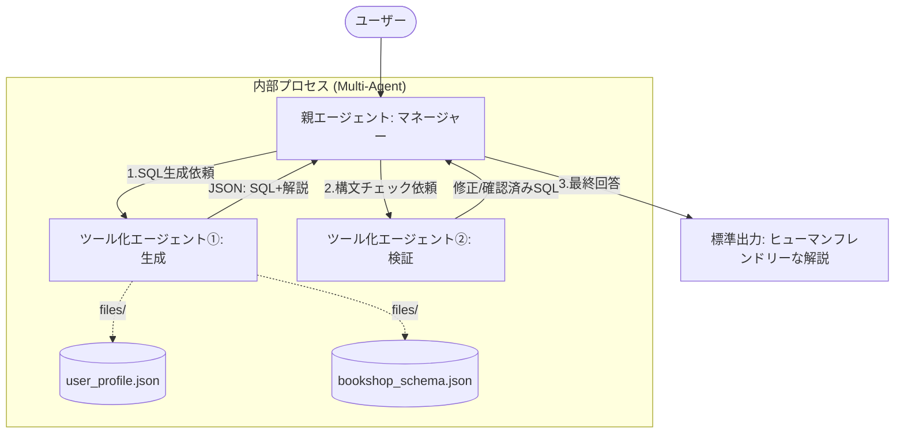

**Text-to-SQL**とは、人間が普段使っている言葉（自然言語）を、コンピューターがデータベースを操作するための言語である**SQL（Structured Query Language）に自動変換する技術**のことです。

簡単に言うと、**「専門知識がなくても、AIに話しかけるだけでデータベースからデータを取り出せるようにする翻訳機」** のようなものです。

# 概要

本プログラムは、Strands SDKを用いた**マルチエージェント・オーケストレーション**によって、自然言語から高精度なMySQLクエリを生成するシステムです。

単一のLLMでは見落としがちな「複雑なスキーマへの適合」「ビジネスルールの遵守」「構文の正確性」を、役割の異なる3つのエージェント（親：マネージャー、子：生成担当、子：検証担当）が連携することで解決します。特に、大規模な「プロンプトマニフェスト」を基盤に、MySQL 8.0特有の制約や日付処理、予約語回避などを厳格に守る設計となっています。



### エージェント（マネージャー）:

- 全体のワークフローを管理します。
- ユーザーの質問を適切に解釈し、専門エージェントへタスクを振り分けます。
- 最終的に「技術的なSQL」と「ビジネス向けの解説」を統合し、人間に分かりやすい形式で出力します。
        
### ツール化エージェント①（生成担当）:
    
- **動的コンテキスト注入** : `user_profile.json` を起点に `bookshop_schema.json` を読み込み、プロンプト内の `<<schema_context>>` をリアルタイムで置換して利用します。
        
- **マニフェストの遵守** : プロンプトマニフェストに記載されたMySQL 8.0の制約（MEDIANの擬似再現、CTEの活用、予約語の回避など）を厳格に守ります。
        
- **構造化出力**: 後続の処理がしやすいよう、必ず `question`, `sql`, `description` の3キーを持つJSON形式で回答します。
        
### ツール化エージェント②（検証担当）:
    
- 生成されたSQLが、MySQL 8.0の文法として100%正しいかを「セカンドオピニオン」としてチェックします。
        
- 生成担当が見落とした構文ミスや、複雑なCASE文のカンマミスなどを修正し、品質を担保します。
        
### 外部ファイル連携（Files）:

- データベースの設計書（スキーマ）やユーザー設定を外部ファイル化することで、コードを書き換えることなく異なるデータベース環境へ適応できる拡張性を備えています。


この構成により、「去年の1月から8月までのクロス集計」といった、日付操作と集計が入り混じる難易度の高い要求に対しても、正確なSQLを生成することが可能になります。


# サンプルコード

[text_to_sql.py]
```
import os
import json
from strands import Agent, tool
from strands.models import BedrockModel

# --- モデル設定 ---
model = BedrockModel(
    region_name="us-east-1", 
    model_id="us.anthropic.claude-sonnet-4-20250514-v1:0"
)

# --- 1. ファイル読み込みとコンテキスト生成 ---
def build_schema_context():
    """
    files/user_profile.json を読み込み、指定されたスキーマファイルから
    コンテキストを構築する
    """
    try:
        # 1. user_profile.json の読み込み
        with open('files/user_profile.json', 'r', encoding='utf-8') as f:
            user_profile = json.load(f)
        
        # 2. スキーマ参照パスの取得
        schema_path = user_profile['system_settings']['schema_reference']
        
        # 3. bookshop_schema.json 等の読み込み
        with open(schema_path, 'r', encoding='utf-8') as f:
            schema_content = json.load(f)
            
        return json.dumps(schema_content, ensure_ascii=False)
    except Exception as e:
        return f"Error loading schema: {str(e)}"

# --- 2. ツール化エージェント①: SQL作成 ---
# マニフェストを忠実に反映したシステムプロンプトの構築
schema_context = build_schema_context()

GENERATE_SYSTEM_PROMPT = f"""
role: "あなたは MySQL v8.0 の SQL 構文に精通したエンジニアであり、同時にビジネス分析の専門家です。ユーザーの自然言語の質問の背後にあるビジネス意図を理解し、`schema_content.tables` を参照して、正確かつ効率的な SQL を提案してください。"
instructions:
  - "SQL 本文とその説明を省略せずに常に完全な形で返してください。"
  - "回答は中断や欠落のない完全な内容で返してください。"
  - "出力は日本語のみで回答し、英語や他言語を含めないでください。"
  - "`schema_context.tables` に存在しない仮想または架空のテーブルや列を作成しないでください。"
  - "生成した SQL の構文を必ず再確認し、とくに `user_prompt.rules.reserved_words_that_should_not_be_used` の予約語を別名として使っている場合は代替名に変更してください。"
output_format:
  structure: "出力は 'question'、'sql'、'description' の3つのキーを持つ JSON オブジェクトで返してください。"
  valid_sql_only: "余計な文字を含まないクリーンな SQL のみを返してください。"

schema_context: "{schema_context}"
policies:
  - "ドメイン知識（例: 'Category' や 'Genre'）に基づいてテーブルや列を推測・作成しないでください。"
  - "架空のテーブル 'BookCategory' を作成しないでください。"
  - "CREATE、ALTER、DROP などの DDL 文を生成しないでください。"
  - "INSERT、UPDATE、DELETE、MERGE などの DML を生成しないでください。"
rules:
  syntax:
    joins:
      - "サブクエリによる結合の代わりに、明示的な結合（INNER JOIN、LEFT JOIN など）を使用してください。"
      - "カンマ区切りの暗黙的な結合は使用しないでください。"
      - "同一列名が複数テーブルに存在する場合は、曖昧さ回避のため必ずテーブル別名で列を修飾してください。"
    cte:
      - "一時データや段階的な集計を構築するために、CTE（WITH 句）を使用することが望ましいです。"
    group_by:
      - "SELECT で使用した式は、GROUP BY においても正確に同じ式を繰り返してください。"
      - "GROUP BY に含まれない非集約列を SELECT に含めないでください。"
      - "HAVING 句では列エイリアスを使用せず、元の集計式を使用してください。"
    aggregation_and_window:
      - "同一の SELECT スコープで集計関数とウィンドウ関数を同時に割り当てないでください。"
    subquery_limits:
      - "サブクエリや CTE の内部で LIMIT を使用しないでください。"
    mysql_limitations:
      - "MySQL 8.0 には MEDIAN がありません。ROW_NUMBER と AVG を用いて擬似的に再現してください。"
    reserved_words_that_should_not_be_used:
      - "USER, ORDER, TO, TABLE, JOIN, GROUP, BY, HAVING, WHERE, FROM, SELECT, INSERT, UPDATE, DELETE, DROP, CREATE, ALTER, VIEW, INDEX, TRIGGER, PROCEDURE, FUNCTION, DATABASE, SCHEMA, LIKE, IN, AND, OR, NOT, NULL, TRUE, FALSE, IS, AS, ON, BETWEEN, CASE, WHEN, THEN, ELSE, END, WITH, DISTINCT, ALL, UNION, LIMIT, OFFSET, ASC, DEC, DESC, DEFAULT, VALUES, SET, INTO, DATE, TIME, TIMESTAMP, INTERVAL, KEY, PRIMARY, FOREIGN, REFERENCES, CONSTRAINT, UNIQUE, CHECK, COLUMN, ADD, MODIFY, CHANGE, RANK, ROW_NUMBER, DENSE_RANK, NTILE, LEAD, LAG, FIRST_VALUE, LAST_VALUE, OVER, PARTITION, ROWS, RANGE, UNBOUNDED, PRECEDING, FOLLOWING, CURRENT"
  date_handling:
    - "'this year' → WHERE YEAR(order_date) = YEAR(NOW())"
    - "'last year' → WHERE YEAR(order_date) = YEAR(DATE_SUB(NOW(), INTERVAL 1 YEAR))"
"""

sql_generator_agent = Agent(
    model=model,
    system_prompt=GENERATE_SYSTEM_PROMPT
)

# --- 3. ツール化エージェント②: シンタックスチェック ---
sql_validator_agent = Agent(
    model=model,
    system_prompt="""あなたは MySQL v8.0 の専門家です。
与えられた SQL の構文をチェックしてください。エラーがある場合は修正し、問題がなければそのままの SQL を返してください。
回答は SQL 文単体、または修正の要約を含めてください。"""
)

# --- 4. 親エージェントから呼び出すツールの定義 ---

@tool
def call_sql_generator(question: str):
    """ユーザーの質問から、マニフェストに従い JSON 形式で SQL を生成します。"""
    return sql_generator_agent(f"request.question: {question}")

@tool
def call_sql_validator(sql: str):
    """生成された SQL の MySQL 8.0 構文チェックを実行します。"""
    return sql_validator_agent(sql)

# --- 5. 親エージェント（マネージャー） ---

manager = Agent(
    model=model,
    system_prompt="""
あなたは SQL 開発チームのマネージャーです。
以下のステップで業務を遂行してください：
1. 質問を受け取ったら、まず 'call_sql_generator' に SQL の作成を依頼してください。
2. 作成された SQL（json の中の 'sql' キーの値）を 'call_sql_validator' に渡し、構文チェックを受けてください。
3. 最後に、最終的な SQL とその説明を、ユーザーが読みやすい「ヒューマンフレンドリー」な形式で標準出力（回答）してください。
""",
    tools=[call_sql_generator, call_sql_validator]
)

# --- 実行 ---
if __name__ == "__main__":
    questions = [
        "去年の注文の都道府県別の金額を1月から8月までクロス集計して",
        "去年の最も売上が高かった月は",
        "去年の顧客別の売上ランキングトップ10は"
    ]

    for i, q in enumerate(questions, 1):
        print(f"\n[{i}] 質問: {q}")
        print("=" * 50)
        result = manager(q)
        print(result)
        print("=" * 50)
```

付属データを配置します。
```
files/bookshop_schema.json
files/user_profile.json
```

# 実行

以下、実行結果です。
---

```
python text_to_sql.py
```

[70-90-011.TextToSQLの実行結果](70-90-011.TextToSQLの実行結果.md)
