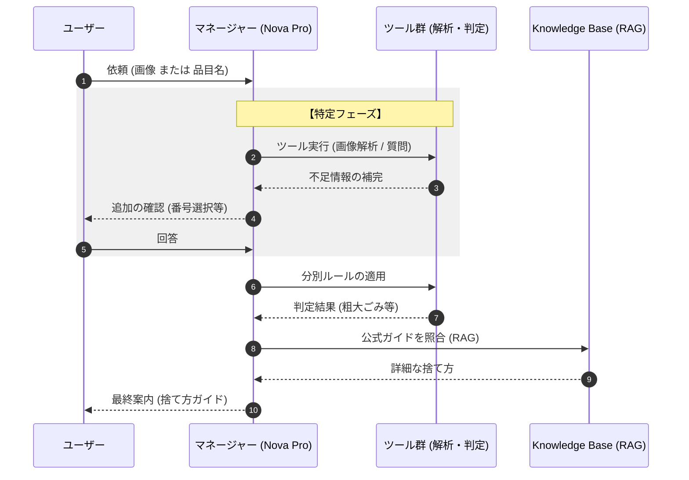

# 検証ユースケース：粗大ごみ受付をAIでアシストする

筆者は東京都足立区在住で、年に2回の**粗大ごみ持ち込み（無料）サービス**を活用しています。  
しかし、**事前のWeb申し込み手続き**に毎回苦労しています。

### 課題

- 申請時に**正確な品目名が分からないことがある** 
    
- 分かっていても、**PDF資料（10ページ前後）を参照するのが面倒**
    
- 結果として、**途中で挫折し、結局電話で案内員に頼る**ことが多い
	- 実は、Web申し込みは一回も成功してない

### ソリューション

この課題の解決策として、**画像からごみの品目を特定し、出し方を自動で案内する**「疑似粗大ごみ判定システム」の可能性を検証してみる。

- **マネージャー (Nova Pro) [司令塔]** ユーザーの最初の入力を受け取り、ゴール（捨て方ガイド）に到達するために「次にどのツールを使うべきか」を常に判断します。
    
- **ツール群 [実務担当]** マネージャーの指示に従い、画像の「解析」や、足りない情報を埋めるための「質問生成」、そして「ルールの計算」を実務としてこなします。
    
- **Knowledge Base [根拠]** 最後のステップで登場します。判定された品目に対して、足立区のExcelデータから「最も確実な公式情報」を取り出し、回答の信頼性を担保します。
    
- **全体の流れ** **「情報の特定（ツール）」→「ルールの適用（ツール）」→「公式情報の補完（KB）」** という、一方向で迷いのない構造に整理しています。

# 実装のポイント

### 「Coding不要」でできる範囲（Amazon Bedrock Knowledge Bases を使用）

以下のプロセスは、AWSコンソール上の設定だけで完結します。

- **PDFのベクトル化**: S3に置いたPDFを読み込み、AIが検索しやすい形式（ベクトル）に変換してデータベース（OpenSearch等）に保存する。
- **検索機能のテスト**: AWSコンソール上のテストウィンドウで、質問を投げるとPDFから回答が返ってくるか確認する。
- **プロンプトの設定**: AIに「ごみ分別の専門家として回答してください」といった役割を与える。

これだけで「PDFの内容に基づいて回答するAI」の心臓部は完成します。

### 「Coding（開発）」が必要になる範囲

実際に「システム」として動かすには、以下の部分で少しプログラミングが必要になります。

- **「写真」を送る部分**: ユーザーがアップロードした画像をAI（Novaなど）に渡し、「これは何のごみか？」を特定させる命令を送る処理。
- **処理のつなぎ込み（オーケストレーション）**:

    1. 写真を解析して「電子レンジ」と特定する。
    2. その「電子レンジ」という言葉でRAGに検索をかける。
    3. 両方の結果をまとめてユーザーに表示する。

- **ユーザーインターフェース (UI)**: LINEボットやWeb画面など、ユーザーが写真を送る口を作る部分。

# ナレッジベース作成

詳細は [70-90-021.画像から粗大ごみ判定ープロビジョニング](70-90-021.画像から粗大ごみ判定ープロビジョニング.md)をご参照ください。  
ここでは **Amazon Bedrock Knowledge Base** を使用しており、**ベクトルストアには Amazon OpenSearch Serverless** を採用しています。
