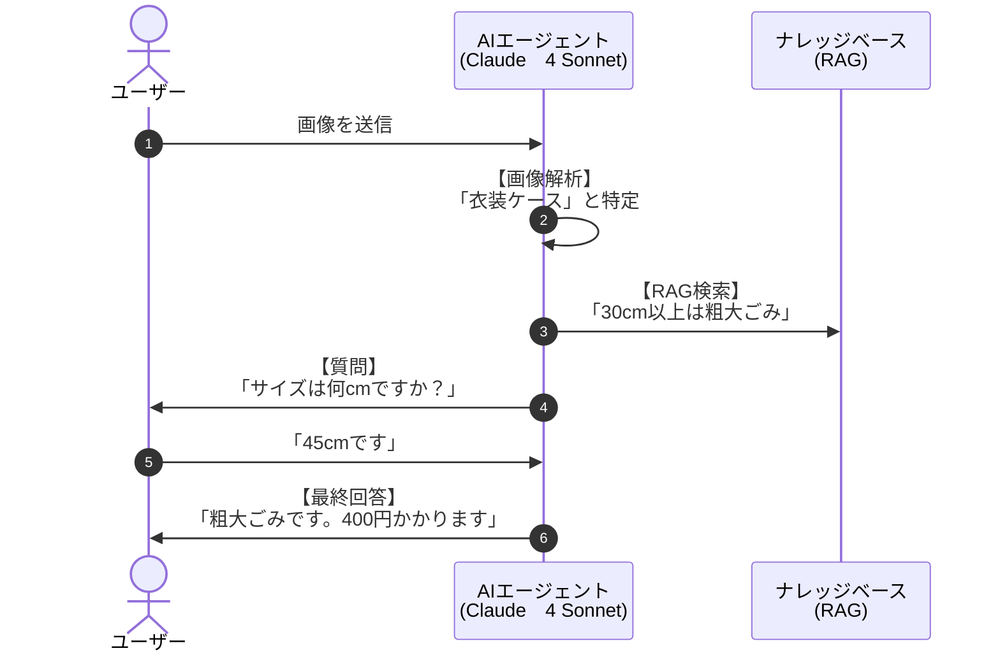

# 検証ユースケース：粗大ごみ受付をAIでアシストする

筆者は東京都足立区在住で、年に2回の**粗大ごみ持ち込み（無料）サービス**を活用しています。  
しかし、**事前のWeb申し込み手続き**に毎回苦労しています。

### 課題点

- 申請時に**正確な品目名が分からない**
    
- 分かっていても、**PDF資料（10ページ前後）を参照するのが面倒**
    
- 結果として、**途中で挫折し、結局電話で案内員に頼る**ことが多い
    

### 検証アイデア

この課題に対し、以下のような構成で **Amazon Bedrock の Knowledge Base 機能**を活用し、**自然言語で質問できるAIサポートエージェント**を構築・検証してみたいと考えています。

### 技術構成のイメージ

- **ドキュメントソース**：足立区の粗大ごみ品目PDF一覧（例：PDF→テキスト抽出してベクトル化）
    
- **ベクトル検索**：Amazon Bedrock Knowledge Base を利用
    
- **フロント**：自然文で「この椅子は粗大ごみ扱い？」「マットレスは何と分類される？」などと聞ける
    
- **推論**：Claude / TitanなどのLLMで応答生成
    
- **目的**：誰でも迷わず申し込みできる案内システム
    





- **画像解析**: 写真から「何のごみか」を名前（テキスト）にする。
    
- **RAG検索**: その名前で「分別のルール」をDBから引き出す。
    
- **サイズ確認**: ルールに「サイズ条件」があれば、ユーザーに質問する。
    
- **最終回答**: すべての情報を統合して、捨て方と手数料を答える。
    

# 実装のポイント

### 「Coding不要」でできる範囲（Amazon Bedrock Knowledge Bases を使用）

以下のプロセスは、AWSコンソール上の設定だけで完結します。

- **PDFのベクトル化**: S3に置いたPDFを読み込み、AIが検索しやすい形式（ベクトル）に変換してデータベース（OpenSearch等）に保存する。
    
- **検索機能のテスト**: AWSコンソール上のテストウィンドウで、質問を投げるとPDFから回答が返ってくるか確認する。
    
- **プロンプトの設定**: AIに「ごみ分別の専門家として回答してください」といった役割を与える。
    

これだけで「PDFの内容に基づいて回答するAI」の心臓部は完成します。

### 「Coding（開発）」が必要になる範囲

実際に「システム」として動かすには、以下の部分で少しプログラミング（主にPythonとAWS Lambda）が必要になります。

- **「写真」を送る部分**: ユーザーがアップロードした画像をAI（Claude 3など）に渡し、「これは何のごみか？」を特定させる命令を送る処理。
    
- **処理のつなぎ込み（オーケストレーション）**:
    
    1. 写真を解析して「電子レンジ」と特定する。
        
    2. その「電子レンジ」という言葉でRAGに検索をかける。
        
    3. 両方の結果をまとめてユーザーに表示する。
        
- **ユーザーインターフェース (UI)**: LINEボットやWeb画面など、ユーザーが写真を送る口を作る部分。
    
# サンプルコード

[text_to_garbage_info.py]
```
import os
import json
import base64
from strands import Agent, tool
from strands.models import BedrockModel

# --- モデル設定 ---
# 最新の Claude 3.7 Sonnet (20250514) を使用
model = BedrockModel(
    region_name="us-east-1", 
    model_id="us.anthropic.claude-3-7-sonnet-20250514-v1:0"
)

# --- 1. RAG（Knowledge Base）検索ツールの定義 ---
@tool
def search_garbage_rule(item_name: str):
    """
    ナレッジベースからごみの品目名に基づいた捨て方・手数料・注意点を検索します。
    """
    # 実際にはここに retrieve_and_generate 等のKB呼び出しを記述します
    # ここではKBが返すであろう情報をシミュレーションします
    return f"【KB検索結果】{item_name}について: 30cm角以上は粗大ごみ（400円）、未満は材質別。プラスチック製はモデル地区回収対象。"

# --- 2. 専門エージェントの定義 ---

# 画像解析エージェント（画像から品目名を特定）
image_analyzer = Agent(
    model=model,
    system_prompt="あなたは画像解析の専門家です。提供された画像から、ごみの品目（名称）を特定してください。不明確な場合は候補をいくつか挙げてください。"
)

# 判定エージェント（RAGの結果とサイズを考慮して最終回答）
judgement_agent = Agent(
    model=model,
    system_prompt="""あなたは自治体のごみ分別相談員です。
1. 品目名とRAGの知識を照合します。
2. 30cm角ルールなどのサイズ判定が必要な場合、情報がなければユーザーに「寸法（縦・横・高さ）」を質問してください。
3. 最終的に「ごみの種別（粗大・可燃・不燃等）」と「出し方・手数料」を回答してください。"""
)

# --- 3. 親エージェントから呼び出すツールの定義 ---

@tool
def call_image_analyzer(image_path: str):
    """画像ファイルを読み込み、何が写っているかを特定します。"""
    with open(image_path, "rb") as f:
        img_base64 = base64.b64encode(f.read()).decode("utf-8")
    
    # 画像データを含めてエージェントを呼び出し
    return image_analyzer([
        {"type": "text", "text": "この画像に写っているものは何ですか？名称を教えてください。"},
        {"type": "image", "source": {"type": "base64", "media_type": "image/jpeg", "data": img_base64}}
    ])

@tool
def ask_user_dimension(message: str):
    """サイズが不明な場合に、ユーザーに寸法を入力してもらうためのツールです。"""
    print(f"\n[AIからの質問]: {message}")
    dimension = input(">> 寸法を入力してください（例: 40cm x 40cm）: ")
    return f"ユーザーからの回答: 寸法は {dimension} です。"

# --- 4. 統括マネージャーエージェント ---

manager = Agent(
    model=model,
    system_prompt="""
あなたは「ごみ分別コンシェルジュ」です。以下の流れで対応してください：
1. 画像から品目名を特定する。
2. その名称でナレッジベースを検索する。
3. サイズ（30cm角など）の判定が必要で、画像から判断できない場合は、必ず 'ask_user_dimension' を使ってユーザーに確認してください。
4. 最終的に、粗大ごみ対象か、それ以外のごみ種別と出し方をフレンドリーに回答してください。
""",
    tools=[call_image_analyzer, search_garbage_rule, ask_user_dimension]
)

# --- 実行 ---
if __name__ == "__main__":
    image_file = "files/IMG_0358.jpg"
    
    if os.path.exists(image_file):
        print("--- ごみ分別判定スタート ---")
        response = manager(f"{image_file} の捨て方を教えてください。")
        print("\n" + "="*50)
        print(response)
        print("="*50)
    else:
        print(f"エラー: {image_file} が見つかりません。")
```

# 実行

```
python text_to_garbage_info.py
```