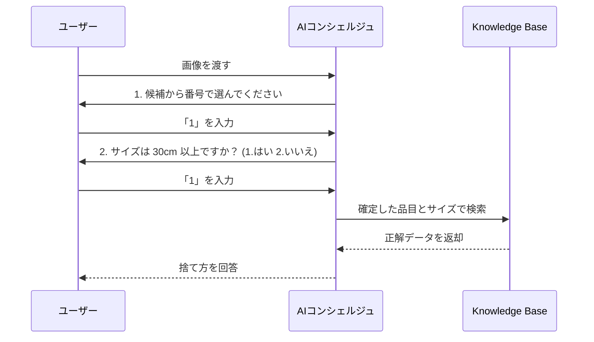

# 検証ユースケース：粗大ごみ受付をAIでアシストする

筆者は東京都足立区在住で、年に2回の**粗大ごみ持ち込み（無料）サービス**を活用しています。  
しかし、**事前のWeb申し込み手続き**に毎回苦労しています。

### 課題点

- 申請時に**正確な品目名が分からない** 
    
- 分かっていても、**PDF資料（10ページ前後）を参照するのが面倒**
    
- 結果として、**途中で挫折し、結局電話で案内員に頼る**ことが多い
	- 実は、Web申し込みは一回も成功してない
    
### 検証アイデア

この課題に対し、以下のような構成で **Amazon Bedrock の Knowledge Base 機能**を活用し、**自然言語で質問できるAIサポートエージェント**を構築・検証してみたいと考えています。

### 技術構成のイメージ

- **ドキュメントソース**：足立区の粗大ごみ品目PDF一覧（例：PDF→テキスト抽出してベクトル化）
    
- **ベクトル検索**：Amazon Bedrock Knowledge Base を利用
    
- **フロント**：自然文で「この椅子は粗大ごみ扱い？」「マットレスは何と分類される？」などと聞ける
    
- **推論**：Claude / TitanなどのLLMで応答生成
    
- **目的**：誰でも迷わず申し込みできる案内システム
    

- **画像解析が主役ではない**: 画像はあくまで「候補を出すため」に使い、最終的な決定はユーザーに**番号**で選ばせます。
    
- **間違いが起きない**: ユーザーが選んだ番号に基づいてKB（ナレッジベース）を引くので、誤判定のまま進むことがありません。
    
- **サイズも番号**: テキスト入力ではなく `1` か `2` を選ばせることで、処理を確実にしています。

# 実装のポイント

### 「Coding不要」でできる範囲（Amazon Bedrock Knowledge Bases を使用）

以下のプロセスは、AWSコンソール上の設定だけで完結します。

- **PDFのベクトル化**: S3に置いたPDFを読み込み、AIが検索しやすい形式（ベクトル）に変換してデータベース（OpenSearch等）に保存する。
- **検索機能のテスト**: AWSコンソール上のテストウィンドウで、質問を投げるとPDFから回答が返ってくるか確認する。
- **プロンプトの設定**: AIに「ごみ分別の専門家として回答してください」といった役割を与える。

これだけで「PDFの内容に基づいて回答するAI」の心臓部は完成します。

### 「Coding（開発）」が必要になる範囲

実際に「システム」として動かすには、以下の部分で少しプログラミングが必要になります。

- **「写真」を送る部分**: ユーザーがアップロードした画像をAI（Novaなど）に渡し、「これは何のごみか？」を特定させる命令を送る処理。
- **処理のつなぎ込み（オーケストレーション）**:

    1. 写真を解析して「電子レンジ」と特定する。
    2. その「電子レンジ」という言葉でRAGに検索をかける。
    3. 両方の結果をまとめてユーザーに表示する。

- **ユーザーインターフェース (UI)**: LINEボットやWeb画面など、ユーザーが写真を送る口を作る部分。

# ナレッジベース作成

詳細は [81-11.プロビジョニング](../81.BedrockKnowledgeBase/81-11.プロビジョニング.md)をご参照ください。  
ここでは **Amazon Bedrock Knowledge Base** を使用しており、**ベクトルストアには Amazon OpenSearch Serverless** を採用しています。
