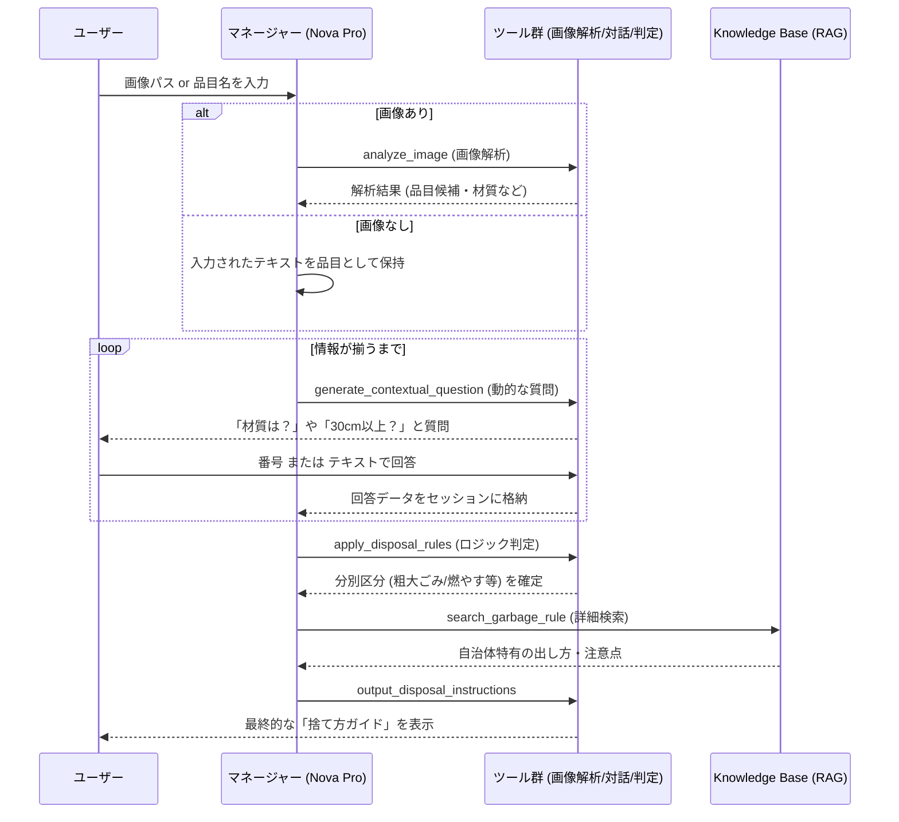

# 概要


ここでは、**画像から粗大ごみの品目を自動判別**する仕組みを検証しています。

### 処理の流れ

1. **画像を解析して品目名称を特定**
    
2. **ナレッジベースから該当するごみ品目情報を検索し、出し方を判定**
    
3. **判定結果を返却**
    





### 動的な質問ループ (loop): 
単に順番に質問するのではなく、`generate_contextual_question` が現在のセッション（材質が不明か、サイズが不明か）を見て、その時々に最適な質問をユーザーに投げる様子を表しています。
    
### ツールを介した情報の蓄積: 
マネージャー(M)自身がすべてを覚えるのではなく、ツール(T)を実行するたびに `session_state` が更新され、判定の精度が上がっていく流れです。
    
### 判定とRAGの組み合わせ: 
プログラム内の `determine_disposal_method`（ロジック判定）で大枠の区分を決め、その後に `Knowledge Base`（RAG）で具体的な自治体のルールを補完する「ハイブリッド検索」の形を表現しています。


# Amazon Nova

今回のサンプルコードで画像の解析は、Amazon Novaを使用しています。

**Amazon Nova**は、2024年末にAmazon（AWS）が発表した、自社開発の最新AIモデルシリーズです。  
画像・音声・テキストといった複数のモダリティを理解・処理できる**マルチモーダルモデル**として設計されており、高精度な画像解析をはじめとする幅広いタスクに対応します。

これまでのClaude（Anthropic）やLlama（Meta）といった他社モデルの提供に加え、Amazonが「自社のインフラに最も最適化した脳」としてリリースしました。

### 3つの主な特徴

1. 圧倒的なコストパフォーマンス
    
    同等性能の他社モデルと比較して、利用料金が非常に安く設定されています。大量の画像やテキストを処理する業務システムに最適です。
    
2. マルチモーダル（画像・動画・テキスト）対応
    
    今回のように「画像を見て中身を特定する」といった処理をネイティブにこなせます。
    
3. AWSサービスとの深い親和性
    
    Amazon自身が作っているため、Knowledge BasesやS3、Lambdaとの連携が非常にスムーズで、処理速度も高速です。
    

### Novaファミリーのラインナップ

用途に合わせて3つのサイズがあります。

|**モデル名**|**特徴**|**今回のシステムでの役割**|
|---|---|---|
|**Nova Pro**|最も賢い万能モデル|複雑な画像解析と、RAGを使った正確な回答。|
|**Nova Lite**|高速・低コストなモデル|スピーディなチャット応答や、大量の画像処理。|
|**Nova Micro**|超高速・テキスト専用|シンプルな要約や分類。|

一言で言えば、**「AWSユーザーにとって、最も安くて速くて使い勝手が良い、Amazon純正のAI」**　です。

# サンプルコード

このサンプルコードでは、多様な判定条件に対応するため、また品目特定に失敗した場合にも備えて、**複数の「ツール化エージェント」**　を実装しています。

特に、**画像から品目名の特定ができなかった場合には、「二十質問形式」でユーザーに問いかけながら、段階的に品目名を絞り込む**ような対話フローを採用しています。  
これにより、曖昧な情報や不完全な入力からでも、柔軟にごみ品目の特定を試みることができます。

>[注]実際には、**画像が不鮮明だったり、画像解析で品目の特定ができなかった場合に「二十質問形式」に切り替えるフロー**が用意されていますが、現時点ではその挙動がやや不十分です。  
質問の精度や分岐ロジックに課題があり、ユーザー体験としても洗練されていないため、今後の改善ポイントと考えています。


[image_to_garbage_info_l1.py]
```
import os
import json
import base64
import boto3
from strands import Agent, tool
from strands.models import BedrockModel

# --- 設定 ---
KNOWLEDGE_BASE_ID = "3GC22IOMHK"
REGION = "us-east-1"
MODEL_ID = "amazon.nova-pro-v1:0"

bedrock_agent_runtime = boto3.client("bedrock-agent-runtime", region_name=REGION)
bedrock_runtime = boto3.client("bedrock-runtime", region_name=REGION)
model = BedrockModel(region_name=REGION, model_id=MODEL_ID)

# =============================================================================
# 判定ロジック用データ
# =============================================================================

# 収集不可品目
UNCOLLECTABLE = {
    "区収集不可": [
        "石", "オートバイ", "タイヤ", "ピアノ", "消火器", "ガスボンベ",
        "コンクリートブロック", "耐火金庫", "砂", "土", "バッテリー",
        "注射針", "石油類", "灯油", "ガソリン", "塗料", "レンガ",
        "花火", "マッチ", "モバイルバッテリー"
    ],
    "家電リサイクル": [
        "テレビ", "ブラウン管テレビ", "液晶テレビ", "プラズマテレビ",
        "エアコン", "冷蔵庫", "冷凍庫", "洗濯機", "衣類乾燥機"
    ],
    "PCリサイクル": ["パソコン", "ノートパソコン", "デスクトップパソコン"],
    "モバイルリサイクル": ["携帯電話", "スマートフォン"]
}

# サイズ条件付き品目（材質別）
SIZE_CONDITIONAL_ITEMS = {
    "バケツ": {
        "金属製": {"small": "燃やさないごみ", "large": "粗大ごみ", "fee": 400},
        "プラスチック製": {"small": "プラスチック回収", "large": "粗大ごみ", "fee": 400}
    },
    "植木鉢": {
        "素焼き・陶器製": {"small": "燃やさないごみ", "large": "粗大ごみ", "fee": 400},
        "プラスチック製": {"small": "プラスチック回収", "large": "粗大ごみ", "fee": 400}
    },
    "プランター": {
        "素焼き・陶器製": {"small": "燃やさないごみ", "large": "粗大ごみ", "fee": 400},
        "プラスチック製": {"small": "プラスチック回収", "large": "粗大ごみ", "fee": 400}
    },
    "ぬいぐるみ": {
        "default": {"small": "燃やすごみ", "large": "粗大ごみ", "fee": 400}
    },
    "クッション": {
        "default": {"small": "燃やすごみ", "large": "粗大ごみ", "fee": 400}
    },
    "時計": {
        "default": {"small": "燃やさないごみ", "large": "粗大ごみ", "fee": 400}
    },
    "鏡": {
        "default": {"small": "燃やさないごみ", "large": "粗大ごみ", "fee": 400}
    },
    "ゲーム機": {
        "default": {"small": "燃やさないごみ", "large": "粗大ごみ", "fee": 400}
    },
    "ラジオ": {
        "default": {"small": "燃やさないごみ", "large": "粗大ごみ", "fee": 400}
    },
    "スピーカー": {
        "default": {"small": "燃やさないごみ", "large_50": "粗大ごみ", "fee_small": 400, "fee_large": 800}
    },
    "加湿器": {
        "default": {"small": "燃やさないごみ", "large": "粗大ごみ", "fee": 400}
    },
    "掃除機": {
        "default": {"small": "燃やさないごみ", "large": "粗大ごみ", "fee": 400}
    },
    "扇風機": {
        "default": {"small": "燃やさないごみ", "large": "粗大ごみ", "fee": 400}
    }
}

# 粗大ごみ固定料金
SODAI_FIXED_FEE = {
    "アイロン台": 400, "いす": 400, "オーブンレンジ": 400, "電子レンジ": 400,
    "自転車": 400, "布団": 400, "ソファー（一人用）": 400, "ソファー（二人以上用）": 1200,
    "ベッド（シングル）": 1200, "ベッド（ダブル）": 1200, "二段ベッド": 2400,
    "たたみ（1畳）": 1200, "たたみ（半畳）": 800,
    "マッサージチェア": 2000, "電子オルガン": 2800, "電子ピアノ": 2800
}

# 箱物家具サイズ別料金
HAKONOMONO_FEE = [
    (135, 400), (180, 800), (270, 1200), (360, 2000), (9999, 2800)
]

# プラスチック回収対象（プラマーク品目）
PLASTIC_RECYCLABLE = [
    "食品トレイ", "カップ麺の容器", "菓子の袋", "レトルト食品の容器",
    "ペットボトルキャップ", "ペットボトルラベル", "発泡スチロール",
    "CD", "DVD", "レコード盤", "薬のシート", "ストロー", "ラップ"
]

# =============================================================================
# セッション状態
# =============================================================================
session_state = {
    "image_analysis": None,
    "image_analysis_failed": False,
    "candidates": [],
    "confirmed_item": None,
    "material": None,
    "size": None,
    "size_cm": None,
    "category": None,
    "usage": None,
    "special_conditions": [],  # 電池有無、汚れ等
    "question_round": 0,
    "history": [],
    "missing_info": []  # 判定に不足している情報
}

def reset_session():
    global session_state
    session_state = {
        "image_analysis": None,
        "image_analysis_failed": False,
        "candidates": [],
        "confirmed_item": None,
        "material": None,
        "size": None,
        "size_cm": None,
        "category": None,
        "usage": None,
        "special_conditions": [],
        "question_round": 0,
        "history": [],
        "missing_info": []
    }

def add_to_history(action: str, data: dict):
    session_state["history"].append({"action": action, "data": data})

def get_context_summary():
    ctx = []
    if session_state["image_analysis"]:
        ctx.append(f"画像解析: {session_state['image_analysis'][:100]}")
    if session_state["confirmed_item"]:
        ctx.append(f"品目: {session_state['confirmed_item']}")
    if session_state["material"]:
        ctx.append(f"材質: {session_state['material']}")
    if session_state["size"]:
        ctx.append(f"サイズ: {session_state['size']}")
    if session_state["category"]:
        ctx.append(f"カテゴリ: {session_state['category']}")
    if session_state["usage"]:
        ctx.append(f"用途: {session_state['usage']}")
    if session_state["special_conditions"]:
        ctx.append(f"特記: {', '.join(session_state['special_conditions'])}")
    return " / ".join(ctx) if ctx else "情報なし"


# =============================================================================
# 判定ロジック関数
# =============================================================================

def check_uncollectable(item_name: str) -> dict:
    """収集不可品目かチェック"""
    item_lower = item_name.lower()
    
    for category, items in UNCOLLECTABLE.items():
        for item in items:
            if item in item_name or item_name in item:
                return {
                    "collectable": False,
                    "category": category,
                    "message": get_uncollectable_message(category, item_name)
                }
    return {"collectable": True}

def get_uncollectable_message(category: str, item_name: str) -> str:
    messages = {
        "区収集不可": f"「{item_name}」は区では収集できません。販売店や専門業者にご相談ください。",
        "家電リサイクル": f"「{item_name}」は家電リサイクル法の対象品目です。購入店または指定引取場所にお持ちください。",
        "PCリサイクル": f"「{item_name}」はパソコンリサイクルの対象です。メーカーまたは回収業者にお問い合わせください。",
        "モバイルリサイクル": f"「{item_name}」はモバイル・リサイクル・ネットワークをご利用ください。"
    }
    return messages.get(category, f"「{item_name}」は区では収集できません。")

def determine_disposal_method(item_name: str, material: str, size_cm: int) -> dict:
    """材質×サイズで分別方法を判定"""
    
    # 1. 収集可否チェック
    uncollectable = check_uncollectable(item_name)
    if not uncollectable["collectable"]:
        return uncollectable
    
    # 2. サイズ条件付き品目チェック
    for key, rules in SIZE_CONDITIONAL_ITEMS.items():
        if key in item_name:
            mat_key = material if material in rules else "default"
            if mat_key in rules:
                rule = rules[mat_key]
                if size_cm < 30:
                    return {
                        "collectable": True,
                        "method": rule["small"],
                        "fee": 0,
                        "note": "30cm角未満"
                    }
                else:
                    return {
                        "collectable": True,
                        "method": "粗大ごみ",
                        "fee": rule.get("fee", 400),
                        "note": "30cm角以上"
                    }
    
    # 3. 粗大ごみ固定料金チェック
    for key, fee in SODAI_FIXED_FEE.items():
        if key in item_name:
            return {
                "collectable": True,
                "method": "粗大ごみ",
                "fee": fee,
                "note": "粗大ごみ対象品目"
            }
    
    # 4. 一般判定（材質ベース）
    if size_cm >= 30:
        return {
            "collectable": True,
            "method": "粗大ごみ",
            "fee": 400,
            "note": "30cm角以上のため粗大ごみ"
        }
    
    # 30cm未満の材質別判定
    material_rules = {
        "プラスチック": ("プラスチック回収", "プラマークがあればプラスチック回収"),
        "金属": ("燃やさないごみ", ""),
        "ガラス": ("燃やさないごみ", "割れ物は新聞紙等に包んで「キケン」表示"),
        "陶器": ("燃やさないごみ", "割れ物は新聞紙等に包んで「キケン」表示"),
        "木製": ("燃やすごみ", ""),
        "布": ("燃やすごみ", "50cm四方以内に切断"),
        "紙": ("燃やすごみ", "資源回収可能なものは資源へ"),
    }
    
    for mat, (method, note) in material_rules.items():
        if mat in (material or ""):
            return {
                "collectable": True,
                "method": method,
                "fee": 0,
                "note": note
            }
    
    return {
        "collectable": True,
        "method": "燃やすごみ",
        "fee": 0,
        "note": "材質不明のためデフォルト判定"
    }

def calculate_hakonomono_fee(height_cm: int, width_cm: int) -> int:
    """箱物家具の料金計算"""
    total = height_cm + width_cm
    for threshold, fee in HAKONOMONO_FEE:
        if total <= threshold:
            return fee
    return 2800


# =============================================================================
# ツール定義
# =============================================================================

# --- 1. 画像解析ツール ---
@tool
def analyze_image(image_path: str):
    """画像から品目の特徴を抽出します。"""
    try:
        clean_path = image_path.strip().strip('"').strip("'")
        
        if not os.path.exists(clean_path):
            session_state["image_analysis_failed"] = True
            add_to_history("analyze_image", {"error": f"ファイル未検出: {clean_path}"})
            return json.dumps({
                "success": False,
                "error": "ファイルが見つかりません",
                "next_action": "generate_contextual_question"
            }, ensure_ascii=False)
        
        with open(clean_path, "rb") as f:
            img_b64 = base64.b64encode(f.read()).decode("utf-8")
        
        ext = os.path.splitext(clean_path)[1].lower()
        format_map = {".jpg": "jpeg", ".jpeg": "jpeg", ".png": "png", ".gif": "gif", ".webp": "webp"}
        img_format = format_map.get(ext, "jpeg")
        
        analysis_prompt = """画像の物を詳細に分析し、以下のJSON形式で出力してください：
{
    "item_name": "品目名（推定）",
    "description": "詳細な説明",
    "materials": ["素材1", "素材2"],
    "estimated_size_cm": 推定サイズ（数値、cm単位）,
    "size_category": "small（30cm未満）/ large（30cm以上）",
    "category": "キッチン用品/家電/家具/衣類/文房具/おもちゃ/工具/その他",
    "special_notes": ["電池式", "ガラス部分あり"等の特記事項],
    "keywords": ["検索キーワード1", "検索キーワード2"]
}"""
        
        request_body = {
            "messages": [{
                "role": "user",
                "content": [
                    {"image": {"format": img_format, "source": {"bytes": img_b64}}},
                    {"text": analysis_prompt}
                ]
            }],
            "inferenceConfig": {"maxTokens": 1500, "temperature": 0}
        }
        
        response = bedrock_runtime.invoke_model(modelId=MODEL_ID, body=json.dumps(request_body))
        result = json.loads(response['body'].read())
        output_text = result.get('output', {}).get('message', {}).get('content', [{}])[0].get('text', '')
        
        # JSON部分を抽出
        try:
            json_start = output_text.find('{')
            json_end = output_text.rfind('}') + 1
            if json_start >= 0 and json_end > json_start:
                parsed = json.loads(output_text[json_start:json_end])
                session_state["image_analysis"] = output_text
                session_state["image_analysis_failed"] = False
                
                # セッションに情報を格納
                if parsed.get("item_name"):
                    session_state["candidates"] = [parsed["item_name"]]
                if parsed.get("materials"):
                    session_state["material"] = parsed["materials"][0]
                if parsed.get("estimated_size_cm"):
                    session_state["size_cm"] = parsed["estimated_size_cm"]
                    session_state["size"] = parsed.get("size_category", "不明")
                if parsed.get("category"):
                    session_state["category"] = parsed["category"]
                if parsed.get("special_notes"):
                    session_state["special_conditions"] = parsed["special_notes"]
                
                add_to_history("analyze_image", {"result": parsed})
                
                return json.dumps({
                    "success": True,
                    "analysis": parsed,
                    "next_action": "apply_disposal_rules"
                }, ensure_ascii=False)
        except json.JSONDecodeError:
            pass
        
        session_state["image_analysis"] = output_text
        session_state["image_analysis_failed"] = False
        add_to_history("analyze_image", {"result": output_text})
        
        return json.dumps({
            "success": True,
            "result": output_text,
            "next_action": "search_item_candidates"
        }, ensure_ascii=False)
        
    except Exception as e:
        session_state["image_analysis_failed"] = True
        add_to_history("analyze_image", {"error": str(e)})
        return json.dumps({
            "success": False,
            "error": str(e),
            "next_action": "generate_contextual_question"
        }, ensure_ascii=False)


# --- 2. コンテキスト考慮型 質問生成ツール---
@tool
def generate_contextual_question():
    """
    現在のコンテキストを考慮して、品目特定に最適な質問を動的に生成します。
    固定選択肢ではなく、LLMが状況に応じた自然な質問を作成します。
    """
    session_state["question_round"] += 1
    round_num = session_state["question_round"]
    
    if round_num > 5:
        return json.dumps({
            "success": False,
            "message": "質問回数の上限に達しました",
            "next_action": "search_garbage_rule_with_context"
        }, ensure_ascii=False)
    
    # 不足情報を特定
    missing = []
    if not session_state["confirmed_item"] and not session_state["candidates"]:
        missing.append("品目名")
    if not session_state["material"]:
        missing.append("材質")
    if not session_state["size_cm"] and not session_state["size"]:
        missing.append("サイズ（30cm基準）")
    
    session_state["missing_info"] = missing
    
    # コンテキスト構築
    context = {
        "round": round_num,
        "image_failed": session_state["image_analysis_failed"],
        "known_info": get_context_summary(),
        "missing_info": missing,
        "history": session_state["history"][-3:] if session_state["history"] else []
    }
    
    # LLMで質問生成
    question_prompt = f"""あなたはごみ分別の専門家です。ユーザーが捨てたい物を特定するための質問を1つ生成してください。

【現在の状況】
- ラウンド: {round_num}/5
- 画像解析: {"失敗" if context["image_failed"] else "なし" if not session_state["image_analysis"] else "成功"}
- 判明している情報: {context["known_info"]}
- 不足している情報: {", ".join(missing) if missing else "なし"}

【判定に必要な情報の優先順位】
1. 品目名（何を捨てたいか）
2. 材質（プラスチック/金属/木/ガラス・陶器/布/紙/複合素材）
3. サイズ（30cm角を基準に大小）
4. 特殊条件（電池有無、汚れ、液体残存など）

【指示】
- 最も重要な不足情報を1つ選び、自然な日本語で質問してください
- 可能なら選択肢形式（3-5個）で提示してください
- ユーザーが答えやすい質問にしてください

出力形式（JSON）:
{{
    "question": "質問文",
    "question_type": "品目名/材質/サイズ/特殊条件/確認",
    "options": ["選択肢1", "選択肢2", ...] または null（自由回答の場合）,
    "hint": "回答のヒント（任意）"
}}"""

    try:
        request_body = {
            "messages": [{"role": "user", "content": [{"text": question_prompt}]}],
            "inferenceConfig": {"maxTokens": 500, "temperature": 0.3}
        }
        
        response = bedrock_runtime.invoke_model(modelId=MODEL_ID, body=json.dumps(request_body))
        result = json.loads(response['body'].read())
        output_text = result.get('output', {}).get('message', {}).get('content', [{}])[0].get('text', '')
        
        # JSONパース
        json_start = output_text.find('{')
        json_end = output_text.rfind('}') + 1
        if json_start >= 0 and json_end > json_start:
            question_data = json.loads(output_text[json_start:json_end])
        else:
            question_data = {
                "question": "何を捨てたいですか？品目名を教えてください。",
                "question_type": "品目名",
                "options": None
            }
        
        # 質問を表示
        print(f"\n[AI] 品目特定 - ラウンド {round_num}/5")
        if context["known_info"] != "情報なし":
            print(f"[現在の情報] {context['known_info']}")
        
        print(f"\n【質問】{question_data['question']}")
        
        if question_data.get("options"):
            for i, opt in enumerate(question_data["options"], 1):
                print(f"  {i}. {opt}")
            print(f"  {len(question_data['options']) + 1}. その他（自由入力）")
        
        if question_data.get("hint"):
            print(f"[ヒント] {question_data['hint']}")
        
        # ユーザー入力取得
        user_input = input(">> 回答: ").strip()
        
        # 回答を解釈してセッションに格納
        answer = interpret_answer(user_input, question_data)
        
        add_to_history("contextual_question", {
            "round": round_num,
            "question": question_data,
            "answer": answer
        })
        
        # 次のアクション決定
        if session_state["confirmed_item"] or (session_state["candidates"] and session_state["material"] and session_state["size"]):
            next_action = "apply_disposal_rules"
        elif session_state["candidates"]:
            next_action = "confirm_item_from_candidates"
        else:
            next_action = "search_item_candidates"
        
        return json.dumps({
            "success": True,
            "question_data": question_data,
            "answer": answer,
            "context": get_context_summary(),
            "next_action": next_action
        }, ensure_ascii=False)
        
    except Exception as e:
        return json.dumps({
            "success": False,
            "error": str(e),
            "next_action": "fallback_questions"
        }, ensure_ascii=False)


def interpret_answer(user_input: str, question_data: dict) -> dict:
    """ユーザーの回答を解釈してセッションに格納"""
    q_type = question_data.get("question_type", "")
    options = question_data.get("options", [])
    
    # 選択肢がある場合
    if options:
        try:
            idx = int(user_input) - 1
            if 0 <= idx < len(options):
                answer_value = options[idx]
            else:
                answer_value = user_input  # その他
        except ValueError:
            answer_value = user_input
    else:
        answer_value = user_input
    
    # 質問タイプに応じてセッション更新
    if q_type == "品目名":
        session_state["candidates"].append(answer_value)
        session_state["confirmed_item"] = answer_value
    elif q_type == "材質":
        session_state["material"] = answer_value
    elif q_type == "サイズ":
        session_state["size"] = answer_value
        # サイズをcmに変換
        if "30cm未満" in answer_value or "小" in answer_value:
            session_state["size_cm"] = 20
        elif "30cm以上" in answer_value or "大" in answer_value:
            session_state["size_cm"] = 50
    elif q_type == "特殊条件":
        session_state["special_conditions"].append(answer_value)
    elif q_type == "確認":
        if "はい" in answer_value or answer_value == "1":
            pass  # 確認OK
        else:
            session_state["confirmed_item"] = None  # リセット
    
    return {"type": q_type, "value": answer_value}


# --- 3. フォールバック質問ツール ---
@tool
def fallback_questions():
    """LLM質問生成が失敗した場合のフォールバック（固定質問）"""
    session_state["question_round"] += 1
    round_num = session_state["question_round"]
    
    print(f"\n[AI] 品目を特定するために質問させてください（ラウンド {round_num}）")
    
    if not session_state["confirmed_item"]:
        print("\n【質問1】何を捨てたいですか？")
        item = input(">> 品目名: ").strip()
        session_state["confirmed_item"] = item
        session_state["candidates"] = [item]
    
    if not session_state["material"]:
        print("\n【質問2】主な材質は？")
        materials = ["プラスチック", "金属", "木製", "ガラス・陶器", "布・繊維", "紙", "複合素材"]
        for i, m in enumerate(materials, 1):
            print(f"  {i}. {m}")
        try:
            idx = int(input(">> 番号: ")) - 1
            session_state["material"] = materials[idx] if 0 <= idx < len(materials) else "不明"
        except:
            session_state["material"] = "不明"
    
    if not session_state["size_cm"]:
        print("\n【質問3】最も長い辺のサイズは？")
        print("  1. 30cm未満")
        print("  2. 30cm以上")
        size_choice = input(">> 番号: ")
        session_state["size_cm"] = 20 if size_choice == "1" else 50
        session_state["size"] = "30cm未満" if size_choice == "1" else "30cm以上"
    
    add_to_history("fallback_questions", {
        "item": session_state["confirmed_item"],
        "material": session_state["material"],
        "size": session_state["size"]
    })
    
    return json.dumps({
        "success": True,
        "context": get_context_summary(),
        "next_action": "apply_disposal_rules"
    }, ensure_ascii=False)


# --- 4. ナレッジベース検索 ---
@tool
def search_item_candidates(search_query: str):
    """ナレッジベースから品目名候補を検索"""
    try:
        context = get_context_summary()
        full_query = f"{search_query} {context}" if context != "情報なし" else search_query
        
        response = bedrock_agent_runtime.retrieve(
            knowledgeBaseId=KNOWLEDGE_BASE_ID,
            retrievalQuery={'text': full_query},
            retrievalConfiguration={'vectorSearchConfiguration': {'numberOfResults': 10}}
        )
        
        candidates = []
        for result in response.get('retrievalResults', []):
            text = result.get('content', {}).get('text', '')
            if text:
                # 品目名を抽出（行頭の品目名パターン）
                lines = text.split('\n')
                for line in lines:
                    line = line.strip()
                    if line and len(line) < 30 and line not in candidates:
                        candidates.append(line)
                        if len(candidates) >= 5:
                            break
            if len(candidates) >= 5:
                break
        
        session_state["candidates"] = candidates
        add_to_history("search_candidates", {"query": full_query, "candidates": candidates})
        
        return json.dumps({
            "success": True,
            "candidates": candidates,
            "found": len(candidates) > 0,
            "next_action": "confirm_item_from_candidates" if candidates else "generate_contextual_question"
        }, ensure_ascii=False)
        
    except Exception as e:
        return json.dumps({
            "success": False,
            "error": str(e),
            "next_action": "generate_contextual_question"
        }, ensure_ascii=False)


# --- 5. 候補確認ツール ---
@tool
def confirm_item_from_candidates():
    """検索候補からユーザーに品目を確認"""
    candidates = session_state.get("candidates", [])
    
    if not candidates:
        return json.dumps({
            "confirmed": False,
            "next_action": "generate_contextual_question"
        }, ensure_ascii=False)
    
    print(f"\n[現在の情報] {get_context_summary()}")
    print("\n[AI] 以下の中に該当するものはありますか？")
    
    for i, item in enumerate(candidates, 1):
        print(f"  {i}. {item}")
    print(f"  {len(candidates) + 1}. どれも該当しない")
    
    choice = input(">> 番号: ").strip()
    
    try:
        idx = int(choice) - 1
        if 0 <= idx < len(candidates):
            session_state["confirmed_item"] = candidates[idx]
            add_to_history("confirm_candidates", {"selected": candidates[idx]})
            return json.dumps({
                "confirmed": True,
                "item_name": candidates[idx],
                "next_action": "apply_disposal_rules"
            }, ensure_ascii=False)
    except:
        pass
    
    add_to_history("confirm_candidates", {"selected": None})
    return json.dumps({
        "confirmed": False,
        "next_action": "generate_contextual_question"
    }, ensure_ascii=False)


# --- 6. 分別ルール適用ツール ---
@tool
def apply_disposal_rules():
    """収集した情報を基に分別ルールを適用"""
    item_name = session_state.get("confirmed_item") or (session_state["candidates"][0] if session_state["candidates"] else "不明")
    material = session_state.get("material", "不明")
    size_cm = session_state.get("size_cm", 20)
    
    # 判定実行
    result = determine_disposal_method(item_name, material, size_cm)
    
    add_to_history("apply_rules", {
        "item": item_name,
        "material": material,
        "size_cm": size_cm,
        "result": result
    })
    
    if not result["collectable"]:
        return json.dumps({
            "success": True,
            "collectable": False,
            "item_name": item_name,
            "message": result["message"],
            "next_action": "output_disposal_instructions"
        }, ensure_ascii=False)
    
    return json.dumps({
        "success": True,
        "collectable": True,
        "item_name": item_name,
        "method": result["method"],
        "fee": result.get("fee", 0),
        "note": result.get("note", ""),
        "next_action": "search_garbage_rule"
    }, ensure_ascii=False)


# --- 7. RAG検索（詳細ルール取得） ---
@tool
def search_garbage_rule(item_name: str):
    """ナレッジベースから詳細な分別ルールを検索"""
    try:
        material = session_state.get("material", "")
        size = session_state.get("size", "")
        
        query = f"{item_name} {material} {size} 捨て方 分別 手数料 注意点"
        
        response = bedrock_agent_runtime.retrieve_and_generate(
            input={'text': query},
            retrieveAndGenerateConfiguration={
                'type': 'KNOWLEDGE_BASE',
                'knowledgeBaseConfiguration': {
                    'knowledgeBaseId': KNOWLEDGE_BASE_ID,
                    'modelArn': f'arn:aws:bedrock:{REGION}::foundation-model/{MODEL_ID}'
                }
            }
        )
        
        result = response['output']['text']
        add_to_history("search_rule", {"query": query, "result": result[:200]})
        
        return json.dumps({
            "success": True,
            "item_name": item_name,
            "disposal_info": result,
            "next_action": "output_disposal_instructions"
        }, ensure_ascii=False)
        
    except Exception as e:
        return json.dumps({
            "success": False,
            "error": str(e),
            "next_action": "output_disposal_instructions"
        }, ensure_ascii=False)


# --- 8. 結果出力ツール ---
@tool
def output_disposal_instructions(item_name: str, disposal_info: str = ""):
    """最終的なごみの出し方を出力"""
    
    # 判定結果を取得
    material = session_state.get("material", "不明")
    size_cm = session_state.get("size_cm", 20)
    result = determine_disposal_method(item_name, material, size_cm)
    
    print("\n" + "=" * 60)
    print(f"【 {item_name} 】の捨て方")
    print("=" * 60)
    
    print(f"\n■ 基本情報")
    print(f"  材質: {session_state.get('material', '不明')}")
    print(f"  サイズ: {session_state.get('size', '不明')}")
    if session_state.get("special_conditions"):
        print(f"  特記事項: {', '.join(session_state['special_conditions'])}")
    
    print(f"\n■ 分別区分")
    if result["collectable"]:
        print(f"  【{result['method']}】")
        if result.get("fee", 0) > 0:
            print(f"  手数料: {result['fee']}円")
        if result.get("note"):
            print(f"  備考: {result['note']}")
    else:
        print(f"  {result['message']}")
    
    if disposal_info:
        print(f"\n■ 詳細情報")
        print(f"  {disposal_info}")
    
    print("\n" + "=" * 60)
    
    return json.dumps({"success": True, "completed": True}, ensure_ascii=False)


# =============================================================================
# エージェント定義
# =============================================================================

MANAGER_PROMPT = """あなたは足立区のごみ分別AIコンシェルジュです。

【役割】
ユーザーが捨てたい物を特定し、正確な分別方法と注意点を案内します。

【判定の優先順位】
1. 収集不可品目チェック（家電リサイクル法対象、区収集不可品目）
2. 材質×サイズによる分別判定
3. 特殊条件の確認（電池、汚れ、危険物等）

【フロー】
1. analyze_image（画像があれば）
   → success: apply_disposal_rules または search_item_candidates
   → failure: generate_contextual_question

2. generate_contextual_question（情報不足時）
   → コンテキストを考慮した動的な質問を生成
   → 必要情報が揃ったら apply_disposal_rules

3. search_item_candidates（品目特定が必要な場合）
   → confirm_item_from_candidates

4. apply_disposal_rules（情報が揃ったら）
   → 収集不可: output_disposal_instructions
   → 収集可能: search_garbage_rule

5. search_garbage_rule
   → output_disposal_instructions

【重要なルール】
- 必ずツールを使用して回答すること。テキストのみの回答は禁止。
- next_actionに指定されたツールを必ず呼び出すこと。
- 30cm角が粗大ごみの基準サイズであることを考慮すること。
- 材質によって分別方法が異なることを考慮すること。
"""

manager = Agent(
    model=model,
    system_prompt=MANAGER_PROMPT,
    tools=[
        analyze_image,
        generate_contextual_question,
        fallback_questions,
        search_item_candidates,
        confirm_item_from_candidates,
        apply_disposal_rules,
        search_garbage_rule,
        output_disposal_instructions
    ]
)


# =============================================================================
# メイン実行
# =============================================================================

if __name__ == "__main__":
    reset_session()
    print("=" * 60)
    print("  足立区 ごみ分別AIコンシェルジュ v2.0")
    print("=" * 60)
    print("\n画像ファイルのパスを入力するか、品目名を直接入力してください。")
    print("終了するには 'quit' と入力してください。\n")
    
    while True:
        user_input = input("[あなた] ").strip()
        
        if user_input.lower() in ['quit', 'exit', 'q']:
            print("\nご利用ありがとうございました。")
            break
        
        if not user_input:
            continue
        
        reset_session()
        
        # 画像パスか品目名かを判定
        if os.path.exists(user_input) or user_input.endswith(('.jpg', '.jpeg', '.png', '.gif', '.webp')):
            prompt = f"画像 {user_input} を解析し、捨て方を判定してください。画像解析に失敗した場合は generate_contextual_question を使用してください。"
        else:
            session_state["confirmed_item"] = user_input
            session_state["candidates"] = [user_input]
            prompt = f"「{user_input}」の捨て方を判定してください。まず apply_disposal_rules を呼び出し、必要に応じて generate_contextual_question で追加情報を収集してください。"
        
        try:
            result = manager(prompt)
            if hasattr(result, 'message'):
                # 最終メッセージがあれば表示（ツール実行後の補足など）
                pass
        except Exception as e:
            print(f"\n[エラー] 処理中に問題が発生しました: {e}")
        
        print()  # 空行

```


# 実行


### 鮮明な画像の場合

```
python image_to_garbage_info.py

============================================================
  足立区 ごみ分別AIコンシェルジュ v2.0
============================================================

画像ファイルのパスを入力するか、品目名を直接入力してください。
終了するには 'quit' と入力してください。

[あなた] images/gomifile.jpeg
<thinking> まずは画像解析ツールを使用して、画像から品目の特徴を抽出します。 </thinking>

Tool #1: analyze_image
<thinking> 画像解析が成功したので、次に収集不可品目チェックを行います。電気ヒーターは家電リサイクル法の対象品目です。 </thinking>
Tool #2: apply_disposal_rules
<thinking> 電気ヒーターは収集可能で、粗大ごみとして処分する必要があります。詳細な分別ルールを検索します。 </thinking>
Tool #3: search_garbage_rule
<thinking> 電気ヒーターの詳細な分別ルールが検索できたので、最終的な処分方法を出力します。 </thinking>
Tool #4: output_disposal_instructions

============================================================
【 電気ヒーター 】の捨て方
============================================================

■ 基本情報
  材質: プラスチック
  サイズ: small
  特記事項: 温度設定可能, タイマー機能あり, 省エネモード搭載

■ 分別区分
  【粗大ごみ】
  手数料: 400円
  備考: 30cm角以上のため粗大ごみ

■ 詳細情報
  電気ヒーターは、30cm角未満のものは材質に応じて出してください。30cm角以上のものは粗大ごみとして扱われ、手数料は400円です。プラスチック製の電気ヒーターの場合は、プラスチック分別回収の対象となります。注意点としては、汚れが落ちない場合は燃やすごみとして出してください。

============================================================
電気ヒーターの捨て方は以下になります。

- 30cm角未満のものは材質に応じて出してください。
- 30cm角以上のものは粗大ごみとして扱われ、手数料は400円です。
- プラスチック製の電気ヒーターの場合は、プラスチック分別回収の対象となります。
- 注意点としては、汚れが落ちない場合は燃やすごみとして出してください。

処分方法が確認できました。他にご不明点があれば、お気軽にお尋ねください。
[あなた] quit

ご利用ありがとうございました。
```

### 画像が鮮明ではない場合(自前で取ったイメージ)

```
python image_to_garbage_info.py

============================================================
  足立区 ごみ分別AIコンシェルジュ v2.0
============================================================

画像ファイルのパスを入力するか、品目名を直接入力してください。
終了するには 'quit' と入力してください。

[あなた] images/gomifile2.jpg
<thinking>
ユーザーは画像をアップロードしたので、まずは analyze_image ツールを使用して画像を解析します。解析に成功すれば apply_disposal_rules または search_item_candidates を使用します。解析に失敗した場合は generate_contextual_question を使用して、コンテキストを考慮した動的な質問を生成します。
</thinking>

Tool #1: analyze_image
<thinking>
画像の解析に失敗したため、generate_contextual_question ツールを使用して、コンテキストを考慮した動的な質問を生成します。
</thinking>
Tool #2: generate_contextual_question

[AI] 品目特定 - ラウンド 1/5

【質問】まず最初に、捨てたい品目を教えてください。以下から選んでください。
  1. 食品の空き容器
  2. 衣類
  3. 小型家電
  4. 書籍や紙類
  5. その他
  6. その他（自由入力）
[ヒント] 例：ペットボトル、衣類、スマートフォンなど
>> 回答: 石油ストーブ
<thinking>
ユーザーが「石油ストーブ」を捨てたいと回答したので、apply_disposal_rules ツールを使用して、分別ルールを適用します。
</thinking>
Tool #3: apply_disposal_rules
<thinking>
「石油ストーブ」は区では収集できないため、output_disposal_instructions ツールを使用して、最終的なごみの出し方を出力します。
</thinking>
Tool #4: output_disposal_instructions

============================================================
【 石油ストーブ 】の捨て方
============================================================

■ 基本情報
  材質: None
  サイズ: None

■ 分別区分
  「石油ストーブ」は区では収集できません。販売店や専門業者にご相談ください。

■ 詳細情報
  「石油ストーブ」は区では収集できません。販売店や専門業者にご相談ください。

============================================================
「石油ストーブ」は足立区では収集できません。販売店や専門業者にご相談ください。
[あなた]  ファンヒータ
<thinking>
ユーザーが「フ??ファンヒータ」の捨て方を尋ねているので、まずは apply_disposal_rules ツールを使用して、分別ルールを適用します。必要に応じて generate_contextual_question ツールを使用して、追加情報を収集します。
</thinking>
Tool #5: apply_disposal_rules
<thinking>
apply_disposal_rules ツールでエラーが発生したため、generate_contextual_question ツールを使用して、追加情報を収集します。
</thinking>
Tool #6: generate_contextual_question

[AI] 品目特定 - ラウンド 1/5
[現在の情報] 品目: フ�ファンヒータ

【質問】ファンヒーターの材質を教えてください。
  1. プラスチック
  2. 金属
  3. 木
  4. 複合素材
  5. その他（自由入力）
[ヒント] ファンヒーターの本体部分が主にどのような素材でできているか選んでください。
>> 回答: 2
<thinking>
ユーザーが「フ??ファンヒータ」の材質が「金属」と回答したので、apply_disposal_rules ツールを使用して、分別ルールを適用します。
</thinking>
Tool #7: apply_disposal_rules
<thinking>
apply_disposal_rules ツールで再びエラーが発生したため、fallback_questions ツールを使用して、フォールバック質問を生成します。
</thinking>
Tool #8: fallback_questions

[AI] 品目を特定するために質問させてください（ラウンド 2）

【質問3】最も長い辺のサイズは？
  1. 30cm未満
  2. 30cm以上
>> 番号: 2
<thinking>
fallback_questions ツールを使用してフォールバック質問を生成し、ユーザーが「フ??ファンヒータ」のサイズが「30cm以上」と回答したので、apply_disposal_rules ツールを使用して、分別ルールを適用します。
</thinking>
Tool #9: apply_disposal_rules
<thinking>
「フ??ファンヒータ」は収集可能で、粗大ごみとして処理する必要があります。search_garbage_rule ツールを使用して、詳細な分別ルールを検索します。
</thinking>
Tool #10: search_garbage_rule
<thinking>
search_garbage_rule ツールを使用して、詳細な分別ルールを検索しました。output_disposal_instructions ツールを使用して、最終的なごみの出し方を出力します。
</thinking>
Tool #11: output_disposal_instructions

============================================================
【 フ??ファンヒータ 】の捨て方
============================================================

■ 基本情報
  材質: 金属
  サイズ: 30cm以上

■ 分別区分
  【粗大ごみ】
  手数料: 400円
  備考: 30cm角以上のため粗大ごみ

■ 詳細情報
  ファンヒーターは30cm角未満のものは燃やさないごみ、30cm角以上のものは粗大ごみ（手数料400円）として処分できます。注意点として、灯油と電池を取り除く必要があります。

============================================================
「フ??ファンヒータ」は30cm角未満の
```