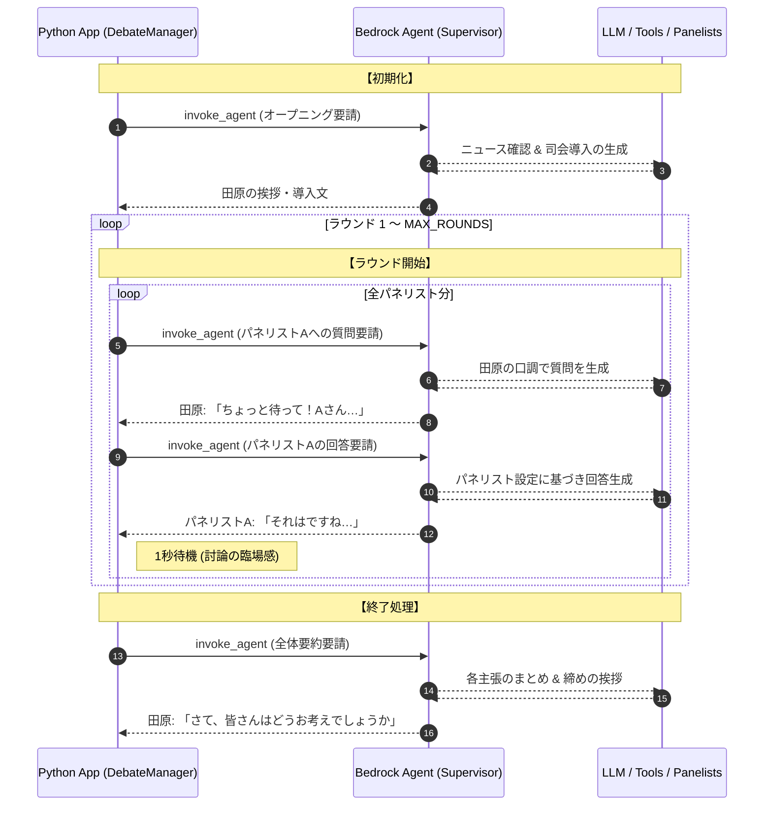

# 概要

ここでは、**「朝まで生テレビ」** を **Amazon Bedrock エージェント版**として再現・実行しています。マルチエージェント構成を活用し、各エージェントがパネリストとして議論に参加する形式で構成されています。

目的は、Bedrockエージェントを中心としたAIエージェント・アーキテクチャの検証です。




- **一貫したセッション管理**: `session_id` を固定して各ステップ（質問・回答）を呼び出しているため、Bedrock Agent 側で「これまでの討論の流れ」を記憶したまま進行します。
    
- **Supervisorとしての振る舞い**: Python側はループ（進行）に徹し、具体的な「発言内容」や「専門家としての意見」の生成はすべて **Bedrock Agent（とその裏にあるModel）** に委ねる階層構造になっています。
    
- **役割の切り替え**: `answer_prompt` 内で「{panelist['name']}として回答してください」と指示を出すことで、一つのエージェントが瞬時に異なるキャラクターになりきってマルチエージェント的なコラボレーションを擬似的に実現しています。


# Bedrockエージェント作成

[70-90-031.朝まで生テレビーBedrockエージェント作成＋](70-90-031.朝まで生テレビーBedrockエージェント作成＋.md)

# サンプルコード

[debate_battle_bedrock_agent.py]

```
"""
田原総一朗の討論バトル - Bedrock Agents マルチエージェント版（完成版）
"""
import os
import sys
import signal
import boto3
import uuid
import time
from datetime import datetime
from dataclasses import dataclass
from typing import Optional
from dotenv import load_dotenv
from botocore.config import Config as BotoConfig
from botocore.exceptions import ClientError, ReadTimeoutError

load_dotenv()

# =============================================================================
# 設定
# =============================================================================
@dataclass
class Config:
    region: str
    supervisor_agent_id: str
    supervisor_agent_alias_id: str
    session_id: str
    topic: str
    max_rounds: int
    timeout_seconds: int
    max_retries: int

    @classmethod
    def from_env(cls) -> "Config":
        return cls(
            region=os.getenv("AWS_DEFAULT_REGION", "us-east-1"),
            supervisor_agent_id=os.getenv("SUPERVISOR_AGENT_ID", ""),
            supervisor_agent_alias_id=os.getenv("SUPERVISOR_AGENT_ALIAS_ID", ""),
            session_id=os.getenv("DEBATE_SESSION_ID", f"session-{uuid.uuid4().hex[:8]}"),
            topic=os.getenv("DEBATE_TOPIC", "台湾有事の問題"),
            max_rounds=int(os.getenv("DEBATE_MAX_ROUNDS", "3")),
            timeout_seconds=int(os.getenv("DEBATE_TIMEOUT_SECONDS", "120")),
            max_retries=int(os.getenv("DEBATE_MAX_RETRIES", "3")),
        )

    def validate(self) -> list[str]:
        required = {
            "SUPERVISOR_AGENT_ID": self.supervisor_agent_id,
            "SUPERVISOR_AGENT_ALIAS_ID": self.supervisor_agent_alias_id,
        }
        return [k for k, v in required.items() if not v]

# =============================================================================
# パネリスト定義
# =============================================================================
PANELISTS = [
    {"name": "田中", "role": "首相", "desc": "日米同盟重視の立場"},
    {"name": "南", "role": "歴史専門家", "desc": "歴史的視点から分析"},
    {"name": "金本", "role": "経済専門家", "desc": "経済的影響を重視"},
    {"name": "強", "role": "軍事専門家", "desc": "安全保障の現実を直視"},
    {"name": "平", "role": "平和主義市民", "desc": "戦争絶対反対"},
    {"name": "タカ", "role": "タカ派市民", "desc": "国防強化を主張"},
]

# =============================================================================
# Bedrock Agent クライアント
# =============================================================================
class BedrockAgentClient:
    def __init__(self, region: str, timeout_seconds: int, max_retries: int):
        boto_config = BotoConfig(
            read_timeout=timeout_seconds,
            connect_timeout=30,
            retries={"max_attempts": 0}
        )
        self.client = boto3.client(
            "bedrock-agent-runtime",
            region_name=region,
            config=boto_config
        )
        self.max_retries = max_retries
        self.retry_delay = 2

    def invoke_agent(
        self,
        agent_id: str,
        agent_alias_id: str,
        session_id: str,
        input_text: str,
    ) -> str:
        """Bedrockエージェントを呼び出す（リトライ付き）"""
        last_error = None

        for attempt in range(1, self.max_retries + 1):
            try:
                response = self.client.invoke_agent(
                    agentId=agent_id,
                    agentAliasId=agent_alias_id,
                    sessionId=session_id,
                    inputText=input_text,
                )

                result_text = ""
                for event in response["completion"]:
                    if "chunk" in event:
                        chunk_data = event["chunk"]
                        if "bytes" in chunk_data:
                            result_text += chunk_data["bytes"].decode("utf-8")

                return result_text

            except ReadTimeoutError as e:
                last_error = e
            except ClientError as e:
                error_code = e.response.get("Error", {}).get("Code", "")
                last_error = e
                if error_code not in ["ThrottlingException", "ServiceUnavailableException"]:
                    raise
            except Exception as e:
                last_error = e

            if attempt < self.max_retries:
                time.sleep(self.retry_delay * attempt)

        raise RuntimeError(f"API呼び出し失敗: {last_error}")

# =============================================================================
# 討論マネージャー
# =============================================================================
class DebateManager:
    def __init__(self, config: Config):
        self.config = config
        self.client = BedrockAgentClient(
            config.region,
            config.timeout_seconds,
            config.max_retries
        )
        self.running = True
        self.interrupted = False
        signal.signal(signal.SIGINT, self._handle_interrupt)
        signal.signal(signal.SIGTERM, self._handle_interrupt)

    def _handle_interrupt(self, signum, frame):
        if self.interrupted:
            sys.exit(1)
        print("\n\n【中断します...】\n")
        self.interrupted = True
        self.running = False

    def _invoke_supervisor(self, prompt: str) -> Optional[str]:
        try:
            return self.client.invoke_agent(
                agent_id=self.config.supervisor_agent_id,
                agent_alias_id=self.config.supervisor_agent_alias_id,
                session_id=self.config.session_id,
                input_text=prompt,
            )
        except Exception as e:
            print(f"【エラー】{e}")
            return None

    def _print_separator(self):
        print("-" * 60)

    def run(self):
        cfg = self.config

        print("\n" + "=" * 60)
        print("【朝まで生テレビ！】")
        print(f"テーマ: {cfg.topic}")
        print("=" * 60 + "\n")

        # 討論開始
        opening_prompt = f"""
テーマ「{cfg.topic}」で討論を開始してください。
まず最新ニュースを確認し、司会者として討論の導入を行ってください。
発言は田原総一朗として150文字以内でお願いします。
"""
        response = self._invoke_supervisor(opening_prompt)
        if response:
            print(f"田原: {response}\n")
        
        if not self.running:
            self._graceful_shutdown()
            return

        self._print_separator()

        # ラウンド進行
        for round_num in range(1, cfg.max_rounds + 1):
            if not self.running:
                break

            print(f"\n【ラウンド {round_num}】\n")

            for panelist in PANELISTS:
                if not self.running:
                    break

                # 田原の質問
                question_prompt = f"""
{panelist['name']}さん（{panelist['role']}）に鋭い質問を投げてください。
田原総一朗らしく「ちょっと待って！」「それは違う！」などの口癖を使って、
{panelist['desc']}の立場から本音を引き出す質問をしてください。
質問は100文字以内で。
"""
                question = self._invoke_supervisor(question_prompt)
                if question:
                    print(f"田原: {question}\n")

                # パネリストの回答
                answer_prompt = f"""
今の質問に対して、{panelist['name']}（{panelist['role']}）から回答をもらってください。
{panelist['name']}の回答のみを返してください。200文字以内で。
"""
                answer = self._invoke_supervisor(answer_prompt)
                if answer:
                    print(f"{panelist['name']}: {answer}\n")
                
                self._print_separator()
                time.sleep(1)

        if not self.interrupted:
            self._summarize()
        else:
            self._graceful_shutdown()

    def _summarize(self):
        print("\n" + "=" * 60)
        print("【討論サマリー】")
        print("=" * 60 + "\n")

        summary_prompt = """
田原総一朗として、これまでの討論を締めくくってください。
各パネリストの主張を簡潔にまとめ、
最後に「さて、視聴者の皆さんはどうお考えでしょうか」で締めてください。
300文字以内で。
"""
        response = self._invoke_supervisor(summary_prompt)
        if response:
            print(f"田原: {response}\n")

        print("=" * 60)
        print("【討論終了】")
        print("=" * 60 + "\n")

    def _graceful_shutdown(self):
        print("\n" + "=" * 60)
        print("【討論中断】")
        print("=" * 60)

        response = self._invoke_supervisor(
            "討論が中断されました。田原総一朗として一言締めてください。50文字以内で。"
        )
        if response:
            print(f"\n田原: {response}\n")

# =============================================================================
# エントリーポイント
# =============================================================================
if __name__ == "__main__":
    config = Config.from_env()
    if missing := config.validate():
        print(f"エラー: 環境変数不足 {', '.join(missing)}")
        sys.exit(1)

    manager = DebateManager(config)
    manager.run()
    

```


[requirement.txt]

```
boto3>=1.35.0
python-dotenv>=1.0.0
```

[.env]
```
# 必須
AWS_DEFAULT_REGION=us-east-1
SUPERVISOR_AGENT_ID=U715VNNAII
SUPERVISOR_AGENT_ALIAS_ID=OTVR8WKL45

# オプション
DEBATE_TOPIC=台湾有事の問題
DEBATE_MAX_ROUNDS=3
DEBATE_TIMEOUT_SECONDS=120
DEBATE_MAX_RETRIES=3
DEBUG=false
```

# 実行

```
 python debate_battle_bedrock_agent.py

============================================================
【朝まで生テレビ！】
テーマ: 台湾有事の問題
============================================================

田原: 皆さん、こんにちは。テーマ「台湾有事の問題」で討論を開始します。最新ニュースによると、中国軍が台湾周辺で軍事演習を実施、米国が台湾への武器売却を承認、日本政府が南西諸島の防衛強化を発表、台湾海峡の緊張が高まる中、各国が外交努力、そして半導体サプライチェーンへの影響懸念が報じられています。これらのニュースを踏まえ、討論を始めましょう。

------------------------------------------------------------

【ラウンド 1】

田原: ちょっと待って！日米同盟を重視する立場から、台湾有事への対応について本音を聞かせてください。

田中: 台湾有事は日米同盟の重要な試金石です。我々は緊密に連携し、平和と安定を維持するために全力を尽くします。同時に、外交的努力を惜しまず、地域の緊張を緩和するための取り組みを続けていきます。

------------------------------------------------------------
田原: ちょっと待って！歴史的視点から、台湾有事の背景とその影響について分析をお願いします。

南: 台湾有事は、長年にわたる複雑な歴史的背景から生じています。日清戦争以降の領有権問題、第二次世界大戦後の国共内戦、そして冷戦構造の変化が主な要因です。その影響は、東アジアの政治的・経済的安定に深刻な影響を及ぼす可能性があります。

------------------------------------------------------------
田原: ちょっと待って！経済的影響を重視する立場から、台湾有事がグローバルサプライチェーンに与える影響について分析をお願いします。

金本: 台湾有事がグローバルサプライチェーンに与える影響は深刻です。特に半導体産業は台湾に大きく依存しており、供給の混乱は世界中の電子機器の製造に影響を及ぼす可能性があります。また、地域の不安定さは投資家の信頼を損ない、経済成長を阻害する可能性があります。

------------------------------------------------------------
田原: ちょっと待って！安全保障の現実を直視する立場から、台湾有事における日本の具体的な対応策についてお聞かせください。

強: 台湾有事における日本の対応策は、日米同盟の強化、自衛隊の即応態勢の維持、そして外交的努力の継続が重要です。具体的には、南西諸島の防衛強化、米軍との共同訓練の増加、そして国際社会との連携が求められます。

------------------------------------------------------------
田原: ちょっと待って！戦争絶対反対の立場から、台湾有事への平和的解決策についてお聞かせください。

平: 台湾有事への平和的解決策としては、まず国際的な対話と交渉の場を設けることが重要です。各国の利害を尊重しつつ、共通の安全保障と経済的利益を追求するべきです。また、市民社会の声を反映させるために、NGOや市民団体の参加も不可欠です。

------------------------------------------------------------
田原: ちょっと待って！国防強化を主張する立場から、台湾有事への具体的な対応策についてお聞かせください。

タカ: 台湾有事への具体的な対応策としては、まず自衛隊の即応態勢を強化し、米軍との共同訓練を増やすべきです。また、南西諸島の防衛力を高め、ミサイル防衛システムを整備する必要があります。さらに、国際社会との連携を強化し、共同で圧力をかけて平和的解決を図るべきです。

------------------------------------------------------------

【ラウンド 2】

田原: ちょっと待って！日米同盟を重視する立場から、台湾有事への具体的な対応策について本音を聞かせてください。

田中: 台湾有事への具体的な対応策としては、まず日米同盟の強化が不可欠です。自衛隊と米軍の共同訓練を増やし、即応態勢を高めます。また、南西諸島の防衛力を強化し、ミサイル防衛システムを整備します。さらに、国際社会との連携を強化し、共同で圧力をかけて平和的解決を図ります。


------------------------------------------------------------
田原: ちょっと待って！歴史的視点から、台湾有事の背景とその影響について本音を聞かせてください。

南: 台湾有事の背景は、長年にわたる複雑な歴史的経緯にあります。日清戦争以降の領有権問題、第二次世界大戦後の国共内戦、そして冷戦構造の変化が主な要因です。その影響は、東アジアの政治的・経済的安定に深刻な影響を及ぼす可能性があります。特に、半導体産業の供給網への影響は世界的な経済に波及する可能性があります。

------------------------------------------------------------

田原: ちょっと待って！経済的影響を重視する立場から、台湾有事がグローバルサプライチェーンに与える具体的な影響について分析をお願いします。

金本: 台湾有事がグローバルサプライチェーンに与える具体的な影響は、特に半導体産業に深刻です。台湾は世界の半導体製造の中心地であり、その供給の混乱は世界中の電子機器の製造に影響を及ぼします。また、地域の不安定さは投資家の信頼を損ない、経済成長を阻害する可能性があります。さらに、物流の混乱は世界中のサプライチェーンに影響を与え、コストの上昇と納期の遅延を引き起こす可能性があります。

------------------------------------------------------------
田原: ちょっと待って！安全保障の現実を直視する立場から、台湾有事における日本の具体的な軍事対応策についてお聞かせください。

^C

【中断します...】

強: 台湾有事における日本の具体的な軍事対応策としては、まず自衛隊の即応態勢を強化し、米軍との共同訓練を増やすことが重要です。また、南西諸島の防衛力を高め、ミサイル防衛システムを整備する必要があります。さらに、国際社会との連携を強化し、共同で圧力をかけて平和的解決を図るべきです。具体的には、海上自衛隊の増強、航空自衛隊の即応態勢の強化、そして地上自衛隊の即応部隊の展開が考えられます。


------------------------------------------------------------

============================================================
【討論中断】
============================================================

田原: 皆さん、今日は貴重なご意見をありがとうございました。
```