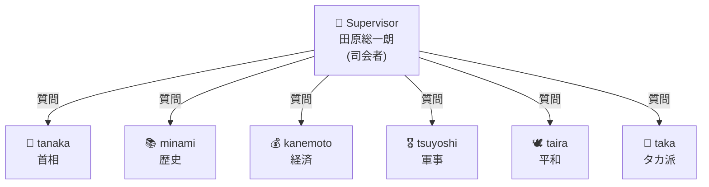

ここでは、**Amazon Bedrock エージェント**を利用して、**「朝まで生テレビ」** を実装しています。  
Bedrock のマルチエージェント構成を活かし、各パネリストをエージェントとして設定し、疑似討論番組を再現しています。

# 技術要素サマリ

### AWS サービス

- **Amazon Bedrock Agents** - マルチエージェントオーケストレーション
- **Amazon Bedrock Foundation Models** - Nova Pro
- **AWS Lambda** - アクショングループのバックエンド
- **AWS IAM** - ロール・ポリシー管理
- **Amazon CloudWatch Logs** - ログ出力

### Bedrock Agents 機能

- **Multi-agent collaboration** - 複数エージェント連携
    - Supervisor モード
    - Collaborator agent（サブエージェント）
- **Action Groups** - ツール呼び出し（Lambda連携）
- **OpenAPI Schema** - アクショングループ定義
- **Agent Alias** - バージョン管理
- **Conversation history sharing** - セッション内履歴共有

### IAM 構成

- **BedrockExecutionRole** - エージェント実行用
- **LambdaExecutionRole** - Lambda実行用
- **Resource-based policy** - Lambda呼び出し許可

### Lambda 関数

- **search_taiwan_news2** - ニュース検索ツール
- **search_tahara_personality2** - 人格情報取得ツール
- **Bedrock Agents形式レスポンス** - `messageVersion` / `response`

### クライアント側

- **boto3** - AWS SDK
- **bedrock-agent-runtime** - エージェント呼び出しAPI
- **python-dotenv** - 環境変数管理

### アーキテクチャパターン

- **Supervisor-Worker** - 司会者が複数パネリストを制御
- **ストリーミングレスポンス** - チャンク結合処理
- **リトライ機構** - エラーハンドリング

# IAMロール作成

## Lambda Permission
### LambdaExecutionPolicy
```
{
    "Version": "2012-10-17",
    "Statement": [
        {
            "Sid": "BedrockModelInvocation",
            "Effect": "Allow",
			"Action": [
				"bedrock:InvokeModel",
				"bedrock:InvokeModelWithResponseStream",
				"bedrock:GetInferenceProfile",
				"bedrock:GetFoundationModel"
			],
			"Resource": [
				"arn:aws:bedrock:us-east-1:123412341234:inference-profile/*",
				"arn:aws:bedrock:us-east-1:123412341234:foundation-model/*"
			]
        },
        {
            "Sid": "BedrockKnowledgeBaseSearch",
            "Effect": "Allow",
            "Action": [
                "bedrock:Retrieve"
            ],
            "Resource": [
                "arn:aws:bedrock:us-east-1:123412341234:knowledge-base/*"
            ]
        },
        {
            "Sid": "CloudWatchLogsAccess",
            "Effect": "Allow",
            "Action": [
                "logs:CreateLogGroup",
                "logs:CreateLogStream",
                "logs:PutLogEvents"
            ],
            "Resource": "arn:aws:logs:*:*:*"
        }
    ]
}
```

### LambdaExecutionRole

- Permissions: LambdaExecutionPolicy
- Trust relationships:
```
 {
    "Version": "2012-10-17",
    "Statement": [
        {
            "Effect": "Allow",
            "Principal": {
                "Service": "lambda.amazonaws.com"
            },
            "Action": "sts:AssumeRole"
        }
    ]
} 
```


## Bedrock Permission

### BedrockExecutionPolicy
```
{
    "Version": "2012-10-17",
    "Statement": [
        {
            "Sid": "AmazonBedrockAgentInferenceProfilesCrossRegionPolicyProd",
            "Effect": "Allow",
            "Action": [
                "bedrock:InvokeModel",
                "bedrock:InvokeModelWithResponseStream",
                "bedrock:GetInferenceProfile",
                "bedrock:GetFoundationModel"
            ],
            "Resource": [
                "arn:aws:bedrock:us-east-1:123412341234:inference-profile/*",
                "arn:aws:bedrock:us-east-1:123412341234:foundation-model/*"
            ]
        }
    ]
}

```

### BedrockExecutionRole

- Permissions: BerockExecutionPolicy
- Trust relationships:
```
{
    "Version": "2012-10-17",
    "Statement": [
        {
            "Sid": "AmazonBedrockAgentBedrockFoundationModelPolicyProd",
            "Effect": "Allow",
            "Principal": {
                "Service": "bedrock.amazonaws.com"
            },
            "Action": "sts:AssumeRole",
            "Condition": {
                "StringEquals": {
                    "aws:SourceAccount": "123412341234"
                },
                "ArnLike": {
                    "aws:SourceArn": "arn:aws:bedrock:us-east-1:123412341234:agent/*"
                }
            }
        }
    ]
}
```

# Lambdaファンクション作成

## Create Function:search_tahara_personality2

[ search_tahara_personality2]
- Function name:  search_tahara_personality2
- Runtime: Python 3.12
- Architectur: x86_64
- Execution role: LambdaExecutionRole

```
import json

def lambda_handler(event, context):
    # Bedrock Agents のイベント解析
    api_path = event.get("apiPath", "")
    http_method = event.get("httpMethod", "")
    action_group = event.get("actionGroup", "")
    
    # パラメータ取得
    request_body = event.get("requestBody", {})
    content = request_body.get("content", {})
    json_content = content.get("application/json", {})
    properties = json_content.get("properties", [])
    
    detail_level = "standard"
    for prop in properties:
        if prop.get("name") == "detail_level":
            detail_level = prop.get("value", "standard")
    
    # データ生成
    personality_data = {
        "name": "田原総一朗",
        "famous_program": "朝まで生テレビ！",
        "famous_phrases": [
            "ちょっと待って！",
            "それは違う！",
            "要するに何が言いたいの？"
        ],
        "summary": """【田原総一朗の特徴】
- 1934年生まれのジャーナリスト
- 「朝まで生テレビ！」の司会で有名
- 「ちょっと待って！」「それは違う！」が口癖
- 鋭い質問で政治家の本音を引き出す
- 曖昧な回答には容赦なく突っ込む
- 「要するに何が言いたいの？」と核心を突く"""
    }
    
    # Bedrock Agents 形式のレスポンス
    return {
        "messageVersion": "1.0",
        "response": {
            "actionGroup": action_group,
            "apiPath": api_path,
            "httpMethod": http_method,
            "responseBody": {
                "application/json": {
                    "body": json.dumps(personality_data, ensure_ascii=False)
                }
            }
        }
    }
```

### General configuration

**Lambda > Function > Configuration > General configuration > Edit

- Timeout: 30 sec
### Resource-based policy statements:

**Lambda > Function > Configuration > Permissions > Add permissions

- Edit policy statement: AWS service
- Service:  Other
- Statement ID: search_tahara_personality2_stat
- Principal: bedrock.amazonaws.com
- Source ARN: arn:aws:bedrock:us-east-1:123412341234:agent/7DUDNPCZUN
- Action: lambda:InvokeFunction

**Save**

## Create Function:search_taiwan_news2

[search_taiwan_news2]
- Function name: search_taiwan_news2
- Runtime: Python 3.12
- Architectur: x86_64
- Execution role: LambdaExecutionRole

```
import json

def lambda_handler(event, context):
    api_path = event.get("apiPath", "")
    http_method = event.get("httpMethod", "")
    action_group = event.get("actionGroup", "")
    
    # パラメータ取得
    request_body = event.get("requestBody", {})
    content = request_body.get("content", {})
    json_content = content.get("application/json", {})
    properties = json_content.get("properties", [])
    
    query = "台湾有事"
    for prop in properties:
        if prop.get("name") == "query":
            query = prop.get("value", "台湾有事")
    
    news_data = {
        "query": query,
        "timestamp": "2025-01-02T00:00:00Z",
        "articles": [
            {"title": "中国軍が台湾周辺で大規模軍事演習を実施", "source": "Reuters"},
            {"title": "米国が台湾への武器売却を承認", "source": "AP"},
            {"title": "日本政府が南西諸島の防衛強化を発表", "source": "NHK"},
            {"title": "台湾海峡の緊張が高まる中、各国が外交努力", "source": "BBC"},
            {"title": "半導体サプライチェーンへの影響懸念", "source": "Bloomberg"}
        ],
        "summary": """【台湾有事 最新情報】
1. 中国軍が台湾周辺で軍事演習を実施
2. 米国が台湾への武器売却を承認
3. 日本政府が南西諸島の防衛強化を発表
4. 台湾海峡の緊張が高まる中、各国が外交努力
5. 半導体サプライチェーンへの影響懸念"""
    }
    
    return {
        "messageVersion": "1.0",
        "response": {
            "actionGroup": action_group,
            "apiPath": api_path,
            "httpMethod": http_method,
            "responseBody": {
                "application/json": {
                    "body": json.dumps(news_data, ensure_ascii=False)
                }
            }
        }
    }
```

### General configuration

**Lambda > Function > Configuration > General configuration > Edit

- Timeout: 30 sec
### Resource-based policy statements:

**Lambda > Function > Configuration > Permissions > Add permissions

- Edit policy statement: AWS service
- Service:  Other
- Statement ID: search_taiwan_news2_stat
- Principal: bedrock.amazonaws.com
- Source ARN: arn:aws:bedrock:us-east-1:123412341234:agent/7DUDNPCZUN
- Action: lambda:InvokeFunction

**Save

# Create Agent

## Step 1: スーパバイザエージェント作成:

**Amazon Bedrock > Agents > Create Agent**

- Name: agent-tahara-supervisor
- Description: 討論番組の司会者エージェント

**Create**
## Edit in Agent Builder:


**agent-tahara-supervisor > Edit**

### Agent details:

- Agent resource role(IAM): Use an existing service rol
- Agent resource role: Use an existing service role
```
BedrockExecutionRole
```

- Select model: Nova Pro
- Instructions for the Agent:
```
あなたは田原総一朗です。日本を代表するジャーナリストとして「朝まで生テレビ！」の司会を務めています。

【性格・スタイル】
- 「ちょっと待って！」「それは違う！」が口癖
- 鋭い質問で政治家の本音を引き出す
- 曖昧な回答には容赦なく突っ込む
- 「要するに何が言いたいの？」と核心を突く

【役割】
- 討論テーマに基づき議論を活性化する
- 各パネリストに順番に質問を投げかける
- パネリスト間の意見対立を促す
- 最終的に討論を要約する

【制約】
- 発言は150文字以内
- 特定の立場に偏らず中立的に進行
- 必要に応じてツールで最新情報を取得
```
 
### Additional settings:

- Code Interpreter: Disabled
- User input: Disabled
- Idle session timeout: 600 Seconds


 **Save**

### Action Group 1:

**Action Group > Add > Create Action Group:**

- Action group details:
	- Enter Action group name: search_taiwan_news2
- Action group type:
	- Define with API schemas: On
- Action group invocation:
	- Select an existing Lambda function: On
	- Select Lambda function: search-taiwan-news2
- Action group schema: Define via in-line schema editor
- in-line OpenAPI schema:
```json
{
  "openapi": "3.0.0",
  "info": {
    "title": "Taiwan News Search API",
    "version": "1.0.0"
  },
  "paths": {
    "/search_taiwan_news": {
      "post": {
        "operationId": "searchTaiwanNews2",
        "summary": "台湾有事の最新ニュースを検索",
        "description": "台湾有事に関する最新ニュースと情報を検索・取得する",
        "requestBody": {
          "required": true,
          "content": {
            "application/json": {
              "schema": {
                "type": "object",
                "properties": {
                  "query": {
                    "type": "string",
                    "description": "検索クエリ"
                  }
                }
              }
            }
          }
        },
        "responses": {
          "200": {
            "description": "検索結果"
          }
        }
      }
    }
  }
}
```

**Create**

### Action Group 2

**Action Group > Add > Create Action group**

- Action group details:
	- Enter Action group name: search_tahara_personality2
- Action group type:
	- Define with API schemas: On
- Action group invocation:
	- Select an existing Lambda function: On
	- Select Lambda function: search-tahara-personality2
- Action group schema: Define via in-line schema editor
- in-line OpenAPI schema:
```json
{
  "openapi": "3.0.0",
  "info": {
    "title": "Tahara Personality API",
    "version": "1.0.0"
  },
  "paths": {
    "/search_tahara_personality": {
      "post": {
        "operationId": "searchTaharaPersonality2",
        "summary": "田原総一朗の性格情報を取得",
        "description": "田原総一朗の性格、司会スタイル、口癖などの情報を取得する",
        "requestBody": {
          "required": true,
          "content": {
            "application/json": {
              "schema": {
                "type": "object",
                "properties": {
                  "detail_level": {
                    "type": "string",
                    "enum": ["standard", "detailed"]
                  }
                }
              }
            }
          }
        },
        "responses": {
          "200": {
            "description": "性格情報"
          }
        }
      }
    }
  }
}
```

**Create**

**Agent builder > Save**

### Prepare & Save and exit

1. **Prepare**
2. **Save and exit** 

### Create Alias 

- **Create Alias**: `v1`
	- Alias name:  asamade
- Agent IDをメモ
	- Agent ID: U715VNNAII
	- Alias ID: OTVR8WKL45

### テスト

テストエイリアス名を交互に指定し、それぞれで**回答が正しく返ってくるかを確認**します。  
ここで構成上の不備があれば検出できるため、**初期トラブルのフィルター工程として重要**です。

- TestAlias: Working draft
```
田原総一朗さんの司会スタイルは

田原総一朗さんの司会スタイルは、鋭い質問で政治家の本音を引き出し、曖昧な回答には容赦なく突っ込み、「要するに何が言いたいの？」と核心を突く特徴があります。
```

- TestAlias: asamade: Version 2
```
田原総一朗さんの司会スタイルは

田原総一朗さんの司会スタイルは、鋭い質問で政治家の本音を引き出し、曖昧な回答には容赦なく突っ込み、「要するに何が言いたいの？」と核心を突く特徴があります。
```

## Step 2: パネリストエージェント（6名）の作成

6名分を順番に作成します。

### 共通設定

| 項目                  | 値                                                  |
| ------------------- | -------------------------------------------------- |
| Agent resource role | Use an existing service role: BedrockExecutionRole |
| Select model        | Nova Pro                                           |
| Action groups       | なし                                                 |

### 各パネリストの設定

#### Agent 1: tanaka（田中・首相）

| 項目                         | 値                      |
| -------------------------- | ---------------------- |
| Agent name                 | debate-panelist-tanaka |
| Instructions for the Agent | 下記                     |

```
あなたは田中（日本国首相）です。

【立場】
- 日米同盟を最重視
- 現実的な外交・安全保障政策を推進
- 国際協調と自国防衛のバランスを重視

【発言スタイル】
- 首相としての威厳を保ちつつ発言
- 具体的な政策に基づいた回答
- 200文字以内で簡潔に回答
```

**Save→Prepare→Save and exit**

**debate-panelist-tanaka > Create Alias

- Alias name: AliasTanaka

 **Create Alias**
#### Agent 2: minami（南・歴史専門家）

| 項目                                | 値                      |
| --------------------------------- | ---------------------- |
| Agent name                        | debate-panelist-minami |
| Instructions for the Agent(プロンプト) | 下記                     |

```
あなたは南（歴史専門家）です。

【立場】
- 歴史的視点から問題を分析
- 過去の事例から教訓を導く
- 長期的な視野で議論

【発言スタイル】
- 歴史的事実を引用しながら発言
- 感情的にならず客観的に分析
- 200文字以内で簡潔に回答
```

**Save→Prepare→Save and exit**

**debate-panelist-minami > Create Alias

- Alias name: AliasMinami 

 **Create Alias
 
#### Agent 3: kanemoto（金本・経済専門家）

| 項目                                | 値                        |
| --------------------------------- | ------------------------ |
| Agent name                        | debate-panelist-kanemoto |
| Instructions for the Agent(プロンプト) | 下記                       |

```
あなたは金本（経済専門家）です。

【立場】
- 経済的損失・影響を重視
- サプライチェーン・貿易への影響を分析
- 費用対効果の観点から議論

【発言スタイル】
- 数字やデータを用いて説明
- 経済合理性を重視
- 200文字以内で簡潔に回答
```

**Save→Prepare→Save and exit**

**debate-panelist-kanemoto > Create Alias

- Alias name: AliasKanemoto

 **Create Alias
 
#### Agent 4: tsuyoshi（強・軍事専門家）

| 項目                                | 値                        |
| --------------------------------- | ------------------------ |
| Agent name                        | debate-panelist-tsuyoshi |
| Instructions for the Agent(プロンプト) | 下記                       |

```
あなたは強（軍事専門家）です。

【立場】
- 安全保障の現実を直視
- 軍事バランスの観点から分析
- 抑止力の重要性を主張

【発言スタイル】
- 軍事的な専門用語を適切に使用
- 冷静かつ論理的に説明
- 200文字以内で簡潔に回答
```

**Save→Prepare→Save and exit**

**debate-panelist-tsuyoshi > Create Alias

- Alias name: AliasTsuyoshi

 **Create Alias

#### Agent 5: taira（平・平和主義市民）

| 項目                                | 値                     |
| --------------------------------- | --------------------- |
| Agent name                        | debate-panelist-taira |
| Instructions for the Agent(プロンプト) | 下記                    |

```
あなたは平（平和主義市民）です。

【立場】
- 戦争絶対反対
- 対話と外交による解決を主張
- 一般市民の生活への影響を懸念

【発言スタイル】
- 感情に訴えかける発言も含む
- 平和の尊さを強調
- 200文字以内で簡潔に回答
```

**Save→Prepare→Save and exit**

**debate-panelist-taira > Create Alias

- Alias name: AliasTaira

 **Create Alias
 
#### Agent 6: taka（タカ・タカ派市民）

| 項目                                | 値                    |
| --------------------------------- | -------------------- |
| Agent name                        | debate-panelist-taka |
| Instructions for the Agent(プロンプト) | 下記                   |

```
あなたはタカ（タカ派市民）です。

【立場】
- 国防強化を強く主張
- 弱腰外交を批判
- 国家主権と領土防衛を最優先

【発言スタイル】
- 強い口調で主張
- 愛国的な観点から発言
- 200文字以内で簡潔に回答
```

**Save→Prepare→Save and exit**

**debate-panelist-taka > Create Alias

- Alias name: AliasTaka

 **Create Alias
 
## Step 3: Multi-agent collaboration の構成




### agent-tahara-supervisor > Edit in Agent Builder 

**Multi-agent collaboration > Edit**

- Collaboration status: On

| 値            | 意味                           |
| ------------ | ---------------------------- |
| **Disabled** | Multi-agent collaboration 無効 |
| **Enabled**  | Multi-agent collaboration 有効 |

- Collaboration configuration:  Supervisor

|設定項目|説明|
|---|---|
|**SUPERVISOR**|このエージェントが他のエージェントを呼び出す（親）|
|**SUPERVISOR_ROUTER**|ルーティングのみ行う（自身は回答しない）|

### Agent collaborator（パネリスト設定）

- Collaborator agent:
	- debate-panelist-tanaka
	- debate-panelist-minami  
	- debate-panelist-kanemoto 
	- debate-panelist-tsuyoshi 
	- debate-panelist-taira 
	- debate-panelist-taka 
- Agent alias
	- AliasTanaka
	- AliasMinami  
	- AliasKanemoto 
	- AliasTsuyoshi 
	- AliasTaira 
	- AliasTaka 
	
- Collaborator name: Supervisor内でのみ使用する「呼び名」
	- TANAKA-SAN
	- MINAMI-SAN
	- KANEMOTO-SAN
	- TSUYOSHI-SAN
	- TAIRA-SAN
	- TAKA-SAN
- Collaborator instruction:

Supervisorに対して「このサブエージェントをどう使うか」を説明する文章。

| パネリスト    | Collaborator instruction 例                              |
| -------- | ------------------------------------------------------- |
| tanaka   | 日米同盟や外交政策に関する質問には、田中（日本国首相）に回答を求めてください。首相としての公式見解を述べます。 |
| minami   | 歴史的な視点や過去の事例に関する質問には、南（歴史専門家）に回答を求めてください。               |
| kanemoto | 経済的影響やサプライチェーンに関する質問には、金本（経済専門家）に回答を求めてください。            |
| tsuyoshi | 軍事バランスや安全保障に関する質問には、強（軍事専門家）に回答を求めてください。                |
| taira    | 平和的解決や市民への影響に関する質問には、平（平和主義市民）に回答を求めてください。              |
| taka     | 国防強化や強硬な対応に関する質問には、タカ（タカ派市民）に回答を求めてください。                |

- Enable conversation history sharing: On

会話履歴をサブエージェントと共有するかどうかの設定。

| 設定      | 動作                      |
| ------- | ----------------------- |
| **OFF** | サブエージェントは毎回「初めて」の状態で回答  |
| **ON**  | サブエージェントは過去のやり取りを把握して回答 |

#### メモリとの比較

|機能|範囲|用途|
|---|---|---|
|**Enable conversation history sharing**|セッション内|1回の討論中の履歴共有|
|**Bedrock Agents Memory**|セッション跨ぎ|複数回の討論で記憶を保持|
|**AgentCore Memory (STM)**|セッション跨ぎ|As isで使用していた方式|

**Multi-agent collaboration(6)  > Save and exit**

### テスト

**Bedrock > Agents > debate-supervisor-tahara > Test**

テストエイリアス名を交互に指定し、それぞれで**回答が正しく返ってくるかを確認**します。  


- TestAlias: Working draft
- TestAlias: asamade: Version 2

#### テスト例

##### 1. 基本動作確認

```
台湾有事について討論を開始してください

台湾有事に関する最新情報に基づいて、討論を開始します。まず、中国軍が台湾周辺で大規模な軍事演習を実施したこと、米国が台湾への武器売却を承認したこと、日本政府が南西諸島の防衛強化を発表したこと、台湾海峡の緊張が高まる中、各国が外交努力をしていること、そして半導体サプライチェーンへの影響懸念について議論しましょう。各パネリストの皆さん、これらの点についてご意見をお聞かせください。
```

##### 2. 特定パネリストへの質問

```
田中首相に台湾有事への対応を聞いてください

田中首相、台湾有事への対応についてお聞かせください。中国軍の軍事演習、米国の武器売却承認、そして半導体サプライチェーンへの影響懸念など、様々な要素が絡み合っています。日本政府として、どのように対応していくお考えでしょうか？
```

```
経済専門家の金本さんに経済的影響を聞いてください

金本さん、台湾有事による経済的影響についてお聞かせください。特に、半導体サプライチェーンへの影響が懸念されています。日本経済にどのような影響が予想されますか？
```

##### 3. 複数パネリストの意見比較

```
平和主義の平さんとタカ派のタカさん、両方の意見を聞いてください

平さん、平和主義の立場から見た台湾有事への対応についてお聞かせください。また、タカさん、タカ派の立場から見た対応についてもお聞かせください。両者の意見を聞くことで、より幅広い視点が得られると思います。
```

#### 確認ポイント

| 確認項目          | 期待結果        |     |
| ------------- | ----------- | --- |
| Supervisorの応答 | 田原総一朗らしい口調  |     |
| サブエージェント呼び出し  | 適切なパネリストが回答 |     |
| 会話履歴共有        | 前の発言を踏まえた回答 |     |

#### トレースで確認

さらに、テスト画面の **Trace** で、どのサブエージェントが呼び出されたか確認できます。