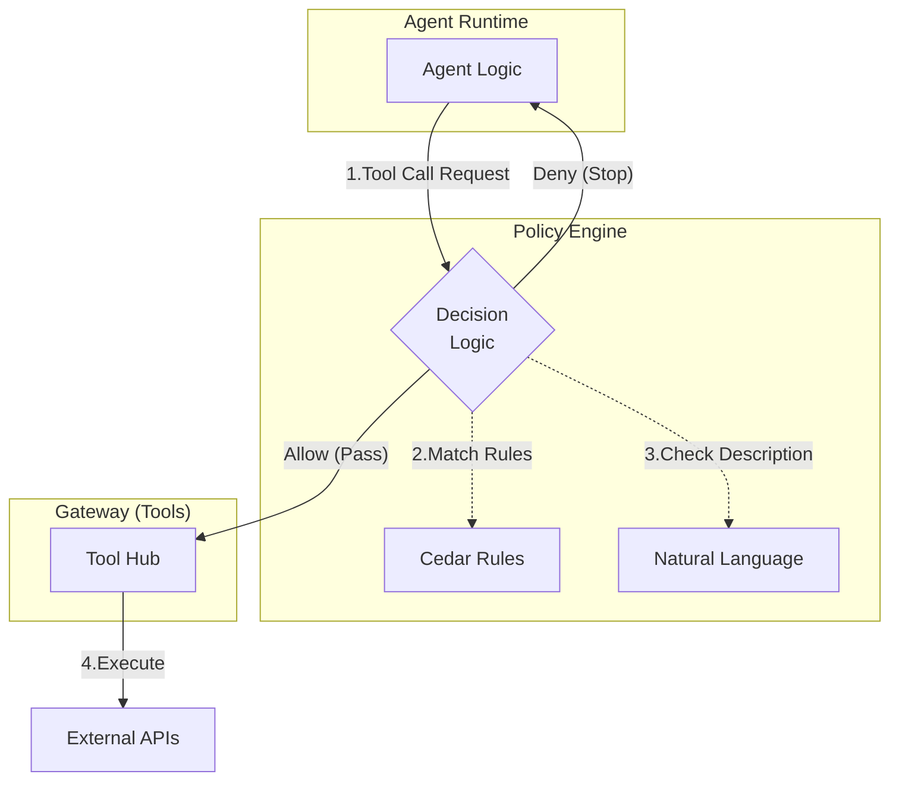

AWS Bedrock AgentCoreにおける**ポリシー（Policy）**は、エージェントの自由な推論と、企業の厳格なビジネスルールを両立させるための**「動的ガードレール」**です。

単なるアクセス制御（IAM）ではなく、**「エージェントがツールを使おうとするその瞬間」** に割り込んで内容を検証する、非常に強力な機能です。


# 概要

AgentCoreのポリシーは、以下の2つの顔を持つ「ポリシーエンジン」によって動作します。

- **自然言語ポリシー:** 「100ドル以上の購入には承認が必要」といった人間の言葉でルールを記述。
    
- **Cedarポリシー:** AWSのオープンソース言語「Cedar」を用い、特定のユーザー、特定のツール、特定のパラメータ条件をコードレベルで厳密に定義。
    

これらが**Gateway（ツールの入り口）**と直結し、エージェントの「ツールを使いたい」という要求をリアルタイムで**インターセプト（遮断・評価）**します。

---

ポリシーがどこで、どのようにエージェントを制止するかを示します。



---

- **Policy Engine:** ルールを解釈・評価する「計算機」。一つのEngineの中に複数のポリシーを持たせます。
    
- **Policy Store:** 実際に書かれたルール（Cedarや自然言語）の集合体。
    
- **Gateway Association:** ポリシーエンジンを特定のGatewayに紐付ける設定。これにより、そのGatewayを通るすべての通信が自動的に監視対象となります。
    

---

# 実装のポイント

### 自然言語ポリシーの例

開発初期や、複雑なロジックが不要な場合に有効です。

> 「週末は支払いに関するツールの利用を禁止する」
> 
> 「カスタマーサポート以外の部署のユーザーには、個人情報の取得ツールを許可しない」

### Cedarポリシーの例（より厳密な制御）

属性ベース（ABAC）での制御が可能です。

コード スニペット

```
// ユーザーの部署が 'Sales' でない場合、
// 'delete_customer' ツールの実行を禁止する
forbid (
    principal,
    action == Action::"use_tool",
    resource == Resource::"Gateway::delete_customer"
)
when { principal.department != "Sales" };
```

### 実装のワークフロー

1. **Engine作成:** `CreatePolicyEngine` で器を作る。
    
2. **ポリシー追加:** `AddPolicy` でCedarコードや自然言語を流し込む。
    
3. **Gateway紐付け:** `CreateGateway` または `UpdateGateway` 時に `policyEngineId` を指定。
    
4. **実行:** エージェントがツールを呼ぶ際、パラメータ（`amount: 500`等）を含めて評価され、`ALLOW` か `DENY` が即座に返されます。
    

---

# まとめ

ポリシーの実体は、**「エージェントとツールの間に置かれた、24時間監視の自動検問所」** です。

- **IAMとの違い:** IAMは「Gatewayにアクセスできるか」を見ますが、Policyは「Gatewayの中の**どのツールを、どんな引数で**使おうとしているか」まで踏み込んでチェックします。
    