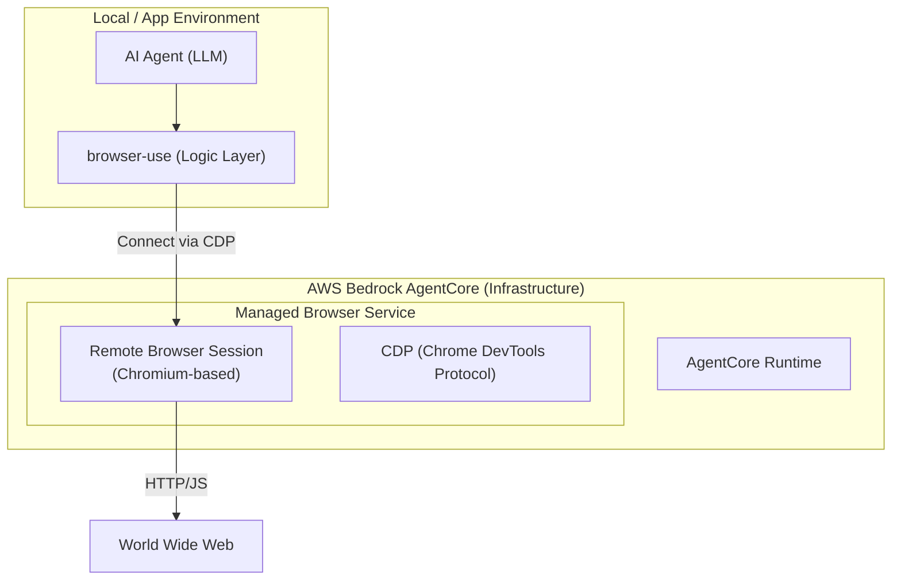

AWS Bedrock AgentCoreにおける**Browser（ブラウザ）**は、AIエージェントがWebサイトを閲覧、操作、情報抽出するために提供される**「マネージドな内蔵ツール」**です。

これまで、エージェントにWebアクセスをさせるには自前でPuppeteerやPlaywrightの実行環境を構築する必要がありましたが、BrowserツールはそのすべてをAWS側で完結させます。

---

# 概要

AIエージェントが「2021年までの知識」ではなく、**「今、現在の動的なWeb情報」** にアクセスするためにはブラウザが必要です。しかし、商用環境での実装には以下の課題がありました。

- **インフラの複雑さ:** ヘッドレスブラウザの実行には大量のメモリを消費し、管理が困難。
    
- **セキュリティ:** 悪意のあるサイトへのアクセスや、ブラウザの脆弱性を突いた攻撃からの保護が必要。
    
- **可視性:** エージェントが裏で何を見たのか、どのボタンを押したのかを追跡できない。
    

AgentCore Browserは、これらを **「隔離された安全なブラウザセッション」** として提供し、エージェントにWebブラウジング能力を即座に与えます。

---

BrowserツールがAgentCore Runtimeとどのように連携し、外部のWeb世界へアクセスするかを示します。

---





- **パッケージ構成:** AgentCore専用の `bedrock-agentcore-sdk` と、OSSの `browser-use` を組み合わせて使用します。
    
- **接続方式:** AgentCore Browserが発行するWebSocketエンドポイント（CDP URL）を `browser-use` に渡すことで、リモート操作を確立します。
    
- **認証:** AWS SDK（boto3）を通じて、ブラウザセッションの開始・終了を制御します。    
---

# 実装のポイント

- **インフラ管理の不要:** `BrowserTool` を使うことで、ブラウザ実行用のサーバーを自前で用意する必要がなくなります。
    
- **高度な操作ロジック:** `browser-use` の「DOMを解釈して自律的に動く」という強力な機能を、そのままAWS基盤に持ち込めます。
    
- **可視性の確保:** AgentCoreの機能（Session Replayなど）と組み合わせれば、`browser-use` が裏で何をしたかをビデオで確認できるようになります。

---

# 疑似コード

Browserツールをエージェントに組み込み、Webから情報を取得させる際の実装例です。

```
import asyncio
# 1. AgentCore SDKとboto3（AWS操作）のインポート
import boto3
from bedrock_agentcore import AgentCoreRuntime
from bedrock_agentcore.tools.builtins import BrowserTool

# 2. browser-use（OSSライブラリ）のインポート
from browser_use import Agent as BrowserUseAgent
from langchain_aws import ChatBedrockConverse # LLMとしてBedrockを使用

async def main():
    # --- A. AgentCore Browserセッションの準備 ---
    # AWSマネージドなブラウザリソースを起動
    client = boto3.client("bedrock-agentcore")
    
    # BrowserToolをインスタンス化（実体はAWS上のリソース）
    browser_tool = BrowserTool(browser_id="your-browser-id")
    
    # セッションを開始し、リモートデバッグ用のURLを取得
    # これにより、ローカルではなくAWS上のブラウザに接続可能になる
    session_info = await browser_tool.start_session()
    cdp_url = session_info["cdp_endpoint"]

    # --- B. browser-use による操作の実装 ---
    # LLMの定義（ここではAmazon Novaを使用）
    llm = ChatBedrockConverse(model_id="amazon.nova-pro-v1:0")

    # browser-useのAgentに、AgentCoreのリモートブラウザを紐付け
    browser_agent = BrowserUseAgent(
        task="AWSの最新ニュースを検索し、タイトルを3つ抽出してください。",
        llm=llm,
        browser_url=cdp_url # ここが核心：AgentCoreのブラウザを指定
    )

    # --- C. 実行 ---
    result = await browser_agent.run()
    print(result)

    # --- D. 後処理 ---
    # セッションを終了し、リソースを解放（コスト削減）
    await browser_tool.stop_session()

if __name__ == "__main__":
    asyncio.run(main())
```

---

# まとめ


この構成により、以下の「商用レベルのWeb操作」が完成します。

- **インフラ管理の不要:** `BrowserTool` を使うことで、ブラウザ実行用のサーバーを自前で用意する必要がなくなります。
    
- **高度な操作ロジック:** `browser-use` の「DOMを解釈して自律的に動く」という強力な機能を、そのままAWS基盤に持ち込めます。
    
- **可視性の確保:** AgentCoreの機能（Session Replayなど）と組み合わせれば、`browser-use` が裏で何をしたかをビデオで確認できるようになります。
    
