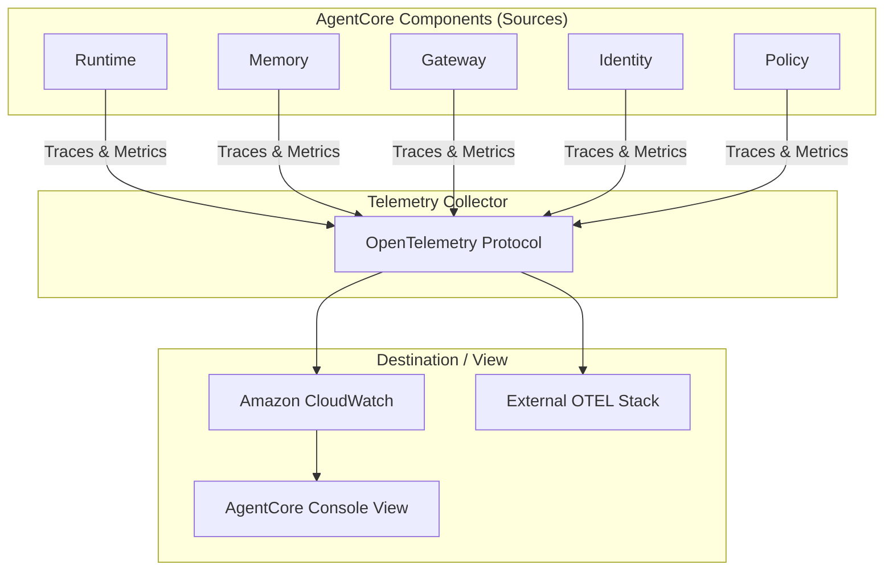

AWS Bedrock AgentCoreにおける**Observability（可観測性）** は、複雑なエージェントの挙動をブラックボックス化させず、本番環境でのパフォーマンス、コスト、安全性を可視化するための**「統合デバッグ・監視基盤」**です。

標準化された**OpenTelemetry (OTEL)** 規格を採用しているため、AWSサービス内だけでなく、既存の監視エコシステムとの親和性が高いのが特徴です。

---

#  概要

AgentCoreの可観測性は、単なる「ログ出力」を超えた、以下の3つの役割を担います。

- **推論プロセスの可視化（Tracing）:** エージェントが何を考え、どのツールをどの順番で呼び出したか、その「思考の足跡」を追跡します。
    
- **コンポーネントごとの健康診断（Metrics）:** Runtime、Memory、Gateway、Identity、Policyといった各コンポーネントの稼働状況を数値化します。
    
- **品質とコストの管理:** トークン使用量やエラー率、ポリシーによる拒否数などを監視し、運用の最適化を支援します。
    

---

AgentCoreの各部位からどのようにデータが生成され、どこに集約されるかを示します。

---

| **コンポーネント**  | **主な観測指標 (Metrics)**                            | **役割**                        |
| ------------ | ----------------------------------------------- | ----------------------------- |
| **Runtime**  | `Invocations`, `Duration`, `TokenCount`         | エージェントの実行回数、処理時間、LLMコストの把握。   |
| **Memory**   | `MemoryReadLatency`, `InsightExtractionSuccess` | 記憶の読み出し速度や、会話からの知識抽出の成功率。     |
| **Gateway**  | `ToolInvocationCount`, `ErrorRate`              | 外部ツール（API）がどれだけ呼ばれ、どれだけ失敗したか。 |
| **Identity** | `AuthSuccess`, `CredentialRotationStatus`       | 認証の成否や、APIキー等の認証情報の有効性。       |
| **Policy**   | `PolicyAllowCount`, `PolicyDenyCount`           | どのルールによってエージェントの行動が阻止されたか。    |

---

# 実装のポイント：どのように「見る」のか

1. テレメトリの設定 (Configuration):
    
    ConfigureObservability APIを使用して、テレメトリデータの送信先（CloudWatch Log Group等）を指定します。
    
2. トレースとスパン (Tracing):
    
    エージェントの一連の動作（セッション）は「Trace」として記録され、その中の個別のステップ（モデル呼び出し、ツール呼び出し）は「Span」として階層的に管理されます。
    
3. 統合ビュー (Unified View):
    
    AgentCoreコンソール上のビュー機能を使うと、特定の Trace ID を基に、エージェントが「いつ、どのポリシーによって、どのツール呼び出しを拒否されたか」といった相関関係を、時刻順のタイムラインで視覚的に確認できます。
    

---

#  まとめ

Observabilityの実体は、**「エージェントの全身に張り巡らされたセンサー」** です。

- **開発者にとって:** 「なぜエージェントがこのツールを呼ばなかったのか？」というデバッグが容易になります。
    
- **管理者にとって:** 「今月のエージェントの運用コスト（トークン）はいくらか？」「不正なツール利用の試行（Policy Deny）はないか？」を即座に把握できます。
    
