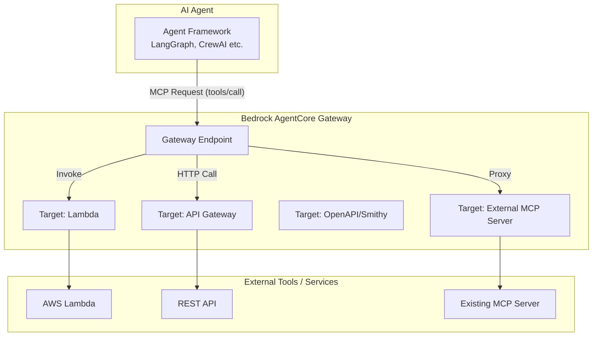

AWS Bedrock AgentCoreの「Gateway」は、AIエージェントが既存のAPIやLambda関数などの外部ツールを、標準化されたプロトコル（MCP: Model Context Protocol）を通じて安全かつ容易に呼び出せるようにする　**「統合型ツールサーバー（ハブ）」**　です。

ご提示いただいたドキュメント群に基づき、核となる機能を「概念」「概念図」「概念の説明」「実装のポイント」に整理して解説します。

---

#  概要

AgentCore Gatewayの主要なコンセプトは **「抽象化」と「標準化」** です。

- **MCP (Model Context Protocol) への自動変換:** 独自のプロトコルやデータ形式を持つ既存資産（Lambda, REST API等）を、AIエージェントが理解できる「MCP」という共通規格に自動で変換します。
    
- **一元管理 (Centralized Hub):** 複数のツール（ターゲット）を一つの「Gateway」にまとめ、AIエージェントからは一つのエンドポイントに見えるようにします。
    
- **セキュアな接続:** 認証・認可（IAMやOAuth）をGateway側で肩代わりし、エージェントの実装側で認証情報を意識する必要をなくします。
    

---

---

### ターゲットの多様性 (Targets)

Gatewayは、以下のような多様なリソースを「ツール」として登録できます。

- **Lambda:** ビジネスロジックを直接実行。
    
- **API Gateway:** 既存のRESTfulサービスを統合。
    
- **OpenAPI/Smithy:** 定義済みのAPI仕様書から自動でツールを生成。
    
- **MCP Servers:** すでに構築済みの外部MCPサーバーをそのまま統合。
    
### インテリジェントなツール発見 (Discovery)

エージェントはGatewayに対して「どんなツールがあるか」を問い合わせることができ、Gatewayは各ターゲットのメタデータ（名前、説明、スキーマ）をMCP形式で返却します。

### 認証の抽象化 (Identity & Auth)

AgentCore Identityと連携し、ターゲットごとに異なる認証方式（IAM, API Key, OAuth等）をGatewayが処理します。エージェント側はGatewayへのアクセス権さえあれば、背後の各ツールへの認証を意識しなくて済みます。

### ツール名の管理 (Tool Naming)

複数のターゲット間でツール名が衝突しないよう、`<TargetName>_<ToolName>` のような形式で名前空間を管理します。

---

# 実装のポイント (Implementation Highlights)

実装時に重要となる点は以下の通りです。

### ターゲットスキーマの定義:
    
- LambdaやAPIを統合する際、そのツールが何をするものか、どのようなパラメータが必要かを定義する「Tool Schema」が必要です。
        
- OpenAPI 3.0やSmithyモデルを使用すると、既存の定義ファイルから自動的にスキーマが生成されるため、コードの書き直しが不要になります。
        
### IAMロールの設定:
    
- Gatewayには、ターゲット（Lambda等）を呼び出すための権限を持つIAMロールを割り当てる必要があります。
        
- 外部リソースの場合は、適切なクレデンシャルプロバイダーをGatewayに紐付けます。
        
###  API Gateway使用時の注意点
    
- パブリックREST APIであること、各メソッドに `operationId` が設定されていることなどが要件となります。
        
### MCPクライアントの利用
    
- 実装側（エージェント側）では、Strands MCP SDKなどのライブラリを使い、GatewayのURLをMCPサーバーのエンドポイントとして指定するだけで、背後の全ツールが利用可能になります。
        

# まとめ

Bedrock AgentCore Gatewayを活用することで、開発者は**「個別のツールとの接続ロジックや認証の実装」から解放**され、エージェントの推論やビジネスロジックの構築に集中できるようになります。既存の資産（LambdaやAPI）を「AIの部品」として迅速に再利用したい場合に非常に強力なツールです。