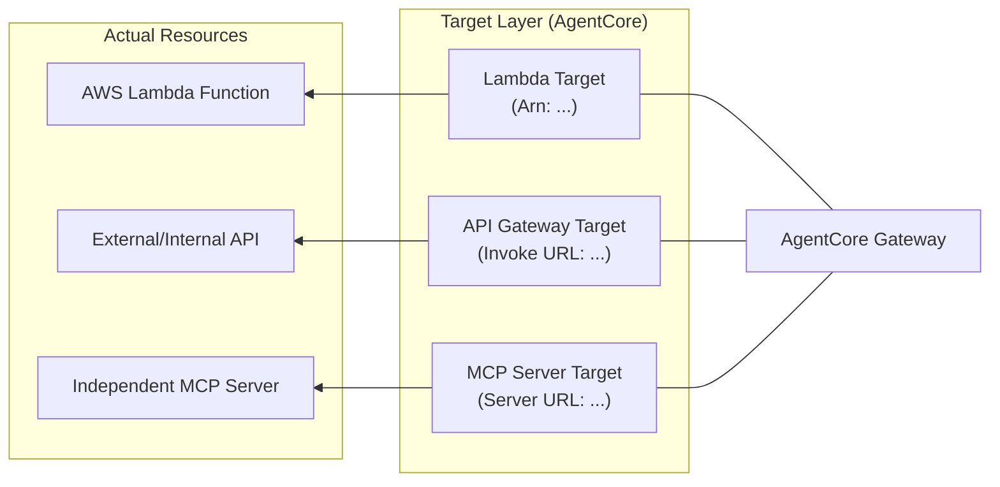

AWS Bedrock AgentCoreにおける**ターゲット（Target）** とは、Gateway（ハブ）の背後で実際に「仕事」をする**実体（リソース）** のことです。

# 概念

ターゲットは、多様なバックエンド（Lambda、REST API、既存のMCPサーバー）をAgentCore Gatewayに繋ぎ込むための**「アダプター」**の役割を果たします。

特筆すべきは、ご提示のドキュメントにある「MCP Server Target」です。これは、すでに世の中に存在する「MCP（Model Context Protocol）規格」に準拠した外部サーバーを、そのままAgentCoreの配下に組み込めることを意味しています。

---

- **Gatewayとの関係:** ターゲットはGatewayに対して「プラグイン」のように登録されます。Gatewayはこれら複数のターゲットを取りまとめ、一つの大きなツールセットとしてエージェントに提示します。
    
- **Stageとの関係:** ターゲットは作成しただけでは動作しません。「どのステージ（例：prod, dev）」でそのターゲットを有効にするかを設定（Associate）することで初めて利用可能になります。
    
- **MCP Server Targetの特殊性:** * 通常のAPIターゲットは「スキーマ」を自分で定義する必要がありますが、**MCP Server Target**の場合、接続先のサーバーがすでにツール定義（スキーマ）をMCP形式で持っています。そのため、AgentCoreは接続先から情報を自動取得（イントロスペクション）し、そのままGatewayのツールとして公開できます。
        

# 実装のポイント

ドキュメントの「MCP Server Target」の設定等に基づく重要なポイントです。

### 接続プロトコルの選択:
    
MCPサーバーをターゲットにする場合、トランスポート層として SSE (Server-Sent Events) などを介して接続します。Gatewayはこのプロトコルを解釈して、エージェントとの通信を仲介します。
    
### エンドポイントURLの指定:
    
ターゲット作成時に、実際のMCPサーバーが稼働しているURL（例: https://my-mcp-server.com/sse）を指定します。
    
### 認証（Credential）の紐付け:
    
 ターゲットが外部サービスである場合、そこへアクセスするためのAPIキーや認証情報を、AgentCoreの「Credential Manager」を通じて安全に渡す設定が必要です。
    
### ツール名の衝突回避:
    
 Gatewayに複数のターゲットを登録すると、ツール名が重複する可能性があります。AgentCoreは各ターゲットに名前空間（Prefix）を付与することで、エージェントが「どのターゲットのツールか」を識別できるようにします。
    
# まとめ

**ターゲット**は、AgentCoreにおける **「接続の終着点」** です。特にMCPサーバーをターゲットとして追加できる機能により、AWS外にある既存のAIツール資産を簡単にBedrockのエコシステムに統合できるのが最大の強みです。
