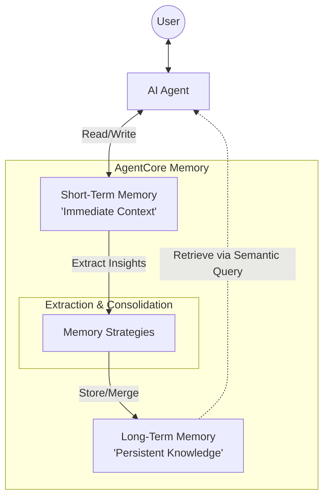

AWS Bedrock AgentCore における「メモリ（Memory）」は、AI エージェントに人間のような「記憶」と「学習能力」を与えるためのフルマネージドな基盤です。

単なるチャット履歴の保存だけでなく、会話から重要な事実やユーザーの好みを自動で抽出し、長期間活用できる形に構造化する点が最大の特徴です。

---

#  概要

AgentCore Memory は、エージェントが「過去に何が起きたか」を把握し、それに基づいて「次どうすべきか」を判断するための知識基盤です。

- **コンテキストの継続性:** 以前のセッションで話した内容を、数日後の新しい会話でも覚えている状態を作ります。
    
- **非構造化データから構造化知識へ:** 雑談や長文の会話ログから、「ユーザーはコーヒーが好き」「予算は10万円以内」といった **インサイト（洞察）** を抽出して保存します。
    

---

### コア用語

- **Event:** 会話の 1 ターン（発言と応答）。メモリの最小単位。
    
- **Insight:** 会話から抽出された価値のある情報（事実、好み、要約）。
    
- **Consolidation (統合):** 新しい情報と古い情報を照らし合わせ、重複を消したり矛盾を修正したりするプロセス。
    

### メモリの種類 (Memory Types)

1. **短期記憶 (Short-term Memory):** * 現在のセッション内での「今何の話をしているか」を保持します。
    
    - 会話が終わると基本的には消滅（または長期記憶へ変換）されます。
        
2. **長期記憶 (Long-term Memory / LTM):**
    
    - セッションを跨いで永続化される記憶です。
        
    - ユーザープロファイルや、過去の決定事項などがここに含まれます。

### メモリ戦略 (Memory Strategies)

「何を、どう覚えるか」を決めるルールです。用途に合わせて使い分けます。

| **戦略**              | **何を抽出・保存するか**    | **具体例**                        |
| ------------------- | ----------------- | ------------------------------ |
| **Semantic**        | 会話の中の「事実」や「知識」    | 「会社には3つの拠点がある」「締め切りは金曜」        |
| **Summary**         | 会話の「流れ」の要約        | 「料金プランについて相談し、見積もり送付に合意した」     |
| **User Preference** | ユーザーの「好み」や「傾向」    | 「ダークモードを好む」「PythonよりJavaを優先する」 |
| **Episodic**        | 一連の「体験」と「リフレクション」 | 「なぜこのタスクが失敗したのか」という教訓の抽出       |

### LTM と RAG の違い (LTM vs. RAG)

よく混同されますが、役割が明確に異なります。

- **RAG (Retrieval-Augmented Generation):**
    
    - マニュアルや社内文書など、**「外部の静的な知識」**を検索するための仕組み。
        
    - エージェント自身が書くのではなく、用意された資料を読みに行きます。
        
- **LTM (Long-term Memory):**
    
    - エージェントがユーザーとのやり取りを通じて得た **「経験に基づく動的な知識」**。
        
    - 「あなたが昨日言ったこと」を覚えているのはこちらです。
        

---
# まとめ

AgentCoreのメモリは、**「AWSが裏側で管理する、AI専用のスマートな外部脳」** です。

開発者は複雑なデータベースのインデックス設計や、要約ロジックを自分で実装することなく、APIを叩くだけで「物覚えの良いエージェント」を構築できます。

---
