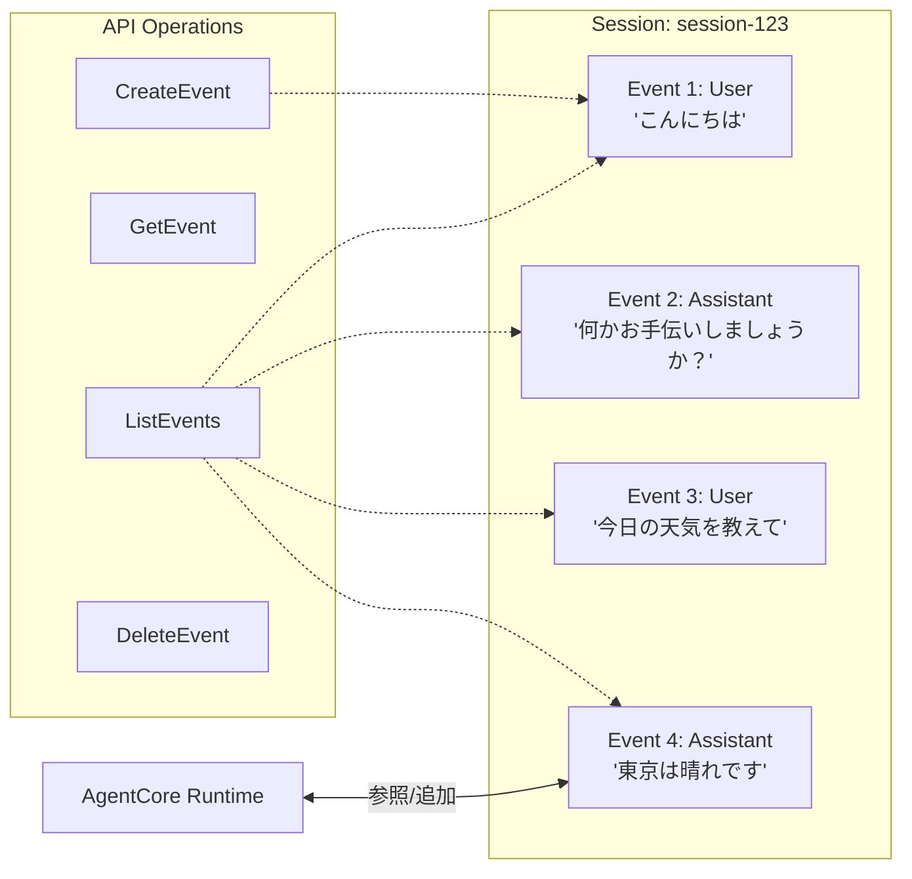

AWS Bedrock AgentCoreにおける**Short-term memory（短期記憶）** は、エージェントが「現在の会話の流れ」を正確に把握し、一貫性のある対話を行うための**「セッション内作業用メモリ」**です。

人間が会話中に「さっき言った『あれ』」を理解するのと同様に、直近のやり取りを時系列（Event）で保持します。

---

# 概要

- **文脈の維持:** 1つのセッション内での複数ターンの会話（マルチターン）を記憶し、「それ」「その結果」といった指示語や文脈を解釈可能にする。
    
- **イベント管理:** 会話の最小単位を「Event」として扱い、ユーザーの発言やエージェントの応答を個別に記録・管理する。
    
- **揮発性と制御:** 基本的には現在のセッションに紐付きますが、開発者はAPIを通じて特定のイベントを削除したり、後から取得したりと高度な制御が可能。
    
---

短期記憶は会話のログを構造化して保持します。




---

- **Event (イベント):** 会話の1往復（または1発言）を指すデータ実体。各イベントには `eventId` と `timestamp` が付与されます。
    
- **Session ID:** **短期記憶をグループ化する一意識別子** 。これが変わるとエージェントは過去の話を「忘れた」状態になります。

 - ActorId を組み合わせることで、マルチユーザー環境でも会話が混ざらないように設計します。

- **操作API:** `CreateEvent`: 会話ログを手動で追加する。    
    - `GetEvent/ListEvents`: 特定の時点の会話や、履歴の一覧を呼び出す。
       

# 特徴

- 適切な記憶構造（キー）である必要があります。キーバリューのイメージです。
	- memoryId: システム全体で一意なメモリインスタンス。例えば、 討論バトルという「アプリケーション機能」そのものを識別
	- actorId: ユーザー/役割など。サンプルコードでは「tahara」「tanaka」等を指定
	- sessionID: 会話履歴のレコード単位。第1回討論会」「第2回」のように、一連の会話をグループ化
	- payload: メッセージ

```
if event_timestamp is None:
                event_timestamp = datetime.utcnow()

            params = {
                "memoryId": memory_id,
                "actorId": actor_id,
                "sessionId": session_id,
                "eventTimestamp": event_timestamp,
                "payload": payload,
                "clientToken": str(uuid.uuid4()),
            }
            response = memory_client.create_event(**params)

            event = response["event"]
            logger.info("Created event: %s", event["eventId"])
```

 - 7～365日保存可能です。

- 別途検索可能です。

# ユースケース

短期記憶（STM）の主な役割は、**「今、この瞬間の会話」を成立させること**にあります。長期記憶が「知識や経験」の蓄積であるのに対し、短期記憶は「作業台（ワークスペース）」のような役割を果たします。

具体的なユースケースは以下の通りです。

### 会話の文脈（コンテキスト）の維持

直前の数往復のやり取りを保持し、「それ」「あれ」「さっき言ったこと」といった指示代名詞を正しく理解するために使います。

- **例:** ユーザーが「昨日のニュース見た？」と言った後、「それについてどう思う？」と聞いた際、「それ」が「昨日のニュース」であることを指し示し続ける。
    

### 段階的なタスクの遂行（マルチステップ・プロセス）

一つの大きな目的を達成するために、ステップバイステップで情報を収集する過程を管理します。

- **例:** 航空券の予約エージェントが、「出発地」「目的地」「日程」を順番に聞き取り、すべて揃うまで一時的に保持しておく。
    

### トピックの脱線と復帰への対応

会話が一時的に脇道に逸れても、元の話に戻れるようにします。

- **例:** 討論中に用語の解説を挟んだ後、「さて、さっきの議論の続きですが」と元の本筋に戻って対話を再開する。
    

### セッション内での計算や推論の仲介

コードインタープリターやブラウザを使った際の中間結果を保持し、最終的な回答を導き出すまでの「思考のプロセス」を記録します。

- **例:** 複数のサイトから情報を集め、それらを比較検討している最中の「下書き」状態のデータを保持する。
    

    