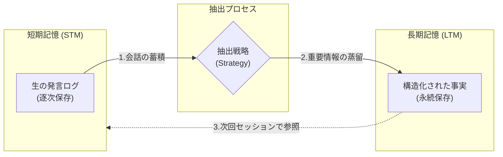

AWS Bedrock AgentCoreにおける**Long-term memory（長期記憶）**　は、セッション（会話）が終了した後も、ユーザーの好み、過去の重要な出来事、学習した事実を保持し続けるための「永続的な知識蓄積基盤」です。

単なるログの保存ではなく、会話から価値のある情報（Insight）を抽出し、構造化して蓄積する点が短期記憶との最大の違いです。

# 概要

- **パーソナライズの実現:** 「以前話した私の好み」や「過去に合意したルール」を、日を改めてもエージェントが覚えている状態を作る。
    
- **インサイト抽出の自動化:** 会話の断片から「このユーザーはコーヒーが好き」「このプロジェクトの納期は来月末」といった重要な情報を自動で抽出し、記録する。
    
- **戦略的な記憶管理:** どの情報をいつ保存し、どう取り出すかを「組み込み戦略」または「カスタム戦略」によって制御できる。
    

# 長期記憶（LTM）の仕組みと実装ポイント

AgentCore において **LTM（長期記憶）** を有効にすると、エージェントは **STM（短期記憶／会話履歴）** を常に監視し、セッションの区切りなどをきっかけに  
「この会話から残すべき事実は何か？」を分析し、LTM へ自動的に抽出・保存します。

### 基本的な特徴

- **長期記憶は、短期記憶から抽出して生成**されます。
    - プログラムの中で、まず既存の STM を検索して利用します。
    - 該当する STM がなければ、自動的に新規作成して使用します。
    - LTM の実装は、**STM を内包する形で構成**します。
        - ✅ 短期記憶だけの構成：実行可能
        - ❌ 長期記憶だけの構成：実行不可（短期記憶に依存）

### 抽出戦略と実装方式

- 長期記憶の**保存形式**や**抽出戦略（Strategy）**は、用途に応じて適切に設計・選択する必要があります。
    
- ストラテジーIDや保存先（S3 バケットなど）も事前に定義しておきます。
    
### 抽出のタイミングと遅延

- 抽出処理には**一定の遅延**が発生します。
    
    - **最短**：5〜10秒（短く単純な会話）
    - **標準**：20〜30秒
    - **最大**：1分程度（長い会話 or 同時処理が多い場合）
### その他

- 抽出された長期記憶は、**別途検索や参照が可能**です（API／Gateway 経由など）

# 記憶戦略と抽出戦略(オプション)

「長期記憶をどのようなユースケースに使用するのかによって、適切な実装方式と抽出戦略を選択します。**例えば、個別の事実を検索する『検索型』と、過去の文脈を要約して理解する『要約型』では、ネームスペースの設計やプロンプトの構成が根本から異なるためです。**」

### 記憶戦略

**Built in extraction strategies**
生のやり取りから長期記憶を抽出するための組み込み戦略。

**Built-in strategy with override**
基礎モデルとプロンプト テンプレートを通じてメモリ処理をオーバーライドします。

**Sefl-managed strategy**
AgentCoreメモリをカスタムトリガーによるイベント保存に使用します。独自の環境でメモリ処理ロジックを定義

### 抽出戦略

**要約(Summarization)**
重要なコンテキストと主要な洞察を保存するためにやり取りを要約します。

**セマンティック(Semantic)**
コンテキストに依存しない形式で、生の会話から一般的な事実の知識、概念、意味を抽出します。

**ユーザーの好み(User peference)**
生の会話からユーザーの行動パターンを抽出します。

**エピソード(Episodes)**
イベントを構造化されたエピソードに変換し、エージェントが過去の行動からリフレクションを用いて学習できるようにします。リフレクションとは、過去の経験から分析された洞察であり、エージェントの将来のパフォーマンス向上に役立ちます。

# ユースケース

長期記憶（LTM）は、一過性のチャット履歴（短期記憶）を超えて、**「ユーザー個別のコンテキスト」を資産として蓄積すること**にあります。

主なユースケースは以下の通りです。

### ユーザーの好み・パーソナライズ（User Preferences）

ユーザーが過去に語った趣味嗜好、アレルギー、特定のトピックへの関心、あるいは「結論から先に話してほしい」といったコミュニケーションスタイルの好みを保持します。

- **例:** 料理アシスタントが「このユーザーはベジタリアンで、イタリアンが好き」という事実をずっと覚えている。
    
### スキル習得・学習進捗の管理（Learning & Progression）

教育エージェントが、ユーザーが「どの概念を理解し、どこで躓いたか」を把握し続けます。

- **例:** 技術学習アシスタントが「ユーザーは昨日 React の Hooks を学んだので、今日はその応用編から始めよう」と判断する。
    
### 長期的なタスク・プロジェクトの文脈維持（Long-term Context）

数週間から数ヶ月にわたる長いプロジェクトの経緯や、未解決の課題（Pending Issues）を記憶します。

- **例:** ビジネスエージェントが「2週間前の会議で懸念されていたコスト問題は、その後どうなりましたか？」と自発的にフォローアップする。
    
### 信頼関係と共感の構築（Relationship Building）

ユーザーの家族構成、誕生日、過去に話した思い出のエピソードなどを覚え、人間味のある対話を実現します。

- **例:** メンタルケアエージェントが「先週おっしゃっていた試験の結果はどうでしたか？」と、前回のセッションの深い内容から会話を始める。
