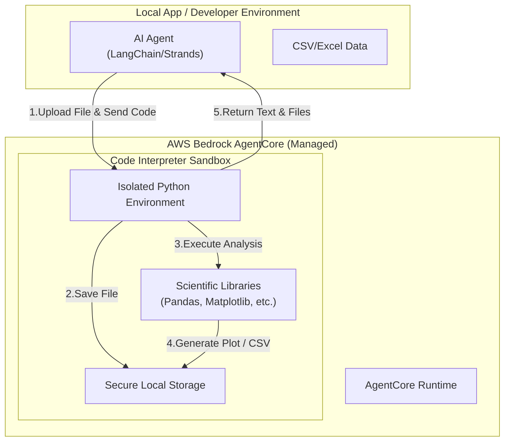

AWS Bedrock AgentCoreにおける**Code Interpreter（コードインタープリター）は、エージェントがプログラム（主にPython）を生成し、それを安全に隔離されたサンドボックス環境**で実行するための機能です。

# 概要

LLMは「言葉」の処理に長けていますが、統計計算や論理演算、大規模データの加工を確率的なテキスト生成だけで行うと、誤った数値を出力（ハルシネーション）するリスクがあります。

**Code Interpreter**は、AgentCore Runtimeに統合された「内蔵ツール」です。 LangChainやStrandsといったフレームワークを使用する場合、このツールを「標準的な関数（Tool）」としてエージェントに登録します。エージェントは計算が必要な時、自身の推論（ハルシネーションのリスクあり）ではなく、この**決定論的なPython実行環境**を呼び出すことで、正確な分析結果を出力します。

AgentCoreが「隔離された実行環境」の中で、どのように内蔵ツールと外部リソースを統制しているかを示します。

- **Runtime（中心）:** エージェントが思考する隔離されたメインルーム。
    
- **内蔵ツール（直結）:** Code InterpreterやBrowserはRuntimeの「隣の部屋」にあり、設定なしで高速・安全に呼び出せる。
    
- **Gateway（窓口）:** 外部APIや社内DBへ繋がる唯一の「安全な出口」。
    
- **Policy（検問）:** エージェントがGatewayやツールを使う前に、ルール違反がないかチェックする「門番」。
    
- **Memory（蓄積）:** 過去の会話や学習した事実を保存し、いつでも取り出せる「外部脳」。

## 実装のポイント

- **隔離ストレージ:** サンドボックス内の `/tmp/inputs` や `/tmp/outputs` を通じてファイルの読み書きを行います。
    
- **ライブラリの事前ロード:** Pandasなどの重いライブラリを自分でインストールする必要はなく、インポートするだけで即座に使えます。
    
- **セッションの永続性:** 一連の対話（スレッド）の間、生成されたファイルは保持され、次のステップで再利用可能です

#  まとめ

Code Interpreterの疑似コードにおける「正解」は、**「自分で計算ロジックを書くのではなく、AWSが提供するツールの口（Interface）をエージェントに渡すだけ」** という点に集約されます。

- **内蔵ツール:** `from ... import CodeInterpreterTool` が示す通り、実体はAWSのマネージドなインフラです。
    
- **利便性:** 開発者は、実行環境のパッチ当てやセキュリティ対策（サンドボックス化）を一切気にせず、分析ロジックの精度向上に専念できます。

開発者は「接続」や「保護」の苦労から解放され、**「エージェントにどのような価値を提供させるか」** という本来の目的のみに集中できるようになります。
