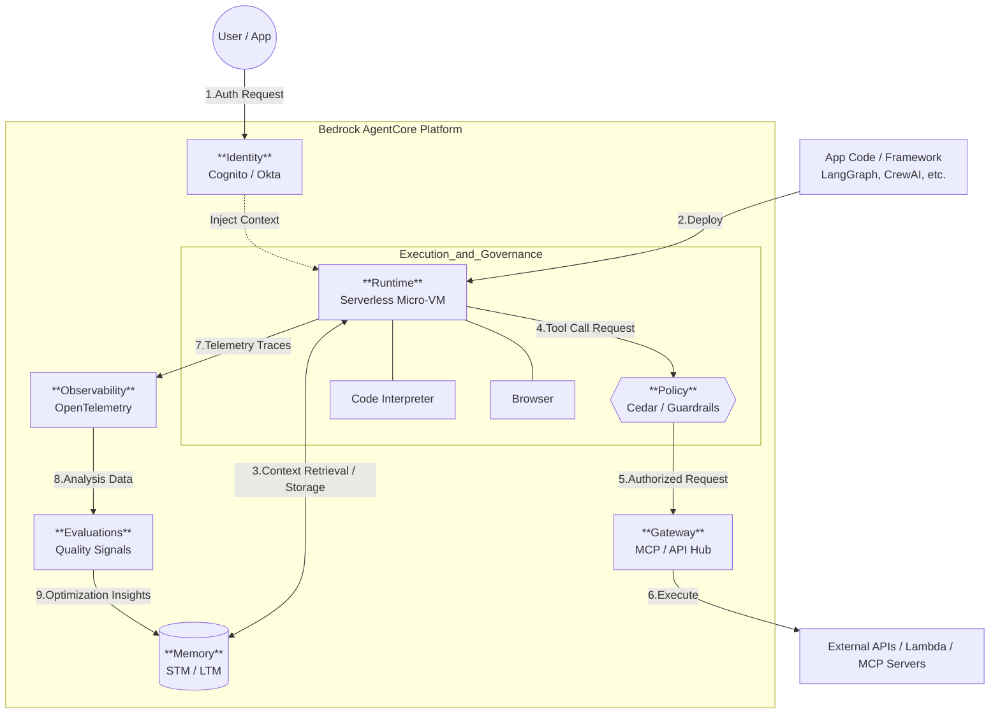

AWS Bedrock AgentCoreの**Runtime（ランタイム）** は、AIエージェントを実行・スケーリングするための**「セキュアなサーバーレス実行環境」**です。

開発者が作成したエージェントのコードを、インフラの管理なしにエンタープライズ品質で動かすための中心的なコンポーネントです。ご提示いただいたドキュメントに基づき、核心部分を整理します。

---

# 概要

AgentCore Runtimeの核心は、**「究極の柔軟性」**と**「強固な隔離（アイソレーション）」** の両立です。

- **Bring Your Own Everything (BYO):** 好きなフレームワーク（LangGraph, CrewAI等）と、Bedrock内外の好きなモデル（OpenAI, Gemini, Claude, Nova等）を組み合わせて動かせます。
    
- **Micro-VMによる隔離:** セッションごとに独立した軽量な仮想マシン（Micro-VM）が立ち上がり、高速なコールドスタートを実現しつつ、ユーザー間のデータ混在を防ぎます。
    
- **通信プロトコルの標準化:** **MCP**（Model Context Protocol）によるツール連携や、**A2A**（Agent-to-Agent）によるエージェント間通信をサポートします。
    

---

Runtimeがどのように外部環境と接続し、エージェントをホストするかを示します。

---
### サーバーレス・スケーリング

エージェントの実行に必要なリソースを自動で管理します。リアルタイム対話のための高速起動だけでなく、長時間実行が必要な非同期タスクもサポートします。

### WebSocketによるリアルタイム通信

`runtime-get-started-websocket.html` にある通り、双方向のWebSocket通信をネイティブでサポートしています。これにより、エージェントの推論プロセスをストリーミングで表示したり、リアルタイムなチャットアプリを容易に構築できます。

### モデルとフレームワークの自由

特定のSDKに縛られません。

- **モデル:** Bedrock上のモデル（Amazon Nova, Anthropic Claude等）だけでなく、外部API（OpenAI, Google Gemini等）も、ランタイム内から安全に呼び出せます。
    
- **フレームワーク:** LangGraph, CrewAI, LlamaIndex, Google ADKなど、既存のOSSエコシステムをそのまま持ち込めます。
    

### A2A (Agent-to-Agent) 通信

エージェントが別のエージェントを「ツール」として呼び出す仕組みです。複雑なタスクを専門特化した複数のエージェントで分業させるマルチエージェントワークロードを容易にします。

---

# 実装のポイント (Implementation)

1. Toolkit（CLI）の活用:
    
    bedrock-agentcore-starter-toolkit を使うことで、プロジェクトの初期化からAWSへのデプロイまでをコマンドライン（agentcore deploy）で完結できます。
    
2. ハンドラーの実装:
    
    カスタムエージェントを動かす場合、Runtimeからのリクエストを受け取るエントリーポイント（Handler）を定義します。これにより、Runtimeがセッション管理やアイデンティティ情報をエージェントに渡せるようになります。
    
3. MCPサーバーとしての公開:
    
    エージェント自体をMCPサーバーとしてRuntime上に公開することで、他のMCP対応クライアントからそのエージェントを「ツール」として利用可能になります。
    
4. セキュリティと認証:
    
    Identityコンポーネントと統合されており、実行環境内で安全にクレデンシャル（APIキー等）を管理・使用できます。
    

# まとめ

Runtimeは、**「エージェントのコードがどこで、どう動くか」**という問題を解決します。開発者はローカルで作ったLangGraphなどのエージェントを、そのまま「エンタープライズ基準の安全な本番環境」へ昇華させることができます。