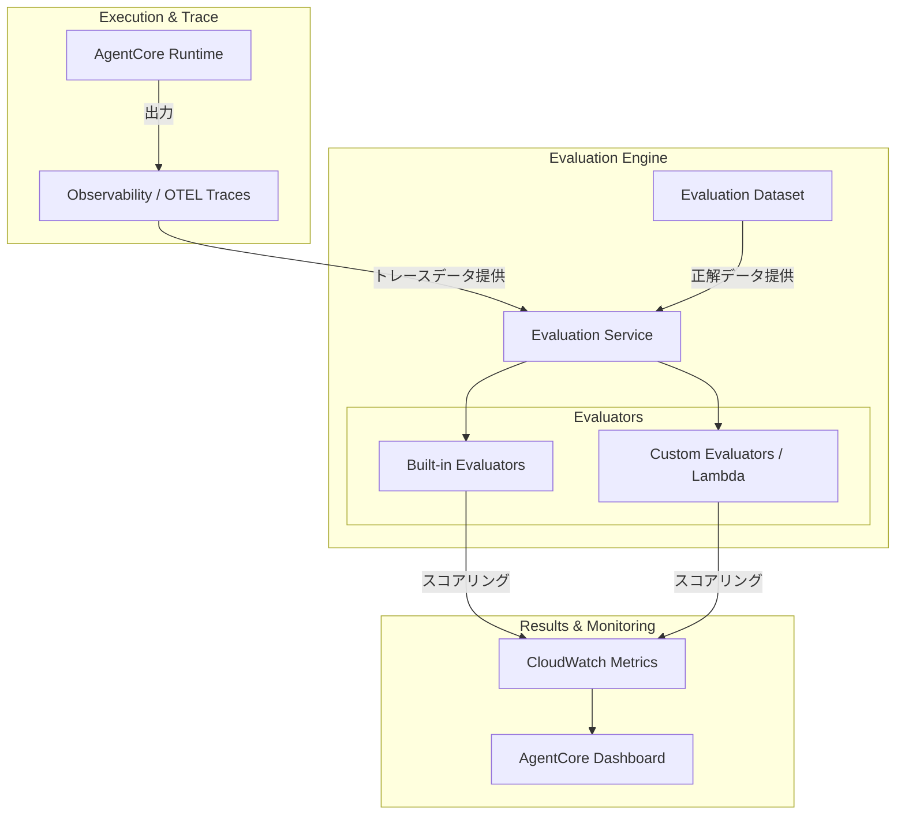

AWS Bedrock AgentCoreにおける**Evaluations（評価）** は、エージェントの推論、ツールの呼び出し、回答の品質を「データ駆動」で測定し、商用レベルの信頼性を担保するための**「自動化された評価基盤」**です。

---

# 概要

なぜEvaluations(評価)が必要なのでしょうか。

- **ハルシネーションの検知:** エージェントの回答が事実に基づいているか、論理的に正しいかを客観的にスコアリングするため。
    
- **パフォーマンスの最適化:** プロンプトの変更やモデルの切り替えが、回答の精度にどう影響したかを定量的に比較するため。
    
- **継続的な改善:** 本番環境（オンライン）と開発環境の両方でエージェントを評価し、品質の低下を未然に防ぐため。
    

---

EvaluationsがAgentCoreの他のコンポーネントとどのように連携し、評価ループを構成しているかを示します。



---


- **Runtime & Observability:** エージェントの実行結果はOpenTelemetry形式で記録（トレース）され、評価の原材料となります。
    
- **Evaluation Dataset:** 期待される回答や質問のセットを準備し、実際の挙動と比較します。
    
- **Evaluators (評価者):** 「採点基準」です。AWSが提供する**Built-in（組み込み）と、独自のビジネスルールを定義するCustom**があります。
    
- **Metrics & Dashboard:** 評価結果（正確性、毒性、忠実性など）がCloudWatchに集約され、一元的に可視化されます。
    

---

# 核心的な要素

- **Built-in Evaluators:** LLMを使用して、回答の「忠実性(Faithfulness)」「関連性(Answer Relevance)」「事実性(Correctness)」などを自動採点します。
    
- **Online Evaluations:** 本番環境で動いているエージェントの生のトレースをリアルタイムで評価し、異常があれば即座に検知します。
    
- **Cross-Region Inference:** 評価用のモデル（採点側）を異なるリージョンで実行し、リソースを効率的に活用できます。
    


# 実装のポイント

- **OTELの有効化:** 評価を行うためには、RuntimeでOpenTelemetry（OTEL）を有効にし、トレースが正しく記録されるように設定する必要があります。
    
- **プロンプトテンプレート:** 組み込み評価者は、評価専用のプロンプトを使用して採点を行います。これらをカスタマイズして、評価の「厳しさ」を調整することも可能です。
    
- **カスタム評価者の作成:** 特殊な業界用語や社内ルールが必要な場合は、Lambda関数を使用して独自の評価ロジックを実装できます。
    

---

# 疑似コード


```
# --- 1. 必要パッケージのインポート ---
from bedrock_agentcore import Agent
from bedrock_agentcore.evaluations import EvaluationEngine, BuiltInEvaluator
from bedrock_agentcore.observability import ObservabilityConfig

# --- 2. 観測性の設定（評価にはトレースが必須） ---
obs_config = ObservabilityConfig(
    export_to_cloudwatch=True,
    otel_enabled=True # 評価のベースとなるデータを生成
)

# --- 3. 評価者の定義 ---
# 「回答が提供されたコンテキストに忠実か」を評価する組み込み評価者
faithfulness_eval = BuiltInEvaluator(
    type="FAITHFULNESS",
    model_id="us.anthropic.claude-sonnet-4-20250514-v1:0" # 採点を行うモデルを指定
)

# --- 4. 評価エンジンのセットアップ ---
eval_engine = EvaluationEngine(
    evaluators=[faithfulness_eval],
    output_path="s3://your-eval-results-bucket/"
)

# --- 5. 実行と評価 ---
# エージェントを実行すると、裏側でOTELトレースが生成され、
# eval_engineがそのデータを基にスコアリングを行います。
response = my_agent.run(
    "売上レポートを要約して。",
    observability=obs_config
)

# 評価のサマリーを取得
report = eval_engine.get_summary()
print(f"Faithfulness Score: {report.score}")
```

---

# まとめ

- **Evaluationsの本質:** 「エージェントが良くなったか悪くなったか」を勘ではなく、データで語れるようにする仕組み。
    
- **開発者の利益:** 大量のテストケースを人間が一つずつ確認する手間を省き、自動化されたCI/CDパイプラインに評価を組み込める。
    
- **ビジネス価値:** オンライン評価（モニタリング）によって、本番環境でのエージェントの品質を24時間体制で保証できる。
    

これで、エージェントの「構築（Runtime）」「装備（Tools）」「制御（Policy/Identity）」「記憶（Memory）」そして「品質管理（Evaluations）」のすべてが網羅されました。

