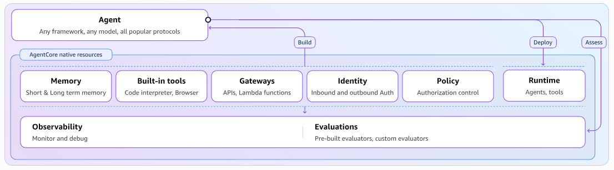

AWS Bedrock AgentCoreは、AIエージェントをプロトタイプから「エンタープライズ品質の商用環境」へ移行させるための、**フルマネージドな実行基盤スイート**です。

一言で言えば、**「どんなフレームワーク（Strands Agent, LangGraph, CrewAI等）で書かれたエージェントでも、セキュアにデプロイ・運用できるインフラ基盤」** です。

# 概要

これまでの「Amazon Bedrock Agents」がノーコード/ローコードなエージェント構築サービスだったのに対し、**AgentCore**はプログラマブルで自由度の高い「基盤（Platform）」を提供します。

- **フレームワークに依存しない:** 好きなSDKやライブラリでエージェントを書けます。
    
- **モデルに依存しない:** Bedrock上のモデルだけでなく、外部モデルも利用可能です。
    
- **運用に特化:** セキュリティ、メモリ管理、API連携、観測性を「部品（コンポーネント）」として提供します。
    

以下、AgentCoreを構成するサービスと、それらがどのように連携するかを示します。

| **カテゴリ** | **要素**               | **核心機能と統合対象**                                                                                                     |
| -------- | -------------------- | ----------------------------------------------------------------------------------------------------------------- |
| **実行基盤** | **Runtime**          | **セキュアなサーバーレス実行環境。**  高速なコールドスタートとセッション分離を実現。CrewAI, LangGraph等のOSSフレームワーク、Bedrock内外（OpenAI, Gemini等）のモデルに対応。 |
| **記憶**   | **Memory**           | **文脈を理解する記憶。**  短期（会話）と長期（セッション跨ぎ）の記憶を管理。StrandsやLlamaIndexと連携し、エージェント間での記憶共有や経験学習が可能。                        |
| **接続**   | **Gateway**          | **ツール統合のハブ。**  APIやLambdaをMCP規格に変換。SalesforceやSlackなどの既存サービスを数行のコードでAIツール化。                                   |
| **認証**   | **Identity**         | **アイデンティティ管理。**  Cognito, Okta, Azure Entra ID等の既存IdPと連携し、ユーザー移行なしで安全な認証フローを構築。                                |
| **拡張機能** | **Code Interpreter** | **分離されたサンドボックス。**  Python, JS, TSを実行し、複雑な計算やデータ処理の精度を向上。                                                      |
| **操作**   | **Browser**          | **クラウド型ブラウザ環境。**  Playwright等を使用し、エージェントがWebサイトの閲覧、フォーム入力、情報抽出を安全に実行。                                         |
| **観測性**  | **Observability**    | **統合デバッグビュー。**  OpenTelemetry (OTEL)形式でトレースとログを出力。パフォーマンスのボトルネックを可視化。                                         |
| **評価**   | **Evaluations**      | **データ駆動型の品質評価。**  セッションやトレースに基づき、タスク完遂率や信頼性を測定。結果はCloudWatch連携のObservabilityで確認可能。                            |
| **統制**   | **Policy**           | **決定論的な境界制御。**  自然言語またはCedar言語で「どのツールを、いつ、誰が使えるか」を定義。Gatewayでの実行前に介入し、ビジネスルールを強制                              |
|          |                      |                                                                                                                   |

# 実装のポイント：要素間の関係性

- **「信頼」のチェーン (Identity → Runtime → Policy):** ユーザーが既存のIdP（Identity）でログインし、隔離された環境（Runtime）でエージェントが動きます。エージェントが外部ツールを呼ぶ際、Policyがその行動がルールに沿っているか（Cedar言語等で）即座に判定します。
    
- **「成長」のサイクル (Observability → Evaluations → Memory):** エージェントの全挙動はOTEL形式で記録（Observability）され、それが評価エンジン（Evaluations）で分析されます。良かった行動やユーザーの反応はMemoryとして蓄積され、次回のセッションに活かされます。
    
- **「拡張」の柔軟性 (Gateway + Browser/Code Interpreter):** 自社APIはGateway経由で、Web上の情報はBrowser経由で、複雑なロジックはCode Interpreterで処理します。これらはすべて「ツール」としてエージェントに提供されます。
    
>[注]
開発において、Amazon Bedrock が提供する AI エコシステムのサービスやツールを、**すべて一度に使う必要はありません**。  
レゴブロックのように、AIエージェントの**用途や規模に応じて、必要なパーツだけを取捨選択すればよい**のです。
実際、AIエージェントを動かすうえで**必須となるコンポーネントは、ごくわずか**で、ほとんどの機能は「便利ツール」や「補助的なオプション」にすぎません。  
とはいえ、エージェントの規模やユースケースが広がるにつれて、これらのオプションが必要になる場面も出てくるため、**段階的に活用していく設計が重要**です。

# 開発・デプロイのステップ

ドキュメントにある「Toolkit」を使用した開発の全体的な流れは以下の通りです。

- **Toolkitの導入:** `bedrock-agentcore-starter-toolkit` をインストール。
    
-  **プロジェクト作成:** CLI（`agentcore create`）を使用して、テンプレートからプロジェクトを生成。
    
- **エージェント実装:** 好きなフレームワーク（Strands Agents, LangGraph等）でビジネスロジックを記述。
    
- **デプロイ:** `bedrock-agentcore-app` クラスを使用して、数行のコードでAWS上のRuntimeへデプロイ。
    
- **運用:** コンソールやAPIを通じて、メモリの最適化やポリシー（ガードレール）の適用を行う。
    
# まとめ

AgentCoreは、 「自由にエージェントを開発しつつ、企業が必要とするセキュリティ、ガバナンス、信頼性を後付けではなく基盤として提供する」*ための仕組みです。

これにより開発者は、サーバーの管理や複雑なデータベース設計、セキュリティの実装に時間を取られることなく、**「いかに賢いエージェントを作るか」** という本質的な開発に集中できるようになります。

# 節の構成について

- **10:基本構成**
- **20:ランタイム**
- **30:可観測性&評価**
