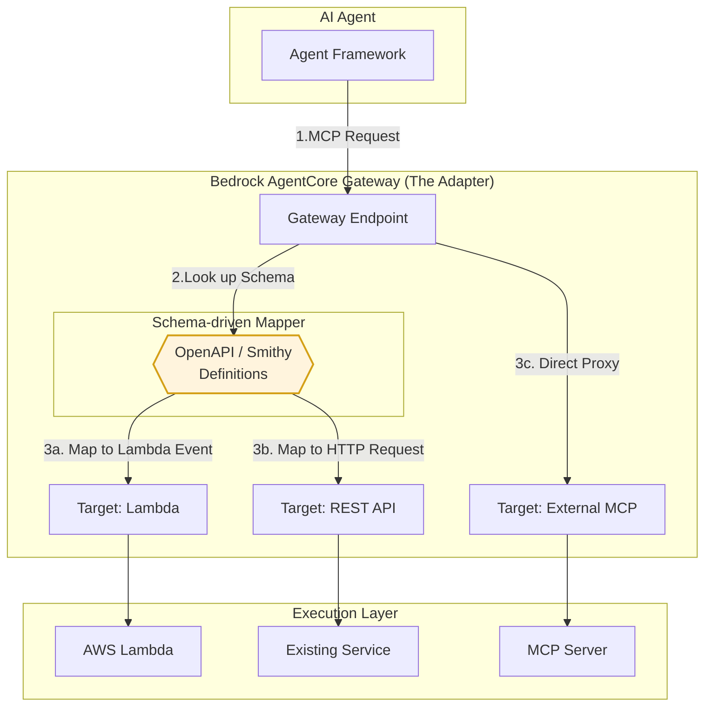

AWS Bedrock AgentCoreの「Gateway」は、AIエージェントが既存のAPIやLambda関数などの外部ツールを、標準化されたプロトコル（MCP: Model Context Protocol）を通じて安全かつ容易に呼び出せるようにする　**「統合型ツールサーバー（ハブ）」**　です。

#  概要

AgentCore Gatewayの主要なコンセプトは **「抽象化」と「標準化」** です。

- **MCP (Model Context Protocol) への自動変換:** 独自のプロトコルやデータ形式を持つ既存資産（Lambda, REST API等）を、AIエージェントが理解できる「MCP」という共通規格に自動で変換します。
    
- **一元管理 (Centralized Hub):** 複数のツール（ターゲット）を一つの「Gateway」にまとめ、AIエージェントからは一つのエンドポイントに見えるようにします。
    
- **セキュアな接続:** 認証・認可（IAMやOAuth）をGateway側で肩代わりし、エージェントの実装側で認証情報を意識する必要をなくします。
    

### Unified Interface (MCP Endpoint)
- エージェントからの単一窓口: LangGraphやCrewAIなどのAIエージェントフレームワークに対し、標準化されたMCP（Model Context Protocol）インターフェースを提供します。

- 抽象化のメリット: エージェント側は、背後のツールがLambdaなのかREST APIなのかを意識せず、すべて共通の tools/call 形式でリクエストを送ることが可能になります。

### Protocol Translation & Mapping (The Core)
- 非MCP資産のMCP化: Lambda関数や既存のREST APIなど、本来MCPを話さない（理解しない）リソースを、Gatewayがラップして「あたかもMCPサーバーであるかのように」振る舞わせます。

- スキーマ注入と変換: OpenAPIやSmithyの定義ファイルを読み込むことで、エージェントから受け取った引数を、Lambdaの event オブジェクトやHTTPリクエストの body/query パラメータに動的にマッピングします。

### Multi-Target Routing
#### 柔軟なバックエンド選択:

- Target: Lambda: AWSネイティブな処理系に対し、定義に基づいたPayloadを注入して実行します。

- Target: HTTP/REST: 既存の社内システムや外部SaaSに対し、OpenAPIに基づいたHTTPコールを行います。

- Target: External MCP: すでにMCPに対応しているサーバーに対しては、変換を行わず透過的なプロキシとして機能します。

### Integration Hub (Schema Management)
- 資産の再利用: 既存のOpenAPI定義資産をそのまま流用してエージェントの「ツール」として公開できるため、AI専用のバックエンドを個別に作り直すコストを削減します。

- 包括的なガバナンス: 各ツールへのアクセス権限や認証をGatewayで一元管理し、エージェントと実サービスの間のセキュリティ境界として機能します。

# 実装のポイント

実装時に重要となる点は以下の通りです。

### ターゲットスキーマの定義:
    
- LambdaやAPIを統合する際、そのツールが何をするものか、どのようなパラメータが必要かを定義する「Tool Schema」が必要です。
        
- OpenAPI 3.0やSmithyモデルを使用すると、既存の定義ファイルから自動的にスキーマが生成されるため、コードの書き直しが不要になります。
        
### IAMロールの設定:
    
- Gatewayには、ターゲット（Lambda等）を呼び出すための権限を持つIAMロールを割り当てる必要があります。
        
- 外部リソースの場合は、適切なクレデンシャルプロバイダーをGatewayに紐付けます。
        
###  API Gateway使用時の注意点
    
- パブリックREST APIであること、各メソッドに `operationId` が設定されていることなどが要件となります。
        
### MCPクライアントの利用
    
- 実装側（エージェント側）では、Strands MCP SDKなどのライブラリを使い、GatewayのURLをMCPサーバーのエンドポイントとして指定するだけで、背後の全ツールが利用可能になります。
        
# まとめ

Bedrock AgentCore Gatewayを活用することで、開発者は「個別のツールとの接続ロジックや認証の実装」から解放され、エージェントの推論やビジネスロジックの構築に集中できるようになります。既存の資産（LambdaやAPI）を「AIの部品」として迅速に再利用したい場合に非常に強力なツールです。