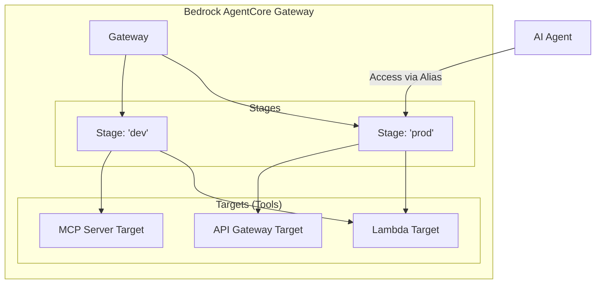

AgentCoreにおける**ステージ（Stage）** とは、Gateway（ハブ）とTarget（個別のツール/API）の間に位置する**「論理的な抽象化レイヤー」** です。

# 概要

通常、API開発における「開発・テスト・本番」といった環境分けだけでなく、AgentCoreでは **「特定のツールセットの実行環境と設定の管理単位」**　として機能します。エージェントがGatewayにアクセスする際、実際にはこの「ステージ」を指定してツールを呼び出します。

---

ステージは、以下の3つのコア要素を繋ぐ「接着剤」のような役割を果たします。

- **Gatewayとの関係:** 1つのGatewayは複数のステージを持つことができます。Gatewayが入り口（URL）を提供し、ステージがその中身（どのツールが有効か）を定義します。
    
- **Target（ターゲット）との関係:** ステージは、そのステージで利用可能な「ターゲットのリスト」を保持します。例えば、「devステージには試験的なツールを含めるが、prodステージには含めない」といった制御が可能です。
    
- **Alias（エイリアス）との関係:** エージェントは通常、特定の「エイリアス」を介してステージに接続します。エイリアスが「どのステージを指すか」を切り替えることで、エージェント側の設定を変えずに背後の環境（ステージ）を瞬時に切り替えられます。
    
# 実装のポイント

ドキュメント（API Gatewayターゲット等）の内容を踏まえた実装上の重要事項です。

### エンドポイントの構造:

  GatewayのベースURLに対し、/stages/{stageName}/ という形式でエンドポイントが構成されます。MCPプロトコルで接続する場合、このステージを含んだURLを指定することで、そのステージに登録されたツール群がエージェントから見えるようになります。
   
### ターゲットのバインド:
   
   ターゲット（API GatewayやLambda）を作成しただけでは利用できません。必ず特定のステージに対してターゲットを「関連付け（Associate）」する必要があります。
   
### 環境固有の設定の吸収:
   
   例えば、API Gatewayターゲットを登録する際、背後のAPI Gateway側にも「ステージ（prod/test等）」が存在します。AgentCoreのステージ側で、接続先となる背後のAPI Gatewayのステージ情報を保持させることで、エージェントからは背後の複雑な環境差異が見えないように隠蔽します。
   
###  認証・認可の適用範囲:

   認証（Identity）の設定はステージ単位、あるいはステージを介したターゲット呼び出しに対して適用されます。特定のステージにのみ厳しい認証をかけるといった運用が可能です。
   
# まとめ

「ステージ」は、エージェント（利用者）と実際のツール（ターゲット）の間に挟まる **「構成のパッケージ」** です。これにより、開発サイクル（dev/prod）の分離や、異なるツールセットの切り替えを、エージェント側のコードを汚さずに柔軟に行うことが可能になります。