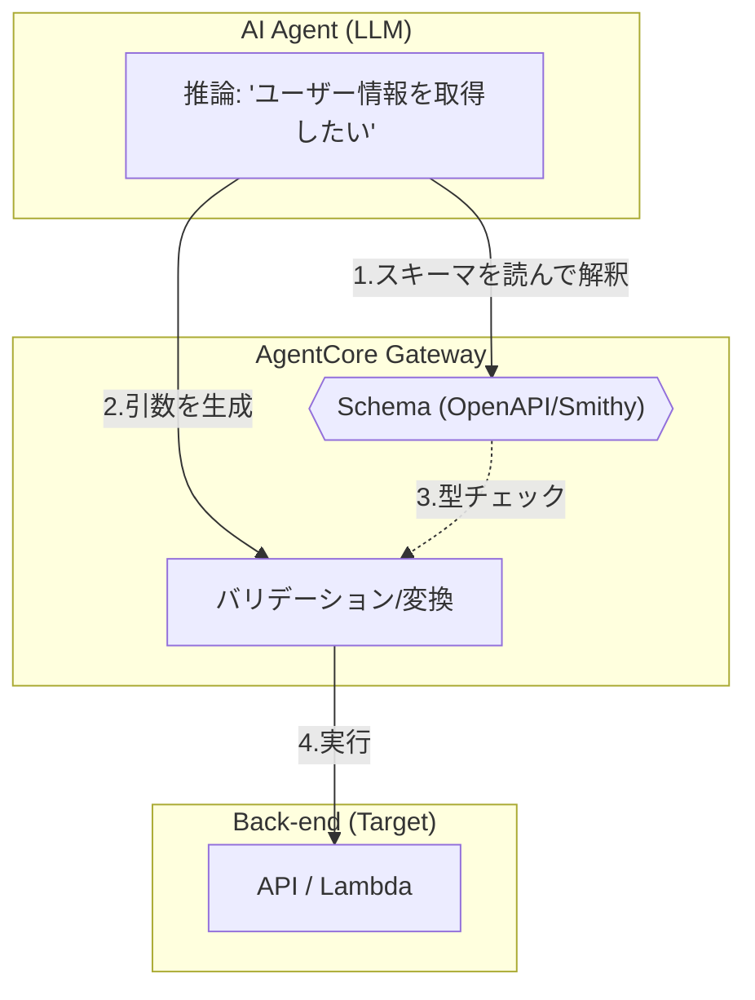

AWS Bedrock AgentCoreにおける**スキーマ（Schema）** とは、一言で言えば　**「AIエージェントと外部ツールの間の『取扱説明書』兼『インターフェース定義書』」** のことです。

AI（LLM）は、外部のAPIやLambda関数を呼び出す際、「そのツールが何をするのか」「どんな引数（パラメータ）を、どんなデータ型で渡すべきか」を知る必要があります。これらを標準化された形式で記述したものがスキーマです。

---

# 概念

スキーマは、人間にとってもAIにとっても「このツールをどう使うか」の共通理解を形成する役割を持ちます。

- **AIに対して:** 「この関数を呼ぶには、`user_id`を文字列で、`amount`を数値で渡してください」という指示になります。
    
- **システムに対して:** 渡されたデータが正しい形式か（バリデーション）をチェックする基準になります。
    

---

AgentCoreでは、主に**OpenAPI (Swagger)** や **Smithy** といった標準的な仕様が使われます。

- ツールのメタデータ:
    
    スキーマには、ツールの「名前（operationId）」や「説明（description）」が含まれます。LLMは、この「説明」を読んで、どのツールを使うべきかを判断します。
    
- **入出力の定義:**
    
    - **Input:** 引数の名前、型（string, integer等）、必須か否か。
        
    - **Output:** ツールが返すデータの構造。
        
- プロトコルの統一:
    
    AgentCore Gatewayは、このスキーマを読み取って、内部的に MCP (Model Context Protocol) 形式のツール定義としてエージェントに提示します。これにより、エージェント側は背後のAPIがRESTなのかLambdaなのかを気にせず、統一された方法でツールを扱えます。
    

---

# 実装のポイント

ドキュメント（OpenAPIスキーマ）に基づく、実装上の重要事項です。

### description の精度が命:
   
AIはスキーマ内の description フィールドを読んでツールの用途を理解します。「ユーザー取得」よりも「指定されたIDに基づいてデータベースからユーザーのプロフィール情報を取得する」といった具体的で詳細な記述が、AIの誤動作を防ぎます。
  
### operationId の一意性:
  
各APIエンドポイントには一意の operationId が必要です。これがAgentCore内での「ツール名」として認識されます。
### JSON Schemaとの互換性:
   
引数の定義には JSON Schema 形式が使われます。列挙型（enum）などを使って値の範囲を制限しておくと、AIがデタラメな値を生成するのを防げます。

### 既存資産の活用:
  
すでにSwaggerなどでAPI仕様書がある場合、それをそのままAgentCoreのターゲット定義としてアップロードするだけで、AIツール化が完了します。
  

# まとめ

スキーマは、**「AIにツールの使い方を教えるための辞書」**です。これを正しく記述することで、AIは迷わずに正確なAPIコールを実行できるようになります。

次に、具体的なOpenAPIスキーマの書き方の例や、Lambdaターゲットでのスキーマ定義の方法について詳しく知りたいですか？