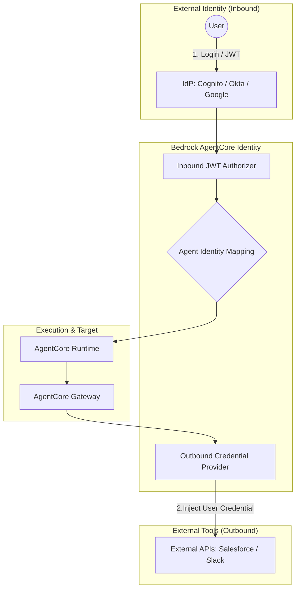

AWS Bedrock AgentCoreにおける **Identity（アイデンティティ）** は、エージェントを利用する「ユーザー」と、エージェントが操作する「外部サービス」の間で、安全に認証情報を橋渡しするための **「エージェント専用の認証・認可マネージャー」** です。

# 概要

- **ユーザー認証の統合:** 既存のIdP（Cognito, Okta, Google等）をそのまま使い、ユーザーを移行させることなくエージェントを利用可能にする。
    
- **認証情報の安全な委譲:** ユーザーがログインした「身分」をエージェントに引き継がせ、ユーザーに代わって外部API（Salesforce, Slack等）を叩かせる。
    
- **クレデンシャル管理の隠蔽:** エージェントのコード内にAPIキーやトークンを直接記述せず、基盤側で安全に注入・更新する。
    
Identityがどのように「入り口（Inbound）」と「出口（Outbound）」を繋いでいるかを示します。

---

- **Inbound JWT Authorizer:** ユーザーがIdPから取得したJWTトークンを検証し、リクエストを正当なものとして受け入れる。
    
- **Agent Identity Mapping:** 外部IdPのユーザー識別子を、AgentCore内の「Agent ID」に紐付ける。
    
- **Outbound Credential Provider:** エージェントが外部ツールを呼ぶ際に、そのユーザーに代わって必要な認証情報（OAuthトークン、APIキー）をGatewayに自動注入する。
    
- **Runtimeへの伝播:** ユーザーの属性情報（部署や役割）をRuntime（エージェント）へ引き継ぎ、Memoryの分離やPolicyの判定に活用する。
    
# 実装のポイント

- **Authorizerの設定:** `CreateInboundJwtAuthorizer` APIを使用して、どのIdP（Issuer）を信頼するかを設定する。
    
- **認証情報の登録:** 外部サービスにアクセスするためのOAuthクライアント情報やAPIキーを、AgentCoreのクレデンシャルストアに事前に登録する。
    
- **コンテキストの自動注入:** エージェント開発者は、コード内で `auth_header` を手動で作成する必要はなく、Gatewayが送信直前に認証情報を自動付加するように構成する。
    
- **マルチテナントの保護:** ユーザーごとに独立した認証情報が提供されるため、エージェントが誤って別のユーザーのデータにアクセスするリスクを構造的に排除する。
    
# まとめ

- **Identityの本質:** エージェントに「誰が操作しているか」という認識を与え、その権限を外部サービスへ安全に橋渡しする仕組み。
    
- **開発者の利益:** 複雑なOAuthフローやトークンのリフレッシュ、APIキーの管理を自前で実装する必要がなくなる。
    
- **ビジネス価値:** 「エージェント自身の権限」ではなく「ユーザー個別の権限」でタスクを実行できるため、最小権限の原則（Least Privilege）をAIの世界でも守ることができる。
    
