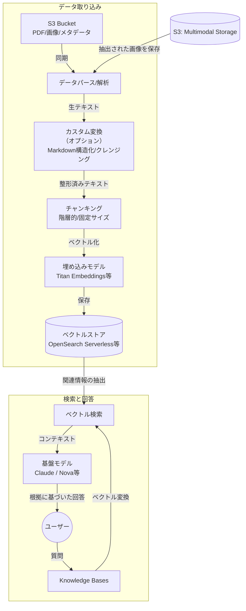

Amazon Bedrock Knowledge Bases は、**RAG（検索拡張生成）** という手法を**ノーコードに近い形で実現するフルマネージドサービス** です。

# 概要

Bedrock Knowledge Bases は、企業独自のデータ（PDF、テキスト、Markdown、画像など）を S3 に置くだけで、自動的に「読み込み・分割・ベクトル化・保存」を行い、LLM（Claude など）がその最新情報を参照して回答できるようにします。

開発者が自前で検索エンジンやベクトルデータベースの複雑な統合コードを書く必要がないのが最大の特徴です。

ここでは、「カスタム変換（Lambda）」を含めた、データの取り込み（Ingestion）から回答生成（Retrieval & Generation）までのフローを示しています。

### データソース (S3)
知識の源泉となるファイルを格納します。ファイルごとの属性を定義するメタデータファイルも併置可能です。
    
### カスタム変換 (Lambda)
標準的なテキスト抽出では崩れてしまう「複雑な表」や「特殊なフォーマット」を、LLM（Claude等）を使って整形してからデータベースへ送ります。
    
### チャンキング & ベクトル化
長い文書を適切な長さ（チャンク）に切り分け、その意味を数値（ベクトル）に変換します。
    
### ベクトルストア
数値化されたデータを高速に検索するための専用データベースです。
    
### RAGエンジン
ユーザーの質問をベクトル化し、データベースから似た意味の情報を探し出して、LLMに「この情報を元に答えて」と指示を出します。
    

# 構成要素

| **構成要素**            | **内容説明**                                               |
| ------------------- | ------------------------------------------------------ |
| **データソース (S3)**     | 知識となるドキュメントを置く場所。今回の場合、ごみ分別PDFを格納。                     |
| **埋め込みモデル**         | テキストを多次元のベクトル（数値）に変換するAI。Titan Text Embeddings 等。      |
| **ベクトルストア**         | 変換されたベクトルを保存・検索する場所。Amazon OpenSearch Serverless が一般的。 |
| **カスタム変換 (Lambda)** | **【重要】** 取り込み時にデータを加工する。今回、PDFのバラバラな行をMarkdownの表にする役割。 |
| **基盤モデル (LLM)**     | 検索結果を元に、人間が読みやすい文章を作成する知能。Claude 3.7 Sonnet 等。         |

# ユースケース

- **自治体のごみ分別・行政案内チャットボット:**
    
    - 複雑なPDF（本件のような品目表）から、サイズや材質に応じた正確な捨て方を案内。
        
- **社内規定・マニュアル検索:**
    
    - 就業規則、経理規定、技術マニュアルなどの膨大な社内文書から、必要な箇所を即座に特定。
        
- **カスタマーサポートの支援:**
    
    - 過去のFAQや修理マニュアルを参照し、オペレーターに対して「回答のドラフト」を提示。
        
- **専門情報の要約とQ&A:**
    
    - 最新の法律文書や医療論文を取り込み、その分野に特化したアドバイスを提供。

# 実装例

『[70-90-021.画像から粗大ごみ判定ープロビジョニング＋](../70.サンプルコード/70-90-021.画像から粗大ごみ判定ープロビジョニング＋.md)』
