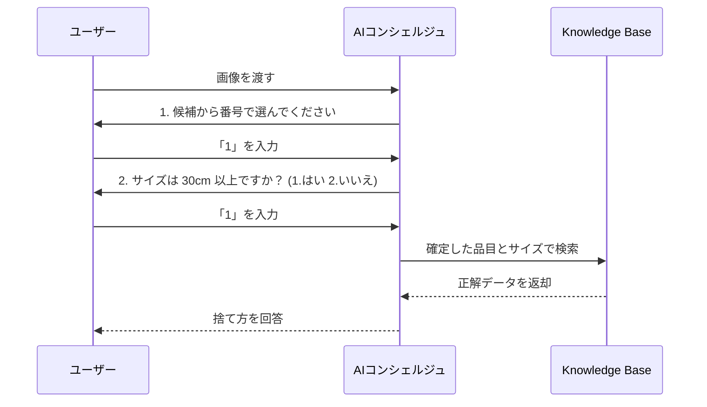

# 検証ユースケース：粗大ごみ受付をAIでアシストする

筆者は東京都足立区在住で、年に2回の**粗大ごみ持ち込み（無料）サービス**を活用しています。  
しかし、**事前のWeb申し込み手続き**に毎回苦労しています。

### 課題点

- 申請時に**正確な品目名が分からない** 
    
- 分かっていても、**PDF資料（10ページ前後）を参照するのが面倒**
    
- 結果として、**途中で挫折し、結局電話で案内員に頼る**ことが多い
	- 実は、Web申し込みは一回も成功してない
    
### 検証アイデア

この課題に対し、以下のような構成で **Amazon Bedrock の Knowledge Base 機能**を活用し、**自然言語で質問できるAIサポートエージェント**を構築・検証してみたいと考えています。

### 技術構成のイメージ

- **ドキュメントソース**：足立区の粗大ごみ品目PDF一覧（例：PDF→テキスト抽出してベクトル化）
    
- **ベクトル検索**：Amazon Bedrock Knowledge Base を利用
    
- **フロント**：自然文で「この椅子は粗大ごみ扱い？」「マットレスは何と分類される？」などと聞ける
    
- **推論**：Claude / TitanなどのLLMで応答生成
    
- **目的**：誰でも迷わず申し込みできる案内システム
    




- **画像解析が主役ではない**: 画像はあくまで「候補を出すため」に使い、最終的な決定はユーザーに**番号**で選ばせます。
    
- **間違いが起きない**: ユーザーが選んだ番号に基づいてKB（ナレッジベース）を引くので、誤判定のまま進むことがありません。
    
- **サイズも番号**: テキスト入力ではなく `1` か `2` を選ばせることで、処理を確実にしています。

# 実装のポイント

### 「Coding不要」でできる範囲（Amazon Bedrock Knowledge Bases を使用）

以下のプロセスは、AWSコンソール上の設定だけで完結します。

- **PDFのベクトル化**: S3に置いたPDFを読み込み、AIが検索しやすい形式（ベクトル）に変換してデータベース（OpenSearch等）に保存する。
- **検索機能のテスト**: AWSコンソール上のテストウィンドウで、質問を投げるとPDFから回答が返ってくるか確認する。
- **プロンプトの設定**: AIに「ごみ分別の専門家として回答してください」といった役割を与える。

これだけで「PDFの内容に基づいて回答するAI」の心臓部は完成します。

### 「Coding（開発）」が必要になる範囲

実際に「システム」として動かすには、以下の部分で少しプログラミングが必要になります。

- **「写真」を送る部分**: ユーザーがアップロードした画像をAI（Novaなど）に渡し、「これは何のごみか？」を特定させる命令を送る処理。
- **処理のつなぎ込み（オーケストレーション）**:

    1. 写真を解析して「電子レンジ」と特定する。
    2. その「電子レンジ」という言葉でRAGに検索をかける。
    3. 両方の結果をまとめてユーザーに表示する。

- **ユーザーインターフェース (UI)**: LINEボットやWeb画面など、ユーザーが写真を送る口を作る部分。

# サンプルコード

[text_to_garbage_info.py]
```
import os
import json
import base64
import boto3
from strands import Agent, tool
from strands.models import BedrockModel

# --- 既存環境の設定 ---
KNOWLEDGE_BASE_ID = "XXXXXXXXXX"
REGION = "us-east-1"
MODEL_ID = "amazon.nova-pro-v1:0"

bedrock_agent_runtime = boto3.client("bedrock-agent-runtime", region_name=REGION)
model = BedrockModel(region_name=REGION, model_id=MODEL_ID)

# --- 1. ユーザーへのカテゴリー質問ツール (New!) ---
@tool
def ask_user_for_item_category():
    """
    画像解析が失敗した場合や不明瞭な場合に、大まかなカテゴリーを番号で選択してもらいます。
    """
    categories = [
        "キッチン用品（鍋・食器など）",
        "生活家電（掃除機・ドライヤーなど）",
        "家具・寝具（椅子・布団など）",
        "プラスチック製品（容器・おもちゃ）",
        "金属・刃物類",
        "その他（自由入力）"
    ]
    
    print("\n[AI] 画像の解析が難しいため、カテゴリーを教えてください:")
    for i, cat in enumerate(categories, 1):
        print(f"  {i}. {cat}")
        
    choice = input(">> 番号を入力してください: ")
    try:
        idx = int(choice) - 1
        if 0 <= idx < len(categories) - 1:
            return f"カテゴリー: {categories[idx]}"
        else:
            return f"ユーザー入力: {input('具体的な品目名を入力してください: ')}"
    except:
        return f"回答: {choice}"

# --- 2. 品目候補の確認ツール ---
@tool
def ask_user_to_confirm_item(candidates_json: str):
    """
    AIが画像から出した複数の候補を提示し、番号で選んでもらいます。
    """
    try:
        # JSONパース
        clean_json = candidates_json.replace("```json", "").replace("```", "").strip()
        data = json.loads(clean_json)
        candidates = data.get("candidates", [])
    except:
        return "候補を読み取れませんでした。手動でカテゴリー選択に移行してください。"

    print("\n[AI] これらの中に該当するものはありますか？")
    for i, item in enumerate(candidates, 1):
        print(f"  {i}. {item}")
    print(f"  {len(candidates) + 1}. どれも違う（自由入力）")

    choice = input(">> 番号を入力してください: ")
    try:
        idx = int(choice) - 1
        return f"確定品目: {candidates[idx]}" if 0 <= idx < len(candidates) else input("正しい名称を入力: ")
    except:
        return f"確定品目: {choice}"

# --- 3. サイズの番号入力確認ツール ---
@tool
def ask_user_about_size(item_name: str):
    """サイズを番号で確認します。"""
    print(f"\n[AI] 「{item_name}」のサイズ（最長辺）を教えてください。")
    print("  1. 30cm以上（粗大ごみの可能性）")
    print("  2. 30cm未満")
    choice = input(">> 番号を選択してください: ")
    return "30cm以上" if choice == "1" else "30cm未満"

# --- 4. RAG検索ツール ---
@tool
def search_garbage_rule(query_text: str):
    """既存のKnowledge Base(3GC22IOMHK)を検索します。"""
    try:
        response = bedrock_agent_runtime.retrieve_and_generate(
            input={'text': query_text},
            retrieveAndGenerateConfiguration={
                'type': 'KNOWLEDGE_BASE',
                'knowledgeBaseConfiguration': {
                    'knowledgeBaseId': KNOWLEDGE_BASE_ID,
                    'modelArn': f'arn:aws:bedrock:{REGION}::foundation-model/{MODEL_ID}'
                }
            }
        )
        return response['output']['text']
    except Exception as e:
        return f"検索エラー: {str(e)}"

# --- 5. 画像解析ツール ---
@tool
def analyze_image_contents(image_path: str):
    """画像解析。失敗した場合はその旨をマネージャーに伝えます。"""
    try:
        with open(image_path, "rb") as f:
            img_b64 = base64.b64encode(f.read()).decode("utf-8")
        
        analyzer_agent = Agent(model=model, system_prompt='{"candidates": ["品目1", "品目2"]} 形式のJSONのみ返せ。')
        return analyzer_agent([
            {"type": "text", "text": "画像からごみの品目候補をJSONで出して。"},
            {"type": "image", "source": {"type": "base64", "media_type": "image/jpeg", "data": img_b64}}
        ])
    except Exception as e:
        return f"ERROR: 画像解析に失敗しました。詳細: {str(e)}"

# --- 6. 統括マネージャー ---
manager = Agent(
    model=model,
    system_prompt="""あなたは「ごみ分別コンシェルジュ」です。
1. `analyze_image_contents` を試す。
2. 失敗、または候補が不明確なら `ask_user_for_item_category` を使い、番号選択で品目を絞り込む。
3. 候補があるなら `ask_user_to_confirm_item` で番号選択させる。
4. 確定後に `ask_user_about_size` でサイズを番号選択させる。
5. 最後に `search_garbage_rule` で検索し、結論を伝える。

※いかなる場合も、AIが勝手に決めず、ユーザーに「番号」で選ばせてください。""",
    tools=[analyze_image_contents, ask_user_for_item_category, ask_user_to_confirm_item, ask_user_about_size, search_garbage_rule]
)

if __name__ == "__main__":
    image_file = "files/gomi_test.jpg"
    print("--- ごみ分別AIコンシェルジュ 起動 ---")
    print(manager(f"画像 {image_file} の捨て方を判定してください。解析に失敗した場合は口頭で質問してください。"))```

# 実行
```

```
python text_to_garbage_info.py
```