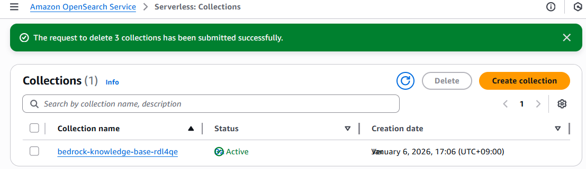
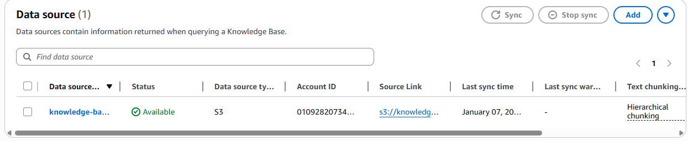
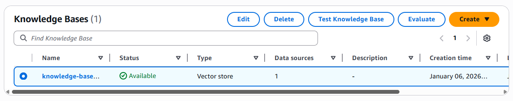
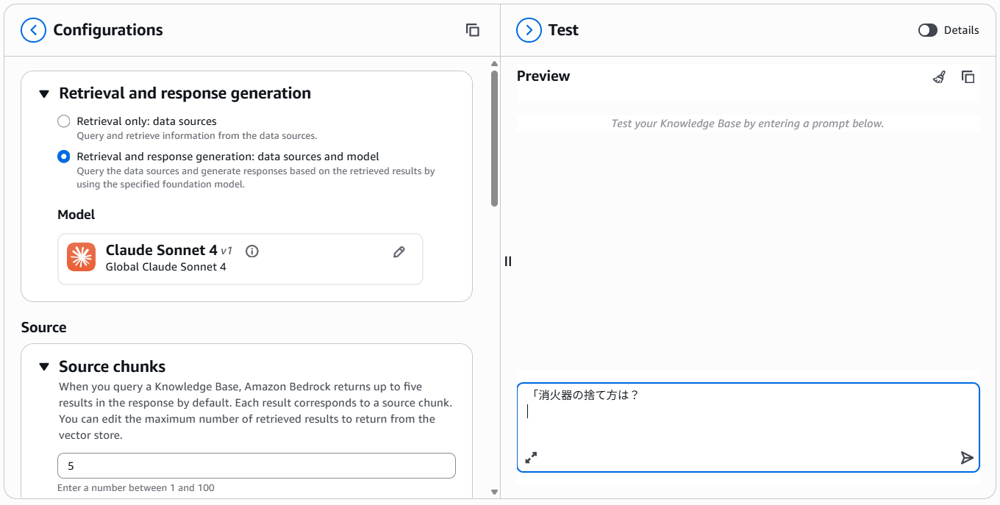

# 事前準備

## S3のバケット作成

- ソースデータの格納先
	- s3://knowledge-base-test-12345/source	
- Lambdaの一時的な作業スペース
	- s3://knowledge-base-test-lambda-temp
- ソースファイルにある画像など中間ファイルの格納先
	- s3://knowledge-base-test-intermerdate
## PDFファイルのアップロード

```
../files/ごみの品目情報.pdf
↓
s3://knowledge-base-test-12345/source/品目情報.pdf
```
## Lambda作成

###  作成手順

- **Function name**: `custom_transformation`
- **Runtime**: Python 3.12
- **Architecture**: x86_64
- **操作**: `Create function` をクリックして作成

### コードをデプロイ

作成した `custom_transformation` 関数を開きます。

以下のようなテンプレートコードを編集画面に貼り付けます：

```
import json
import boto3

bedrock = boto3.client('bedrock-runtime')
MODEL_ID = "us.anthropic.claude-sonnet-4-20250514-v1:0"

def lambda_handler(event, context):
    output_files = []
    
    # Bedrockからの入力構造に合わせてループを回す
    for input_file in event.get('inputFiles', []):
        new_chunks = []
        for chunk in input_file.get('chunks', []):
            raw_text = chunk['content']['text']
            
            try:
                # Markdown変換の呼び出し
                transformed_text = call_bedrock_transformation(raw_text)
                new_chunks.append({
                    "content": {"text": transformed_text},
                    "metadata": chunk.get('metadata', {})
                })
            except Exception as e:
                print(f"Error: {e}")
                new_chunks.append(chunk)
        
        # 変換後のファイルをリストに追加
        output_files.append({
            "fileMetadata": input_file.get('fileMetadata', {}),
            "chunks": new_chunks
        })
            
    return {"outputFiles": output_files}

def call_bedrock_transformation(text):
    body = json.dumps({
        "anthropic_version": "bedrock-2023-05-31",
        "max_tokens": 2048,
        "messages": [
            {
                "role": "user",
                "content": f"以下のごみ分別テキストを、品目、手数料、出し方・注意点がわかるMarkdown表形式に整理してください。解説は不要です：\n\n{text}"
            }
        ]
    })
    
    response = bedrock.invoke_model(modelId=MODEL_ID, body=body)
    response_body = json.loads(response.get('body').read())
    return response_body['content'][0]['text']
```

### 構成設定（Configuration）

1. Lambda 関数の画面を開く（例：`custom_transformation`）
2. 左メニューから **[Configuration] > [General configuration]** を選択
3. **[Edit]** をクリックして以下を設定：
    - **Memory**: `512 MB` ※ディプロトは128MB
    - **Timeout**: `5 minutes` ※ディプロトは3秒
    - → **[Save]** をクリック

### IAM 権限の設定（Permissions）

1. Lambda 画面の **[Configuration] > [Permissions]** に移動
2. 表示されている **[Role name]** をクリック  
    ※ 例：`AmazonBedrockExecutionRoleForKnowledgeBase_52nbq` など
3. IAM ロール画面が開くので、以下を実行：
    - **[Add permissions] > [Attach policies]** をクリック
    - 検索バーで `AmazonS3FullAccess` を検索 ※GetObject,ListBucketが必須
    - チェックを入れて **[Add permissions]** をクリック

# Knowledge Base作成

### Knowledge Base 作成設定

- **Knowledge Base name**: `knowledge-base-quick-start-52nbq`
- **IAM permissions**: Create and use a new service role
- **Service role name**: `AmazonBedrockExecutionRoleForKnowledgeBase_52nbq`
    
### データソース設定

- **Choose data source type**: Amazon S3
- **Data source name**: `knowledge-base-quick-start-cfzef-data-source`
- **Data source location**: This AWS account
- **S3 URL**: `s3://knowledge-base-test-12345/source`

### パース & チャンク設定

- **Parsing strategy**: Amazon Bedrock Data Automation as parser
- **Chunking strategy**: Hierarchical chunking
    - Max parent token size: `1500`
    - Max child token size: `300`
    - Overlap tokens between chunks: `30`（子チャンクの10%）

### トランスフォーメーション関数

- **Lambda function**: `custom_transformation` を選択
- **S3 bucket for Lambda function**: `s3://knowledge-base-test-lambda-temp`  
    　※ Lambda実行のための一時バケット（個別指定が必要）

### 埋め込みモデル設定

- **Embeddings model**: Titan Text Embeddings V2
- **Embeddings type**: Floating-point vector embeddings
- **Vector dimensions**: 1024
    
### ベクトルストア設定

- **Vector store creation method**: Quick create a new vector store
- **Vector store type**: Amazon OpenSearch Serverless
- **Multimodal storage destination**: `s3://knowledge-base-test-12345`  
    　※ イメージ抽出などに必要な一時ストレージ（個別指定）

### 最後に

- **[Next]** をクリック
- **Create Knowledge Base** を実行

Knowledge Base の作成には、**ベクトルストア（`OpenSearch Serverless`）の起動**も含まれています。

この段階では、**中身のベクトルデータはまだ作成されておらず**、「箱（ベクトルストア）」のみが用意された状態です。  
実際のベクトル化は、**Knowledge Base で「シンク（同期）」を実行**したタイミングで行われます。

`Amazon OpenSearch Service > Serverless > Collections` をクリックしてみてください。  
作成された **ベクトルストアのコレクション** を確認できるはずです。




>[注]
>Knowledge Baseを削除してもベクトルストアは自動削除されません。

### Knowledge Baseとベクトルストアのシンク

ベクトルストアにデータをアップロードするには、**シンク処理（同期処理）**が必要です。

1. `My Knowledge Base` を選択
2. `My Data source` を選択
3. `Sync` をクリックして実行
    

これにより、**S3に保存されたPDFファイルが読み込まれ、ベクトル化されてベクトルストアに格納**されます。




### ナレッジベースをテスト

`My Knowledge Base` を選択すると、**`Test Knowledge Base`** 機能を使って、  実際にベクトル検索が機能しているかを確認できます。




ここでは、単純検索より、回答まで作ってもらうことにします。

- **Configurantion.Retrieval and response generation: Retrieval and response generation: data sources and model**
	- **Anthropic.Claude Sonnect 4を選択**





# 用語説明

## データタイプ
### 非構造的なデータ

- **Knowledge Base with vector store**: S3上のデータを自動でベクトル化してOpenSearch等に保存し、低コストかつ柔軟に最新情報を参照した回答（RAG）を実現するフルマネージドサービスです。

- **Kendra GenAI index**: 高性能なエンタープライズ検索エンジンを基盤とし、Office 365やSharePointなど多様な外部ソースの権限管理を維持したまま、セキュアに高度な生成AI回答を提供します。

### 構造的データ

**Structured data store**（構造化データストア）は、Amazon Bedrock Knowledge Basesにおいて、非構造化テキスト（PDFやマニュアル）ではなく、**データベース（RDS/PostgreSQL）上の数値や行データ**をLLMに直接クエリさせるための機能です。

3行で説明すると以下の通りです：

- **データ形式**: SQLデータベース（Amazon RDSやAurora）などの表形式データを対象とし、テキスト検索ではなく「合計」「平均」「条件比較」といった正確な集計を可能にします。
    
- **動作原理**: LLMが自然言語の質問を解釈して適切なSQL文を自動生成（Text-to-SQL）し、データベースに対して直接問い合わせを実行します。
    
- **用途**: 在庫数、売上統計、最新の予約状況など、ベクトル検索では曖昧になりがちな「正確な数値情報」に基づいた回答が必要な場合に最適です。

## ソースデータのタイプ

- Amazon S3
- Web Crawler
- Custom
- Confluence
- Salesforce 
- SharePoint 
## Parsing戦略

###  Amazon Bedrock default parser（デフォルト解析器）

特別な追加料金なしで利用できる標準的な解析機能です。

- **動作**: OCR（光学文字認識）技術を用いて、ドキュメントからテキストを抽出します。
    
- **特徴**: シンプルな文書の読み取りには十分ですが、複雑な表レイアウトや図解が含まれる場合、読み取り順序が崩れたり、表の構造を維持できなかったりすることがあります。
    
- **用途**: テキスト中心の契約書、レポート、マニュアルなど。
    
### Amazon Bedrock Data Automation as parser（データ自動化解析器）

高度なAIを用いて、ドキュメントの「構造」と「マルチモーダル要素（画像・図）」を同時に解析する機能です。

- **動作**: ドキュメント内の表、図、チェックボックスなどの構造を理解したままデータを抽出します。
    
- **特徴**: **「マルチモーダル保存（Multimodal storage）」**と組み合わせて使用し、画像データも抽出しながら、より高精度なデータソースを作成できます。
    
- **用途**: 複雑なレイアウトの申請書、図表が重要な技術資料、スキャンされた低品質な書類。
    
### Foundation models as parser（基盤モデル解析器）

Claudeなどの強力なLLM（基盤モデル）そのものを解析エンジンとして使用する、最もリッチな方法です。

- **動作**: テキスト抽出の段階でLLMを呼び出し、文書の意味を汲み取りながら構造化（Markdown化など）を行います。
    
- **特徴**: **最高精度**ですが、取り込み（Sync）の際にモデル呼び出し料金が発生します。表データを「人間が読むような意味的なまとまり」として整理する力が非常に高いです。
    
- **用途**: 今回のごみ分別表のように、単なる文字抽出ではなく「この手数料はこの品目のものだ」という**意味の紐付け**が不可欠なケース。

## チャンキング戦略

### Default chunking（デフォルト・チャンキング）

AWSが推奨する標準的な設定（通常はFixed-sizeで300トークン程度、オーバーラップ20%）を自動で適用します。

- **特徴:** 迷ったらこれ。汎用性が高く、文書の前後関係をある程度維持しつつ分割します。
    
- **用途:** 一般的なレポートやブログ記事など。
    
###  Fixed-size chunking（固定サイズ・チャンキング）

指定した文字数（トークン数）で機械的に文書を区切ります。

- **特徴:** 前後の文章を少し重ねる（Overlap）ことで、文脈の断絶を防ぎます。
    
- **用途:** 構造が単純な文書。計算が速く、最も一般的に使われます。
    
### Hierarchical chunking（階層的チャンキング）

文書を「親（大まかな内容）」と「子（詳細な内容）」の2層構造で分割します。

- **特徴:** 検索時は「子」を探し、回答生成時は「親」の文脈もLLMに渡します。
    
- **用途:** **今回の「ごみ分別PDF」には最適です。** 「粗大ごみ（親）」というカテゴリの中に、「アイロン」「自転車」などの詳細（子）がある構造を維持できるため、誤回答が減ります。
    
### Semantic chunking（意味的チャンキング）

文字数ではなく、AIが「話の変わり目」を判断して区切ります。

- **特徴:** 文脈のまとまりが非常に綺麗になりますが、取り込み（Sync）に時間がかかり、コストも高めです。
    
- **用途:** 法律文書や技術論文など、一文一文の繋がりが非常に重要な場合。
    
### No chunking（チャンキングなし）

1つのファイルを1つのベクトルとして保存します。

- **特徴:** ファイルが非常に短い（1ページ未満など）場合に適しています。
    
- **用途:** 1件1回答のFAQリストや、短いメモ。

## データ削除ポリシー(Data deletion policy)

### 「Data deletion policy」が `Delete`（デフォルト）の場合

データソース（S3との連携設定）を削除したときの挙動は以下の通りです。

- **ベクトルデータ（中身）**: **削除されます。** ベクトルストアの中から、そのデータソースに紐づくインデックスが消去されます。
    
- **ベクトルストア（箱）**: **削除されません。** OpenSearch Serverless などのデータベース本体は残ります。
    
    - **注意点**: ベクトルストアが残っていると、たとえ中身が空でも**課金が継続**されます。不要になった場合は、別途「OpenSearch Service」のコンソールから「コレクション」を削除する必要があります。

## 変換関数(オプション)

**Transformation function（変換関数）**とは、Amazon Bedrock Knowledge Basesがドキュメントを読み込む際、**「データをベクトル化する直前に、中身を加工・整形するためのLambda関数」**のことです。

## Embedding Models

### Amazon
- Amazon Nova Multimodal Embeddings 1.0
- Titan Embeddings G1 - Text v1.2
- Titan Text Embeddings V2 v2.0

### Cohere
- Embed English v3
- Embed Multilingual v3

## Vector Stores
- Amazon OpenSearch Serverless
- Amazon Aurora PostgreSQL Serverless
- Amazon Neptune Analytics

## エンベデッドタイプとベクトル次元数

「Embeddings type」と「Vector dimensions」の選択は、ナレッジベースの**「記憶の細かさ」**と**「検索スピード・コスト」**のバランスを決める非常に重要なステップです。

今回の「ごみ分別」のような、**似たような言葉（品目）が多く、正確な区別が必要なケース**における推奨設定を解説します。

###  Embeddings type（埋め込み形式）

|**項目**|**Floating-point (浮動小数点)**|**Binary (バイナリ)**|
|---|---|---|
|**精度**|**非常に高い**（推奨）|低い|
|**データの保持**|文脈やニュアンスを詳細に保持|0か1に圧縮するため、詳細が消える|
|**コスト**|ストレージ消費は多いが、今回は微差|ストレージコストを大幅削減|
|**今回の適合度**|◎ 最適|△ 不向き|

- **選ぶべき理由**: ごみ分別データは「植木鉢（プラスチック製）」と「植木鉢（陶器製）」のように、言葉は似ていても出し方が全く異なるデータが密集しています。Floating-point を使うことで、こうした**微細な情報の違い**を正確にベクトル空間上で描き分けることができます。
    
### Vector dimensions（ベクトル次元数）

- **256 / 512**: データが圧縮されるため、検索スピードは速くなりますが、情報の「解像度」が落ちます。
    
- **1024**: 情報の解像度が高くなり、品目名と「30cm以上」「400円」といった付随情報の結びつきをより正確に表現できます。
    

