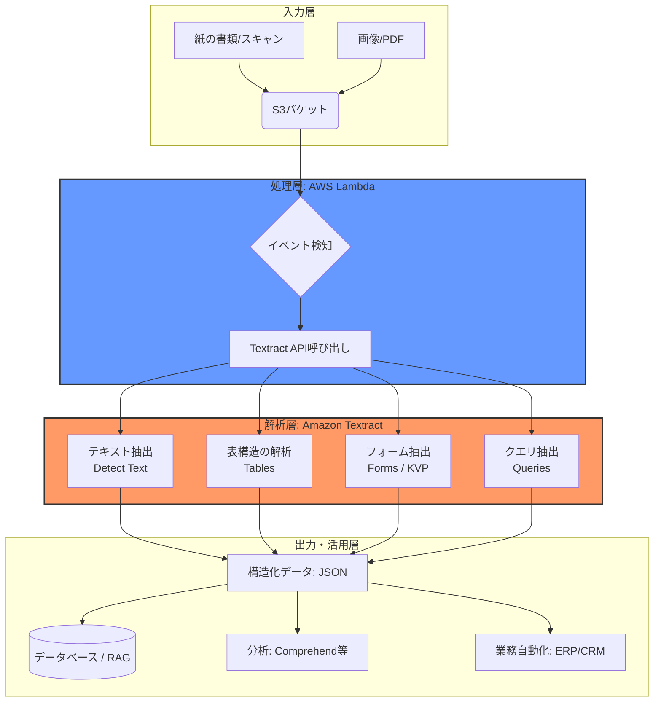

Amazon Textractは、スキャンしたドキュメントからテキスト、手書き文字、およびデータを自動的に抽出する機械学習サービスです。単なるOCR（光学文字認識）を超え、フォームの構造や表のデータを意味のある形で識別できるのが特徴です。

ご提示いただいた資料に基づき、構成要素ごとに説明します。

>[注]
>[81-11.プロビジョニング](81-11.プロビジョニング.md)では、PDFファイルをデータソースとして使用しようとしましたが、パーシングに失敗しました。  
その際に試した手法のひとつが Amazon Textractです。  
ただし今回は、対象のPDFデータが複雑な構造を含んでいたため、期待した精度での抽出はできませんでした。

Textract による処理を通じて、PDF内の情報構造を把握しようとしましたが、対象データの複雑さや形式によってはうまく抽出できないケースもありました。

# 概要

Amazon Textractは、機械学習を用いて、あらゆる種類のドキュメント（PDF、画像など）から手作業なしでデータを抽出するサービスです。

- **インテリジェントな抽出**: テキストだけでなく、表（Tables）やフォームのキーと値のペア（Key-Value Pairs）を構造を維持したまま認識します。
    
- **手書き文字対応**: 印刷された文字だけでなく、手書きの文字も高い精度で抽出可能です。
    
- **カスタム設定不要**: 従来のOCRのように、ドキュメントのレイアウトごとにテンプレートを作成したり、ルールを設定したりする必要がありません。
    

- **入力層 (Input)**: ごみ分別のPDFや領収書、請求書などの非構造化データが **Amazon S3** に保存されます。
    
- **処理層 (Processing)**: **AWS Lambda** が「ファイルが置かれた」ことをトリガーに起動し、オーケストレーターとして Textract に解析命令を出します。
    
- **解析層 (AI Engine)**: ここが Textract の核心部です。単なる文字起こし（OCR）だけでなく、**「表（Tables）」**として行列を認識したり、**「フォーム（Forms）」**として「品目：電子レンジ」のようなキーと値のペア（KVP）を特定したりします。
    
- **出力・活用層 (Output)**: 解析結果は JSON 形式で返され、それを **ベクトルデータベース（RAG）** に入れて検索可能にしたり、他の AI サービス（Amazon Comprehend）に渡して内容の分類や感情分析を行ったりします。
 
#  ユースケース

参照資料に基づく主な活用例は以下の通りです。

- 金融サービス（ローン・住宅ローン審査）:
    
    申請書類、給与明細、税務申告書から氏名や金額などの重要データを数分で抽出し、審査プロセスを迅速化します。
    
- 領収書・請求書の処理:
    
    AnalyzeID や領収書用APIを使用して、ベンダー名、日付、合計金額、税額を自動的に仕分け、経理業務を自動化します。
    
- ヘルスケア（カルテ・保険金請求）:
    
    受診報告書や保険金請求書から患者データを抽出し、元の文脈（どの検査結果がどの数値か）を維持したままデジタル化します。
    
- テキストマイニング（Comprehend連携）:
    
    Textractで抽出したテキストをAmazon Comprehendに渡し、法的文書やカスタマーレビューから特定の名前、地名、製品名、さらには感情（ポジティブ/ネガティブ）を抽出するパイプラインを構築できます。
    
- データ書き出し:
    
    表形式のデータをCSVとしてエクスポートし、Excelなどで即座に利用可能な形に変換します。
    

このように、Amazon Textractは「紙の情報をデジタルのビジネスプロセスに統合する」ための強力な架け橋として機能します。

