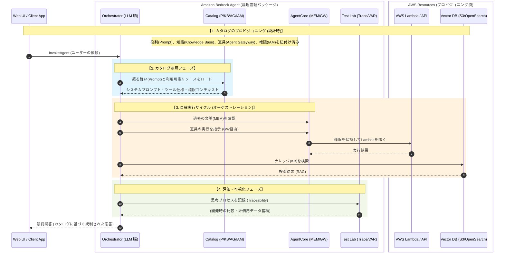

**Amazon bedrockエージェント**は、一言でいえば、**AIエージェントのオーケストレーションサービス**です。

Amazon Bedrock のエコシステムには多様なコンポーネントが存在しており、それぞれを**個別に実装してAIエージェントを開発することも可能**です。ただし、その場合は、**各コンポーネントを統合するためのインターフェースを自前でコーディング**する必要があります。

一方、**Bedrockエージェントを使えば、これらのコンポーネントをまとめて一つのエージェントとして構成・管理・対話**できるようになります。

# 概要

**Amazon Bedrock Agent** は、単なる「プログラムの実行環境（ランタイム）」ではありません。  
むしろ、**AIエージェントを構成するあらゆる関係性を定義し、それらを実行・テスト・管理できる、フルマネージドな管理ユニット** と言えます。

たとえば、あるエージェント構成の一部がプログラムから呼び出された場合でも、そのメンバー（エージェント）は、事前に定義された役割・関係性に従って、自律的に動作します。

もっとも分かりやすいのは **IAMロール** の例です。  
適切な権限が割り当てられていなければ、特定のリソースにはアクセスできず、呼び出しも拒否されます。これは、Bedrock Agent が単なる呼び出し先ではなく、**構成と制御の中枢** であることを示しています。




- **静的なカタログが「動的なコンテキスト」に変わる瞬間 (Step 3-4)** 単なるリスト（カタログ）だったプロンプトやAPI定義が、`InvokeAgent`された瞬間に、LLMが思考するための「前提知識」として一気にロードされます。これが「強化されたカタログ」が実行時に果たす役割です。
    
- **IAMロールによる「境界の強制」 (Step 8-9)** Lambda（L）やVector DB（S3）はAgentの外側にありますが、Agentのカタログに登録されていることで、**「AgentのResource Role」という認可の枠組み**の中で動かされます。権限のないリソースへのアクセスをこのパッケージ境界で封鎖している様子がわかります。
    
- **内包された「テスト環境」 (Step 11-12)** シーケンスの中に **Test Lab** が組み込まれているのが特徴です。実行と同時に `Trace` が記録されるため、開発者は「なぜこのカタログのメンバーが選ばれたのか」を後から一目瞭然に確認（見える化）できます。
    
- **単一窓口による隠蔽 (Step 2 と Step 13)** UI側は `LLM` (Agentのエンドポイント) としか話していません。裏側でカタログが参照され、複雑なリソースが動員されているプロセスはすべてパッケージ内に隠蔽（カプセル化）されています。


#### Bedrock Agentの構成要素一覧

| **構成要素**                      | **ワンライン説明（役割と本質）**                              |
| ----------------------------- | ----------------------------------------------- |
| **Agent Namespace**           | 特定の目的（例：足立区ごみ判定）のために全リソースを束ねる最上位の管理境界。          |
| **Agent Builder Namespace**   | エージェントの「設計図」を定義し、ドラフト版のテストや編集を行う作業領域。           |
| **Agent Resource Role (IAM)** | カタログ内の各リソース（S3/Lambda等）へアクセスするための「公式な通行証」を一括管理。 |
| **Model (LLM)**               | カタログ情報を読み解き、次にどのアクションを取るべきか「思考と計画」を担う中心核。       |
| **Code Interpreter**          | 複雑な計算やデータ加工が必要な際、一時的な砂場でプログラムを自動生成・実行する技能。      |
| **User Input**                | ユーザーからの依頼を受け取り、対話の起点となる情報の入り口。                  |
| **Action Group**              | LambdaやAPIスキーマを登録し、外部システムを操作するための「手足となる道具箱」。    |
| **Memory**                    | 会話の文脈や過去のやり取りを保持し、一貫した対話を実現するための「記憶媒体」。         |
| **Knowledge Base**            | ExcelやPDFなどのドキュメントを検索し、回答の根拠となる「専門知識」を提供する図書館。  |
| **Guardrail**                 | 不適切な回答や機密情報の流出を阻止し、安全な運用を担保するための「防衛線」。          |
| **Orchestration strategy**    | LLMがどのように推論し、ツールを呼び出すかの手順（自律か、半自律か）を制御する方針。     |
| **Multi-agent collaboration** | 複数の専門エージェント間でタスクを分担し、複雑な課題をチームで解決する連携機能。        |

# ユースケース

### カスタマーサポート

- **FAQ自動応答** - 知識ベースと連携した質問応答
- **チケット分類** - 問い合わせ内容の自動振り分け
- **エスカレーション判断** - 人間への引き継ぎ判断

### 社内業務効率化

- **社内文書検索** - RAGによる社内ナレッジ検索
- **経費精算支援** - 申請フォーム自動入力
- **HR問い合わせ** - 休暇・福利厚生の質問応答

### 営業・マーケティング

- **リード分析** - 顧客情報の自動分析・要約
- **提案書作成支援** - 顧客情報に基づく文書生成
- **競合分析** - Web検索と連携した情報収集

### データ分析・レポート

- **SQLクエリ生成** - 自然言語からSQL変換
- **ダッシュボード対話** - データに関する質問応答
- **定期レポート生成** - 自動レポート作成

### ITオペレーション

- **インシデント対応** - 障害情報の収集・分析
- **ランブック実行** - 運用手順の自動実行
- **ログ分析** - CloudWatch連携による調査

### マルチエージェント活用（今回の例）

- **ロールプレイ** - 複数ペルソナによるシミュレーション
- **承認ワークフロー** - 複数部門の判断を統合
- **専門家パネル** - 各分野の視点を統合した回答

# 構成パターン

```
【シンプル】
User → Agent → LLM

【RAG連携】
User → Agent → Knowledge Base → LLM

【ツール連携】
User → Agent → Action Group (Lambda) → 外部API

【マルチエージェント】
User → Supervisor → Sub-agents → LLM
```

# 実装例

[70-90-030.朝まで生テレビーBedrockエージェント版＋](../70.サンプルコード/70-90-030.朝まで生テレビーBedrockエージェント版＋.md)

