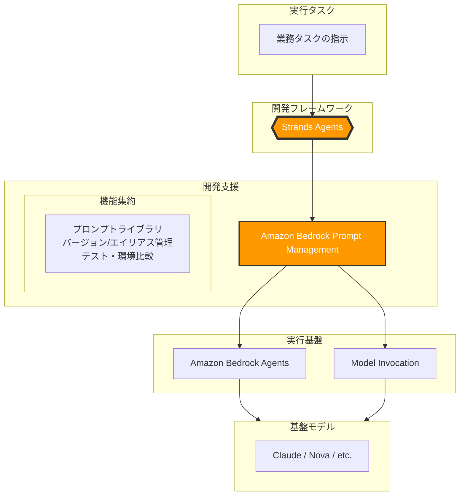

# 概要

Amazon Bedrock Prompt Managementは、AIエージェントの「指示書」であるプロンプトを、アプリケーションコードから完全に分離して管理・運用するための機能です。

これまではソースコード内にハードコーディングされがちだった複雑なプロンプトを、AWS上の独立したリソースとして「作成・テスト・バージョン管理・デプロイ」することができます。これにより、エンジニアだけでなくプロンプトエンジニアや非開発者との共同作業が容易になります。

Prompt Managementは、AIサービスエコシステムの5つのレイヤーにおいて **「開発支援層」** と **「実行基盤層」** の境界に位置し、プロンプトの「資産化」を担います。

- **プロンプトの独立**: アプリケーション（Strands Agents）は、具体的な文章を保持するのではなく、プロンプトの「ID（エイリアス）」を呼び出すだけで済みます。
    
- **シームレスな連携**: 抽出したプロンプトは、そのままBedrock Agentsの指示文として使ったり、単体のモデル呼び出し（Lamba経由など）に利用したりできます。
    
- **一貫したデプロイ**: コードを修正・デプロイしなくても、AWSコンソール側でプロンプトを更新・テストし、エイリアスを切り替えるだけで挙動の変更が可能です。

# Strands Agents との関係

「スパゲッティ状態」を解消するための強力なコンビネーションです。

- **Strands Agents（ロジックの司令塔）**
    
    - エージェントの挙動（どのツールを使い、どの順番で動くか）という**プログラム的なワークフロー**を管理します。
        
- **Prompt Management（言葉の管理者）**
    
    - エージェントが使う「言葉（プロンプト）」を専門に管理します。
        

なぜ併用するのか？

Strands Agentsの中でプロンプトを直接記述してしまうと、プロンプトを微調整するたびにプログラムの修正とデプロイが必要になります。

**「Strands Agentsが、Prompt Managementに格納された特定のバージョンのプロンプトを読み込んで実行する」** という形をとることで、ロジックとメッセージの分離が実現し、保守性が飛躍的に向上します。

# ユースケース

- **A/Bテストの実施**: 新しいプロンプト案を「Draft」としてテスト環境で試し、成果が良い方を「Live」エイリアスに反映させて本番環境の挙動を切り替える。
    
- **マルチモデル対応**: 同じ業務タスクでも、Claude用、Nova用などモデルごとに最適化されたプロンプトを個別に管理し、状況に応じて呼び分ける。
    
- **非エンジニアとの協業**: ドメインエキスパート（業務知識に詳しい人）がAWSコンソール上でプロンプトの文言を磨き、開発者は呼び出し側のコードに専念する。
    
- **Lambdaベースの軽量エージェント**: 重厚なBedrock Agentsを組むまでもない単発の処理において、LambdaからPrompt Managementを呼び出し、一貫した品質のプロンプトを注入する。

