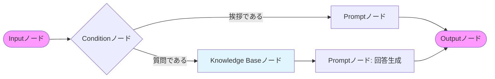

# 概要

Amazon Bedrock Flows（フロー）は、**複数の基盤モデル、プロンプト、ナレッジベース、Lambda関数などを、視覚的なキャンバス上で「線でつなぐ」ことで、複雑な生成AIワークフローをノーコード/ローコードで構築できるオーケストレーション機能**です。

「Bedrockエージェント」が「自律的な思考」を重視するのに対し、Flowsは　**「あらかじめ定義した手順（フロー）」**　を確実に実行させることに特化しています。

---

#### 入力層 (In: Inputノード)

- **役割**: ユーザーからの最初のリクエスト（テキストや質問）を受け取ります。

- **特徴**: ここで受け取ったデータが、後続のすべてのノードへ引き継がれる「出発点」となります。

#### 判断層 (Query: Conditionノード)

- **役割**: 入力内容を解析し、次にどのルートへ進むべきかを**条件分岐**させます。

- **分岐の仕組み**:

    - **「質問である」ルート**: 知識が必要な問いに対し、ナレッジベース検索（KB）へ誘導します。

    - **「挨拶である」ルート**: 検索不要な定型的な対話として、直接プロンプト（Chat）へ誘導します。

#### 知識・検索層 (KB: Knowledge Baseノード)

- **役割**: 「質問である」と判断された場合、関連する社内ドキュメントやマニュアルから情報を検索します。

- **出力**: 質問に対する回答の「根拠となるテキスト（ソース）」を抽出して、次の生成ノードに渡します。

####  推論・生成層 (Chat / Gen: Promptノード)

- **役割**: 最終的な回答文を作成します。

- **Gen (回答生成)**: KBから届いた「根拠」と「質問」を組み合わせ、「事実に基づいた正確な回答」を作成します。

- **Chat (挨拶応答)**: KBを介さず、モデルが持つ知識や設定されたプロンプトだけで「こんにちは」などの返答を作成します。

#### 出力層 (Out: Outputノード)

- **役割**: 生成された最終的な回答をユーザーへ返却します。

# Bedrock Flows の主要コンポーネント

キャンバス上に以下の「ノード」を配置して繋ぎ合わせます。

- **Input/Outputノード**: ユーザーからの入力受け取りと、最終的な回答の返却。

- **Promptノード**: 特定のプロンプトとモデルを組み合わせて実行。

- **Knowledge Baseノード**: RAG（検索拡張生成）を実行し、外部データから情報を取得。

- **Lambdaノード**: 外部APIの呼び出しや、独自のロジック（計算、データ加工）を実行。

- **Conditionノード**: 条件分岐（If-Then）を行い、入力内容に応じてルートを変更。

- **Lexノード**: 音声やチャットのインテント解釈を統合。

# Bedrock エージェントとの違い

もっとも混同しやすいポイントですが、役割が明確に異なります。

|**比較項目**|**Bedrock エージェント (Agents)**|**Bedrock フロー (Flows)**|
|---|---|---|
|**思考プロセス**|**自律的**。目標を与えれば、AIが自分で手順を考えて実行する。|**定型的**。人間が決めた順序（フロー）通りに処理が進む。|
|**制御性**|自由度が高いが、挙動が予測しにくい場合がある。|**制御性が高い**。処理の順番が目に見えるため、確実性が高い。|
|**適した用途**|カスタマーサポート、複雑なタスクの代行。|**業務プロセス自動化（BPA）**、定型的なドキュメント生成。|
|**構築方法**|命令（プロンプト）とツールの定義。|**キャンバス上での視覚的な配置。**|

# なぜ Flows が必要なのか？（メリット）

- 可視化によるデバッグの容易さ:

    - プロンプトの後にどのLambdaが動くのかが「線」で見えるため、開発者以外（ビジネスサイド）もロジックを確認できます。

- プロンプトの連鎖（Prompt Chaining）:

    - 「ステップ1：文章を要約する」→「ステップ2：要約を元に翻訳する」といった、多段階の推論を確実に実行できます。

- サーバーレスな実行基盤:

    - Step Functionsを自分で組むよりも、AIアプリケーションに特化したUIで素早くデプロイできます。

#  討論バトルへの応用例

「朝まで生テレビ」をFlowsで作るなら、以下のような **「定型的な討論サイクル」** を組むのに適しています。

- **Input**: テーマを受け取る。

- **Node A**: パネリストAが意見を出す。

- **Node B**: パネリストBがAの意見に反論する。

- **Node C**: 田原総一朗がまとめ、次の質問を投げる。

- **Condition**: 3往復したか？（NoならNode Aへ戻る、Yesなら終了）
    

# ユースケース
### 多段階の文章作成・校閲（マルチステップ・ライティング）

一つのプロンプトでは難しい、複雑なコンテンツ作成プロセスを自動化します。

- **フローの例**:

    - **ノードA**: 下書き作成（全体の構成案をモデルが作成）。

    - **ノードB**: 事実確認（ナレッジベースを検索して、下書きに嘘がないか照合）。

    - **ノードC**: 表現の調整（SNS用、メール用など、ターゲットに合わせてトーンを変更）。

- **メリット**: ステップを分けることで、出力の精度と安定性が格段に向上します。

### インテリジェントなコールセンター・ルーティング

顧客の問い合わせ内容に応じて、最適な回答ルートを動的に選択します。

- **フローの例**:

    - **Conditionノード**: ユーザーの入力から「苦情」「質問」「解約希望」を判別。

    - **ルート1（質問）**: ナレッジベースから回答を生成して返信。

    - **ルート2（解約）**: Lambdaを起動して顧客DBを照会し、引き止め用の特別オファーを提示。

    - **ルート3（苦情）**: 謝罪文を生成した上で、担当者へメール通知。

- **メリット**: 全てをAI任せにせず、特定の要件（解約など）には定義済みのビジネスロジックを確実に適用できます。

### データ抽出と事後処理のパイプライン

先ほどの「データオートメーション」と組み合わせて、情報の抽出からアクションまでを繋ぎます。

- **フローの例**:

    - **Input**: 請求書のPDF画像。

    - **Data Automationノード**: 金額、品目、振込先を抽出（構造化）。

    - **Conditionノード**: 合計金額が10万円を超えているか判定。

    - **Action**: 10万円以上なら「上長承認フロー」へ、以下なら「自動支払いLambda」へ。

- **メリット**: 非構造化データの読み取りから、基幹システムへの連携までをシームレスに完結できます。

### パーソナライズされた教育・トレーニング

学習者の理解度や回答に合わせて、次に提供するコンテンツを変化させます。

- **フローの例**:

    1. **Promptノード**: クイズを出題。

    2. **Conditionノード**: 回答の正誤を判定。

    3. **ルート（正解）**: 次の難易度の問題へ進む。

    4. **ルート（不正解）**: ナレッジベースから「ヒント」や「解説記事」を抽出して提示。

- **メリット**: 個々のユーザーに最適化された学習体験（アダプティブ・ラーニング）を安価に構築できます。

