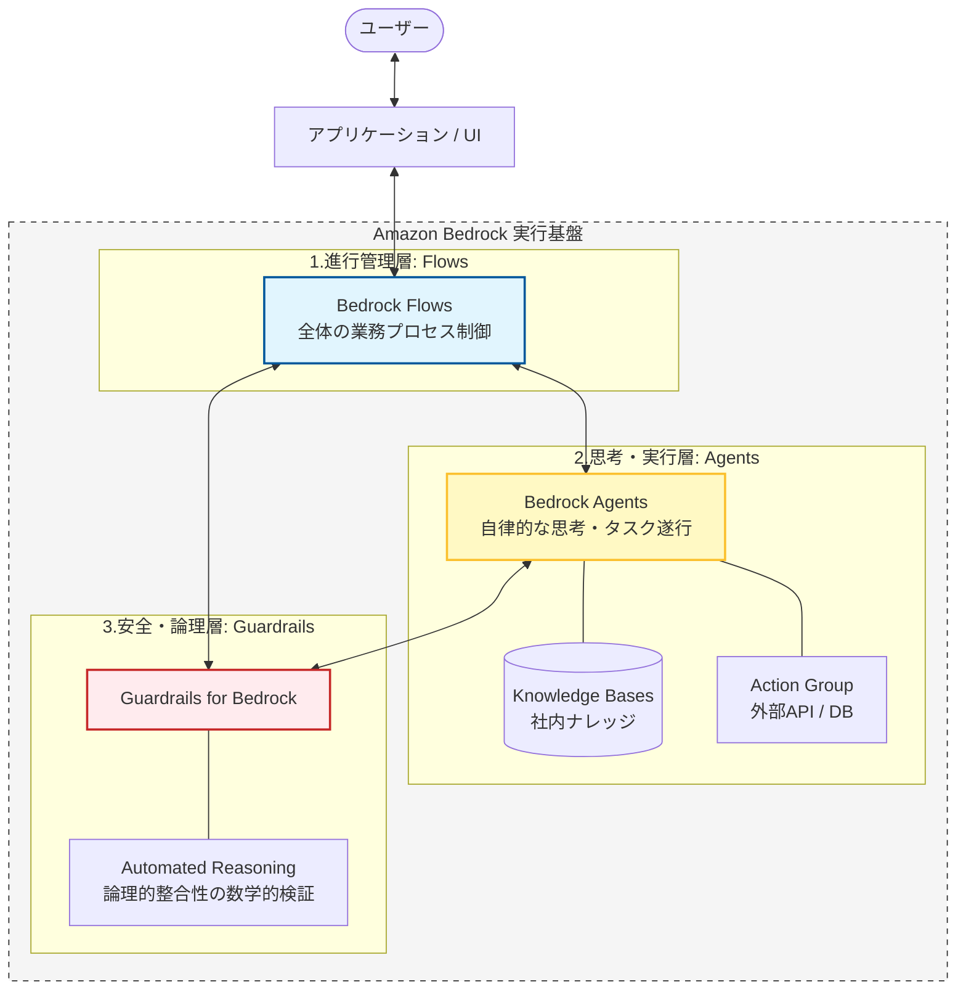

# 概要

Amazon Bedrockの **Automated Reasoning（自動推論）** は、ガードレール機能の一部として提供される最新の高度な検証機能です。

一言でいうと、AIの回答が**「あらかじめ定義した厳格なルールやビジネスロジックに100%適合しているか」を、数学的な検証手法を用いてチェックする機能**です。

#### Bedrock Flows（全体の司令塔）

- **役割**: アプリケーションの「骨組み」です。

- **連携**: ユーザーの入力を受け取り、「まずエージェントに考えさせる」「その後に人間による承認（条件分岐）を入れる」といった**順序**を制御します。

- **メリット**: 全体の処理の流れを可視化し、予測不可能なエージェントの動きを「業務プロセス」の中に閉じ込めます。

#### Bedrock Agents（自律的なワーカー）

- **役割**: 特定のタスクを「どうこなすか」を考える「脳」です。

- **連携**: Flowsから「このデータを分析して」と指示を受け、ナレッジベース（KB）を検索したり、Lambdaを介して外部システムを操作したりします。

- **メリット**: 全ての手順をFlowsで書かなくても、曖昧な指示を具現化してくれます。

#### Guardrails / Automated Reasoning（安全と論理の番人）

- **役割**: 出入りする全ての情報を監視する「フィルター」です。

- **連携**:

    - **Guardrails**: 誹謗中傷や個人情報をブロック。

    - **Automated Reasoning**: エージェントが算出した数値がビジネスルール（例：割引率の最大値など）に反していないかを数学的にチェック。

- **メリット**: AI特有の「嘘（ハルシネーション）」や「論理矛盾」を、最終回答として出す前に確実に阻止します。

# 特徴

### 従来のガードレールとの違い

これまでのガードレールは「LLM（確率統計）」を使って「この発言は有害っぽいか？」を判断していましたが、Automated Reasoningは **「形式手法（Formal Methods）」** という数学的なアプローチをとります。

| **特徴**      | **従来のガードレール（Content Filter等）** | **Automated Reasoning（自動推論）** |
| ----------- | ------------------------------ | ----------------------------- |
| **判定方法**    | 確率・統計（AIによる推測）                 | **数学的証明・論理的検証**               |
| **精度**      | 曖昧さが残る（誤検知の可能性）                | **極めて厳格（Yes/Noが明確）**          |
| **向いている用途** | ヘイトスピーチ、不適切な表現の抑制              | **数値計算、規約遵守、複雑な論理整合性**        |

###  何ができるのか？（主な機能）

具体的には、モデルの回答が以下のルールに違反していないかを、実行時にリアルタイムで検証します。

- 数値情報の正確性チェック:

    - 「割引率は10%以内」というルールに対し、AIが計算ミスをして「15%割引です」と回答した場合、それを瞬時にブロックします。

- ビジネスルールの強制:

    - 「Aプランの顧客にはBのオプションは提案してはいけない」といった、複雑なIF-THEN形式のビジネスロジックとの矛盾を検知します。

- ハルシネーションの数学的封じ込め:

    - ナレッジベースから引用した数値データと、回答内の数値が論理的に一致しているかを厳密に照合します。

### なぜ「朝まで生テレビ」のような討論に役立つのか？

討論バトルにおいて、以下のような「議論の破綻」を防ぐために有効です。

- 統計データの矛盾防止:

    - パネリストAが「日本の人口は1億人だ」と言い、その後で「そのうち若者が2億人だ」というような、論理的にあり得ない矛盾（$1 < 2$ の矛盾）を自動で弾けます。

- 一貫性の維持:

    - 冒頭で「増税反対」と言ったパネリストが、論理的な経緯なしに直後に「増税すべきだ」と正反対のことを言う（自己矛盾）のを、論理チェックで防ぐことができます。

### 4. 実装イメージ（Cedarポリシー）

この機能の裏側では、AWSが開発したポリシー言語 **「Cedar」** が使われることが一般的です（Amazon Verified Permissionsなどと同様の仕組み）。

- **ルール定義**: 「回答に含まれる金額は、見積書（ソース）の合計額を超えてはならない」という論理式を定義。
    
- **検証**: AIが回答を生成した瞬間、Automated Reasoningエンジンがその回答をスキャン。
    
- **遮断**: 論理式に違反（矛盾）があれば、ユーザーに届く前に「Blocked Message」に差し替え。
    

### 注意点：使い分けのコツ

- 処理の重さ:

    - 通常のフィルタよりも高度な計算を行うため、非常に長い文章の全数チェックには向かない場合があります。重要な数値や、絶対に外せないビジネスルールに絞って適用するのがベストです。

- 設定の難易度:

    - 自然言語で「なんとなく」設定するのではなく、論理的なルールを明確に言語化して設定する必要があります。

# ユースケース

Amazon Bedrockの **自動推論 (Automated Reasoning)** は、「AIがもっともらしい嘘（ハルシネーション）をつく」という最大のリスクを、**「数学的な証明」** によって封じ込めるための機能です。

単なる「それっぽさ」ではなく、**厳密な論理整合性**が求められるシーンで真価を発揮します。具体的な4つのユースケースを整理しました。

### 金融・税務：複雑な計算と数値ルールの順守

AIによるローン審査や税額計算の回答が、法的・社内規定上の「計算式」や「制限値」に違反していないかを検証します。

- **具体的な処理**:

    - AIが提案した「特別割引後の金利」が、規定の「最低金利 $x.x\%$」を下回っていないかを数学的に照合。

    - 複数の控除を適用した後の合計額が、元の所得額を上回る（論理的破綻）のを阻止。

- **メリット**: AIの計算ミスによるコンプライアンス違反や金銭的損失を未然に防ぎます。

### 公共・法務：法規やガイドラインとの一貫性チェック

数千ページに及ぶガイドラインに基づいた回答をする際、前後の文脈や法的定義と矛盾がないかを確認します。

- **具体的な処理**:

    - 「Aという条件下ではBは禁止」というルールがある際、AIが「Aの場合でもBは可能です」と回答する矛盾を検知。

    - 契約書ドラフトの生成において、第3条の定義と第15条の制限事項が論理的に衝突していないかを検証。

- **メリット**: 「担当者（AI）によって言うことが違う」「矛盾した指示を出す」といったリスクを排除します。

### 3. 製造・エンジニアリング：設計仕様と安全基準の検証

製品のスペックや安全基準に関する問い合わせに対し、物理的な法則や設計限界を超えた回答をしないよう監視します。

- **具体的な処理**:

    - 「最大耐荷重 $500\text{kg}$」の製品に対し、AIが「$600\text{kg}$までなら安全です」と回答するのを遮断。

    - 複数の部品の組み合わせにおいて、物理的な干渉や仕様上の不適合（例：電圧の不一致）を見逃さずに指摘。

- **メリット**: 物理的な事故に繋がるような、AIの「知ったかぶり」による誤情報を確実に止めます。

### 医療・ヘルスケア：投与量や禁忌（ダメな組み合わせ）の確認

医学的なナレッジベースに基づき、処方やアドバイスが「論理的な禁忌事項」に触れていないかを二重チェックします。

- **具体的な処理**:

    - 「患者の年齢が$12$歳未満の場合、薬Aは投与不可」という論理式に対し、AIが子供向けに薬Aを推奨するのをブロック。

    - ナレッジベースにある「成分Aと成分Bの同時摂取は危険」という情報を、論理エンジンが常に監視。

- **メリット**: 人命に関わる判断において、AIの推論プロセスに「数学的な安全網」を敷くことができます。
    
### 従来のガードレールとの使い分け（まとめ）

- **通常のガードレール（Content Filter）**: 「暴力的な言葉」「差別用語」など、**ニュアンスや感情**に基づくフィルタリング。

- **自動推論（Automated Reasoning）**: 「$A > B$」「$A$ ならば $B$ は偽」など、**数式や論理式**に基づく厳格な検証。

