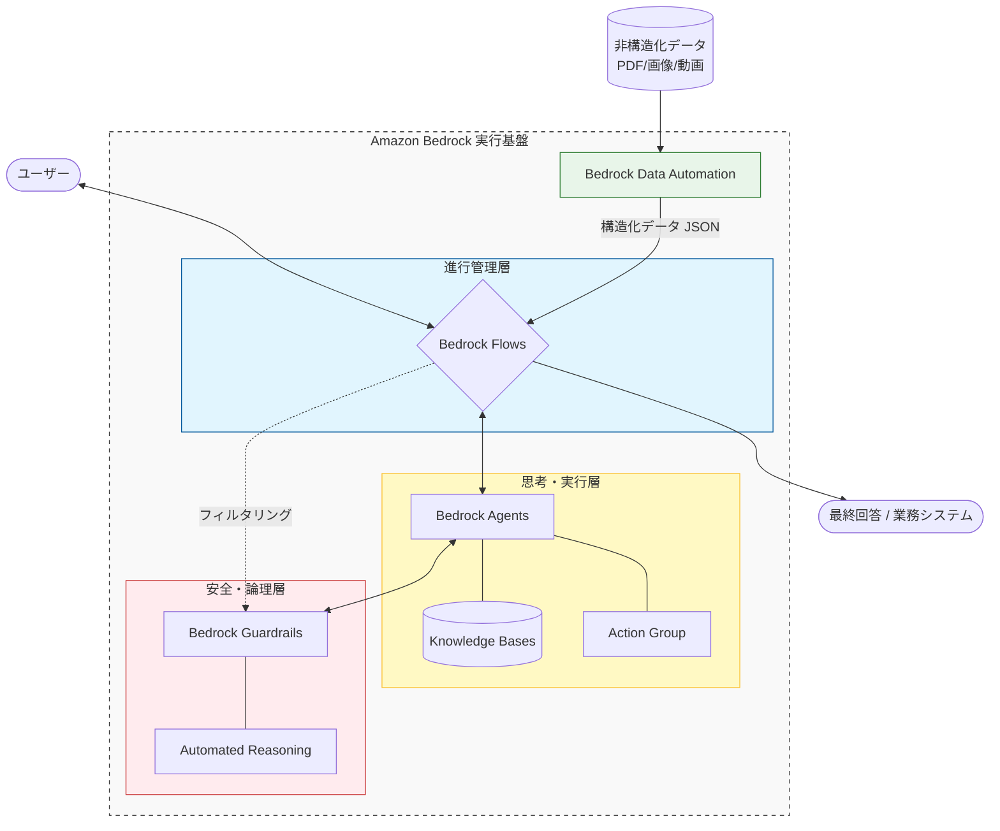

# 概要

Amazon Bedrock **データオートメーション (Data Automation)** は、PDF、画像、音声、動画などの **「非構造化データ」から、ビジネスで利用可能な「構造化データ」を自動的に抽出・変換する**ためのマネージドな自動化パイプラインです。

これまでのOCR（文字認識）や個別のAIモデルを組み合わせる手法に比べ、**マルチモーダル・モデル（テキスト・画像・動画を同時に理解するAI）**をベースにしているため、複雑なレイアウトの書類でも人間のように理解してデータ化できるのが特徴です。

-

- **データの入り口 (Data Automation)**: バラバラな形式の資料（PDFや動画など）を、AIが使える「きれいなデータ（JSON）」に変換します。これが全体の「燃料」になります。

- **全体の指揮 (Flows)**: 「データが届いたらエージェントに渡し、その後に承認へ回す」といった**「仕事の順番」**を管理します。

- **現場の判断 (Agents)**: Flowsから指示を受けて、ナレッジベースを調べたり外部システム（Lambda）を操作したりして、具体的なタスクを片付けます。

- **安全の確保 (Guardrails & Automated Reasoning)**: エージェントが「間違ったこと」や「危ないこと」を言っていないか、数学的・論理的にチェックして、ユーザーに届く直前で守ります。

# 特徴

### 主な機能と役割

このサービスは、以下のプロセスをワンストップで提供します。

- **マルチモーダル抽出**: 請求書のレイアウト、手書き文字、グラフ、動画内のシーンなど、形式を問わず情報を読み取ります。

- **カスタムスキーマ定義**: 「この書類から『合計金額』と『振込先』だけを抜き出す」といった独自のデータ構造（JSON形式など）を定義できます。

- **データのクレンジングと変換**: 抽出したデータを、既存のデータベースや業務システムですぐに使える形に整形します。

### 他のサービス（Textract等）との違い

AWSには従来から `Amazon Textract` などの抽出サービスがありますが、データオートメーションは「生成AI」を活用することで、より高度な判断が可能になっています。

|**特徴**|**Amazon Textract (従来型)**|**Bedrock データオートメーション (生成AI型)**|
|---|---|---|
|**得意分野**|定型フォーマット、文字の正確な読み取り|**非定型、複雑な文脈理解、動画・音声の解析**|
|**設定方法**|座標指定やルールの定義が必要な場合がある|**「何を抜き出すか」を自然言語で指示できる**|
|**対応データ**|主にドキュメント（PDF/画像）|**画像、動画、音声、テキストなどマルチモーダル**|
|**推論能力**|文字をそのまま読み取る|**「この備考欄は値引きを意味するか？」等の推論が可能**|

### 技術的実装の3ステップ

データオートメーションは、主に以下の3つのコンポーネントで構成されます。

- Blueprints（ブループリント）:

	- 抽出したいデータの定義図（スキーマ）です。例えば「領収書用」「契約書用」など、データの型を定義します。

- Projects（プロジェクト）:

    - ブループリントを管理し、どのモデル（Novaなど）を使用して処理を行うかを設定するコンテナです。

- Data Automation Jobs（ジョブ）:

    - 実際にS3上のファイルを読み込み、変換を実行するタスクです。

### 全体構成における位置づけ

以前解説した **Flows / Agents** と組み合わせることで、以下のような高度な自動化が可能になります。

- **Flows** がS3へのファイル保存を検知。

- **Data Automation** がファイルを解析して構造化データ（JSON）に変換。

- **Agents** がそのデータを元に、「予算を超過していないか」を判断。

- **Guardrails** が不適切な情報の露出を防ぐ。

# ユースケース

Amazon Bedrock **データオートメーション (Data Automation)** の真価は、従来のOCR（文字認識）では対応しきれなかった「複雑なレイアウト」「動画・音声」「高度な文脈理解」が必要なシーンで発揮されます。

具体的な4つの主要なユースケースを整理しました。

### 金融・保険：複雑な非定型書類の自動査定

保険金の請求書や、世界中の銀行から届く多種多様なフォーマットの財務諸表を解析します。

- **具体的な処理**:

    - 病院ごとに異なる診断書のレイアウトから、特定の病名や入院期間を抽出。

    - 手書きの修正が入った領収書の内容を正しく読み取り、合計金額と照合。

- **メリット**: 人手による入力作業を大幅に削減し、支払いまでのリードタイムを短縮。

### サプライチェーン・製造：グローバルな物流伝票の構造化

多言語で書かれ、汚れや歪みがある物流伝票やパッキングリストからデータを抽出します。

- **具体的な処理**:

    - 写真に撮った歪んだ送り状から、荷物追跡番号（Tracking ID）や配送先住所を特定。

    - 製品仕様書（スペックシート）から、数値データ（重量、耐熱温度など）を抜き出し、在庫管理システムへ自動登録。

- **メリット**: 現場のモバイル端末で撮影した画像から、リアルタイムでシステム連携が可能。

### メディア・エンターテインメント：動画・音声コンテンツのメタデータ生成

大量のアーカイブ映像や音声データの内容を「機械が検索できる形」に変換します。

- **具体的な処理**:

    - 動画を解析し、「誰が」「いつ」「どんな場所で」「何について話しているか」をタイムコード付きでテキスト化。

    - スポーツ中継の映像から、特定の選手が決めたゴールのシーンだけを特定し、要約説明を生成。

- **メリット**: 膨大な映像資産の中から、必要なシーンを数秒で検索・再利用できるようになる。

### 法務・コンプライアンス：契約書や規約の重要条項抽出

数百ページに及ぶ契約書や法的文書から、リスクとなる項目を抜き出します。

- **具体的な処理**:

    - 大量の契約書から「賠償責任の制限」や「有効期限」に関する条項を抽出し、一覧表（JSON）に変換。

    - 社内規定と照らし合わせ、規定に違反する表現が契約書内に含まれていないかを推論。

- **メリット**: 弁護士や法務担当者がチェックすべき箇所を事前に絞り込み、レビュー効率を劇的に向上。