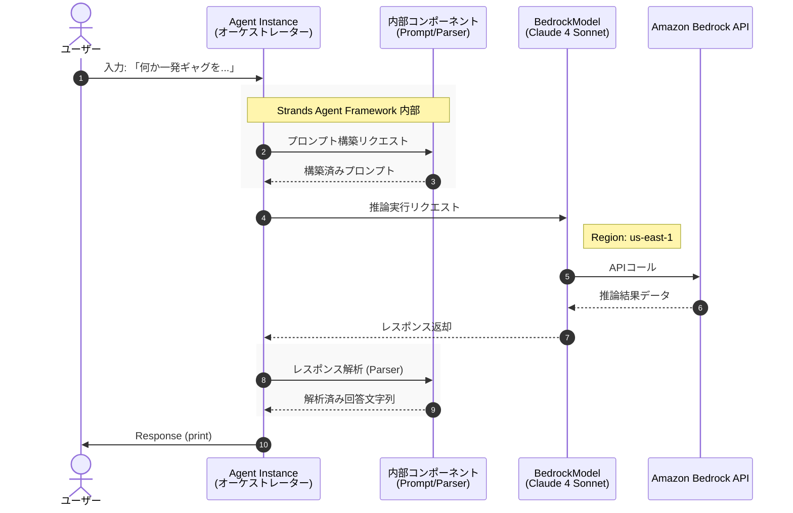

# 概要

この構成は最もシンプルな「**Single Agent**」構成です。
ここに `tools=[]` 引数を追加して関数を渡せば、エージェントが自律的に外部APIを叩く「**Tool Use（ReAct）**」構成へと拡張できるのがStrandsの設計の特徴です。





#### 受付と準備（Strands Agent Framework）

ユーザーから「何か一発ギャグを...」という入力が入ると、**Agent Instance（オーケストレーター）**が司令塔として動き出します。

- **プロンプト構築:** そのままAIに投げるのではなく、内部でAIが理解しやすい「命令書」の形に整えます。

#### 推論の実行（Model Provider / Bedrock）

整えられた命令が、**Amazon Bedrock**上のAIモデル（Claude 4 Sonnet）へ送られます。

- **Configuration:** リージョン（us-east-1）や使用するモデルの種類など、あらかじめ設定されたルールに従ってAPI経由で推論が行われます。

#### 解析と回答（Response）

AIから返ってきた複雑なデータ（推論結果）を、そのままユーザーに出すのではなく、再度エージェント内部で処理します。

- **レスポンス解析:** 不要なデータを取り除き、純粋な「回答文字列」だけを抽出します。

- **出力:** 最終的に、整理された回答がユーザーの画面に表示（print）されます。
 
# サンプルコード
[first-agent.py]
```
from strands import Agent
from strands.models.bedrock import BedrockModel

bedrock_model = BedrockModel(
    region_name="us-east-1",
    model_id="us.anthropic.claude-sonnet-4-20250514-v1:0",
    # callback_handler=None,
)

agent = Agent(
    model=bedrock_model
)

response = agent("何か一発ギャグを教えてください。")
print(response)
```

# 実行
```
python first-agent.py

なぜコンピューターは風邪をひかないのでしょうか？

ウイルス対策ソフトがあるからです！
```


