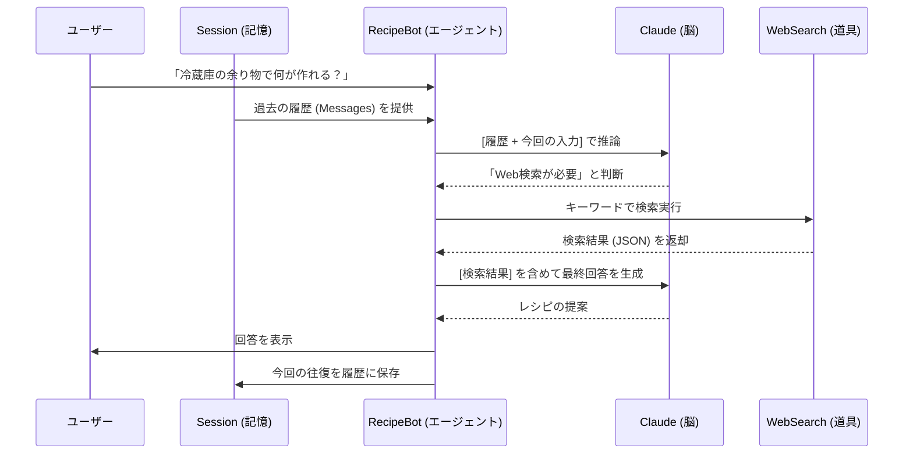

# 概要

このコードは、Strands SDKにおけるシングルエージェントの定義である「脳(LLM)・道具(Tool)・記憶(Session)」を完全に体現しています。

1. 脳（LLM）：推論と判断の中枢 中枢には Amazon Bedrock 上の Claude を採用しています。ユーザーの「何が作れる？」という抽象的な問いに対し、現在の状況を分析して「検索が必要か」「どのキーワードで調べるべきか」を論理的に判断します。

2. 道具（Tool）：現実世界へのアクセス（WebSearch） 外部情報の取得には DDGS（DuckDuckGo Search） を利用しています。Strands におけるツールの実装は非常にシンプルで、メソッドに @tool デコレータを付けるだけです。エージェントは関数の説明文（docstring）を読み取り、そのツールが必要な場面を自律的に判断して呼び出します。

3. 記憶（Session）：文脈の維持と情報の蓄積 本コードの最大の特徴は、Sessionクラスによる明示的な記憶管理です。 単なる一問一答（シンプルエージェント）とは異なり、これまでの会話履歴を invocation_state として保持しています。これにより、「さっきのレシピに鶏肉を追加して」といった、過去の文脈に依存した高度なリクエストにも正確に応えることができます。

この構成は、推論と行動を繰り返す 「Tool Use（ReAct）」パターン に、永続的な 「ステート管理」 を組み合わせたものです。脳が考え、道具が動き、記憶がそれらを繋ぐ。この3要素が一つに統合されることで、AIは単なるテキスト生成器を超え、実務を完遂する「自律した個体」として機能します。

>このサンプルコードは、**「脳（LLM）」・「道具（Tool）」・「記憶（Session）」**　という3大要素を備えているシングルエージェントの例です。





### 明示的な「コンテキスト注入」
invocation_state={"messages": session.get_messages()} の部分が重要です。LLMは本質的にステートレス（過去を忘れる）ですが、実行のたびに過去の履歴を「現在の文脈」として再注入することで、擬似的に継続した記憶を持たせています。

### 思考と実行のループ
Agentクラスの内部では、LLMの「検索すべき」という判断を受け取り、自動的にwebsearch関数を呼び出しています。開発者がif result == "search":といった条件分岐を書く必要がなく、AIが自律的に道具（Tool）を選択・実行する「エージェント・ループ」が成立しています。

### ステートの外部管理
この実装では、記憶（Session）をエージェントの外部で管理しています。これにより、特定のユーザーとの会話をデータベースに保存したり、別のセッションに切り替えたりすることが容易になり、エンタープライズ用途に耐えうる拡張性が確保されています。


# サンプルコード

[recipe_bot.py]
```
# Import Agent and tools
import logging
import json
from ddgs import DDGS
from ddgs.exceptions import DDGSException, RatelimitException
from strands import Agent, tool

# Configure logging
logging.getLogger("strands").setLevel(logging.INFO)

# Define a websearch tool
@tool
def websearch(keywords: str, region: str = "us-en", max_results: int = 5) -> str:
    """最新情報を取得するには、Web を検索してください。
    Args:
        keywords: 検索キーワード。
        region: 検索地域: wt-wt, us-en, uk-en, ru-ru など。
        max_results: 返す結果の最大数。
    Returns:
        JSON文字列形式の検索結果。
    """
    try:
        results = DDGS().text(keywords, region=region, max_results=max_results)
        return json.dumps(results, ensure_ascii=False) if results else "結果が見つかりませんでした。"
    except RatelimitException:
        return "レート制限エラー: しばらく待ってから再試行してください。"
    except DDGSException as d:
        return f"DuckDuckGo検索エラー: {d}"
    except Exception as e:
        return f"エラー: {e}"

from strands.models.bedrock import BedrockModel

# Session class - 会話履歴(記憶の最小構成要素)
class Session:
    def __init__(self):
        self.messages = []
    
    def add_message(self, role: str, content: str):
        self.messages.append({"role": role, "content": content})
    
    def get_messages(self):
        return self.messages

bedrock_model = BedrockModel(
    region_name="us-east-1",
    model_id="us.anthropic.claude-sonnet-4-20250514-v1:0",
)

# Create a recipe assistant agent
recipe_agent = Agent(
    model=bedrock_model,
    system_prompt="""あなたは、カリスマの料理アシスタント「RecipeBot」です。
    ユーザーが食材に基づいてレシピを検索したり、料理に関する質問に答えたりできるようサポートします。
    ユーザーが食材について言及したときにレシピを検索したり、料理情報を調べたりするには、ウェブ検索ツールを使用します。""",
    tools=[websearch],
)

if __name__ == "__main__":
    print("\n👨‍🍳 RecipeBot: レシピや料理について聞いてください!終了するには「exit」と入力してください。\n")
    
    # Session初期化(会話履歴の記憶)
    session = Session()
    
    # Run the agent in a loop for interactive conversation
    while True:
        user_input = input("\nYou > ")
        if user_input.lower() == "exit":
            print("Happy cooking! 🍽️")
            break
        
        # 会話履歴を渡して実行
        response = recipe_agent(
            user_input, 
            invocation_state={"messages": session.get_messages()}
        )
        
        # 履歴に保存
        session.add_message("user", user_input)
        session.add_message("assistant", response)
        
        print(f"\nRecipeBot > {response}")
        
```


# 実行

```
uv pip install ddgs
```

```
python recipe_bot.py


👨‍🍳 RecipeBot: レシピや料理について聞いてください!終了するには「exit」と入力してください。

You > 卵とネギがある。
卵とネギを使った美味しいレシピを検索してみますね！
Tool #1: websearch
卵とネギがあるなら、とても美味しい料理がたくさん作れますね！検索結果から、人気のレシピをご紹介します：

## 🍳 おすすめレシピ

### 1. **ふわふわ卵ねぎ炒め**（一番人気！）
- 卵をふわふわに炒めて、ネギの香ばしさと合わせるシンプルで美味しい一品
- 調理時間：約10分
- しょうゆベースのシンプルな味付けで素材の味を活かします

### 2. **長ネギのチヂミ**
- 卵とネギを使った韓国風パンケーキ
- パパッと作れて、おつまみにも最適

### 3. **焦がしねぎチャーハン**
- ネギを焦がして香ばしさをプラス
- 卵でパラパラに仕上げる本格的なチャーハン

### 4. **長ねぎと卵のスープ**
- 優しい味わいで温まる一品
- あと一品欲しい時にぴったり

### 5. **ネギ入り卵焼き**
- お弁当のおかずにも使える定番レシピ

## 📝 基本の作り方（卵ねぎ炒め）
1. 卵を溶きほぐして塩で味を調える
2. 中華鍋を煙が出るまで熱し、油を入れて卵を一気に流し込む
3. ふわっとしたら取り出し、同じ鍋でネギを焦げ目がつくまで炒める
4. しょうゆを加え、卵を戻してさっと混ぜて完成

どのレシピに興味がありますか？詳しい作り方をお知らせしますよ！
RecipeBot > 卵とネギがあるなら、とても美味しい料理がたくさん作れますね！検索結果から、人気のレシピをご紹介します：

## 🍳 おすすめレシピ

### 1. **ふわふわ卵ねぎ炒め**（一番人気！）
- 卵をふわふわに炒めて、ネギの香ばしさと合わせるシンプルで美味しい一品
- 調理時間：約10分
- しょうゆベースのシンプルな味付けで素材の味を活かします

### 2. **長ネギのチヂミ**
- 卵とネギを使った韓国風パンケーキ
- パパッと作れて、おつまみにも最適

### 3. **焦がしねぎチャーハン**
- ネギを焦がして香ばしさをプラス
- 卵でパラパラに仕上げる本格的なチャーハン

### 4. **長ねぎと卵のスープ**
- 優しい味わいで温まる一品
- あと一品欲しい時にぴったり

### 5. **ネギ入り卵焼き**
- お弁当のおかずにも使える定番レシピ

## 📝 基本の作り方（卵ねぎ炒め）
1. 卵を溶きほぐして塩で味を調える
2. 中華鍋を煙が出るまで熱し、油を入れて卵を一気に流し込む
3. ふわっとしたら取り出し、同じ鍋でネギを焦げ目がつくまで炒める
4. しょうゆを加え、卵を戻してさっと混ぜて完成

どのレシピに興味がありますか？詳しい作り方をお知らせしますよ！


You > いまのカロリは
先ほど検索した結果から、**ふわふわ卵ねぎ炒め**のカロリー情報がありました：

## 🔥 カロリー情報
**ふわふわ卵ねぎ炒め：163kcal**（1人分）

ただし、他のレシピのカロリー情報も詳しく調べてみますね！
Tool #2: websearch
## 🔥 各レシピのカロリー情報

### **卵ネギ料理のカロリー一覧**

1. **ふわふわ卵ねぎ炒め：163kcal**（1人分）
   - 比較的ヘルシーで軽い一品

2. **卵ネギチャーハン：約400-650kcal**（1人分）
   - 一般的なチャーハン：646kcal（399g）
   - 100gあたり：162kcal
   - ご飯の量によって大きく変わります

3. **長ネギのチヂミ：約200-300kcal**（推定・1人分）
   - 小麦粉と卵が主体なので中程度のカロリー

4. **長ねぎと卵のスープ：約80-120kcal**（1人分）
   - 最もヘルシーな選択肢

## 📊 カロリー比較（低い順）
1. **スープ** - 80-120kcal 🟢
2. **卵ねぎ炒め** - 163kcal 🟢
3. **チヂミ** - 200-300kcal 🟡
4. **チャーハン** - 400-650kcal 🔴

ダイエット中でしたら、**卵ねぎ炒め**や**スープ**がおすすめです！どちらも美味しくて満足感もありますよ 😊
RecipeBot > ## 🔥 各レシピのカロリー情報

### **卵ネギ料理のカロリー一覧**

1. **ふわふわ卵ねぎ炒め：163kcal**（1人分）
   - 比較的ヘルシーで軽い一品

2. **卵ネギチャーハン：約400-650kcal**（1人分）
   - 一般的なチャーハン：646kcal（399g）
   - 100gあたり：162kcal
   - ご飯の量によって大きく変わります

3. **長ネギのチヂミ：約200-300kcal**（推定・1人分）
   - 小麦粉と卵が主体なので中程度のカロリー

4. **長ねぎと卵のスープ：約80-120kcal**（1人分）
   - 最もヘルシーな選択肢

## 📊 カロリー比較（低い順）
1. **スープ** - 80-120kcal 🟢
2. **卵ねぎ炒め** - 163kcal 🟢
3. **チヂミ** - 200-300kcal 🟡
4. **チャーハン** - 400-650kcal 🔴

ダイエット中でしたら、**卵ねぎ炒め**や**スープ**がおすすめです！どちらも美味しくて満足感もありますよ 😊

You > exit
Happy cooking! 🍽️
```


# 記憶が存在することで何か違うのか


このサンプルコードが、生成AIに対する単なるAPI呼び出し（シンプルエージェント）と決定的に異なる点は、**「外部検索ツール」と「記憶」**が高度に統合されていることです。

例えば、ユーザーが **「卵とネギでできる料理のレシピを教えて」と依頼し、エージェントが検索ツールを使ってレシピを回答したとします。その後、ユーザーが短く「今のカロリーは？」** とだけ尋ねた場面を想像してください。

通常のAPI呼び出しでは、文脈が失われているため「今のカロリー」が何を指すか判断できません。しかし、このエージェントは「記憶（Session）」と「ツールの実行結果」を保持しているため、迷わず次のように答えます。

**「先ほど検索した結果に基づくと、『ふわふわ卵ねぎ炒め』のカロリーは1人あたり約150kcalです」**

このように、過去の推論結果を「記憶」として定着させ、必要に応じて「道具」を使い直す。この一連の自律的な振る舞いこそが、Strands SDKが定義する「シングルエージェント」の実力です。
