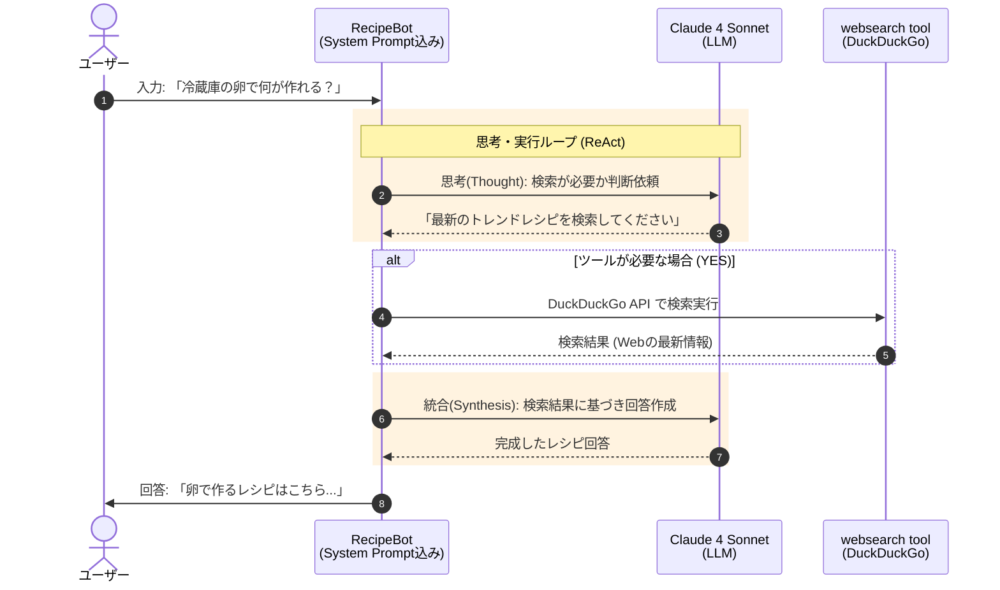

# 概要

このエージェントは、**料理のレシピを聞かれると、インターネットから検索して回答してくれる仕組み**になっています。  
外部検索には、**DDGS（DuckDuckGo Search）** を利用しており、検索エンジンへのアクセスを担当するツールが実装されています。

ポイントは、**ただのシンプルなエージェントではなく、レシピ情報をネット検索によって取得している**という点です。  
この検索のために、**LLM を補助する「ツール（Tool）」を活用**しており、必要に応じて検索機能を呼び出します。

Strands におけるツールの宣言は非常に簡単で、**メソッドに `@tool` デコレーターを付けるだけ**。  
エージェントは、ツールの説明（docstring）をもとに、**その使用が必要かどうかを自律的に判断**します。

このような構成は、**「Tool Use（ReAct）」パターン**と呼ばれ、単なるテキスト生成ではなく、  **必要に応じて外部ツールを使い分け、その結果を統合して返答する仕組み**になっています。





#### 専門家としての構え (System Prompt)

ユーザーの入力に対し、エージェントは「あなたはカリスマ料理アシスタントです」という**役割設定（System Prompt）**に基づいた思考を開始します。

#### 判断と検索 (Reasoning & Tool Use)

ここが最も賢い部分です。AI（Claude）が現在の知識だけで答えるか、外の世界の情報を調べるべきかを**判断（Decision）**します。

- 検索が必要と判断すれば、**websearch tool**を使ってネットから最新の卵料理アイデアを拾ってきます。

#### 情報の統合と回答 (Synthesis)

集めてきた生の検索結果とAIの知識を組み合わせ、ユーザーが読みやすい形に**まとめ上げ（Synthesis）**、最終的なレシピ提案として回答します。


# サンプルコード

[recipe_bot.py]
```
# Import Agent and tools
import logging
import json
from ddgs import DDGS
from ddgs.exceptions import DDGSException, RatelimitException
from strands import Agent, tool

# Configure logging
logging.getLogger("strands").setLevel(
    logging.INFO
)  # Set to DEBUG for more detailed logs


# Define a websearch tool
@tool
def websearch(
    keywords: str, region: str = "us-en", max_results: int = 5
) -> str:
    """最新情報を取得するには、Web を検索してください。
    Args:
        keywords: 検索キーワード。
        region: 検索地域: wt-wt, us-en, uk-en, ru-ru など。
        max_results: 返す結果の最大数。
    Returns:
        JSON文字列形式の検索結果。
    """
    try:
        results = DDGS().text(keywords, region=region, max_results=max_results)
        return json.dumps(results, ensure_ascii=False) if results else "結果が見つかりませんでした。"
    except RatelimitException:
        return "レート制限エラー: しばらく待ってから再試行してください。"
    except DDGSException as d:
        return f"DuckDuckGo検索エラー: {d}"
    except Exception as e:
        return f"エラー: {e}"
from strands.models.bedrock import BedrockModel
bedrock_model = BedrockModel(
    region_name="us-east-1",
    model_id="us.anthropic.claude-sonnet-4-20250514-v1:0",
    # callback_handler=None,
)

# Create a recipe assistant agent
recipe_agent = Agent(
    model=bedrock_model,
    system_prompt="""あなたは、カリスマの料理アシスタント「RecipeBot」です。
    ユーザーが食材に基づいてレシピを検索したり、料理に関する質問に答えたりできるようサポートします。
    ユーザーが食材について言及したときにレシピを検索したり、料理情報を調べたりするには、ウェブ検索ツールを使用します。""",
    tools=[websearch],
)

#system_prompt="""You are RecipeBot, a helpful cooking assistant.
#    Help users find recipes based on ingredients and answer cooking questions.
#    Use the websearch tool to find recipes when users mention ingredients or to look up cooking information.""",


if __name__ == "__main__":
    print("\n👨‍🍳 RecipeBot: レシピや料理について聞いてください！終了するには「exit」と入力してください。\n")

    # Run the agent in a loop for interactive conversation
    while True:
        user_input = input("\nYou > ")
        if user_input.lower() == "exit":
            print("Happy cooking! 🍽️")
            break
        response = recipe_agent(user_input)
        print(f"\nRecipeBot > {response}")
        
```


# 実行

```
uv pip install ddgs
```

```
python recipe_bot.py

👨‍🍳 RecipeBot: レシピや料理について聞いてください！終了するには「exit」と入力してください。


You > 卵できる料理は
卵を使った料理のレシピを検索してみますね！
Tool #1: websearch
検索がタイムアウトしてしまいました。別のキーワードで再度検索してみますね。
Tool #2: websearch
卵で作れる料理はたくさんありますね！検索結果から、人気の卵料理をご紹介しますね：

## 🥚 卵で作れる人気料理 🥚

### **基本の卵料理**
- **卵焼き** - お弁当の定番、甘い出汁巻き卵も
- **オムレツ** - プレーンからチーズ入りまで
- **目玉焼き** - シンプルで朝食にぴったり
- **スクランブルエッグ** - ふわふわで優しい味

### **ご飯もの**
- **卵チャーハン** - パラパラに仕上げるコツが大切
- **卵雑炊** - 体調が悪い時にも優しい
- **目玉焼きご飯** - 簡単で満足感たっぷり

### **おかずになる卵料理**
- **あんかけニラ玉** - とろ〜りあんがおいしい
- **煮卵** - ラーメンのトッピングにも
- **卵のサラダ** - マヨネーズと合わせて
- **茶碗蒸し** - 上品な蒸し料理

### **その他のアレンジ**
- **卵の炒め物** - 野菜と一緒に
- **卵入りスープ** - 中華風かき玉スープなど

何か特定の卵料理のレシピをお知りになりたい場合は、お聞かせください！詳しいレシピを調べてお伝えします 🍳
RecipeBot > 卵で作れる料理はたくさんありますね！検索結果から、人気の卵料理をご紹介しますね：

## 🥚 卵で作れる人気料理 🥚

### **基本の卵料理**
- **卵焼き** - お弁当の定番、甘い出汁巻き卵も
- **オムレツ** - プレーンからチーズ入りまで
- **目玉焼き** - シンプルで朝食にぴったり
- **スクランブルエッグ** - ふわふわで優しい味

### **ご飯もの**
- **卵チャーハン** - パラパラに仕上げるコツが大切
- **卵雑炊** - 体調が悪い時にも優しい
- **目玉焼きご飯** - 簡単で満足感たっぷり

### **おかずになる卵料理**
- **あんかけニラ玉** - とろ〜りあんがおいしい
- **煮卵** - ラーメンのトッピングにも
- **卵のサラダ** - マヨネーズと合わせて
- **茶碗蒸し** - 上品な蒸し料理

### **その他のアレンジ**
- **卵の炒め物** - 野菜と一緒に
- **卵入りスープ** - 中華風かき玉スープなど

何か特定の卵料理のレシピをお知りになりたい場合は、お聞かせください！詳しいレシピを調べてお伝えします 🍳


You > exit
Happy cooking! 🍽️
```

