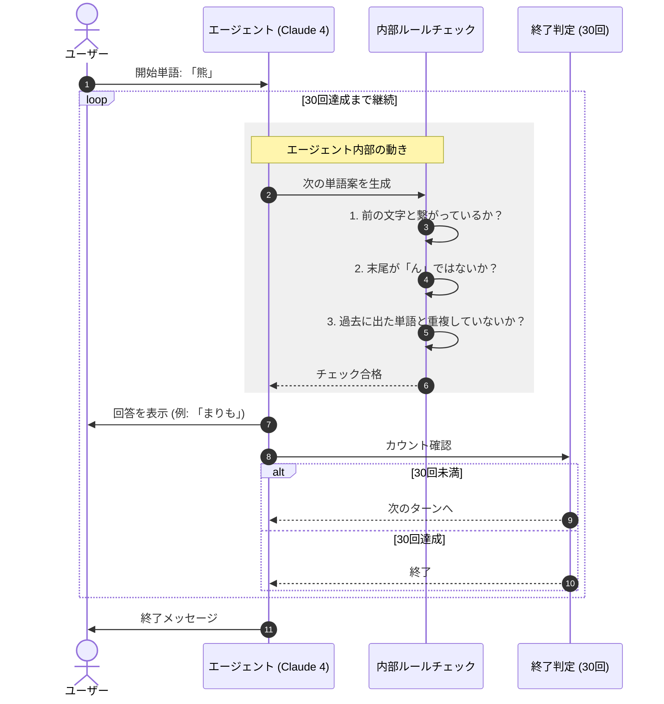

# 概要

Amazon Bedrock上のLLM（Claude 4 Sonnet）に「しりとり」を自律的に行わせるプログラムです。

単なるチャットではなく、**Agent（エージェント）** という概念を用いることで、特定の役割（しりとりマスター）とルールを維持しながらタスクを遂行させる構成になっています。





#### ユーザーからのキックオフ

ユーザーが「熊」と入力することで、エージェントのメインループが起動します。

#### 内部での「三段構え」チェック

エージェント（Claude 4）は、単語を思いつくたびに、内部の**ルール確認層**で以下の3つを厳格にチェックします。

- **接続確認:** 「ま」から始まっているか？

- **禁則事項:** 「ん」で終わって自爆していないか？

- **記憶参照:** すでに言った単語を使い回していないか？

#### 継続とゴール

チェックをパスした単語だけが画面に表示されます。その後、**「30回達成」という終了条件**に達するまで、自分自身（エージェント）に次のバトンを渡し続け、ループを繰り返します。


# サンプルコード

[simple_iterative.py]
```
# import boto3
from strands import Agent
from strands.models.bedrock import BedrockModel

# 1. Bedrockの設定 (Claude 4.0 Sonnetを使用)
bedrock_model = BedrockModel(
    region_name="us-east-1",
    model_id="us.anthropic.claude-sonnet-4-20250514-v1:0"
)

# 2. しりとり専用のシステムプロンプト
# 「思考プロセス」を明示させることで、LLMのルールミスを防ぎます
system_prompt = """
あなたは日本語の「しりとり」を完璧にこなすエージェントです。
以下のルールを厳守し、1人で30ぐらいを目途にしりとりを続けてください。

【ルール】
1. 前の単語の最後の文字から始まる単語を出すこと。違反した場合は終了する。
2. 最後に「ん」がつく単語を出したら終了すること。
3. 同じ単語は二度使わないこと。 同じ単語が使われたら終了する。
4. 読み（ひらがな）を必ず併記すること。

【出力形式】
回数: [n/30]
単語: [単語]（[よみがな]）
次の文字: [次の開始文字]

最初の単語は「熊（くま）」です。次は「ま」から開始してください。
30回を目標に自律的に続けてください。
"""

# 3. エージェントの作成
shiritori_agent = Agent(
    model=bedrock_model,
    system_prompt=system_prompt
)

# 4. 実行開始
# max_iterationsを少し多めに設定し、エージェントが納得するまでループを回せるようにします
print("🎮 しりとりゲーム（Level 1）を開始します...\n")
response = shiritori_agent("「熊（くま）」からスタートして、30回続けてください。")

#print(response)
```

# 実行
```
python simple_iterative.py

🎮 しりとりゲーム（Level 1）を開始します...

1回目: 1/30
単語: 熊（くま）
次の文字: ま

2回目: 2/30
単語: 松（まつ）
次の文字: つ

3回目: 3/30
単語: 月（つき）
次の文字: き

4回目: 4/30
単語: 木（き）
次の文字: き

5回目: 5/30
単語: 切手（きって）
次の文字: て

6回目: 6/30
単語: 天気（てんき）
次の文字: き

7回目: 7/30
単語: 黄色（きいろ）
次の文字: ろ

8回目: 8/30
単語: ロボット（ろぼっと）
次の文字: と

9回目: 9/30
単語: 虎（とら）
次の文字: ら

10回目: 10/30
単語: ラジオ（らじお）
次の文字: お

11回目: 11/30
単語: 鬼（おに）
次の文字: に

12回目: 12/30
単語: 人参（にんじん）
次の文字: ん

【終了】
「人参（にんじん）」で「ん」がついたため、しりとりを終了します。
12回で終了となりました。

```

ここでは 12 回で終了していますが、エージェントの判断によっては、気まぐれに 30 回近くやり通すこともあります。

