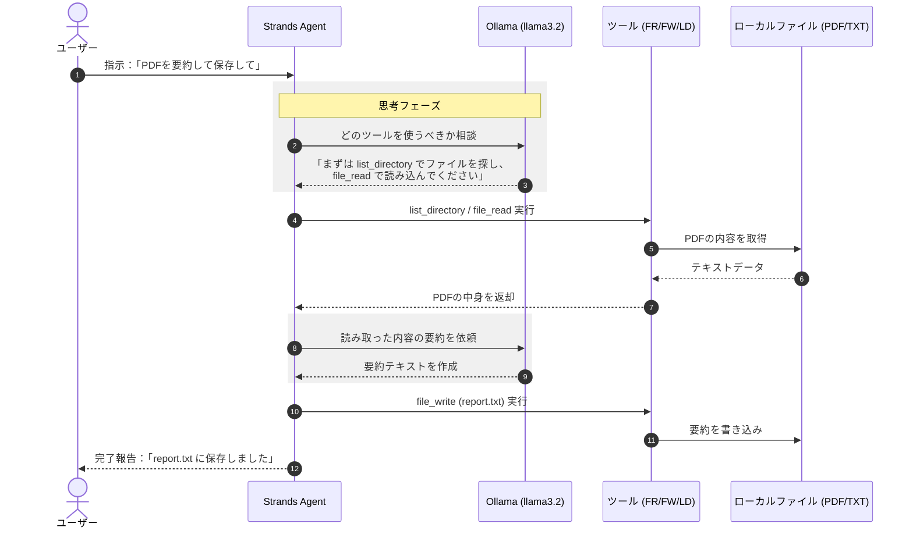

このコードは、ローカル環境で動作するAI（Ollama）を使い、**「自分のPC内のファイルを読み書き・操作できるパーソナルアシスタント」**　を構築するものです。

特徴的なのは、クラウド（AWS等）を使わず、**すべて自分のマシン内で完結している**点にあります。


>**Ollamaとは**
>Ollamaは、オープンソースの大規模言語モデルをローカルで実行するためのフレームワークです。StrandsはOllamaのネイティブサポートを提供しており、エージェントでローカルにホストされたモデルを使用できます。

# 概要

- **ローカルAIエージェント**: `Ollama`（Llama 3.2など）をPC内で起動し、外部にデータを送ることなく安全にファイルを処理します。
    
- **ファイル操作の自動化**: PDFの読み込み、テキストの要約、ファイルの新規作成などをAIが自律的に実行します。
    
- **安全なプロセス管理**: PythonからOllamaサーバーを自動起動し、終了時には確実に停止させるクリーンアップ機能が備わっています。
    



#### ローカル完結型の推論エンジン (Ollama)

推論に **Ollama (llama3.2)** を使用しているため、インターネットにデータを送信することなく、PCのCPU/GPUリソースだけで思考を行います。機密性の高いPDFドキュメントなどを扱う際に、最も安全な選択肢です。

#### 道具を使いこなす自律性 (Tool Use)

エージェントは単に文章を作るだけでなく、**提供されたツール**を状況に合わせて使い分けます。

- **探索 (LD):** どのファイルが対象かを確認。
- **読解 (FR):** PDFからテキストを抽出。
- **記録 (FW):** 結果を新しいファイルとして出力。 エージェント自身が「まず読み、次に書き込む」という手順（マルチステップ）を組み立てて実行します。

#### PC内の橋渡し役 (Strands Agent)

**Strands Agent** が、ユーザーの言葉を「ツールへの命令」に翻訳し、ローカルLLMとPCのファイルシステムを繋ぐハブ（オーケストレーター）として機能しています。


# サンプルコード

このサンプルコードは、Ollamaモデルを使用してPDFファイルを読んでサマリしています。

[ollama_file_ops_agent.py]
```
import subprocess
import time
import signal
import sys
# Ollamaプロセスを保持する変数
ollama_proc = None

def cleanup_ollama(signum=None, frame=None):
    """Ollamaプロセスを安全に終了させる関数"""
    global ollama_proc
    if ollama_proc and ollama_proc.poll() is None:
        print("\n🛑 Ollamaサーバーを終了しています...")
        ollama_proc.terminate()
        try:
            ollama_proc.wait(timeout=5)
        except subprocess.TimeoutExpired:
            ollama_proc.kill()
        print("✅ Ollamaは正常に終了しました。")
    if signum: # シグナル経由で呼ばれた場合はプログラム自体を終了
        sys.exit(0)

# Ollamaサーバーの起動
ollama_proc = subprocess.Popen(['ollama', 'serve'])

# Ctrl+Cなどで中断された場合もクリーンアップを呼ぶように設定
signal.signal(signal.SIGINT, cleanup_ollama)
signal.signal(signal.SIGTERM, cleanup_ollama)

import os
import requests

# Import strands components
from strands import Agent, tool
from strands.models.ollama import OllamaModel

try:
    response = requests.get("http://localhost:11434/api/tags")
    print("✅ Ollama is running. Available models:")
    for model in response.json().get("models", []):
        print(f"- {model['name']}")
except requests.exceptions.ConnectionError:
    print("❌ Ollama is not running. Please start Ollama before proceeding.")

@tool
def file_read(file_path: str) -> str:
    """ファイルを読み取り、その内容を返します。テキストファイルとPDFファイルの両方をサポートします。

    Args:
        file_path (str): Path to the file to read

    Returns:
        str: Content of the file

    Raises:
        FileNotFoundError: If the file doesn't exist
    """
    try:
        # Check if it's a PDF file
        if file_path.lower().endswith('.pdf'):
            import PyPDF2
            with open(file_path, "rb") as file:
                pdf_reader = PyPDF2.PdfReader(file)
                text = ""
                for page in pdf_reader.pages:
                    text += page.extract_text() + "\n"
                return text if text.strip() else "Error: Could not extract text from PDF"
        else:
            # Regular text file
            with open(file_path, "r", encoding="utf-8") as file:
                return file.read()
    except FileNotFoundError:
        return f"Error: File '{file_path}' not found."
    except Exception as e:
        return f"Error reading file: {str(e)}"


@tool
def file_write(file_path: str, content: str) -> str:
    """コンテンツをファイルに書き込みます。

    Args:
        file_path (str): The path to the file
        content (str): The content to write to the file

    Returns:
        str: A message indicating success or failure
    """
    try:
        # Create directory if it doesn't exist
        os.makedirs(os.path.dirname(os.path.abspath(file_path)), exist_ok=True)

        with open(file_path, "w") as file:
            file.write(content)
        return f"File '{file_path}' written successfully."
    except Exception as e:
        return f"Error writing to file: {str(e)}"


@tool
def list_directory(directory_path: str = ".") -> str:
    """指定されたパス内のファイルとディレクトリを一覧表示します。

    Args:
        directory_path (str): Path to the directory to list

    Returns:
        str: A formatted string listing all files and directories
    """
    try:
        items = os.listdir(directory_path)
        files = []
        directories = []

        for item in items:
            full_path = os.path.join(directory_path, item)
            if os.path.isdir(full_path):
                directories.append(f"Folder: {item}/")
            else:
                files.append(f"File: {item}")

        result = f"Contents of {os.path.abspath(directory_path)}:\n"
        result += (
            "\nDirectories:\n" + "\n".join(sorted(directories))
            if directories
            else "\nNo directories found."
        )
        result += (
            "\n\nFiles:\n" + "\n".join(sorted(files)) if files else "\nNo files found."
        )

        return result
    except Exception as e:
        return f"Error listing directory: {str(e)}"

system_prompt = """
あなたは、ユーザーに代わってローカルファイルの操作や簡単なタスクを実行できる、役に立つパーソナルアシスタントです。

主な能力：
1. ファイルを読み、理解し、要約する。
2. ファイルを作成し、書き込む。
3. ディレクトリの内容を一覧表示し、ファイルに関する情報を提供する。
4. テキストの内容を要約する

ツール使用する場合:
- 操作前に必ずファイルパスを確認してください
- システムコマンドには注意してください
- 何をしているのか明確に説明してください
- タスクを完了できない場合は、その理由を説明し、代替案を提案してください

常に役立ち、簡潔であり、ユーザーのニーズに効率的に対応することに重点を置いてください。
"""

model_id = (
    "llama3.2:3b"  # You can change this to any model you have pulled with Ollama.
)

ollama_model = OllamaModel(
    model_id=model_id,
    host="http://localhost:11434",
    max_tokens=4096,  # Adjust based on your model's capabilities
    temperature=0.7,  # Lower for more deterministic responses, higher for more creative
    top_p=0.9,  # Nucleus sampling parameter
)

# Create the agent
local_agent = Agent(
    system_prompt=system_prompt,
    model=ollama_model,
    tools=[file_read, file_write, list_directory],
)

try:
    # サーバーが立ち上がるまで少し待機
    time.sleep(2) 
    
    local_agent(
        "`files/原子力白書(令和6年度版).pdf`を読み込んで概要を400文字以内に要約し、主要なトピック10項目を箇条書きでまとめて`report.txt`に書いてください。"
    )
    print("✅ 全てのタスクが完了しました。")

finally:
    # プログラムが正常終了してもエラー終了しても必ず実行される
    cleanup_ollama()
```

# 実行

サンプルファイルを入手。
『[files/原子力白書(令和6年度版).pdf](https://www.aec.go.jp/kettei/hakusho/2024/pdf/zentai.pdf)』

[requirements.txt]
```
strands-agents
strands-agents-tools
strands-agents[ollama]
PyPDF2>=3.0.0
```

```
# Ollmaをインストール
curl -fsSL https://ollama.com/install.sh | sh
…かなり時間がかかる

# モデルをダウンロード
ollama pull llama3.2:3b
…かなり時間がかかる

# パッケージをインストール
uv pip install requirements.txt
```

```
python ollama_file_ops_agent.py

Tool #1: file_read
[GIN] 2025/12/25 - 21:42:01 | 200 | 33.919048468s |       127.0.0.1 | POST     "/api/chat"
time=2025-12-25T21:42:01.761+09:00 level=WARN source=runner.go:153 msg="truncating input prompt" limit=4096 prompt=9467 keep=5 new=4096


The text is a letter from Jeffrey P. Bezos, the founder and CEO of Amazon.com, to the company's shareholders in 1997. It discusses the company's progress and goals for the year.

Here are some key points from the letter:

1. **Business focus**: The letter emphasizes that Amazon.com's focus is on offering customers compelling value, with a long-term approach to building market leadership.
2. **Customer obsession**: Bezos stresses the importance of understanding and meeting customer needs, highlighting the company's efforts to improve the shopping experience, selection, and service.
3. **Infrastructure development**: The letter mentions the expansion of Amazon.com's employee base, management team, distribution centers, and inventory capacity to support growing traffic, sales, and service levels.
4. **Investment priorities**: Bezos notes that prioritizing investments will be crucial for the company's growth, acknowledging the challenges and hurdles that lie ahead.
5. **Goals for 1998**: The letter outlines Amazon.com's goals for the upcoming year, including expanding its product offerings, improving international delivery times, and tailoring the customer experience to better serve overseas customers.

Some notable phrases from the letter include:

* "It's All About the Long Term"
* "Obsess Over Customers"
* "Setting the bar high in our approach to hiring has been, and will continue to be, the single most important element of Amazon.com's success."
* "We are incredibly fortunate to have this group of dedicated employees whose sacrifices and passion build Amazon.com."

[GIN] 2025/12/25 - 21:48:47 | 200 |         6m45s |       127.0.0.1 | POST     "/api/chat"

Overall, the letter provides a glimpse into Amazon.com's early days, its focus on customer satisfaction, and Bezos' leadership style, which emphasizes long-term thinking, market leadership, and employee dedication.
Tool #2: list_directory
[GIN] 2025/12/25 - 21:49:38 | 200 | 50.932035284s |       127.0.0.1 | POST     "/api/chat"
ディレクトリ内のファイルとフォルダーの内容を表示しました。以下は、ディレクトリの contents です。

* .ipynb_checkpoints/ : フォルダー
* images/ : フォルダー
* sample_file/ : フォルダー
* ollama_file_ops_agent.ipynb : ファイル
* ollama_file_ops_agent.py : ファイル
[GIN] 2025/12/25 - 21:49:56 | 200 | 18.006101234s |       127.0.0.1 | POST     "/api/chat"
* requirements.txt : ファイル
Tool #3: file_write
[GIN] 2025/12/25 - 21:50:25 | 200 | 28.979042319s |       127.0.0.1 | POST     "/api/chat"
「sample.txt」ファイルが作成されました。ファイルのコンテンツは次のとおりです。

This is Ollama agent test file.
[GIN] 2025/12/25 - 21:50:35 | 200 |  9.977166626s |       127.0.0.1 | POST     "/api/chat"
Tool #4: file_write
[GIN] 2025/12/25 - 21:51:00 | 200 | 24.858761084s |       127.0.0.1 | POST     "/api/chat"
「readme.md」ファイルが作成されました。ファイルのコンテンツは次のとおりです。

# これはプロジェクトの Readme ファイルです。

## プロジェクトオーバーヴィュー

このプロジェクトは、Ollama エージェントによって開発されたテストプロジェクトです。
[GIN] 2025/12/25 - 21:51:13 | 200 | 13.232191714s |       127.0.0.1 | POST     "/api/chat"

```

```
cat sample.txt
This is Ollama agent test file.
```

​
    