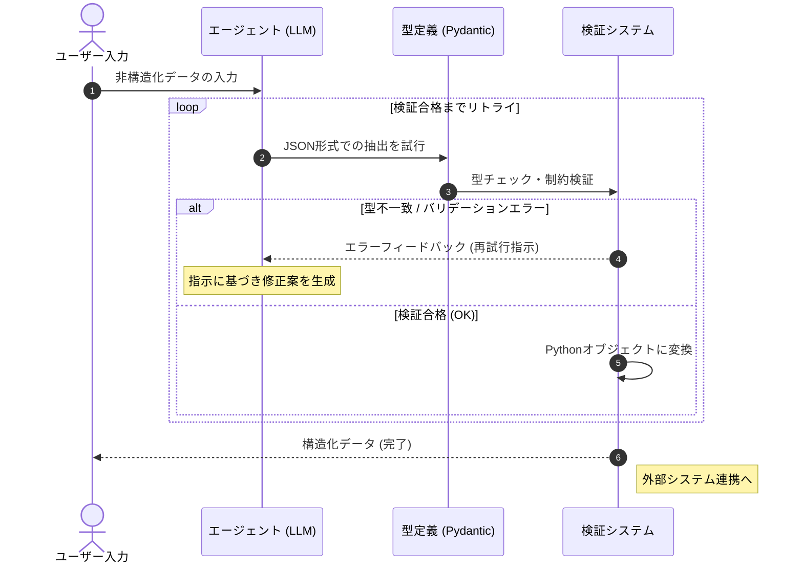

# 概要

**構造化出力（Structured Output）** は、AIが生成する自然言語の回答を、あらかじめ定義された特定のデータ構造（JSONやPythonのオブジェクトなど）に強制的に適合させるパターンです。これにより、AIの出力を「読むための文章」から「動かすためのデータ」へと変え、システム連携の信頼性を飛躍的に高めます。




#### 情報の抽出と型定義

ユーザーが入力した曖昧な文章から、エージェントが必要な情報（日付、金額、名称など）を抜き出します。このとき、**Pydanticモデル**が「器の形（スキーマ）」を定義し、AIに対して「この形式で出力しなさい」という厳格な制約を与えます。

#### 検証システムによる自己修正

AIの回答が定義された型に合わない場合（数値のはずが文字列になっている等）、**検証システム**が即座にエラーを検知します。このシステムは単に処理を止めるのではなく、「どこが間違っているか」をAIに伝えて再考させるため、正解に辿り着くまでの自律的なループが形成されます。

#### 外部システムとの高信頼連携

最終的に出力されるのは、プログラムで直接扱える**Pythonオブジェクト**です。検証をパスした「保証付きのデータ」のみが外部システム（APIやデータベース）へ送られるため、システム全体の安定性と信頼性が飛躍的に向上します。


# サンプルコード

AI に自由な文章を入力し、そこから「名前」「年齢」「趣味」を抽出して、決まった JSON 形式で出力させる例です。

[structured_output.py]
```
from typing import List, Optional
from pydantic import BaseModel, Field
from strands import Agent, tool
from strands.models import BedrockModel

# 1. データの構造定義
class TaskInfo(BaseModel):
    task_name: str = Field(description="タスクの簡潔な名前")
    due_date: Optional[str] = Field(None, description="期限（例：2025-12-31）")
    priority: int = Field(description="優先度を1から5で評価")
    tags: List[str] = Field(default=[], description="カテゴリタグのリスト")

# 抽出結果を格納する変数
extracted_data = None

# 2. 抽出用ツールの自作（SDKのバグを回避）
@tool
def submit_task_data(task_name: str, priority: int, due_date: str = None, tags: List[str] = []):
    """
    抽出したタスクデータをシステムに登録します。
    すべての抽出が完了したら、必ずこのツールを呼び出してください。
    """
    global extracted_data
    extracted_data = TaskInfo(
        task_name=task_name,
        due_date=due_date,
        priority=priority,
        tags=tags
    )
    return "【システム】データの登録に成功しました。対話を終了してください。"

# 3. モデル設定
model = BedrockModel(
    region_name="us-east-1", 
    model_id="us.anthropic.claude-sonnet-4-20250514-v1:0"
)

# 4. エージェントの作成
agent = Agent(
    model=model,
    system_prompt="""
あなたはデータ抽出の専門家です。
ユーザーの入力からタスク情報を抽出し、必ず `submit_task_data` ツールを使用して報告してください。
ツールを呼び出したら、余計な説明はせず簡潔に終了してください。
""",
    tools=[submit_task_data]
)

# 5. 実行
print("--- 構造化出力実行 (Safe Custom Tool Version) ---")
user_msg = "来週の月曜日までに、プロジェクトAの進捗報告書を作成しないといけない。優先度は5。タグは仕事と報告で。"

response = agent(user_msg)

# 6. 結果の確認
if extracted_data:
    print("\n[抽出された構造化データ]")
    print(f"タスク名: {extracted_data.task_name}")
    print(f"優先度  : {extracted_data.priority}")
    print(f"期限    : {extracted_data.due_date}")
    print(f"タグ    : {extracted_data.tags}")
else:
    print("\nデータの抽出に失敗しました。")
    
```

# 実行

```
python structured_output.py

--- 構造化出力実行 (Safe Custom Tool Version) ---

Tool #1: submit_task_data
タスクデータの登録が完了しました。
[抽出された構造化データ]
タスク名: プロジェクトAの進捗報告書を作成
優先度  : 5
期限    : 来週の月曜日
タグ    : ['仕事', '報告']
```

