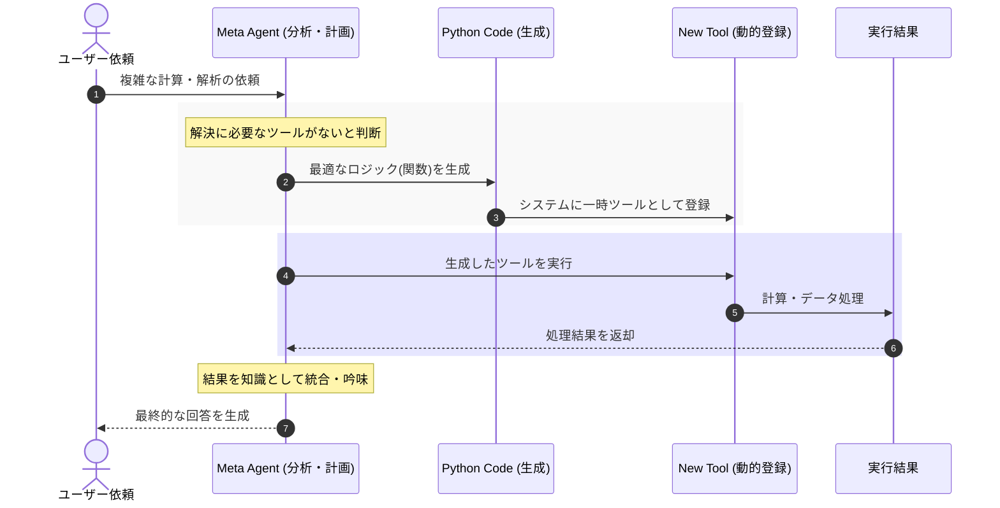

# 概要

メタツーリング(Meta Tooling)とは、エージェントが「既存のツールを使う」だけでなく、**「実行時に新しいツールを自分で作成（定義）し、それを利用する」** 仕組みを指します。

従来のエージェントは、開発者があらかじめ用意したツールの範囲内でしか動けませんでした。しかし、Meta Toolingを装備したエージェントは、未知の課題に直面した際、それを解決するためのPythonコードを自ら生成し、それを動的な「ツール」として即座に自分自身に組み込みます。





#### 課題分析と戦略立案

**Meta Agent** は、ユーザーの依頼を単なるテキストとして処理するのではなく、「どの技術（ツール）を使えば解決できるか」をメタ視点から分析します。適切なツールが手元にない場合、即座に「ツールを自作する」というフェーズに移行できるのがこのシステムの最大の特徴です。

#### 動的なスキルの獲得

生成された **Python Code** は、その場で **New Tool** としてエージェントにマウント（動的登録）されます。これは、人間が「新しい計算式を覚え、その場で電卓を叩く」ような動きをAIが自動で行っていることを意味します。これにより、あらかじめ用意された機能の限界を超えた柔軟な対応が可能になります。

#### 経験の統合と成果

ツールの **実行結果データ** は、Meta Agent に戻された時点で単なる「数値」から「意味のある回答」へと昇華されます。自作ツールを使って得た確かな根拠（計算結果や解析データ）を元に回答を組み立てるため、推論の正確性が飛躍的に高まります。

# サンプルコード

エージェントが「数学的な特殊計算ツール」を自作して解決するイメージの構成案です。

[meta_tooling.py]
```
from strands import Agent, tool
from strands.models import BedrockModel

model = BedrockModel(model_id="us.anthropic.claude-sonnet-4-20250514-v1:0")

# メタ・ツール生成用の特別なプロンプトを持つエージェント
meta_agent = Agent(
    model=model,
    system_prompt="""
    あなたは必要に応じて自らPythonツールを作成できるエンジニアです。
    既存のツールで解決できない場合、解決用のPython関数を生成し、
    それを実行して結果を報告してください。
    """
)

# 例：エージェントが内部で以下のような関数を動的に生成・登録する
@tool
def calculate_complex_metric(data: list[float]):
    """エージェントがその場で考え出した、データ分析用の特殊計算ツール"""
    import math
    return [math.sqrt(x) * math.log(x) for x in data if x > 0]

# 実行
response = meta_agent("この数値リストに対して、独自の相関スコアを計算するツールを作って適用して: [10, 20, 30]")
print(response)
```


# 実行
以下、実行結果です。
---

```
python meta_tooling.py
```

『[900-020-091.実行結果](900-020-091.実行結果.md)』


