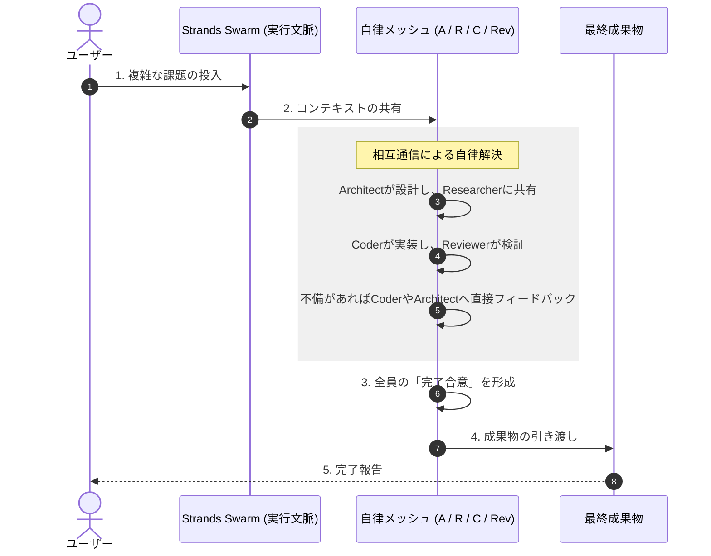

ここでは、Strands SDKの `Swarm` クラスをフル活用した、最も洗練されたマルチエージェント・メッシュ構成（真のSwarm）についてまとめます。

# 概要：Strands Native Swarm（自律分散メッシュ）

この構成は、特定の「指揮者」を介さず、複数の専門エージェントが**共有の実行空間（Swarm Context）** の中で自由に対話・権限委譲を行うモデルです。

- **自律ルーティング**: 各エージェントがプロンプトと現在の状況に基づき、「次は誰にバトンを渡すべきか」をSDKレベルで自動判断します。

- **履歴の自動整合性**: 以前発生したBedrockの `ValidationException`（履歴の不整合）を、SDKが内部でメッセージを適切にスタック・整理することで回避します。

- **自律終了**: タスクが完了したとエージェントが合意した時点で、システム全体が終了し、最終成果物を返します。
    





#### 自律メッシュによる柔軟な相互協力

**自律メッシュ（Mesh Network）内では、設計（Architect）、調査（Researcher）、実装（Coder）、検品（Reviewer）の各エージェントが、固定された順序ではなく必要に応じて双方向に**コミュニケーションを取ります。これにより、ボトルネックが発生しにくく、複雑な問題に対して動的にリソースを配分できるのがこのシステムの強みです。

#### 実行コンテキスト（Strands Swarm）の役割

**SW（実行コンテキスト）** は、個別のエージェントに命令を下すのではなく、群れ全体に対して「共有の記憶」や「現在の目的」を提供します。各エージェントはこの共有された文脈を参照することで、誰に指示されずとも「今、自分が何をすべきか」を自律的に判断します。

#### 合意形成と成果物の確定

このシステムの終了条件は、特定のリーダーの判断ではなく、メッシュ内での**「完了合意」**です。Reviewerが「OK」を出し、Architectが「設計通り」と認めるなど、専門家同士が互いの仕事を承認し合うことで、極めて信頼性の高い **AgentResult** が生成されます。

# サンプルコード

[strands_native_swarm.py]
```
import logging
import sys
from strands import Agent
from strands.multiagent import Swarm
from strands.models.bedrock import BedrockModel

# 1. ログの設定（Swarmの内部挙動を可視化するために重要）
logging.basicConfig(
    level=logging.INFO,
    format="%(levelname)s | %(name)s | %(message)s",
    handlers=[logging.StreamHandler(sys.stdout)]
)
logger = logging.getLogger("strands.multiagent")
logger.setLevel(logging.DEBUG)

# 2. モデルの初期化
model = BedrockModel(
    region_name="us-east-1",
    model_id="us.anthropic.claude-sonnet-4-20250514-v1:0"
)

# 3. 専門家エージェントの定義
# Swarm内では、エージェントは互いを認識し、自然に役割を移譲します。
researcher = Agent(
    name="researcher",
    model=model,
    system_prompt="あなたは調査スペシャリストです。最新技術や市場動向を調査します。実装が必要な場合はcoderに、設計が必要な場合はarchitectに相談してください。"
)

coder = Agent(
    name="coder",
    model=model,
    system_prompt="あなたはコーディングの専門家です。実装を担当します。コードが書けたら必ずreviewerにレビューを依頼してください。"
)

reviewer = Agent(
    name="reviewer",
    model=model,
    system_prompt="あなたはコードレビューの専門家です。セキュリティ、効率性、可読性を厳しくチェックします。問題があればcoderに差し戻し、完璧なら完了を宣言してください。"
)

architect = Agent(
    name="architect",
    model=model,
    system_prompt="あなたはシステム設計の専門家です。全体の構成を考えます。詳細な調査が必要ならresearcherへ、実装に移れるならcoderへ依頼してください。"
)

# 4. Swarm（メッシュ）の構築
swarm = Swarm(
    agents=[researcher, coder, reviewer, architect],
    max_handoffs=20,           # 最大20回までのバトンタッチを許可
    max_iterations=30,         # 最大30ステップまでの推論を許可
    execution_timeout=900.0,   # 全体で15分制限
    node_timeout=300.0,        # 1エージェントあたり5分制限
    # たらい回し防止機能
    repetitive_handoff_detection_window=8,
    repetitive_handoff_min_unique_agents=3
)

# 5. 実行
if __name__ == "__main__":
    task = "TODOアプリのための、セキュアなREST APIの設計と実装案を作成してください。"
    print(f"🚀 タスク開始: {task}\n")
    
    result = swarm(task)
    
    print("\n" + "="*50)
    print(f"🏁 最終ステータス: {result.status}")
    print(f"回ったノード（履歴）: {[node.node_id for node in result.node_history]}")
    print("="*50)
    print(f"\n📄 最終成果物:\n{result.content}")
```

このコードを実行すると、`DEBUG` ログにより、エージェント同士が「私はここまでやった、次は君の番だ」と相談しながらタスクを進める様子が見て取れます。これこそが、Strands SDKが提供する究極のSwarm実装です。

# 実行

以下、実行結果です。
---

```
python strands_native_swarm.py
```

『[900-020-121.実行結果](900-020-121.実行結果.md)』

