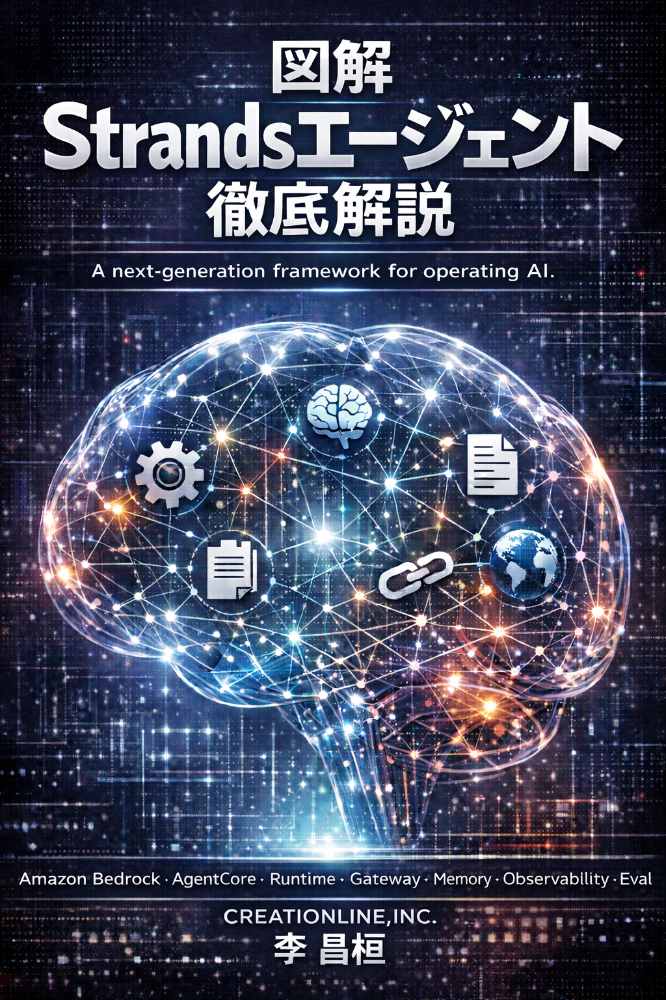

# 『図解Strandsエージェント徹底解説』

**[Strands Agent(Apache License 2.0)](https://github.com/strands-agents/samples/blob/main/LICENSE)** は、AWS主導で開発されたオープンソースのAIエージェントSDKで、2025年5月16日に一般公開されました。 

**Strands（ストランズ）** は、PythonまたはTypeScriptで、ツール連携（Tool Use）やマルチエージェントの構築を直感的に行える軽量なフレームワークです。

「もっとシンプルに、そして人間のように自律的に動くエージェントを作りたい」 という開発者の想いから生まれ、LangChainの対抗馬としても注目を集めています。

本サイト（『**図解 Strandsエージェント徹底解説**』）は、筆者が Strandsを学習する過程で記録してきたメモをもとに構成しています。

一見すると手間のかかる方法に思えるかもしれませんが、これまでの執筆経験から、膨大な知識体系を短期間で習得するには、「一冊の本を書くようにまとめるアプローチ」が最も効果的であると考えています。

**『図解 Strandsエージェント徹底解説』** が、Strandsエージェントを学ぼうとする皆様の一助となれば幸いです。

なお、筆者の主観による要約や再構成を含んでいるため、掲載内容やサンプルコードの利用にあたっては、ご自身の判断と責任にてお願いいたします。

内容は適宜更新・修正される可能性がありますので、あらかじめご了承ください。

2026年1月1日

### 著者プロフィール
---
#### 李 昌桓（LEE CHANFUAN）

- [クリエーションライン株式会社](https://www.creationline.com) に在籍
- 現代的なデータ基盤構築を専門とするソリューション・アーキテクト、リードエンジニアとして活動中
- 代表的なプロジェクト:
	- 大手通信キャリアにおけるDWH基盤の設計・運用
	- Donso Factory IoT、ヨドバシカメラ、モノタロウなどにおけるデータモダナイゼーションを推進
	
#### 著書

- Amazon Cloudテクニカルガイド ― EC2/S3からVPCまで徹底解析、インプレスジャパン、2010
- Amazon Elastic MapReduceテクニカルガイド ― クラウド型Hadoopで実現する大規模分散処理、インプレスジャパン、2012
- Cypherクエリー言語の事例で学ぶ グラフデータベース Neo4j、インプレスR&D、2015
- Neo4jを使うグラフ型データベース入門（共著）、リックテレコム、2016
- RDB技術者のためのNoSQLガイド（共著）、秀和システム新社、2016
- 図解Strandsエージェント徹底解説、[注]、2025
>[注]『図解 Strandsエージェント徹底解説』はWeb上で公開しており、紙での出版は予定していません。
	 

### 掲載内容について
---
『図解 Strandsエージェント徹底解説』は、Strandsエージェントおよび AWS の公式ドキュメント、ならびに GitHub 上のサンプルコードをベースに構成しています。

- [Strands User Guide/](https://strandsagents.com/latest/documentation/docs/)
- [Strands Githubs](https://github.com/strands-agents/)
- [Strands Samples](https://github.com/strands-agents/samples)
- [ Strands Python API](https://strandsagents.com/latest/documentation/docs/api-reference/python/agent/agent/)
- [Amazon Bedrock AgentCore Developer Guide](https://docs.aws.amazon.com/bedrock-agentcore/latest/devguide/what-is-bedrock-agentcore.html)
- [Amazon Bedrock AgentCore Samples](https://github.com/awslabs/amazon-bedrock-agentcore-samples)

### 著作権・ライセンス
---
本サイトの著作権は著者に帰属します。

 - AI学習・研究目的: 出典を明記の上、自由にご利用いただけます。
 - 営利・二次利用: 無断転載や有償イベントでの利用は禁止します。
 - 改変: 自由ですが、すべて自己責任となります。

 詳細は [LICENSE](LICENSE.md) ファイルをご確認ください。

　
### 章立てについて
---
#### 📌構成
-  [メジャー番号]-[マイナ番号]-[リビジョン番号]
-   [章]-[節]-[項]の構成、又は[章]-[項]の構成
　
　
　
### 目次 
---
#### 10.基本構成
- [10-00-000.Strandsエージェントとは](10.基本構成/10-00-000.Strandsエージェントとは.md)  
- [10-10-010.エージェントループ](10.基本構成/10-10-010.エージェントループ.md)  
- [10-10-020.ステート](10.基本構成/10-10-020.ステート.md)  
- [10-10-030.セッション管理](10.基本構成/10-10-030.セッション管理.md)  
- [10-10-040.プロンプト](10.基本構成/10-10-040.プロンプト.md)  
- [10-10-050.フック](10.基本構成/10-10-050.フック.md)  
- [10-10-060.構造化出力](10.基本構成/10-10-060.構造化出力.md)  
- [10-10-070.会話管理](10.基本構成/10-10-070.会話管理.md)  
- [10-20-010.ツール](10.基本構成/10-20-010.ツール.md)  
- [10-30-010.モデルプロバイダー](10.基本構成/10-30-010.モデルプロバイダー.md)  
- [10-40-010.ストリーミング](10.基本構成/10-40-010.ストリーミング.md)  
- [10-50-010.マルチエージェントパターン](10.基本構成/10-50-010.マルチエージェントパターン.md)  
- [10-50-011.補足](10.基本構成/10-50-011.補足.md)  
- [10-50-020.Agent2Agent(A2A)](10.基本構成/10-50-020.Agent2Agent(A2A).md)  
- [10-50-030.ツール化エージェント](10.基本構成/10-50-030.ツール化エージェント.md)  
- [10-50-040.スウォーム](10.基本構成/10-50-040.スウォーム.md)  
- [10-50-050.グラフ](10.基本構成/10-50-050.グラフ.md)  
- [10-50-060.ワークフロー](10.基本構成/10-50-060.ワークフロー.md)  
- [10-50-070.マルチエージェントの概念](10.基本構成/10-50-070.マルチエージェントの概念.md)  
- [10-60-010.インタラプト](10.基本構成/10-60-010.インタラプト.md)  
　
#### 20.安全性とセキュリティ
- [20-00.安全性とセキュリティの概念](20.安全性とセキュリティ/20-00.安全性とセキュリティの概念.md)  
- [20-10.責任あるAI](20.安全性とセキュリティ/20-10.責任あるAI.md)  
- [20-20.ガードレール](20.安全性とセキュリティ/20-20.ガードレール.md)  
- [20-30.プロンプトエンジニアリング](20.安全性とセキュリティ/20-30.プロンプトエンジニアリング.md)  
- [20-40.個人情報の秘匿化](20.安全性とセキュリティ/20-40.個人情報の秘匿化.md)  
　
#### 30.可観測性とセキュリティ
- [30-00.可観測性とデバックの概念](30.可観測性とデバック/30-00.可観測性とデバックの概念.md)  
- [30-10.メトリック](30.可観測性とデバック/30-10.メトリック.md)  
- [30-20.トレース](30.可観測性とデバック/30-20.トレース.md)  
- [30-30.ログ](30.可観測性とデバック/30-30.ログ.md)  
　
#### 40.評価SDK
- [40-00.評価SDKの概念](40.評価SDK/40-00.評価SDKの概念.md)
　
#### 50.デプロイ
- [50-00.デプロイの概念](50.デプロイ/50-00.デプロイの概念.md)
　
#### 60.実行環境
- [60-00.事前準備](60.実行環境/60-00.事前準備.md)
　
#### 70.サンプルコード
- [70-00-000.サンプルコードについて](70.サンプルコード/70-00-000.サンプルコードについて.md)  
- [70-10-010.シンプルエージェント](70.サンプルコード/70-10-010.シンプルエージェント.md)  
- [70-10-020.レシピボットエージェント](70.サンプルコード/70-10-020.レシピボットエージェント.md)
- [70-10-030.自己反省型エージェントの尻取りゲーム＋](70.サンプルコード/70-10-030.自己反省型エージェントの尻取りゲーム＋.md)
- [70-10-031.外部審判ツール付きエージェントの尻取りゲーム＋](70.サンプルコード/70-10-031.外部審判ツール付きエージェントの尻取りゲーム＋.md)
- [70-10-032.マルチエージェント対戦型の尻取りゲーム＋](70.サンプルコード/70-10-032.マルチエージェント対戦型の尻取りゲーム＋.md)
- [70-10-040-Ollmaファイルオペレーション](70.サンプルコード/70-10-040-Ollmaファイルオペレーション.md)
- [70-20-010.外部ツール連携](70.サンプルコード/70-20-010.外部ツール連携.md)
- [70-20-020.ファイル操作](70.サンプルコード/70-20-020.ファイル操作.md)
- [70-20-040.親子関係ワークフロー](70.サンプルコード/70-20-040.親子関係ワークフロー.md)
- [70-20-050.ナレッジベースワークフロー](70.サンプルコード/70-20-050.ナレッジベースワークフロー.md)
- [70-20-060.構造化出力](70.サンプルコード/70-20-060.構造化出力.md)
- [70-20-070.マルチエージェント](70.サンプルコード/70-20-070.マルチエージェント.md)
- [70-20-080.グラフエージェント](70.サンプルコード/70-20-080.グラフエージェント.md)
- [70-20-081.実行結果](70.サンプルコード/70-20-081.実行結果.md)
- [70-20-090.メタツーリング](70.サンプルコード/70-20-090.メタツーリング.md)
- [70-20-091.実行結果](70.サンプルコード/70-20-091.実行結果.md)
- [70-20-100.MCPサーバ](70.サンプルコード/70-20-100.MCPサーバ.md)
- [70-20-110.マルチモーダル](70.サンプルコード/70-20-110.マルチモーダル.md)
- [70-20-120.ネイティブスウォーム](70.サンプルコード/70-20-120.ネイティブスウォーム.md)
- [70-20-121.実行結果](70.サンプルコード/70-20-121.実行結果.md)
- [70-30-010.朝まで生テレビーベーシンク版＋](70.サンプルコード/70-30-010.朝まで生テレビーベーシンク版＋.md)
- [70-30-011.朝まで生テレビーAgentCore版＋](70.サンプルコード/70-30-011.朝まで生テレビーAgentCore版＋.md)
- [70-30-012.朝まで生テレビー短期記憶版＋](70.サンプルコード/70-30-012.朝まで生テレビー短期記憶版＋.md)
- [70-30-013.短期記憶の検索＋](70.サンプルコード/70-30-013.短期記憶の検索＋.md)
- [70-30-020.朝まで生テレビー長期記憶版＋](70.サンプルコード/70-30-020.朝まで生テレビー長期記憶版＋.md)
- [70-30-021.長期記憶の検索＋](70.サンプルコード/70-30-021.長期記憶の検索＋.md)
- [70-90-010.TexToSQL＋](70.サンプルコード/70-90-010.TexToSQL＋.md)
- [70-90-011.実行結果](70.サンプルコード/70-90-011.実行結果.md)
- [70-90-020.足立区の壮大ごみ判別＋](70.サンプルコード/70-90-020.足立区の壮大ごみ判別＋.md)
- [70-90-021.事前準備](70.サンプルコード/70-90-021.事前準備.md)
　
#### 80.Bedrok AgentCore
- [80-00-000.AgentCoreとは](80.AmazonBedrockAgentCore/80-00-000.AgentCoreとは.md)  
- [80-10-010.ゲートウェイ](80.AmazonBedrockAgentCore/80-10-010.ゲートウェイ.md)  
- [80-10-012.ターゲット](80.AmazonBedrockAgentCore/80-10-012.ターゲット.md)  
- [80-10-020.ポリシー](80.AmazonBedrockAgentCore/80-10-020.ポリシー.md)  
- [80-10-030.メモリ(記憶)](80.AmazonBedrockAgentCore/80-10-030.メモリ(記憶).md)  
- [80-10-031.短期記憶](80.AmazonBedrockAgentCore/80-10-031.短期記憶.md)  
- [80-10-032.長期記憶(オプション)](80.AmazonBedrockAgentCore/80-10-032.長期記憶(オプション).md)  
- [80-10-040.アイデンティティ](80.AmazonBedrockAgentCore/80-10-040.アイデンティティ.md)  
- [80-10-050.ブラウザー](80.AmazonBedrockAgentCore/80-10-050.ブラウザー.md)  
- [80-10-060.コードインタープリター](80.AmazonBedrockAgentCore/80-10-060.コードインタープリター.md)  
- [80-20-010.ラインタイム](80.AmazonBedrockAgentCore/80-20-010.ランタイム.md) 
- [80-30-010.可観測性](80.AmazonBedrockAgentCore/80-30-010.可観測性.md)  
- [80-30-020.評価](80.AmazonBedrockAgentCore/80-30-020.評価.md) 
　
#### 80.Bedrock Knowledge Base
- [81-00.Bedrock Knowldege Baseとは](81.BedrockKnowledgeBase/81-00.Bedrock%20Knowldege%20Baseとは.md)